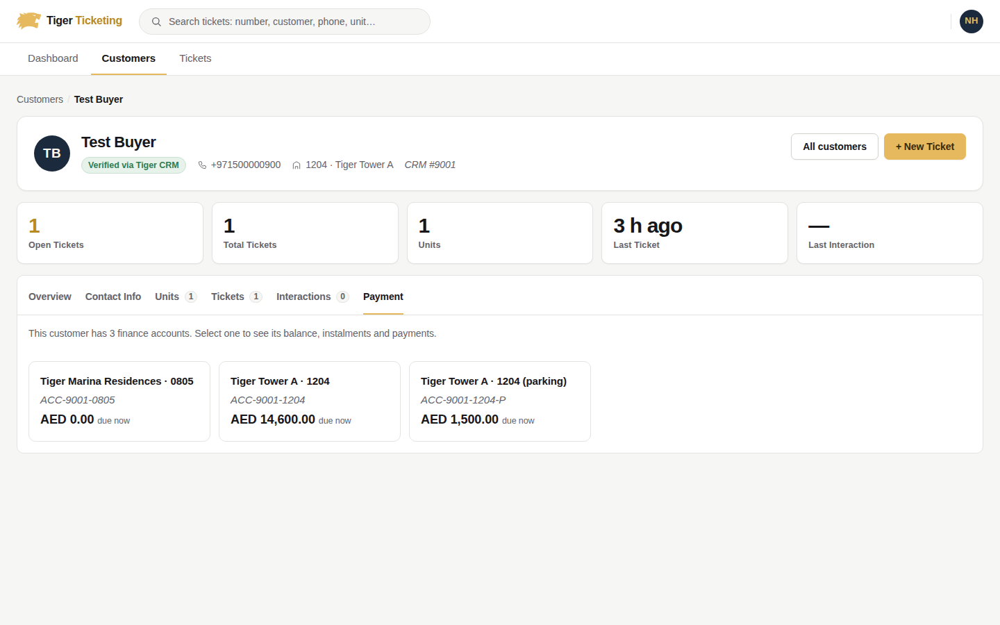
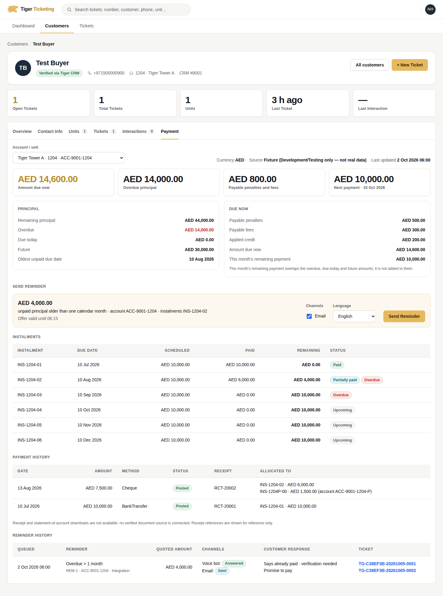
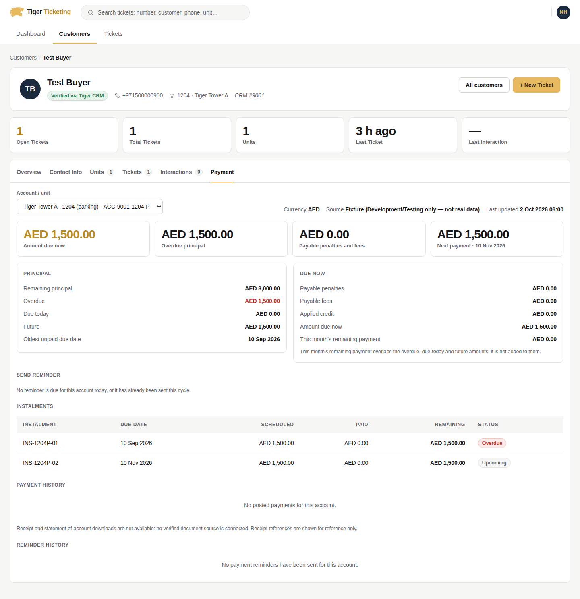
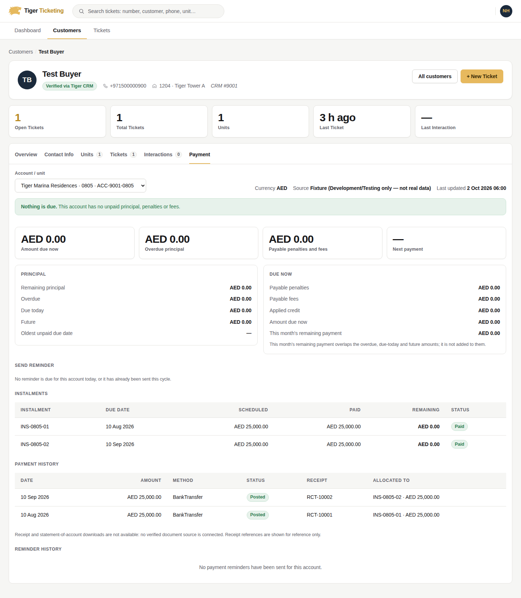
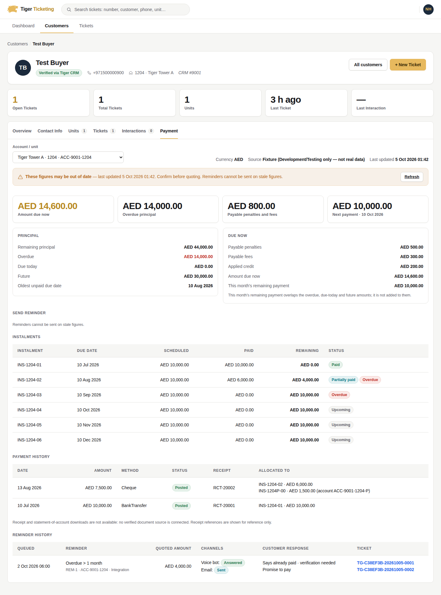
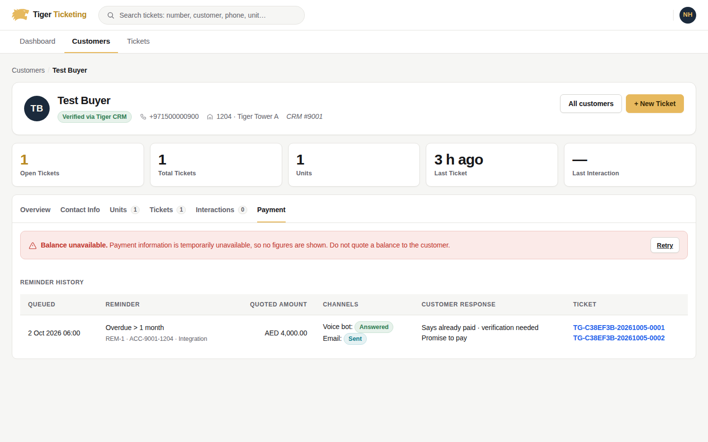
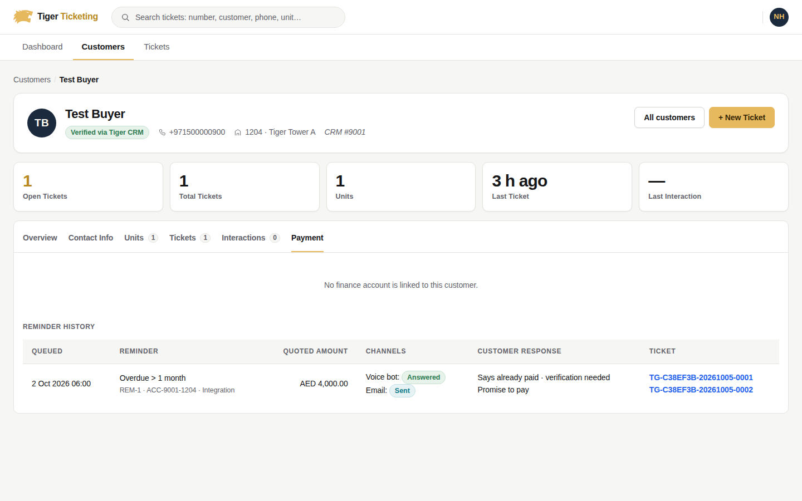
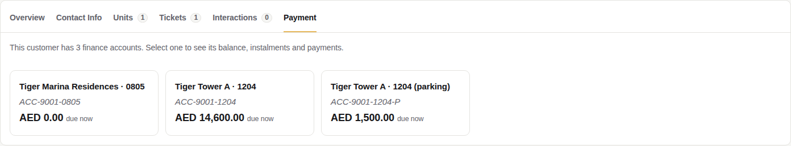
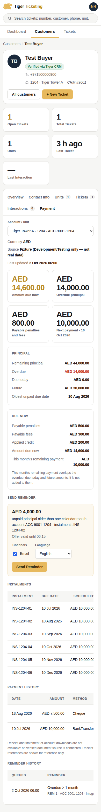

# Collections integration and the Payment tab

**Status: not complete. Blocked on EDSM.** The routes, reminder processing,
customer-response tickets and the Payment tab are implemented and tested
against a Development/Testing fixture. The authoritative financial source is
**EDSM**, and its client, payment function and response contract are not in
this repository or in any other source available to this work. In every real
environment the financial routes answer `503 FinanceUnavailable`, and the
Payment tab says payment information is unavailable. It never shows zero.
Automatic reminder sending is off (`SchedulerOwner: "None"`,
`BusinessRulesConfirmed: false`, every channel disabled).

Inputs: the Collections FAQ (Genesys, 29-09-2026) and
`TigerCS_Collections_API_Specification.md` (a proposed contract). The routes,
status codes and payloads follow the specification, with the deviations listed
in §9.

---

## 1. What exists

| Area | Where |
|---|---|
| Domain: snapshot model, balance bucketing, FAQ reminder windows, reminder job / channel / event entities | `src/TigerCS.Domain/Modules/Collections/` |
| Application: query, reminder and outcome services; outbox handlers; authorization | `src/TigerCS.Application/Modules/Collections/` |
| Financial source port `ICollectionsFinancialSource` + providers `Unavailable` (default) and `Fixture` (Development/Testing only) | `Application/.../Abstractions/ICollectionsFinancialSource.cs`, `src/TigerCS.Integrations/Modules/CollectionsIntegration/` |
| Persistence + migration `AddCollectionsReminders` | `src/TigerCS.Infrastructure/Modules/Collections/`, `AddCollectionsReminders.sql` |
| Designated scheduler (Hangfire recurring job, inactive by default) | `src/TigerCS.Infrastructure/BackgroundJobs/CollectionsReminderScheduleJob.cs` |
| API (`api/genesys/collections/*` for Genesys, `api/collections/*` for TigerCS.Web; same six actions) | `src/TigerCS.Api/Controllers/GenesysCollectionsController.cs` |
| Payment tab | `src/TigerCS.Web/Pages/Shared/_CustomerPaymentTab.cshtml`, `CustomerProfile.cshtml(.cs)`, `Services/Api/CollectionsApiClient.cs`, `Services/CustomerPaymentPanelLoader.cs` |
| Legal notices / referrals (documented only, never dispatched) | `docs/Collections/Collections-Legal-Requirements.md` |

### Reused, not rebuilt

- **Ticket per response:** `GenesysInquiryIngestionAppService`, idempotent on
  the Genesys `conversationId`, routed by department code or Genesys queue
  mapping. Existing classification, lifecycle and ticket permissions are unchanged.
- **Human follow-up:** `GenesysTicketUpdateAppService` handoffs
  (`CustomerRequestedHuman`, `AiConnectionLost`, `AiEscalated`).
- **Durable retry and dispatch:** the existing outbox (`IOutboxWriter`,
  `OutboxDispatcher`) with its claim, attempt budget and dead-lettering.
- **Email delivery:** the existing `IEmailSender`.
- **Scheduler:** the existing Hangfire server. There is no second timer.
- **Web boundary:** typed `ApiClientBase` clients with the bearer handler. The
  browser never sees an API, Genesys or EDSM credential, and Razor never
  touches SQL or EF.
- **Authorization:** roles + department claims, with the ADR-0024 System
  Administrator override through `AuthorizationGate`.

---

## 2. EDSM: the financial source and the blocker

### What was searched

| Place | Result |
|---|---|
| This repository, all branches and history (`EDSM`, `Edsm`, payment, statement, instalment, ledger) | No EDSM client, configuration, DTO, URL or reference |
| Tiger CRM integration (`CrmBuyerGateway`) | One endpoint, `GET /TicketingSystem/GetBuyerByPhone`: buyer + units. No balances, instalments or payments |
| Other repositories visible to this session, and Google Drive | No EDSM code, contract or response sample |
| TigerGroupWeb (the proxy Genesys calls through) | Not available to this session |

**So the EDSM payment function's name, signature, request parameters and
response fields cannot be reported, and the adapter has not been written.**
Writing it now would mean inventing EDSM's contract. TigerCS is built so the
adapter is the only missing piece: implement `ICollectionsFinancialSource`
over the EDSM client, register it as `CollectionsSource:Provider = "Edsm"`,
and nothing else changes.

### Exactly what is needed from the EDSM owners

1. **The client code** (or package) TigerCS should reuse, and the **payment
   function**: its name, signature, request parameters, authentication, base
   URL per environment, timeouts and error model.
2. **Two real response samples from UAT** (redacted is fine), at least:
   - a customer with **multiple units** (and, if EDSM allows it, two contracts on one unit);
   - an account with a **partial payment** (one instalment part-paid);
   - one with a payment that is **received but not yet posted/verified**, and one **reversed**.
3. **The identifier EDSM keys on**, and how it maps to TigerCS (see below).
4. **Which amounts EDSM returns** and its approved calculations (table below).
5. **A paged "accounts with outstanding principal" call** (or a nightly
   extract) for the reminder candidates and scheduler. Without it,
   candidates work only for a named customer.
6. **UAT records approved for validation**, with the figures Collections
   expects to see, so the Payment tab can be checked line by line.

### Identifier mapping (must be confirmed, not assumed)

TigerCS holds these identifiers from Tiger CRM (`GetBuyerByPhone`, stored on
tickets as `CrmBuyerCustomerId`, `CrmBuyerLeadId`, `CrmBuyerUnitId`,
`CrmBuyerProjectId`):

| TigerCS / CRM | Meaning | Used in the API as |
|---|---|---|
| `customerId` (int) | CRM buyer | `crmCustomerId` (route) |
| `leadId` | the sold lead / sale contract | candidate for `accountId` |
| `unitId`, `projectId` | the unit and its project | `unitId` (filter) |

EDSM's identifiers are unknown. TigerCS keeps `accountId` an **opaque string**
and never derives it from a CRM id. The adapter must:

- look accounts up by the key EDSM supports, and confirm every account EDSM
  returns belongs to the requested CRM customer (the API answers `404` for an
  account that is not the customer's, never an empty list);
- reject (not guess) when the CRM customer has no EDSM mapping, which surfaces
  as `FinanceUnavailable` or an empty account list, never as zero balances.

### Amounts: what TigerCS needs, and what happens if EDSM lacks one

| Figure | TigerCS field | Needed from EDSM | Required behaviour if EDSM does not provide it |
|---|---|---|---|
| Principal still owed per instalment **after EDSM's own allocation** | `FinancialInstalment.RemainingAmount` | required | adapter refuses the account (`InvalidSourceData`); no figures |
| Instalment schedule (id, due date, scheduled amount) | `FinancialInstalment` | required | as above |
| Total outstanding principal (cross-check) | `ReportedOutstandingPrincipal` | optional | not cross-checked |
| Posted payments, with allocations to instalments/accounts | `FinancialPayment` (`Posted`) | required for history | history section unavailable |
| Received-not-posted, reversed, rejected payments | `PendingVerification` / `Reversed` / `Rejected` | wanted | only posted are shown |
| Future instalments | instalments with a future due date | required | — |
| Fines / penalties, with payable vs on-hold | `FinancialCharge(Penalty)` | wanted | **null**, labelled not provided; never 0 |
| Fees, with payable vs on-hold | `FinancialCharge(Fee)` | wanted | **null**, labelled not provided; never 0 |
| Credits applied | `AppliedCreditAmount` | wanted | **null**, labelled not provided; never 0 |
| Currency (ISO 4217) and as-of timestamp | `Currency`, `AsOfUtc` | required | account refused |
| Customer phone / email for reminders | `CustomerPhone`, `CustomerEmail` | needed for SMS/email | `422 NoEligibleContact` |
| Receipt / statement-of-account documents | — | only if a verified document API exists | no download offered |

> **Adapter-time change, not yet made:** today the snapshot treats an empty
> charge list as "no penalties/fees" and defaults `AppliedCreditAmount` to `0`.
> That is correct for the fixture but not for a source that simply does not
> report those figures. When the EDSM adapter is written, every figure EDSM does
> not provide must be modelled as *not provided* (nullable, shown as such in the
> API and the Payment tab), so it can never be read as zero. It cannot be done
> before the response is seen because which fields are missing is unknown.

**TigerCS never re-allocates payments or keeps a second ledger.**
`AccountBalanceCalculator` only buckets EDSM's own remaining amounts by due
date against today in `Asia/Dubai`:

| Figure | Definition |
|---|---|
| `remainingPrincipalAmount` | sum of remaining principal |
| `overduePrincipalAmount` / `dueTodayPrincipalAmount` / `futurePrincipalAmount` | remaining principal due before / on / after today |
| `payablePenaltyAmount`, `payableFeeAmount` | outstanding charges that are payable and due |
| `amountDueNow` | max(0, overdue + due today + payable penalties + payable fees − applied credit) |
| `currentMonthRemainingAmount` | remaining principal due this calendar month |
| `nextPayment` | earliest instalment with remaining principal due today or later |

If EDSM already computes any of these with an approved formula, the adapter
should pass EDSM's figure through and the calculator should defer to it. That
cannot be decided until the response is seen. Arithmetic is `decimal`, never
rounded internally, and output is normalized to two decimals. A reported total
that disagrees with the schedule makes the account `Inconsistent`: reminders
are refused. Impossible data makes it `InvalidSourceData` with **null
figures, never zero**. Payment history is display-only, so an unverified
proof of payment can never reduce a balance.

### Validation against EDSM UAT: not done

It needs EDSM UAT access and approved records. The fixture covers the same
shapes (partial payment, two units, two contracts on one unit, settled
account, mismatch, pending proof, shared receipt across accounts), so the
behaviour is tested, but **no displayed amount has been validated against
EDSM**.

---

## 3. Routes

Six actions, each exposed at two prefixes with identical behaviour:
`api/genesys/collections/*` (Genesys, via TigerGroupWeb) and
`api/collections/*` (TigerCS.Web). All need a bearer token **and** the
explicit Collections permission below. `Collections:Enabled = false` answers
`503 CollectionsDisabled`.

| Route | Permission | Success | Errors |
|---|---|---|---|
| `GET customers/{crmCustomerId}/outstanding?accountId=&unitId=&cursor=&pageSize=` | financial-read | 200 | 400, 403, 404, 503 |
| `GET customers/{crmCustomerId}/payments?accountId=&unitId=&view=instalments\|history&fromDate=&toDate=&cursor=&pageSize=` | financial-read | 200 | 400, 403, 404, 503 |
| `GET reminders/candidates?reminderType=&businessDate=&crmCustomerId=&accountId=&cursor=&pageSize=` | reminder-send | 200 | 400, 403, 503 |
| `POST reminders` (header `Idempotency-Key`) | reminder-send (VoiceBot: integration only) | 202 queued / 200 replay | 400, 403, 409, 422, 503 |
| `POST reminders/{reminderId}/outcomes` (header `Idempotency-Key` optional; `eventId` is the key) | report-outcomes (integration only) | 200 / 202 ticket pending | 400, 403, 404, 409, 503 |
| `GET customers/{crmCustomerId}/reminders?accountId=&cursor=&pageSize=` | financial-read | 200 | 400, 403, 503 |

Errors are RFC 7807 problem bodies with `code` and `message` extensions
(`CandidateChanged` also carries `replacementCandidate`):

| Code | Status |
|---|---|
| `InvalidRequest` | 400 |
| `Forbidden` | 403 |
| `AccountNotFound`, `ReminderNotFound` | 404 |
| `CandidateChanged`, `IdempotencyConflict`, `ReminderSuppressed` | 409 |
| `NoEligibleContact`, `ChannelNotEnabled` | 422 |
| `FinanceUnavailable`, `CollectionsDisabled` | 503 |

`payments` requires a single account in scope (`accountId`, or a `unitId`
with one account) and answers `400` otherwise. History lists posted payments
only. An account or unit that is not the customer's returns 404.

### Authorization (explicit, configurable)

| Permission | Holders (defaults, `Collections:Authorization:*`) |
|---|---|
| Financial read | CS Agent, CS Supervisor, CS Manager, General Manager, Chairman/CEO; Department Employee/Head **of the Collections department** (`CollectionsDepartmentCode`, default `COL`); integration accounts |
| Reminder send / candidates | CS Supervisor, CS Manager; Collections Department Employee/Head; integration accounts |
| Report outcomes, queue VoiceBot | Integration accounts only (`IntegrationEmployeeIds`) |

System Administrator passes through the existing ADR-0024 override. Existing
ticket permissions are unchanged.

---

## 4. Reminder processing

**Windows** (`ReminderPolicy`, `Asia/Dubai`):

| Type | Opens | Eligible amount (`amountBasis`) |
|---|---|---|
| `OverdueMonthly` | days 1–4 | principal due before *today − 1 calendar month* still unpaid |
| `CurrentMonth` | day 15 | this month's remaining principal |
| `MonthEndFollowUp` | last day − 3 (28 Oct, 25 Feb, 26 Feb in leap years) | this month's remaining principal |

Penalties and fees are added only if `Rules:IncludePenaltiesAndFees` (default
off), and alone never trigger a reminder. Each eligibility lists the
`instalmentIds` it is based on.

**Flow.** Candidates are evaluated on today's business date only, and stale
source data is skipped. A candidate carries a `CAND-…` token that expires
after `CandidateValidityMinutes` (15). `POST reminders` re-reads the account
from the source and requires an exact match with a fresh evaluation, otherwise
`409 CandidateChanged` with the replacement candidate. SMS/email go into the
outbox **in the same transaction** as the reminder, and are **re-validated
again immediately before dispatch**. An account settled in the meantime is
`Suppressed`, never sent. Stale data at dispatch is retried, not sent.

**Duplicates and idempotency.** `account | type | cycle | channel` is unique
(`CollectionsReminderChannels.DeduplicationKey`). The cycle is the month
(`2026-10:OverdueMonthly`). `Idempotency-Key` is unique per job, and a replay
returns the original with `200`, while a different body under the same key is
`409 IdempotencyConflict`. Outcome events are unique on (reminder, `eventId`)
with a stored request hash.

**Statuses** are kept distinct: channel status `Queued → Sent → Delivered`
(SMS/email) or `Answered`/`NoAnswer` (voice), `Failed`, `Suppressed`.
Customer responses are separate events, not statuses.

**Channels.** VoiceBot: Genesys dials and reports outcomes. TigerCS never
calls. Email: the existing sender, English template only. SMS: **no approved
SMS provider exists**, so an enabled SMS channel fails closed. All three are
disabled by default.

**Designated scheduler.** One Hangfire job, registered only when
`Enabled && BusinessRulesConfirmed && SchedulerOwner == "TigerCS"`. With
`SchedulerOwner = "Genesys"`, Genesys pulls candidates and TigerCS never
schedules. The default is `"None"`, so nothing runs automatically.

**Legal notices and referrals** are not reminder types and cannot be
dispatched by any path here. See `Collections-Legal-Requirements.md`.

---

## 5. Customer responses

An outcome with `customerResponded: true` and a `conversationId`:

1. Records the event and an outbox message in one transaction.
2. Creates or reuses the conversation's ticket through Genesys ingestion
   (idempotent on `conversationId`), routed by
   `Collections:ResponseTickets:QueueId` or `DepartmentCode` (`COL`).
3. `AlreadyPaid` raises a **verification follow-up**. It never posts a
   payment or changes a balance. `RequestedHuman` / `AiDisconnected` /
   `Disputed` raise the existing human handoff, which stays outstanding.
4. Links the ticket to the event.

If ticket creation fails (Genesys off, routing not configured, transient
error), the answer is **202** with `ticketResult: "Pending"`, and the outbox
retries durably. Nothing resolves or closes a ticket. A repeated `eventId`
returns the original result with `replayed: true`.

---

## 6. Payment tab

The Customer Profile gains a **Payment** tab, fetched lazily (`?handler=PaymentPanel`, via `site.js` under the strict CSP). It contains:

- an account selector (required when the customer has more than one account);
- a summary with currency, source and last-updated time;
- instalments (partial payments are flagged when overdue);
- payment history with receipt references and allocations;
- reminder history with linked tickets.

**Send Reminder** appears only when the API lists an eligible candidate for
this viewer and a Web channel (SMS/Email) is enabled. It posts with an
idempotency key, and the API revalidates.

There is no receipt/SOA download, because no verified document API exists.
The tab handles these states: loading, select account, loaded, settled, stale,
forbidden, disabled, not a CRM customer, no accounts, and **unavailable**
(no figures and a retry link, never zero).

Screenshots (real TigerCS.Web against responses captured from the real API
with the fixture source):

| | |
|---|---|
| Multiple accounts, select one |  |
| Account loaded (partial payment, penalties, fees, credit) |  |
| Second contract on the same unit |  |
| Settled account |  |
| After Send Reminder |  |
| Stale figures |  |
| Source unavailable (EDSM not connected) |  |
| Forbidden |  |
| No linked CRM customer |  |
| Loading |  |
| Phone width |  |

---

## 7. Configuration

`src/TigerCS.Api/appsettings.json` ships everything **off**:

```jsonc
"Collections": {
  "Enabled": false,
  "CollectionsDepartmentCode": "COL",
  "TimeZoneId": "Asia/Dubai",
  "StaleAfterMinutes": 60,
  "Authorization": { "IntegrationEmployeeIds": [] },   // TigerGroupWeb/Genesys service account employee id(s)
  "ResponseTickets": { "DepartmentCode": "COL", "QueueId": null },
  "Channels": { "VoiceBotEnabled": false, "SmsEnabled": false, "EmailEnabled": false },
  "SchedulerOwner": "None",                // "None" | "TigerCS" | "Genesys"
  "BusinessRulesConfirmed": false
  // also: CandidateValidityMinutes (15), MaxDeliveryAttempts (3), MaxAccountsPerScan (5000),
  //       ScheduleCron ("0 9 * * *"), Channels:ScheduledChannels ([Sms, Email]),
  //       Rules:{OverdueAgeRule, OverdueFixedDays, OverdueWindowFirstDay/LastDay,
  //              CurrentMonthDay, MonthEndOffsetDays, IncludePenaltiesAndFees, SendFrequency},
  //       Authorization:{FinancialReadRoles, ReminderSendRoles, CollectionsDepartmentRoles}
},
"CollectionsSource": { "Provider": "Unavailable" }   // "Fixture" refused outside Development/Testing
```

EDSM settings (base URL, credentials, timeouts) will be added with the
adapter. Credentials belong in the environment's secret store, never in
`appsettings` or the browser.

Go-live order:
1. Write the EDSM adapter and validate it against UAT records (§2).
2. Set `Enabled`.
3. Add the integration account to `IntegrationEmployeeIds`.
4. Configure the TigerGroupWeb proxy routes.
5. Enable the approved channels.
6. Only after §10 is answered: set `BusinessRulesConfirmed` and choose
   `SchedulerOwner`, with `BackgroundJobs:Enabled` for the TigerCS scheduler.

**TigerGroupWeb proxy:** not available to this session. It must forward the
six `api/genesys/collections/*` routes (method, query string, body,
`Idempotency-Key` header, status and problem body unchanged), as it does the
existing Genesys routes.

---

## 8. Migration

`AddCollectionsReminders` (`20261005072511`) adds three tables:

- `CollectionsReminders`, with a filtered unique `IdempotencyKey`;
- `CollectionsReminderChannels`, with a unique `DeduplicationKey`;
- `CollectionsReminderEvents`, unique on (reminder, `EventId`).

No existing table changes. The idempotent script is `AddCollectionsReminders.sql`
at the repository root, and the DB-migration CI check expects 56 tables. The
migration has not been applied to any environment.

---

## 9. Deviations from the specification

- **Ticket routing not resolved:** answers `202` with `ticketResult: "Pending"`
  and retries durably, instead of `422 DepartmentNotResolved`, so the customer
  response is never lost. The detail carries a `DepartmentNotResolved:` prefix.
- **Replays** (same `Idempotency-Key` or `eventId`) answer `200` with the
  original result.
- **`429` rate limiting** is not implemented.
- **VoiceBot destination:** the number Genesys dials comes from Genesys/EDSM,
  and TigerCS does not return it. This is an open item.
- **Extensions:** `api/collections/*` mirror for TigerCS.Web; problem bodies
  add `code`/`message`; outstanding adds `dataStatus`, `problems` and `source`.

---

## 10. Open decisions (automatic sending stays off until answered)

1. EDSM: everything in §2 (client, payment function, identifier key, amounts, UAT records).
2. "More than one month": calendar month (default) or a fixed number of days?
3. Penalties and fees in reminder amounts (default excluded)?
4. One send per window (default) or daily during days 1–4?
5. Month-end in February: last day − 3 (25/26 Feb)?
6. Should a pending "already paid" claim pause further reminders? Currently it does not.
7. Approved wording (email, voice script, Arabic), and an approved **SMS provider**.
8. Scheduler owner: TigerCS or Genesys.
9. Whether CS Agents keep financial read access (default yes).

---

## 11. JSON examples

Captured from the running API with the Development fixture source (clock fixed
at 2026-10-02 06:00 UTC). **The amounts are fixture data, not EDSM figures.**
`traceId` is removed.


### Outstanding, one account (partial payment, penalties, fees, credit)

```http
GET /api/genesys/collections/customers/9001/outstanding?accountId=ACC-9001-1204

--> 200
{
  "crmCustomerId": 9001,
  "businessDate": "2026-10-02",
  "asOfUtc": "2026-10-02T06:00:00Z",
  "dataStatus": "Current",
  "source": "Fixture (Development/Testing only — not real data)",
  "accounts": [
    {
      "accountId": "ACC-9001-1204",
      "unitId": 9200,
      "towerName": "Tiger Tower A",
      "unitNumber": "1204",
      "currency": "AED",
      "asOfUtc": "2026-10-02T06:00:00Z",
      "dataStatus": "Current",
      "remainingPrincipalAmount": 44000.00,
      "overduePrincipalAmount": 14000.00,
      "dueTodayPrincipalAmount": 0.00,
      "futurePrincipalAmount": 30000.00,
      "payablePenaltyAmount": 500.00,
      "payableFeeAmount": 300.00,
      "appliedCreditAmount": 200.00,
      "amountDueNow": 14600.00,
      "currentMonthRemainingAmount": 10000.00,
      "oldestUnpaidDueDate": "2026-08-10",
      "nextPayment": {
        "instalmentId": "INS-1204-04",
        "dueDate": "2026-10-10",
        "remainingAmount": 10000.00
      },
      "problems": []
    }
  ],
  "nextCursor": null
}
```

### Outstanding, filtered by unit (two contracts on one unit)

```http
GET /api/genesys/collections/customers/9001/outstanding?unitId=9200

--> 200
{
  "crmCustomerId": 9001,
  "businessDate": "2026-10-02",
  "asOfUtc": "2026-10-02T06:00:00Z",
  "dataStatus": "Current",
  "source": "Fixture (Development/Testing only — not real data)",
  "accounts": [
    {
      "accountId": "ACC-9001-1204",
      "unitId": 9200,
      "towerName": "Tiger Tower A",
      "unitNumber": "1204",
      "currency": "AED",
      "asOfUtc": "2026-10-02T06:00:00Z",
      "dataStatus": "Current",
      "remainingPrincipalAmount": 44000.00,
      "overduePrincipalAmount": 14000.00,
      "dueTodayPrincipalAmount": 0.00,
      "futurePrincipalAmount": 30000.00,
      "payablePenaltyAmount": 500.00,
      "payableFeeAmount": 300.00,
      "appliedCreditAmount": 200.00,
      "amountDueNow": 14600.00,
      "currentMonthRemainingAmount": 10000.00,
      "oldestUnpaidDueDate": "2026-08-10",
      "nextPayment": {
        "instalmentId": "INS-1204-04",
        "dueDate": "2026-10-10",
        "remainingAmount": 10000.00
      },
      "problems": []
    },
    {
      "accountId": "ACC-9001-1204-P",
      "unitId": 9200,
      "towerName": "Tiger Tower A",
      "unitNumber": "1204 (parking)",
      "currency": "AED",
      "asOfUtc": "2026-10-02T06:00:00Z",
      "dataStatus": "Current",
      "remainingPrincipalAmount": 3000.00,
      "overduePrincipalAmount": 1500.00,
      "dueTodayPrincipalAmount": 0.00,
      "futurePrincipalAmount": 1500.00,
      "payablePenaltyAmount": 0.00,
      "payableFeeAmount": 0.00,
      "appliedCreditAmount": 0.00,
      "amountDueNow": 1500.00,
      "currentMonthRemainingAmount": 0.00,
      "oldestUnpaidDueDate": "2026-09-10",
      "nextPayment": {
        "instalmentId": "INS-1204P-02",
        "dueDate": "2026-11-10",
        "remainingAmount": 1500.00
      },
      "problems": []
    }
  ],
  "nextCursor": null
}
```

### Outstanding, all accounts of a customer with multiple units (TigerCS.Web prefix)

```http
GET /api/collections/customers/9001/outstanding

--> 200
{
  "crmCustomerId": 9001,
  "businessDate": "2026-10-02",
  "asOfUtc": "2026-10-02T06:00:00Z",
  "dataStatus": "Current",
  "source": "Fixture (Development/Testing only — not real data)",
  "accounts": [
    {
      "accountId": "ACC-9001-0805",
      "unitId": 9201,
      "towerName": "Tiger Marina Residences",
      "unitNumber": "0805",
      "currency": "AED",
      "asOfUtc": "2026-10-02T06:00:00Z",
      "dataStatus": "Current",
      "remainingPrincipalAmount": 0.00,
      "overduePrincipalAmount": 0.00,
      "dueTodayPrincipalAmount": 0.00,
      "futurePrincipalAmount": 0.00,
      "payablePenaltyAmount": 0.00,
      "payableFeeAmount": 0.00,
      "appliedCreditAmount": 0.00,
      "amountDueNow": 0.00,
      "currentMonthRemainingAmount": 0.00,
      "oldestUnpaidDueDate": null,
      "nextPayment": null,
      "problems": []
    },
    {
      "accountId": "ACC-9001-1204",
      "unitId": 9200,
      "towerName": "Tiger Tower A",
      "unitNumber": "1204",
      "currency": "AED",
      "asOfUtc": "2026-10-02T06:00:00Z",
      "dataStatus": "Current",
      "remainingPrincipalAmount": 44000.00,
      "overduePrincipalAmount": 14000.00,
      "dueTodayPrincipalAmount": 0.00,
      "futurePrincipalAmount": 30000.00,
      "payablePenaltyAmount": 500.00,
      "payableFeeAmount": 300.00,
      "appliedCreditAmount": 200.00,
      "amountDueNow": 14600.00,
      "currentMonthRemainingAmount": 10000.00,
      "oldestUnpaidDueDate": "2026-08-10",
      "nextPayment": {
        "instalmentId": "INS-1204-04",
        "dueDate": "2026-10-10",
        "remainingAmount": 10000.00
      },
      "problems": []
    },
    {
      "accountId": "ACC-9001-1204-P",
      "unitId": 9200,
      "towerName": "Tiger Tower A",
      "unitNumber": "1204 (parking)",
      "currency": "AED",
      "asOfUtc": "2026-10-02T06:00:00Z",
      "dataStatus": "Current",
      "remainingPrincipalAmount": 3000.00,
      "overduePrincipalAmount": 1500.00,
      "dueTodayPrincipalAmount": 0.00,
      "futurePrincipalAmount": 1500.00,
      "payablePenaltyAmount": 0.00,
      "payableFeeAmount": 0.00,
      "appliedCreditAmount": 0.00,
      "amountDueNow": 1500.00,
      "currentMonthRemainingAmount": 0.00,
      "oldestUnpaidDueDate": "2026-09-10",
      "nextPayment": {
        "instalmentId": "INS-1204P-02",
        "dueDate": "2026-11-10",
        "remainingAmount": 1500.00
      },
      "problems": []
    }
  ],
  "nextCursor": null
}
```

### Instalments, one account

```http
GET /api/genesys/collections/customers/9001/payments?accountId=ACC-9001-1204&view=instalments&pageSize=50

--> 200
{
  "crmCustomerId": 9001,
  "accountId": "ACC-9001-1204",
  "currency": "AED",
  "asOfUtc": "2026-10-02T06:00:00Z",
  "dataStatus": "Current",
  "view": "instalments",
  "items": [
    {
      "instalmentId": "INS-1204-01",
      "dueDate": "2026-07-10",
      "scheduledAmount": 10000.00,
      "allocatedPaidAmount": 10000.00,
      "remainingAmount": 0.00,
      "status": "Paid",
      "isOverdue": false
    },
    {
      "instalmentId": "INS-1204-02",
      "dueDate": "2026-08-10",
      "scheduledAmount": 10000.00,
      "allocatedPaidAmount": 6000.00,
      "remainingAmount": 4000.00,
      "status": "PartiallyPaid",
      "isOverdue": true
    },
    {
      "instalmentId": "INS-1204-03",
      "dueDate": "2026-09-10",
      "scheduledAmount": 10000.00,
      "allocatedPaidAmount": 0.00,
      "remainingAmount": 10000.00,
      "status": "Overdue",
      "isOverdue": true
    },
    {
      "instalmentId": "INS-1204-04",
      "dueDate": "2026-10-10",
      "scheduledAmount": 10000.00,
      "allocatedPaidAmount": 0.00,
      "remainingAmount": 10000.00,
      "status": "Upcoming",
      "isOverdue": false
    },
    {
      "instalmentId": "INS-1204-05",
      "dueDate": "2026-11-10",
      "scheduledAmount": 10000.00,
      "allocatedPaidAmount": 0.00,
      "remainingAmount": 10000.00,
      "status": "Upcoming",
      "isOverdue": false
    },
    {
      "instalmentId": "INS-1204-06",
      "dueDate": "2026-12-10",
      "scheduledAmount": 10000.00,
      "allocatedPaidAmount": 0.00,
      "remainingAmount": 10000.00,
      "status": "Upcoming",
      "isOverdue": false
    }
  ],
  "nextCursor": null
}
```

### Instalments, settled account

```http
GET /api/collections/customers/9001/payments?accountId=ACC-9001-0805&view=instalments

--> 200
{
  "crmCustomerId": 9001,
  "accountId": "ACC-9001-0805",
  "currency": "AED",
  "asOfUtc": "2026-10-02T06:00:00Z",
  "dataStatus": "Current",
  "view": "instalments",
  "items": [
    {
      "instalmentId": "INS-0805-01",
      "dueDate": "2026-08-10",
      "scheduledAmount": 25000.00,
      "allocatedPaidAmount": 25000.00,
      "remainingAmount": 0.00,
      "status": "Paid",
      "isOverdue": false
    },
    {
      "instalmentId": "INS-0805-02",
      "dueDate": "2026-09-10",
      "scheduledAmount": 25000.00,
      "allocatedPaidAmount": 25000.00,
      "remainingAmount": 0.00,
      "status": "Paid",
      "isOverdue": false
    }
  ],
  "nextCursor": null
}
```

### Instalments, second contract on the same unit

```http
GET /api/collections/customers/9001/payments?accountId=ACC-9001-1204-P&view=instalments

--> 200
{
  "crmCustomerId": 9001,
  "accountId": "ACC-9001-1204-P",
  "currency": "AED",
  "asOfUtc": "2026-10-02T06:00:00Z",
  "dataStatus": "Current",
  "view": "instalments",
  "items": [
    {
      "instalmentId": "INS-1204P-01",
      "dueDate": "2026-09-10",
      "scheduledAmount": 1500.00,
      "allocatedPaidAmount": 0.00,
      "remainingAmount": 1500.00,
      "status": "Overdue",
      "isOverdue": true
    },
    {
      "instalmentId": "INS-1204P-02",
      "dueDate": "2026-11-10",
      "scheduledAmount": 1500.00,
      "allocatedPaidAmount": 0.00,
      "remainingAmount": 1500.00,
      "status": "Upcoming",
      "isOverdue": false
    }
  ],
  "nextCursor": null
}
```

### Payment history (posted only; shared receipt allocated across accounts)

```http
GET /api/genesys/collections/customers/9001/payments?accountId=ACC-9001-1204&view=history&fromDate=2026-01-01&toDate=2026-10-02&pageSize=50

--> 200
{
  "crmCustomerId": 9001,
  "accountId": "ACC-9001-1204",
  "currency": "AED",
  "asOfUtc": "2026-10-02T06:00:00Z",
  "dataStatus": "Current",
  "view": "history",
  "items": [
    {
      "paymentId": "PAY-1204-02",
      "paymentDate": "2026-08-13",
      "amount": 7500.00,
      "method": "Cheque",
      "status": "Posted",
      "receiptNumber": "RCT-20002",
      "receiptAvailable": true,
      "allocations": [
        {
          "instalmentId": "INS-1204-02",
          "amount": 6000.00,
          "accountId": null
        },
        {
          "instalmentId": "INS-1204P-00",
          "amount": 1500.00,
          "accountId": "ACC-9001-1204-P"
        }
      ]
    },
    {
      "paymentId": "PAY-1204-01",
      "paymentDate": "2026-07-10",
      "amount": 10000.00,
      "method": "BankTransfer",
      "status": "Posted",
      "receiptNumber": "RCT-20001",
      "receiptAvailable": true,
      "allocations": [
        {
          "instalmentId": "INS-1204-01",
          "amount": 10000.00,
          "accountId": null
        }
      ]
    }
  ],
  "nextCursor": null
}
```

### Payment history, settled account

```http
GET /api/collections/customers/9001/payments?accountId=ACC-9001-0805&view=history

--> 200
{
  "crmCustomerId": 9001,
  "accountId": "ACC-9001-0805",
  "currency": "AED",
  "asOfUtc": "2026-10-02T06:00:00Z",
  "dataStatus": "Current",
  "view": "history",
  "items": [
    {
      "paymentId": "PAY-0805-02",
      "paymentDate": "2026-09-10",
      "amount": 25000.00,
      "method": "BankTransfer",
      "status": "Posted",
      "receiptNumber": "RCT-10002",
      "receiptAvailable": true,
      "allocations": [
        {
          "instalmentId": "INS-0805-02",
          "amount": 25000.00,
          "accountId": null
        }
      ]
    },
    {
      "paymentId": "PAY-0805-01",
      "paymentDate": "2026-08-10",
      "amount": 25000.00,
      "method": "BankTransfer",
      "status": "Posted",
      "receiptNumber": "RCT-10001",
      "receiptAvailable": true,
      "allocations": [
        {
          "instalmentId": "INS-0805-01",
          "amount": 25000.00,
          "accountId": null
        }
      ]
    }
  ],
  "nextCursor": null
}
```

### Payment history, second contract

```http
GET /api/collections/customers/9001/payments?accountId=ACC-9001-1204-P&view=history

--> 200
{
  "crmCustomerId": 9001,
  "accountId": "ACC-9001-1204-P",
  "currency": "AED",
  "asOfUtc": "2026-10-02T06:00:00Z",
  "dataStatus": "Current",
  "view": "history",
  "items": [],
  "nextCursor": null
}
```

### Reminder candidates (Genesys)

```http
GET /api/genesys/collections/reminders/candidates?reminderType=OverdueMonthly&businessDate=2026-10-02&pageSize=50

--> 200
{
  "reminderType": "OverdueMonthly",
  "cycleKey": "2026-10:OverdueMonthly",
  "businessDate": "2026-10-02",
  "timeZone": "Asia/Dubai",
  "windowOpen": true,
  "items": [
    {
      "candidateId": "CAND-eyJDcm1DdXN0b21lcklkIjo5MDAxLCJBY2NvdW50SWQiOiJBQ0MtOTAwMS0xMjA0IiwiVHlwZSI6MSwiQ3ljbGVLZXkiOiIyMDI2LTEwOk92ZXJkdWVNb250aGx5IiwiQW1vdW50Ijo0MDAwLCJDdXJyZW5jeSI6IkFFRCIsIkluc3RhbG1lbnRJZHMiOlsiSU5TLTEyMDQtMDIiXSwiRXhwaXJlc0F0VXRjIjoiMjAyNi0xMC0wMlQwNjoxNTowMFoifQ",
      "crmCustomerId": 9001,
      "accountId": "ACC-9001-1204",
      "unitId": 9200,
      "towerName": "Tiger Tower A",
      "unitNumber": "1204",
      "currency": "AED",
      "reminderAmount": 4000.00,
      "amountBasis": "UnpaidPrincipalOlderThanOneCalendarMonth",
      "instalmentIds": [
        "INS-1204-02"
      ],
      "oldestUnpaidDueDate": "2026-08-10",
      "availableChannels": [
        "VoiceBot",
        "Email"
      ],
      "asOfUtc": "2026-10-02T06:00:00Z",
      "expiresAtUtc": "2026-10-02T06:15:00Z"
    }
  ],
  "nextCursor": null
}
```

### Reminder candidates for one account (TigerCS.Web)

```http
GET /api/collections/reminders/candidates?reminderType=OverdueMonthly&crmCustomerId=9001&accountId=ACC-9001-1204

--> 200
{
  "reminderType": "OverdueMonthly",
  "cycleKey": "2026-10:OverdueMonthly",
  "businessDate": "2026-10-02",
  "timeZone": "Asia/Dubai",
  "windowOpen": true,
  "items": [
    {
      "candidateId": "CAND-eyJDcm1DdXN0b21lcklkIjo5MDAxLCJBY2NvdW50SWQiOiJBQ0MtOTAwMS0xMjA0IiwiVHlwZSI6MSwiQ3ljbGVLZXkiOiIyMDI2LTEwOk92ZXJkdWVNb250aGx5IiwiQW1vdW50Ijo0MDAwLCJDdXJyZW5jeSI6IkFFRCIsIkluc3RhbG1lbnRJZHMiOlsiSU5TLTEyMDQtMDIiXSwiRXhwaXJlc0F0VXRjIjoiMjAyNi0xMC0wMlQwNjoxNTowMFoifQ",
      "crmCustomerId": 9001,
      "accountId": "ACC-9001-1204",
      "unitId": 9200,
      "towerName": "Tiger Tower A",
      "unitNumber": "1204",
      "currency": "AED",
      "reminderAmount": 4000.00,
      "amountBasis": "UnpaidPrincipalOlderThanOneCalendarMonth",
      "instalmentIds": [
        "INS-1204-02"
      ],
      "oldestUnpaidDueDate": "2026-08-10",
      "availableChannels": [
        "VoiceBot",
        "Email"
      ],
      "asOfUtc": "2026-10-02T06:00:00Z",
      "expiresAtUtc": "2026-10-02T06:15:00Z"
    }
  ],
  "nextCursor": null
}
```

### Queue reminder: 202 queued

```http
POST /api/genesys/collections/reminders
Idempotency-Key: collection-oct-2026-acc9001-1204-overdue
{
  "candidateId": "CAND-eyJDcm1DdXN0b21lcklkIjo5MDAxLCJBY2NvdW50SWQiOiJBQ0MtOTAwMS0xMjA0IiwiVHlwZSI6MSwiQ3ljbGVLZXkiOiIyMDI2LTEwOk92ZXJkdWVNb250aGx5IiwiQW1vdW50Ijo0MDAwLCJDdXJyZW5jeSI6IkFFRCIsIkluc3RhbG1lbnRJZHMiOlsiSU5TLTEyMDQtMDIiXSwiRXhwaXJlc0F0VXRjIjoiMjAyNi0xMC0wMlQwNjoxNTowMFoifQ",
  "channels": [
    "VoiceBot",
    "Email"
  ],
  "language": "en"
}
--> 202
{
  "reminderId": "REM-1",
  "crmCustomerId": 9001,
  "accountId": "ACC-9001-1204",
  "reminderType": "OverdueMonthly",
  "cycleKey": "2026-10:OverdueMonthly",
  "currency": "AED",
  "reminderAmount": 4000.00,
  "amountBasis": "UnpaidPrincipalOlderThanOneCalendarMonth",
  "instalmentIds": [
    "INS-1204-02"
  ],
  "queuedAtUtc": "2026-10-02T06:00:00Z",
  "status": "Queued",
  "channels": [
    {
      "channel": "VoiceBot",
      "status": "Queued",
      "lastEventAtUtc": null,
      "attempts": 1,
      "statusReason": null
    },
    {
      "channel": "Email",
      "status": "Queued",
      "lastEventAtUtc": null,
      "attempts": 1,
      "statusReason": null
    }
  ]
}
```

### Queue reminder: same Idempotency-Key replayed, 200

```http
POST /api/genesys/collections/reminders
Idempotency-Key: collection-oct-2026-acc9001-1204-overdue
{
  "candidateId": "CAND-eyJDcm1DdXN0b21lcklkIjo5MDAxLCJBY2NvdW50SWQiOiJBQ0MtOTAwMS0xMjA0IiwiVHlwZSI6MSwiQ3ljbGVLZXkiOiIyMDI2LTEwOk92ZXJkdWVNb250aGx5IiwiQW1vdW50Ijo0MDAwLCJDdXJyZW5jeSI6IkFFRCIsIkluc3RhbG1lbnRJZHMiOlsiSU5TLTEyMDQtMDIiXSwiRXhwaXJlc0F0VXRjIjoiMjAyNi0xMC0wMlQwNjoxNTowMFoifQ",
  "channels": [
    "VoiceBot",
    "Email"
  ],
  "language": "en"
}
--> 200
{
  "reminderId": "REM-1",
  "crmCustomerId": 9001,
  "accountId": "ACC-9001-1204",
  "reminderType": "OverdueMonthly",
  "cycleKey": "2026-10:OverdueMonthly",
  "currency": "AED",
  "reminderAmount": 4000.00,
  "amountBasis": "UnpaidPrincipalOlderThanOneCalendarMonth",
  "instalmentIds": [
    "INS-1204-02"
  ],
  "queuedAtUtc": "2026-10-02T06:00:00Z",
  "status": "Queued",
  "channels": [
    {
      "channel": "VoiceBot",
      "status": "Queued",
      "lastEventAtUtc": null,
      "attempts": 1,
      "statusReason": null
    },
    {
      "channel": "Email",
      "status": "Queued",
      "lastEventAtUtc": null,
      "attempts": 1,
      "statusReason": null
    }
  ]
}
```

### Queue reminder: same key, different body, 409

```http
POST /api/genesys/collections/reminders
Idempotency-Key: collection-oct-2026-acc9001-1204-overdue
{
  "candidateId": "CAND-eyJDcm1DdXN0b21lcklkIjo5MDAxLCJBY2NvdW50SWQiOiJBQ0MtOTAwMS0xMjA0IiwiVHlwZSI6MSwiQ3ljbGVLZXkiOiIyMDI2LTEwOk92ZXJkdWVNb250aGx5IiwiQW1vdW50Ijo0MDAwLCJDdXJyZW5jeSI6IkFFRCIsIkluc3RhbG1lbnRJZHMiOlsiSU5TLTEyMDQtMDIiXSwiRXhwaXJlc0F0VXRjIjoiMjAyNi0xMC0wMlQwNjoxNTowMFoifQ",
  "channels": [
    "Email"
  ],
  "language": "en"
}
--> 409
{
  "type": "https://tigercs.internal/problems/collections/IdempotencyConflict",
  "title": "IdempotencyConflict",
  "status": 409,
  "detail": "This Idempotency-Key was already used with a different request.",
  "code": "IdempotencyConflict",
  "message": "This Idempotency-Key was already used with a different request."
}
```

### Queue reminder: channel already used this cycle, 409 with replacement

```http
POST /api/genesys/collections/reminders
Idempotency-Key: another-key
{
  "candidateId": "CAND-eyJDcm1DdXN0b21lcklkIjo5MDAxLCJBY2NvdW50SWQiOiJBQ0MtOTAwMS0xMjA0IiwiVHlwZSI6MSwiQ3ljbGVLZXkiOiIyMDI2LTEwOk92ZXJkdWVNb250aGx5IiwiQW1vdW50Ijo0MDAwLCJDdXJyZW5jeSI6IkFFRCIsIkluc3RhbG1lbnRJZHMiOlsiSU5TLTEyMDQtMDIiXSwiRXhwaXJlc0F0VXRjIjoiMjAyNi0xMC0wMlQwNjoxNTowMFoifQ",
  "channels": [
    "Email"
  ],
  "language": "en"
}
--> 409
{
  "type": "https://tigercs.internal/problems/collections/CandidateChanged",
  "title": "CandidateChanged",
  "status": 409,
  "detail": "One or more requested channels were already used for this account in this cycle.",
  "code": "CandidateChanged",
  "message": "One or more requested channels were already used for this account in this cycle.",
  "replacementCandidate": {
    "candidateId": "CAND-eyJDcm1DdXN0b21lcklkIjo5MDAxLCJBY2NvdW50SWQiOiJBQ0MtOTAwMS0xMjA0IiwiVHlwZSI6MSwiQ3ljbGVLZXkiOiIyMDI2LTEwOk92ZXJkdWVNb250aGx5IiwiQW1vdW50Ijo0MDAwLCJDdXJyZW5jeSI6IkFFRCIsIkluc3RhbG1lbnRJZHMiOlsiSU5TLTEyMDQtMDIiXSwiRXhwaXJlc0F0VXRjIjoiMjAyNi0xMC0wMlQwNjoxNTowMFoifQ",
    "crmCustomerId": 9001,
    "accountId": "ACC-9001-1204",
    "unitId": 9200,
    "towerName": "Tiger Tower A",
    "unitNumber": "1204",
    "currency": "AED",
    "reminderAmount": 4000.00,
    "amountBasis": "UnpaidPrincipalOlderThanOneCalendarMonth",
    "instalmentIds": [
      "INS-1204-02"
    ],
    "oldestUnpaidDueDate": "2026-08-10",
    "availableChannels": [],
    "asOfUtc": "2026-10-02T06:00:00Z",
    "expiresAtUtc": "2026-10-02T06:15:00Z"
  }
}
```

### Outcome: customer says already paid (verification follow-up, ticket by conversationId)

```http
POST /api/genesys/collections/reminders/REM-1/outcomes
Idempotency-Key: genesys-event-evt90001
{
  "eventId": "EVT-90001",
  "channel": "VoiceBot",
  "providerMessageId": "GEN-90001",
  "conversationId": "11111111-2222-3333-4444-555555555555",
  "occurredAtUtc": "2026-10-02T06:05:00Z",
  "deliveryStatus": "Answered",
  "customerResponded": true,
  "customerIntent": "AlreadyPaid",
  "requiresHumanFollowUp": true
}
--> 200
{
  "reminderId": "REM-1",
  "eventId": "EVT-90001",
  "result": "Recorded",
  "deliveryStatus": "Answered",
  "channelStatus": "Answered",
  "ticketId": 1,
  "ticketNumber": "TG-C38EF3B-20261005-0001",
  "ticketResult": "Created",
  "followUpRequired": true,
  "replayed": false
}
```

### Outcome: same eventId replayed

```http
POST /api/genesys/collections/reminders/REM-1/outcomes
Idempotency-Key: genesys-event-evt90001
{
  "eventId": "EVT-90001",
  "channel": "VoiceBot",
  "providerMessageId": "GEN-90001",
  "conversationId": "11111111-2222-3333-4444-555555555555",
  "occurredAtUtc": "2026-10-02T06:05:00Z",
  "deliveryStatus": "Answered",
  "customerResponded": true,
  "customerIntent": "AlreadyPaid",
  "requiresHumanFollowUp": true
}
--> 200
{
  "reminderId": "REM-1",
  "eventId": "EVT-90001",
  "result": "Recorded",
  "deliveryStatus": "Answered",
  "channelStatus": "Answered",
  "ticketId": 1,
  "ticketNumber": "TG-C38EF3B-20261005-0001",
  "ticketResult": "Created",
  "followUpRequired": true,
  "replayed": true
}
```

### Outcome: no answer

```http
POST /api/genesys/collections/reminders/REM-1/outcomes
{
  "eventId": "EVT-90002",
  "channel": "VoiceBot",
  "providerMessageId": "GEN-90002",
  "occurredAtUtc": "2026-10-02T06:04:00Z",
  "deliveryStatus": "NoAnswer"
}
--> 200
{
  "reminderId": "REM-1",
  "eventId": "EVT-90002",
  "result": "Recorded",
  "deliveryStatus": "NoAnswer",
  "channelStatus": "Answered",
  "ticketId": null,
  "ticketNumber": null,
  "ticketResult": "NotRequired",
  "followUpRequired": false,
  "replayed": false
}
```

### Outcome: ticket routing unavailable, 202 Pending (durable retry)

```http
POST /api/genesys/collections/reminders/REM-1/outcomes
{
  "eventId": "EVT-90003",
  "channel": "VoiceBot",
  "providerMessageId": "GEN-90003",
  "conversationId": "22222222-3333-4444-5555-666666666666",
  "occurredAtUtc": "2026-10-02T06:09:00Z",
  "customerResponded": true,
  "customerIntent": "PromiseToPay"
}
--> 202
{
  "reminderId": "REM-1",
  "eventId": "EVT-90003",
  "result": "Recorded",
  "deliveryStatus": null,
  "channelStatus": "Answered",
  "ticketId": null,
  "ticketNumber": null,
  "ticketResult": "Pending",
  "followUpRequired": false,
  "replayed": false
}
```

### Reminder history with linked ticket

```http
GET /api/genesys/collections/customers/9001/reminders?accountId=ACC-9001-1204&pageSize=50

--> 200
{
  "crmCustomerId": 9001,
  "accountId": "ACC-9001-1204",
  "items": [
    {
      "reminderId": "REM-1",
      "accountId": "ACC-9001-1204",
      "reminderType": "OverdueMonthly",
      "cycleKey": "2026-10:OverdueMonthly",
      "currency": "AED",
      "reminderAmount": 4000.00,
      "amountBasis": "UnpaidPrincipalOlderThanOneCalendarMonth",
      "queuedAtUtc": "2026-10-02T06:00:00Z",
      "trigger": "Integration",
      "channels": [
        {
          "channel": "VoiceBot",
          "status": "Answered",
          "lastEventAtUtc": "2026-10-02T06:05:00Z",
          "attempts": 1,
          "statusReason": null
        },
        {
          "channel": "Email",
          "status": "Sent",
          "lastEventAtUtc": "2026-10-02T06:00:00Z",
          "attempts": 1,
          "statusReason": null
        }
      ],
      "customerIntent": "PromiseToPay",
      "ticketId": 2,
      "ticketNumber": "TG-C38EF3B-20261005-0002",
      "responses": [
        {
          "eventId": "EVT-90001",
          "channel": "VoiceBot",
          "customerIntent": "AlreadyPaid",
          "occurredAtUtc": "2026-10-02T06:05:00Z",
          "followUpRequired": true,
          "verificationFollowUpRequired": true,
          "ticketResult": "Created",
          "ticketId": 1,
          "ticketNumber": "TG-C38EF3B-20261005-0001"
        },
        {
          "eventId": "EVT-90003",
          "channel": "VoiceBot",
          "customerIntent": "PromiseToPay",
          "occurredAtUtc": "2026-10-02T06:09:00Z",
          "followUpRequired": false,
          "verificationFollowUpRequired": false,
          "ticketResult": "Created",
          "ticketId": 2,
          "ticketNumber": "TG-C38EF3B-20261005-0002"
        }
      ]
    }
  ],
  "nextCursor": null
}
```

### 400: payments without a single account in scope

```http
GET /api/genesys/collections/customers/9001/payments?view=instalments

--> 400
{
  "type": "https://tigercs.internal/problems/collections/InvalidRequest",
  "title": "InvalidRequest",
  "status": 400,
  "detail": "accountId is required: this customer has more than one account in scope.",
  "code": "InvalidRequest",
  "message": "accountId is required: this customer has more than one account in scope."
}
```

### 403: no financial-read permission

```http
GET /api/genesys/collections/customers/9001/outstanding

--> 403
{
  "type": "https://tigercs.internal/problems/collections/Forbidden",
  "title": "Forbidden",
  "status": 403,
  "detail": "Viewing customer payments requires the Collections financial-read permission.",
  "code": "Forbidden",
  "message": "Viewing customer payments requires the Collections financial-read permission."
}
```

### 404: account belongs to another customer

```http
GET /api/genesys/collections/customers/9001/outstanding?accountId=ACC-9002-0310

--> 404
{
  "type": "https://tigercs.internal/problems/collections/AccountNotFound",
  "title": "AccountNotFound",
  "status": 404,
  "detail": "No accessible account matches this customer.",
  "code": "AccountNotFound",
  "message": "No accessible account matches this customer."
}
```

### 422: channel not enabled

```http
POST /api/genesys/collections/reminders
{
  "candidateId": "CAND-eyJDcm1DdXN0b21lcklkIjo5MDAxLCJBY2NvdW50SWQiOiJBQ0MtOTAwMS0xMjA0IiwiVHlwZSI6MSwiQ3ljbGVLZXkiOiIyMDI2LTEwOk92ZXJkdWVNb250aGx5IiwiQW1vdW50Ijo0MDAwLCJDdXJyZW5jeSI6IkFFRCIsIkluc3RhbG1lbnRJZHMiOlsiSU5TLTEyMDQtMDIiXSwiRXhwaXJlc0F0VXRjIjoiMjAyNi0xMC0wMlQwNjoxNTowMFoifQ",
  "channels": [
    "Sms"
  ]
}
--> 422
{
  "type": "https://tigercs.internal/problems/collections/ChannelNotEnabled",
  "title": "ChannelNotEnabled",
  "status": 422,
  "detail": "Reminder channel(s) not enabled: Sms.",
  "code": "ChannelNotEnabled",
  "message": "Reminder channel(s) not enabled: Sms."
}
```

### 503: EDSM not connected (the real-environment answer today)

```http
GET /api/genesys/collections/customers/9001/outstanding

--> 503
{
  "type": "https://tigercs.internal/problems/collections/FinanceUnavailable",
  "title": "FinanceUnavailable",
  "status": 503,
  "detail": "Payment information is temporarily unavailable: the EDSM financial source is not yet connected to TigerCS.",
  "code": "FinanceUnavailable",
  "message": "Payment information is temporarily unavailable: the EDSM financial source is not yet connected to TigerCS."
}
```

### Outstanding: schedule disagrees with the reported total (Inconsistent)

```http
GET /api/collections/customers/9002/outstanding

--> 200
{
  "crmCustomerId": 9002,
  "businessDate": "2026-10-02",
  "asOfUtc": "2026-10-02T06:00:00Z",
  "dataStatus": "Current",
  "source": "Fixture (Development/Testing only — not real data)",
  "accounts": [
    {
      "accountId": "ACC-9002-0310",
      "unitId": 9300,
      "towerName": "Tiger Tower B",
      "unitNumber": "0310",
      "currency": "AED",
      "asOfUtc": "2026-10-02T06:00:00Z",
      "dataStatus": "Inconsistent",
      "remainingPrincipalAmount": 12000.00,
      "overduePrincipalAmount": 8000.00,
      "dueTodayPrincipalAmount": 0.00,
      "futurePrincipalAmount": 8000.00,
      "payablePenaltyAmount": 0.00,
      "payableFeeAmount": 0.00,
      "appliedCreditAmount": 0.00,
      "amountDueNow": 8000.00,
      "currentMonthRemainingAmount": 8000.00,
      "oldestUnpaidDueDate": "2026-09-10",
      "nextPayment": {
        "instalmentId": "INS-0310-02",
        "dueDate": "2026-10-10",
        "remainingAmount": 8000.00
      },
      "problems": [
        "The source reports 12000 AED unpaid principal but its instalment schedule sums to 16000 AED."
      ]
    }
  ],
  "nextCursor": null
}
```
