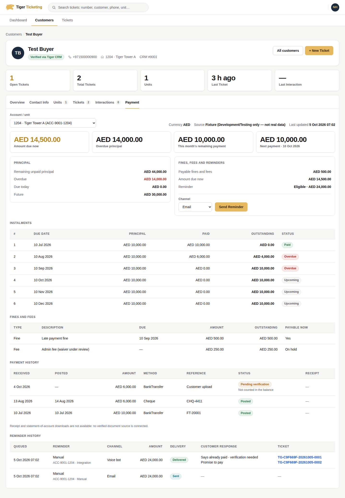
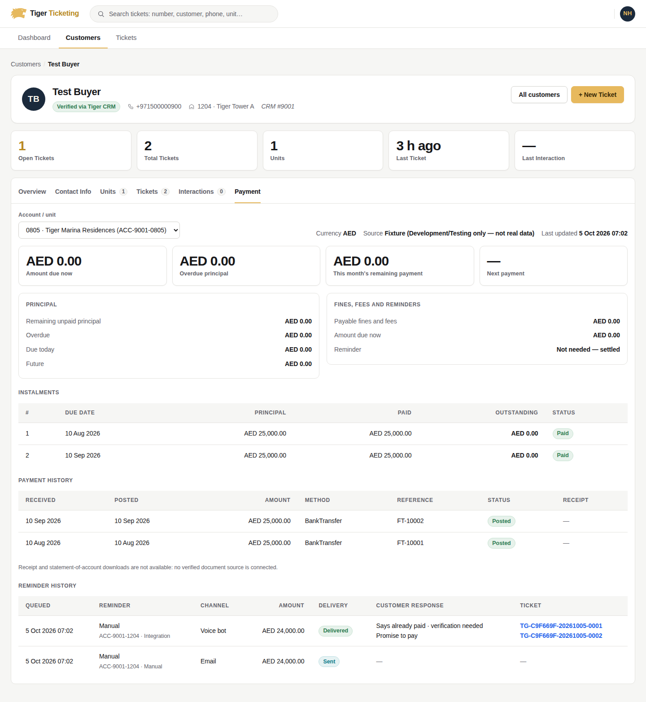
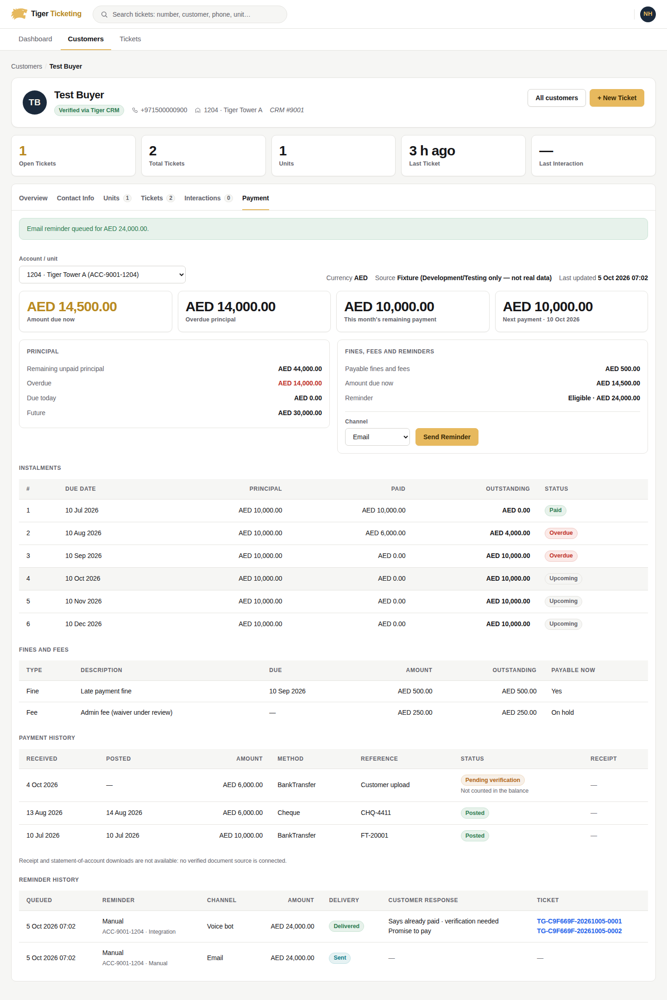
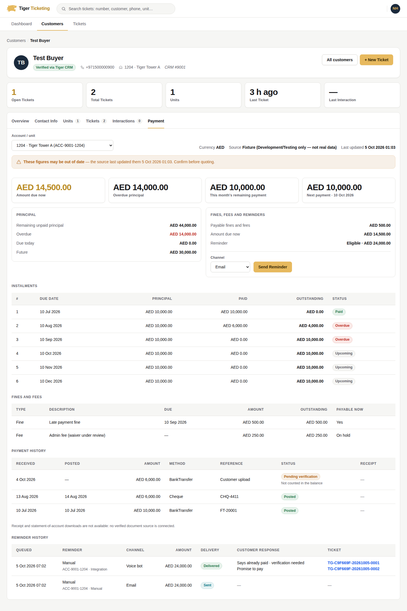
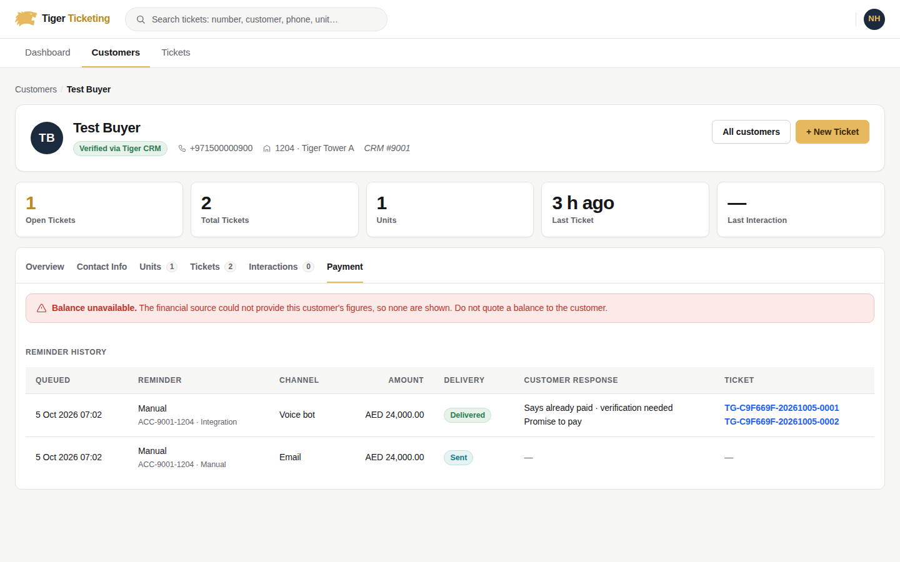
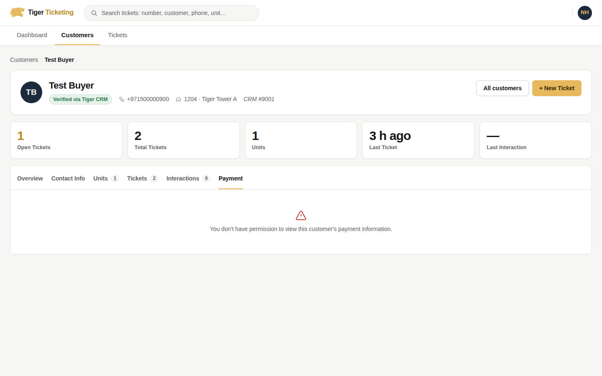
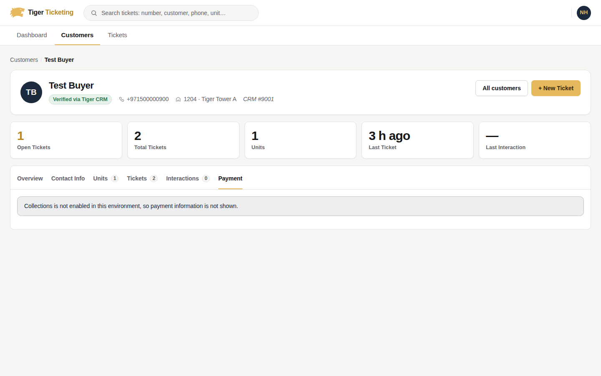
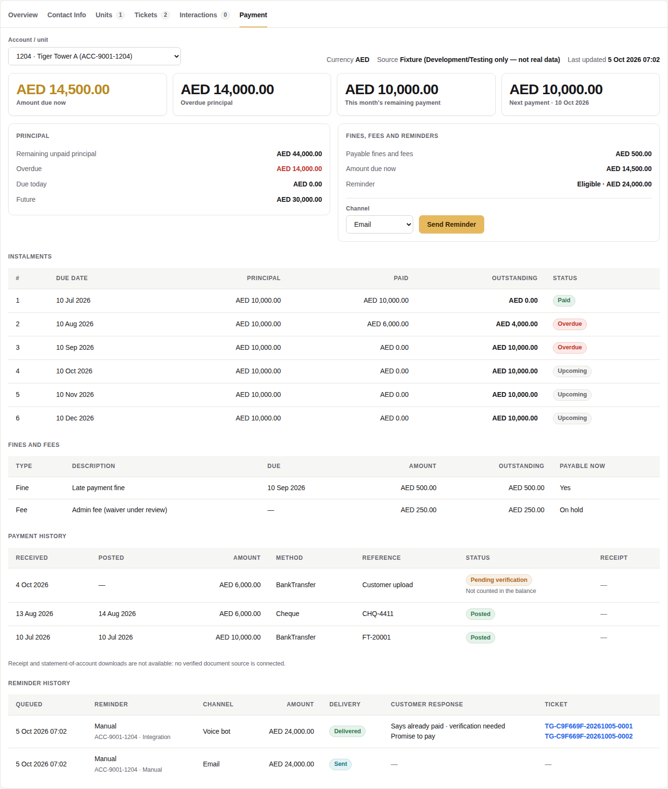
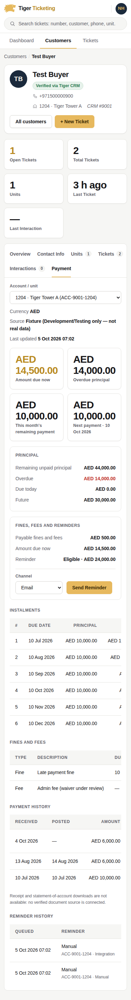

# Collections integration and the Payment tab

Status: **implemented and tested, but no real financial source is integrated.**
In every real environment the financial routes answer `503
collections-source-unavailable`, and the Payment tab says the balance is
unavailable. Nothing reports this integration as complete until a source
exists (§2).

Inputs: the Collections FAQ (Genesys, 29-09-2026) and
`TigerCS_Collections_API_Specification.md`. Neither document was available in
the repository or the build environment. The routes and behaviour below follow
the requirements restated in the work request. The JSON shapes follow this
repository's conventions (camelCase, string enums, `items/totalCount/page/pageSize`
paging, RFC 7807 problem bodies). Reconcile them against the specification
before Genesys builds its data actions (§7).

---

## 1. What exists

| Area | Where |
|---|---|
| Domain: balance bucketing, FAQ reminder windows, reminder + event entities | `src/TigerCS.Domain/Modules/Collections/` |
| Application: query, reminder, outcome services; outbox handlers; authorization | `src/TigerCS.Application/Modules/Collections/` |
| Financial source adapters (fail-closed default, Development/Testing fixture) | `src/TigerCS.Integrations/Modules/CollectionsIntegration/` |
| Persistence + migration `AddCollectionsReminders` | `src/TigerCS.Infrastructure/Modules/Collections/`, `AddCollectionsReminders.sql` |
| Designated scheduler (Hangfire recurring job, off by default) | `src/TigerCS.Infrastructure/BackgroundJobs/CollectionsReminderScheduleJob.cs` |
| API | `src/TigerCS.Api/Controllers/GenesysCollectionsController.cs` |
| Payment tab | `src/TigerCS.Web/Pages/Shared/_CustomerPaymentTab.cshtml`, `CustomerProfile.cshtml(.cs)`, `Services/Api/CollectionsApiClient.cs` |
| Legal notices / referrals (documented only, never dispatched) | `docs/Collections/Collections-Legal-Requirements.md` |

### Reused, not rebuilt

- **Ticket per response:** `GenesysInquiryIngestionAppService`, idempotent on
  `conversationId`, routed by department code or Genesys queue mapping. The
  ticket is created Unclassified like every Genesys ticket. Existing
  classification and lifecycle rules apply unchanged.
- **Human follow-up:** `GenesysTicketUpdateAppService` handoff (`TicketAgentHandoffs`),
  the same path an AI-to-human escalation already uses.
- **Durable retry and dispatch:** the existing outbox (`OutboxMessages`, `OutboxDispatchJob`)
  with its claim, attempt budget and dead-lettering.
- **Email delivery:** the existing `IEmailSender` (SMTP, or Recording in tests).
- **Scheduler:** the existing Hangfire server. There is no second timer.
- **Web boundary:** a typed `ApiClientBase` client with `BearerTokenHandler`.
  The browser never sees an API, Genesys or source credential, and Razor never
  touches SQL or EF.
- **Authorization:** roles plus department claims, with the ADR-0024 System
  Administrator override through `AuthorizationGate`. Ticket permissions are
  unchanged.

---

## 2. Financial source: the integration blocker

**No authoritative financial source exists today.**

- Tiger CRM publishes exactly one endpoint, `GET /TicketingSystem/GetBuyerByPhone`,
  which returns the buyer and units only. It has no balance, instalment,
  payment, receipt or statement-of-account data.
- No Oracle integration exists anywhere in TigerCS, its configuration or its docs.
- TigerCS therefore **does not calculate or store balances**. It defines the
  port `ICollectionsFinancialSource`. `CollectionsSource:Provider = "Unavailable"`
  is the default and the only valid value for UAT/Production, and it fails
  closed on every call.
- `"Fixture"` serves deterministic sample data for Development and the
  automated tests. Startup refuses it in any other environment
  (`CollectionsSourceSafety`, same pattern as `CrmGatewaySafety`). The API's
  `source` field also labels it *"Fixture (Development/Testing only — not real data)"*.

### What the source must provide (the contract TigerCS needs)

The owning team (CRM or Oracle) must publish, per CRM customer:

| Field | Per | Notes |
|---|---|---|
| `accountId`, `crmCustomerId`, `crmUnitId`, unit number, project | account | `crmCustomerId` = Tiger CRM Buyer `customerId` |
| `currency` (ISO 4217), `asOfUtc` | account | Amounts are never mixed across currencies |
| `reportedOutstandingPrincipal` | account | Optional, but used to cross-check the schedule |
| instalments: id, sequence, due date, principal, **principal outstanding after the source's own allocation** | instalment | TigerCS never re-allocates payments |
| charges: id, kind, amount, outstanding, due date, payable/on-hold | fine/fee | |
| payments: id, received, posted, amount, method, reference, status (`Posted`/`PendingVerification`/`Reversed`/`Rejected`), verified receipt available | payment | Only posted payments affect balances, and only via the source's outstanding figures |
| customer phone / email for reminders | account | Needed for SMS/email |
| a paged list of accounts with principal outstanding | — | For candidates and the scheduler |

Also required for downloads: a **verified receipt and statement-of-account
document API**. Until one exists, the API returns `receiptDownloadAvailable:
false` / `statementDownloadAvailable: false`, and the Payment tab offers no download.

When the contract is published, implement `ICollectionsFinancialSource` over it
and register it as a new provider. No other code changes.

### How figures are derived (no second ledger)

`AccountBalanceCalculator` only **sums the source's own outstanding values,
bucketed by due date** against "today" in `Asia/Dubai`:

| Figure | Definition |
|---|---|
| `remainingUnpaidPrincipal` | Source's reported total, or the schedule sum when none is reported |
| `overduePrincipal` | Outstanding on instalments due before today |
| `principalDueToday` | Outstanding on instalments due today |
| `futurePrincipal` | Outstanding on instalments due after today |
| `payableFinesAndFees` | Outstanding fines/fees that are payable (not on hold) and already due |
| `amountDueNow` | overdue + due today + payable fines/fees |
| `currentMonthRemaining` | Outstanding on instalments due in the current calendar month |
| `nextPayment` | Earliest instalment with outstanding principal, due today or later |

All arithmetic is `decimal`. Amounts are stored as `decimal(19,4)`. When the
schedule disagrees with the source total, the account is marked `Mismatch`:
the source total is shown and reminders are refused. Impossible data (more
outstanding than charged, negative values, a missing currency) is marked
`InvalidSourceData` and returns **no figures (null), never zero**.
Payment history is display-only, so an unverified proof cannot reduce a balance.

---

## 3. Routes

All routes sit under `api/genesys/collections`. They need a bearer token
(`AuthenticatedStaff`) **and** the explicit Collections permission below.
`Collections:Enabled = false` (the default) answers `503 collections-disabled`
on every route.

| Route | Permission | Success | Errors |
|---|---|---|---|
| `GET customers/{crmCustomerId}/outstanding?accountId=&crmUnitId=` | financial-read | 200 | 400, 403, 404, 503 |
| `GET customers/{crmCustomerId}/payments?accountId=&crmUnitId=&includeUnposted=&page=&pageSize=` | financial-read | 200 | 400, 403, 404, 503 |
| `GET reminders/candidates?reminderType=&channel=&page=&pageSize=` | reminder-send | 200 | 400, 403, 503 |
| `POST reminders` | reminder-send | 201 created / 200 `AlreadyExists` | 400, 403, 404, 422, 503 |
| `POST reminders/{reminderId}/outcomes` | integration only | 200 / 202 ticket pending | 400, 403, 404, 409, 503 |
| `GET customers/{crmCustomerId}/reminders?accountId=&page=&pageSize=` | financial-read | 200 | 400, 403, 503 |

Paging is `page` (1-based) and `pageSize` (1–100). An account or unit that is
not the customer's returns 404, never an empty list.

### Authorization (explicit, configurable)

| Permission | Holders (defaults, `Collections:Authorization:*`) |
|---|---|
| Financial read | CS Agent, CS Supervisor, CS Manager, General Manager, Chairman/CEO; Department Employee/Head **of the Collections department** (`CollectionsDepartmentCode`, default `COL`); integration accounts |
| Reminder send / candidates | CS Supervisor, CS Manager; Collections Department Employee/Head; integration accounts |
| Report outcomes | Integration accounts only (`IntegrationEmployeeIds`: the TigerGroupWeb service account Genesys calls through) |

The System Administrator passes every check through the existing ADR-0024
override. Reporting User and non-Collections department staff are refused.
**VoiceBot** reminders are recorded only by an integration account, because
Genesys dials and TigerCS never does.

---

## 4. Reminder processing

**Windows** (`ReminderPolicy`, business time zone `Asia/Dubai`):

| Type | Opens | Eligible when | Amount stated |
|---|---|---|---|
| `OverdueMoreThanOneMonth` | days 1–4 | principal due before *today − 1 calendar month* is unpaid | all overdue principal |
| `CurrentMonthDue` | day 15 | this month's instalments have principal outstanding | this month's outstanding principal |
| `MonthEndFollowUp` | last day − 3 (28 Oct, 27 Nov, 25 Feb, 26 Feb in leap years) | same as above | same as above |
| `Manual` | any day | principal due through month end is unpaid | principal due through month end |

Fines are added to the amount only when `Rules:IncludeFinesInReminderAmount` is
set (default off). Fines alone never trigger a reminder. A settled account
(nothing to remind about) is **never reminded**: creation returns 422, and an
SMS/email queued earlier is **suppressed** if the account settles before dispatch.

**Duplicate prevention:** `account | type | cycle | channel` is unique
(`UX_CollectionsReminders_DeduplicationKey`). The cycle is the month (once per
window) or the day (daily sending, and all manual sends). A repeat request
returns the existing reminder with `200 AlreadyExists`. A concurrent duplicate
loses at the unique index and is answered with the winner.

**Revalidation:** every create re-reads the account from the source. SMS/email
are queued in the outbox **in the same transaction** as the reminder, then
re-read again immediately before sending. The amount actually sent is stored
as `dispatchAmount` next to the queued `amount`, each with its source timestamp.

**Channels:**
- **VoiceBot:** Genesys pulls `GET reminders/candidates`, records each call
  with `POST reminders` right before dialing (amount persisted), and reports
  `Sent`/`Delivered`/`Failed`/`CustomerResponded` to `outcomes`.
- **Email:** through the existing EmailNotifications sender. Off by default.
- **SMS:** no approved provider exists in TigerCS. If enabled, dispatch fails
  closed (`Failed`, "No approved delivery provider").

**Statuses** `Queued → Sent → Delivered` (or `Failed`/`Suppressed`) only move
forward. Customer responses are separate events, never a status, so "delivered"
and "the customer said X" stay distinct.

**Designated scheduler:** the Hangfire recurring job
`collections-payment-reminders` (cron `Collections:ScheduleCron`, Asia/Dubai).
It is registered only when **all** of `Collections:Enabled`,
`AutomaticSchedulingEnabled` and `BusinessRulesConfirmed` are true, and it is
removed otherwise. It creates SMS/email reminders only. Voice calls stay
Genesys-pulled.

## 5. Customer responses

A `CustomerResponded` outcome with a `conversationId`:

1. Stores the response event **and** an outbox message in one transaction
   (durable).
2. Creates or reuses the conversation's ticket through
   `GenesysInquiryIngestionAppService`: `channel: Phone`, `direction: Outbound`,
   routed by `Collections:ResponseTickets:QueueId` (if set, via the queue
   mapping) or else `DepartmentCode` (default `COL`). The ticket is
   Unclassified, with no SLA until an agent classifies it, exactly like every
   other Genesys ticket.
3. For `AlreadyPaid`, `Disputed`, `RequestedHuman` and `AiDisconnected`, raises
   outstanding human work through the existing handoff (`AiEscalated`,
   `CustomerRequestedHuman`, `AiConnectionLost`). AlreadyPaid's reason text
   says to *verify against the financial source; no payment has been posted*.
4. Links the ticket last. The response is `Linked` only once its follow-up exists.

If step 2 or 3 fails (Genesys switched off, routing unconfigured, a transient
error), the API answers **202** with `ticketStatus: "Pending"`, and the outbox
retries until the ticket links or the message is dead-lettered for an operator.
Nothing here posts a payment, changes a balance, resolves or closes a ticket.
Repeated callbacks (same `eventId`) return `AlreadyRecorded`, and a second
response in the same conversation reuses the same ticket. A response with no
`conversationId` (an SMS reply) is recorded with `ticketStatus: "NotApplicable"`.

## 6. Payment tab

The Customer Profile (`/Customers/{customerKey}`) gains a **Payment** tab. It
uses the existing tab, KPI-card, facts-panel, data-table, badge and alert
components with the semantic palette tokens.

- **Loading:** the tab is fetched when opened (`?handler=PaymentPanel`, by
  `site.js` under the strict CSP), so the profile never waits on the source.
  Without JavaScript, the placeholder link renders it server-side (`?tab=payment`).
- **Account/unit selector**, currency, source and last-updated time.
- **Balance summary:** amount due now, overdue, this month's remainder, next
  payment, remaining/due-today/future principal, fines and fees.
- **Instalments, fines and fees, payment history** (unposted payments are
  labelled *Not counted in the balance*), **reminder history** with delivery
  status, responses and linked tickets.
- **Send Reminder** appears only when the API says the viewer may send, the
  selected account is eligible, and a Web channel (SMS/Email) is enabled. It
  asks for confirmation, the API revalidates, and the outcome is shown as a notice.
- **No receipt/SOA download:** no verified document API exists.
- **States:** loading, loaded, empty (no accounts), not a CRM customer,
  forbidden, stale (older than `StaleAfterMinutes`), Collections disabled, and
  **balance unavailable** (no figures shown, never zero; reminder history still
  shown).

Screenshots (real TigerCS.Web against a fake API serving responses captured
from the real API with the fixture source):

| | |
|---|---|
| Loaded |  |
| Settled account selected |  |
| After Send Reminder |  |
| Stale figures |  |
| Source unavailable |  |
| Forbidden |  |
| Collections disabled |  |
| Loading |  |
| Phone width |  |

## 7. Configuration

`src/TigerCS.Api/appsettings.json` ships everything **off**:

```jsonc
"Collections": {
  "Enabled": false,                        // gates every route (503 while off)
  "CollectionsDepartmentCode": "COL",      // who counts as Collections staff
  "TimeZoneId": "Asia/Dubai",
  "StaleAfterMinutes": 60,
  "Authorization": { "IntegrationEmployeeIds": [] },   // TigerGroupWeb service account's employee id
  "ResponseTickets": { "DepartmentCode": "COL", "QueueId": null },
  "Channels": { "VoiceBotEnabled": false, "SmsEnabled": false, "EmailEnabled": false },
  "AutomaticSchedulingEnabled": false,
  "BusinessRulesConfirmed": false
  // also: Rules:{OverdueAgeRule, OverdueFixedDays, OverdueWindowFirstDay/LastDay,
  //        CurrentMonthDueDay, MonthEndOffsetDays, IncludeFinesInReminderAmount, SendFrequency},
  //       ScheduleCron ("0 9 * * *"), MaxAccountsPerScan (5000),
  //       Authorization:{FinancialReadRoles, ReminderSendRoles, CollectionsDepartmentRoles}
},
"CollectionsSource": { "Provider": "Unavailable" }
```

To go live, in order: (1) integrate a real source; (2) set `Enabled`;
(3) add the TigerGroupWeb service account to `IntegrationEmployeeIds`;
(4) enable the channels Collections approves; (5) only after §8 is answered,
set `BusinessRulesConfirmed` and `AutomaticSchedulingEnabled`, with
`BackgroundJobs:Enabled` true. The TigerGroupWeb proxy must also forward the
six `api/genesys/collections/*` routes, as it does the existing Genesys routes.

## 8. Migration

`AddCollectionsReminders` (`20261005064542`) adds two tables:
`CollectionsReminders` (unique `DeduplicationKey`) and `CollectionsReminderEvents`
(unique `(CollectionsReminderId, ExternalEventId)`, FK restrict, index on
`TicketId`). The idempotent script is `AddCollectionsReminders.sql` at the
repository root. The DB-migration CI check now expects 55 tables. No existing
table changes.

## 9. Open business decisions (automatic scheduling stays off until answered)

1. **"More than one month"**: calendar month (default; 31 Mar → before 28/29 Feb) or a fixed day count (`FixedDays`, 30)?
2. **Fines in reminder amounts**: excluded by default. Should they be included?
3. **One send per window or daily sends** during days 1–4? Default is once per window.
4. **Month end and February**: is "three days before month end" the last day − 3 (25 Feb, 26 Feb in leap years), or something else?
5. Should the overdue reminder state **all** overdue principal (current) or only the part older than a month?
6. Should a pending "I already paid" claim pause further reminders for that account? Currently it does not.
7. Approved reminder wording (email template, voice script) and an **approved SMS provider**.
8. Whether **CS Agents** should keep financial read access (default yes, because agents take the calls), and whether Collections staff need ticket permissions beyond today's.
9. Reconcile these JSON contracts with `TigerCS_Collections_API_Specification.md`, which was not available for this work.

## 10. JSON examples (captured from the real API, fixture source)

### Outstanding, one account (instalments trimmed to three)

`GET /api/genesys/collections/customers/9001/outstanding?accountId=ACC-9001-1204`

**200**

```json
{
  "crmCustomerId": "9001",
  "source": "Fixture (Development/Testing only — not real data)",
  "asOfUtc": "2026-10-05T07:02:33.2268148Z",
  "isStale": false,
  "businessDate": "2026-10-05",
  "accounts": [
    {
      "accountId": "ACC-9001-1204",
      "crmUnitId": "9200",
      "unitNumber": "1204",
      "projectName": "Tiger Tower A",
      "currency": "AED",
      "asOfUtc": "2026-10-05T07:02:33.2268148Z",
      "isStale": false,
      "consistency": "Consistent",
      "problems": [],
      "balance": {
        "remainingUnpaidPrincipal": 44000,
        "overduePrincipal": 14000,
        "principalDueToday": 0,
        "futurePrincipal": 30000,
        "payableFinesAndFees": 500,
        "amountDueNow": 14500,
        "currentMonthRemaining": 10000,
        "nextPayment": {
          "instalmentId": "INS-1204-04",
          "dueDate": "2026-10-10",
          "amount": 10000
        }
      },
      "reminderEligibility": {
        "eligible": true,
        "amount": 24000,
        "reason": null,
        "openWindows": []
      },
      "instalments": [
        {
          "instalmentId": "INS-1204-01",
          "sequence": 1,
          "dueDate": "2026-07-10",
          "principalAmount": 10000,
          "principalPaid": 10000,
          "principalOutstanding": 0,
          "status": "Paid"
        },
        {
          "instalmentId": "INS-1204-02",
          "sequence": 2,
          "dueDate": "2026-08-10",
          "principalAmount": 10000,
          "principalPaid": 6000,
          "principalOutstanding": 4000,
          "status": "Overdue"
        },
        {
          "instalmentId": "INS-1204-03",
          "sequence": 3,
          "dueDate": "2026-09-10",
          "principalAmount": 10000,
          "principalPaid": 0,
          "principalOutstanding": 10000,
          "status": "Overdue"
        }
      ],
      "charges": [
        {
          "chargeId": "FINE-1204-01",
          "kind": "Fine",
          "description": "Late payment fine",
          "amount": 500,
          "outstanding": 500,
          "dueDate": "2026-09-10",
          "isPayable": true
        },
        {
          "chargeId": "FEE-1204-01",
          "kind": "Fee",
          "description": "Admin fee (waiver under review)",
          "amount": 250,
          "outstanding": 250,
          "dueDate": null,
          "isPayable": false
        }
      ]
    }
  ],
  "viewer": {
    "canSendReminder": true,
    "enabledChannels": [
      "VoiceBot",
      "Email"
    ]
  },
  "documents": {
    "receiptDownloadAvailable": false,
    "statementDownloadAvailable": false,
    "reason": "No verified receipt or statement-of-account document API is connected."
  }
}
```

### Payments, including unposted

`GET /api/genesys/collections/customers/9001/payments?accountId=ACC-9001-1204&includeUnposted=true`

**200**

```json
{
  "crmCustomerId": "9001",
  "source": "Fixture (Development/Testing only — not real data)",
  "asOfUtc": "2026-10-05T07:02:33.2962089Z",
  "isStale": false,
  "items": [
    {
      "paymentId": "PAY-1204-03",
      "accountId": "ACC-9001-1204",
      "crmUnitId": "9200",
      "unitNumber": "1204",
      "receivedOn": "2026-10-04",
      "postedOn": null,
      "amount": 6000,
      "currency": "AED",
      "method": "BankTransfer",
      "reference": "Customer upload",
      "status": "PendingVerification",
      "countsTowardBalance": false,
      "receiptAvailable": false
    },
    {
      "paymentId": "PAY-1204-02",
      "accountId": "ACC-9001-1204",
      "crmUnitId": "9200",
      "unitNumber": "1204",
      "receivedOn": "2026-08-13",
      "postedOn": "2026-08-14",
      "amount": 6000,
      "currency": "AED",
      "method": "Cheque",
      "reference": "CHQ-4411",
      "status": "Posted",
      "countsTowardBalance": true,
      "receiptAvailable": false
    },
    {
      "paymentId": "PAY-1204-01",
      "accountId": "ACC-9001-1204",
      "crmUnitId": "9200",
      "unitNumber": "1204",
      "receivedOn": "2026-07-10",
      "postedOn": "2026-07-10",
      "amount": 10000,
      "currency": "AED",
      "method": "BankTransfer",
      "reference": "FT-20001",
      "status": "Posted",
      "countsTowardBalance": true,
      "receiptAvailable": false
    }
  ],
  "totalCount": 3,
  "page": 1,
  "pageSize": 25
}
```

### Reminder candidates (5 Oct: no window open — on days 1–4/15/month-end − 3 the items are populated)

`GET /api/genesys/collections/reminders/candidates?channel=VoiceBot`

**200**

```json
{
  "businessDate": "2026-10-05",
  "openWindows": [],
  "source": "Fixture (Development/Testing only — not real data)",
  "items": [],
  "totalCount": 0,
  "page": 1,
  "pageSize": 50,
  "truncated": false
}
```

### Create reminder — created

`POST /api/genesys/collections/reminders`

```json
{
  "crmCustomerId": "9001",
  "accountId": "ACC-9001-1204",
  "channel": "Email"
}
```

**201**

```json
{
  "outcome": "Created",
  "reminder": {
    "reminderId": 1,
    "crmCustomerId": "9001",
    "accountId": "ACC-9001-1204",
    "crmUnitId": "9200",
    "reminderType": "Manual",
    "channel": "Email",
    "cycleKey": "2026-10-05",
    "status": "Queued",
    "statusReason": null,
    "amount": 24000,
    "currency": "AED",
    "amountIncludesFines": false,
    "sourceAsOfUtc": "2026-10-05T07:02:33.3718284Z",
    "dispatchAmount": null,
    "trigger": "Manual",
    "createdAtUtc": "2026-10-05T07:02:33.4145165Z",
    "sentAtUtc": null,
    "deliveredAtUtc": null,
    "failedAtUtc": null,
    "suppressedAtUtc": null,
    "events": [
      {
        "reminderEventId": 1,
        "eventId": "tigercs:queued",
        "eventType": "Queued",
        "occurredAtUtc": "2026-10-05T07:02:33.4145165Z",
        "recordedAtUtc": "2026-10-05T07:02:33.4145165Z",
        "detail": null,
        "responseKind": null,
        "conversationId": null,
        "promisedPaymentDate": null,
        "promisedAmount": null,
        "verificationFollowUpRequired": false,
        "humanFollowUpRequired": false,
        "ticketStatus": null,
        "ticketId": null,
        "ticketNumber": null
      }
    ]
  }
}
```

### Create reminder — the same account/type/cycle/channel again

`POST /api/genesys/collections/reminders`

```json
{
  "crmCustomerId": "9001",
  "accountId": "ACC-9001-1204",
  "channel": "Email"
}
```

**200**

```json
{
  "outcome": "AlreadyExists",
  "reminder": {
    "reminderId": 1,
    "crmCustomerId": "9001",
    "accountId": "ACC-9001-1204",
    "crmUnitId": "9200",
    "reminderType": "Manual",
    "channel": "Email",
    "cycleKey": "2026-10-05",
    "status": "Queued",
    "statusReason": null,
    "amount": 24000,
    "currency": "AED",
    "amountIncludesFines": false,
    "sourceAsOfUtc": "2026-10-05T07:02:33.3718284Z",
    "dispatchAmount": null,
    "trigger": "Manual",
    "createdAtUtc": "2026-10-05T07:02:33.4145165Z",
    "sentAtUtc": null,
    "deliveredAtUtc": null,
    "failedAtUtc": null,
    "suppressedAtUtc": null,
    "events": [
      {
        "reminderEventId": 1,
        "eventId": "tigercs:queued",
        "eventType": "Queued",
        "occurredAtUtc": "2026-10-05T07:02:33.4145165Z",
        "recordedAtUtc": "2026-10-05T07:02:33.4145165Z",
        "detail": null,
        "responseKind": null,
        "conversationId": null,
        "promisedPaymentDate": null,
        "promisedAmount": null,
        "verificationFollowUpRequired": false,
        "humanFollowUpRequired": false,
        "ticketStatus": null,
        "ticketId": null,
        "ticketNumber": null
      }
    ]
  }
}
```

### Create reminder — settled account

`POST /api/genesys/collections/reminders`

```json
{
  "crmCustomerId": "9001",
  "accountId": "ACC-9001-0805",
  "channel": "Email"
}
```

**422**

```json
{
  "type": "https://tigercs.internal/problems/collections-reminder-not-eligible",
  "title": "The account is not eligible for this reminder",
  "status": 422,
  "detail": "Account 'ACC-9001-0805' has nothing outstanding for a Manual reminder — no reminder is sent for a settled account."
}
```

### Create VoiceBot reminder (integration account)

`POST /api/genesys/collections/reminders`

```json
{
  "crmCustomerId": "9001",
  "accountId": "ACC-9001-1204",
  "channel": "VoiceBot"
}
```

**201**

```json
{
  "outcome": "Created",
  "reminder": {
    "reminderId": 2,
    "crmCustomerId": "9001",
    "accountId": "ACC-9001-1204",
    "crmUnitId": "9200",
    "reminderType": "Manual",
    "channel": "VoiceBot",
    "cycleKey": "2026-10-05",
    "status": "Queued",
    "statusReason": null,
    "amount": 24000,
    "currency": "AED",
    "amountIncludesFines": false,
    "sourceAsOfUtc": "2026-10-05T07:02:33.7995714Z",
    "dispatchAmount": null,
    "trigger": "Integration",
    "createdAtUtc": "2026-10-05T07:02:33.8000307Z",
    "sentAtUtc": null,
    "deliveredAtUtc": null,
    "failedAtUtc": null,
    "suppressedAtUtc": null,
    "events": [
      {
        "reminderEventId": 2,
        "eventId": "tigercs:queued",
        "eventType": "Queued",
        "occurredAtUtc": "2026-10-05T07:02:33.8000307Z",
        "recordedAtUtc": "2026-10-05T07:02:33.8000307Z",
        "detail": null,
        "responseKind": null,
        "conversationId": null,
        "promisedPaymentDate": null,
        "promisedAmount": null,
        "verificationFollowUpRequired": false,
        "humanFollowUpRequired": false,
        "ticketStatus": null,
        "ticketId": null,
        "ticketNumber": null
      }
    ]
  }
}
```

### Outcome — Delivered

`POST /api/genesys/collections/reminders/2/outcomes`

```json
{
  "eventId": "gen-evt-1001",
  "outcome": "Delivered",
  "occurredAtUtc": "2026-10-05T07:02:33.8112043Z",
  "providerReference": "call-77f1"
}
```

**200**

```json
{
  "outcome": "Recorded",
  "reminderId": 2,
  "reminderStatus": "Delivered",
  "event": {
    "reminderEventId": 3,
    "eventId": "gen-evt-1001",
    "eventType": "Delivered",
    "occurredAtUtc": "2026-10-05T07:02:33.8112043Z",
    "recordedAtUtc": "2026-10-05T07:02:33.8578683Z",
    "detail": "call-77f1",
    "responseKind": null,
    "conversationId": null,
    "promisedPaymentDate": null,
    "promisedAmount": null,
    "verificationFollowUpRequired": false,
    "humanFollowUpRequired": false,
    "ticketStatus": null,
    "ticketId": null,
    "ticketNumber": null
  }
}
```

### Outcome — the same eventId again

`POST /api/genesys/collections/reminders/2/outcomes`

```json
{
  "eventId": "gen-evt-1001",
  "outcome": "Delivered",
  "occurredAtUtc": "2026-10-05T07:02:33.8112043Z",
  "providerReference": "call-77f1"
}
```

**200**

```json
{
  "outcome": "AlreadyRecorded",
  "reminderId": 2,
  "reminderStatus": "Delivered",
  "event": {
    "reminderEventId": 3,
    "eventId": "gen-evt-1001",
    "eventType": "Delivered",
    "occurredAtUtc": "2026-10-05T07:02:33.8112043Z",
    "recordedAtUtc": "2026-10-05T07:02:33.8578683Z",
    "detail": "call-77f1",
    "responseKind": null,
    "conversationId": null,
    "promisedPaymentDate": null,
    "promisedAmount": null,
    "verificationFollowUpRequired": false,
    "humanFollowUpRequired": false,
    "ticketStatus": null,
    "ticketId": null,
    "ticketNumber": null
  }
}
```

### Outcome — customer says already paid (ticket created by conversationId, verification raised)

`POST /api/genesys/collections/reminders/2/outcomes`

```json
{
  "eventId": "gen-evt-1002",
  "outcome": "CustomerResponded",
  "occurredAtUtc": "2026-10-05T07:02:33.8876606Z",
  "response": {
    "kind": "AlreadyPaid",
    "conversationId": "8f2c1e40-3d2a-4b1c-9e77-1a2b3c4d5e6f",
    "customerPhone": "tel:+971500000900",
    "note": "Customer says the transfer was made yesterday"
  }
}
```

**200**

```json
{
  "outcome": "Recorded",
  "reminderId": 2,
  "reminderStatus": "Delivered",
  "event": {
    "reminderEventId": 4,
    "eventId": "gen-evt-1002",
    "eventType": "CustomerResponded",
    "occurredAtUtc": "2026-10-05T07:02:33.8876606Z",
    "recordedAtUtc": "2026-10-05T07:02:33.8943471Z",
    "detail": "Customer says the transfer was made yesterday",
    "responseKind": "AlreadyPaid",
    "conversationId": "8f2c1e40-3d2a-4b1c-9e77-1a2b3c4d5e6f",
    "promisedPaymentDate": null,
    "promisedAmount": null,
    "verificationFollowUpRequired": true,
    "humanFollowUpRequired": true,
    "ticketStatus": "Linked",
    "ticketId": 1,
    "ticketNumber": "TG-C9F669F-20261005-0001"
  }
}
```

### Outcome — ticket creation failed temporarily (durable retry)

`POST /api/genesys/collections/reminders/2/outcomes`

```json
{
  "eventId": "gen-evt-1003",
  "outcome": "CustomerResponded",
  "occurredAtUtc": "2026-10-05T07:02:34.548807Z",
  "response": {
    "kind": "PromiseToPay",
    "conversationId": "0a1b2c3d-0000-4b1c-9e77-1a2b3c4d5e6f",
    "promisedPaymentDate": "2026-10-20",
    "promisedAmount": 14000
  }
}
```

**202**

```json
{
  "outcome": "Recorded",
  "reminderId": 2,
  "reminderStatus": "Delivered",
  "event": {
    "reminderEventId": 5,
    "eventId": "gen-evt-1003",
    "eventType": "CustomerResponded",
    "occurredAtUtc": "2026-10-05T07:02:34.548807Z",
    "recordedAtUtc": "2026-10-05T07:02:34.5543174Z",
    "detail": null,
    "responseKind": "PromiseToPay",
    "conversationId": "0a1b2c3d-0000-4b1c-9e77-1a2b3c4d5e6f",
    "promisedPaymentDate": "2026-10-20",
    "promisedAmount": 14000,
    "verificationFollowUpRequired": false,
    "humanFollowUpRequired": false,
    "ticketStatus": "Pending",
    "ticketId": null,
    "ticketNumber": null
  }
}
```

### Reminder history (after the outbox retried and sent)

`GET /api/genesys/collections/customers/9001/reminders?accountId=ACC-9001-1204`

**200**

```json
{
  "items": [
    {
      "reminderId": 2,
      "crmCustomerId": "9001",
      "accountId": "ACC-9001-1204",
      "crmUnitId": "9200",
      "reminderType": "Manual",
      "channel": "VoiceBot",
      "cycleKey": "2026-10-05",
      "status": "Delivered",
      "statusReason": null,
      "amount": 24000,
      "currency": "AED",
      "amountIncludesFines": false,
      "sourceAsOfUtc": "2026-10-05T07:02:33.7995714Z",
      "dispatchAmount": null,
      "trigger": "Integration",
      "createdAtUtc": "2026-10-05T07:02:33.8000307Z",
      "sentAtUtc": "2026-10-05T07:02:33.8112043Z",
      "deliveredAtUtc": "2026-10-05T07:02:33.8112043Z",
      "failedAtUtc": null,
      "suppressedAtUtc": null,
      "events": [
        {
          "reminderEventId": 2,
          "eventId": "tigercs:queued",
          "eventType": "Queued",
          "occurredAtUtc": "2026-10-05T07:02:33.8000307Z",
          "recordedAtUtc": "2026-10-05T07:02:33.8000307Z",
          "detail": null,
          "responseKind": null,
          "conversationId": null,
          "promisedPaymentDate": null,
          "promisedAmount": null,
          "verificationFollowUpRequired": false,
          "humanFollowUpRequired": false,
          "ticketStatus": null,
          "ticketId": null,
          "ticketNumber": null
        },
        {
          "reminderEventId": 3,
          "eventId": "gen-evt-1001",
          "eventType": "Delivered",
          "occurredAtUtc": "2026-10-05T07:02:33.8112043Z",
          "recordedAtUtc": "2026-10-05T07:02:33.8578683Z",
          "detail": "call-77f1",
          "responseKind": null,
          "conversationId": null,
          "promisedPaymentDate": null,
          "promisedAmount": null,
          "verificationFollowUpRequired": false,
          "humanFollowUpRequired": false,
          "ticketStatus": null,
          "ticketId": null,
          "ticketNumber": null
        },
        {
          "reminderEventId": 4,
          "eventId": "gen-evt-1002",
          "eventType": "CustomerResponded",
          "occurredAtUtc": "2026-10-05T07:02:33.8876606Z",
          "recordedAtUtc": "2026-10-05T07:02:33.8943471Z",
          "detail": "Customer says the transfer was made yesterday",
          "responseKind": "AlreadyPaid",
          "conversationId": "8f2c1e40-3d2a-4b1c-9e77-1a2b3c4d5e6f",
          "promisedPaymentDate": null,
          "promisedAmount": null,
          "verificationFollowUpRequired": true,
          "humanFollowUpRequired": true,
          "ticketStatus": "Linked",
          "ticketId": 1,
          "ticketNumber": "TG-C9F669F-20261005-0001"
        },
        {
          "reminderEventId": 5,
          "eventId": "gen-evt-1003",
          "eventType": "CustomerResponded",
          "occurredAtUtc": "2026-10-05T07:02:34.548807Z",
          "recordedAtUtc": "2026-10-05T07:02:34.5543174Z",
          "detail": null,
          "responseKind": "PromiseToPay",
          "conversationId": "0a1b2c3d-0000-4b1c-9e77-1a2b3c4d5e6f",
          "promisedPaymentDate": "2026-10-20",
          "promisedAmount": 14000,
          "verificationFollowUpRequired": false,
          "humanFollowUpRequired": false,
          "ticketStatus": "Linked",
          "ticketId": 2,
          "ticketNumber": "TG-C9F669F-20261005-0002"
        }
      ]
    }
  ],
  "totalCount": 2,
  "page": 1,
  "pageSize": 25
}
```

### 400 invalid outcome

`POST /api/genesys/collections/reminders/2/outcomes`

**400**

```json
{
  "type": "https://tigercs.internal/problems/collections-invalid-request",
  "title": "The request is not valid",
  "status": 400,
  "detail": "outcome must be Sent, Delivered, Failed or CustomerResponded."
}
```

### 403 no financial-read permission

`GET /api/genesys/collections/customers/9001/outstanding`

**403**

```json
{
  "type": "https://tigercs.internal/problems/collections-forbidden",
  "title": "Not permitted",
  "status": 403,
  "detail": "Reading customer financials requires the Collections financial-read permission."
}
```

### 403 outcome from a non-integration caller

`POST /api/genesys/collections/reminders/2/outcomes`

**403**

```json
{
  "type": "https://tigercs.internal/problems/collections-forbidden",
  "title": "Not permitted",
  "status": 403,
  "detail": "Only a configured integration account may report reminder outcomes."
}
```

### 404 account not the customer's

`GET /api/genesys/collections/customers/9001/outstanding?accountId=ACC-9002-0310`

**404**

```json
{
  "type": "https://tigercs.internal/problems/collections-account-not-found",
  "title": "Account not found for this customer",
  "status": 404,
  "detail": "Account 'ACC-9002-0310' does not belong to customer '9001'."
}
```

### 503 no financial source integrated

`GET /api/genesys/collections/customers/9001/outstanding`

**503**

```json
{
  "type": "https://tigercs.internal/problems/collections-source-unavailable",
  "title": "The financial source is unavailable",
  "status": 503,
  "detail": "No authoritative financial source is integrated: Tiger CRM has not published an account/instalment/payment endpoint and no Oracle integration exists. Collections figures are unavailable."
}
```

### 503 Collections disabled

`GET /api/genesys/collections/customers/9001/outstanding`

**503**

```json
{
  "type": "https://tigercs.internal/problems/collections-disabled",
  "title": "Collections is disabled",
  "status": 503,
  "detail": "Collections:Enabled is false — no Collections request is processed."
}
```
