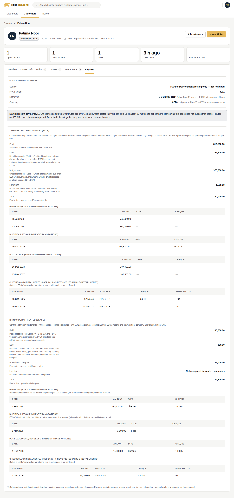
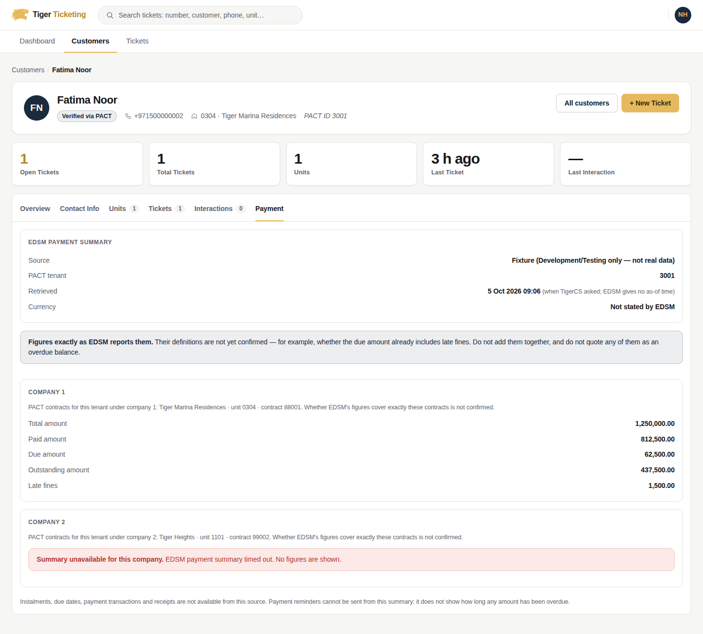
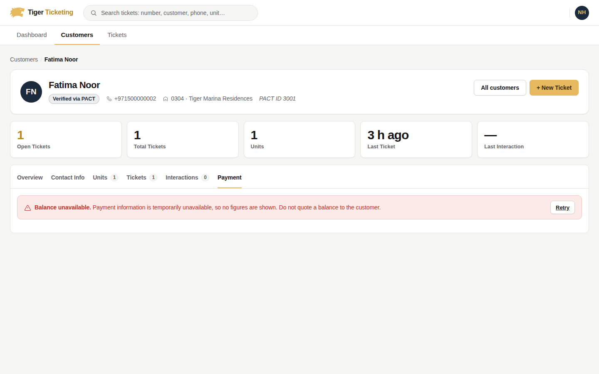
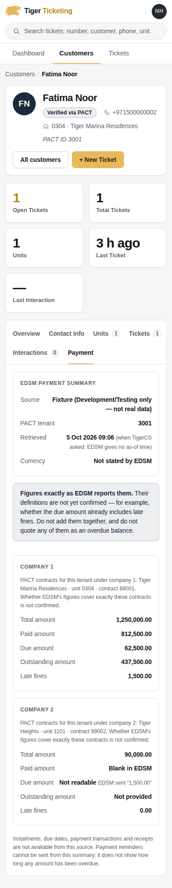

# Collections integration and the Payment tab

**Status: EDSM is connected in code for PACT-identified customers, and off
by default.** The adapter follows `EDSM_Collections_Contract.md` (in this
folder; a static analysis of the EDSM source). It reads three read-only EDSM
routes: payment-summary, payment-transactions (types 1–3) and
due-installments. Owned companies (4, 32) and rented companies (25, 7, 20)
are mapped separately.

Evidence levels:
- **Shown by EDSM source code:** routes, envelope, formulas and caches.
- **Still UNVERIFIED:**
  - the stored-procedure SQL;
  - the deployed build and its configuration (cache durations, host culture,
    base URL);
  - real UAT data.
- **Not connected at all:**
  - **CRM-identified customers.** No verified CRM→PACT crosswalk exists, so
    they are not mapped.
  - **The per-account routes** (outstanding, instalments, history), which
    still answer `503 FinanceUnavailable`.
- **Never sent:** reminders. Automatic sending stays off (`SchedulerOwner:
  "None"`, `BusinessRulesConfirmed: false`, every channel disabled).

Inputs: the Collections FAQ (Genesys, 29-09-2026) and
`TigerCS_Collections_API_Specification.md` (a proposed contract). The routes,
status codes and payloads follow the specification, with the deviations listed
in §9.

---

## 1. What exists

| Area | Where |
|---|---|
| Domain: snapshot model, balance bucketing, FAQ reminder windows, reminder job / channel / event entities | `src/TigerCS.Domain/Modules/Collections/` |
| Application: query, reminder and outcome services; outbox handlers; authorization | `src/TigerCS.Application/Modules/Collections/` |
| Financial source port `ICollectionsFinancialSource` + providers `Unavailable` (default) and `Fixture` (Development/Testing only) | `Application/.../Abstractions/ICollectionsFinancialSource.cs`, `src/TigerCS.Integrations/Modules/CollectionsIntegration/` |
| Persistence + migration `AddCollectionsReminders` | `src/TigerCS.Infrastructure/Modules/Collections/`, `AddCollectionsReminders.sql` |
| Designated scheduler (Hangfire recurring job, inactive by default) | `src/TigerCS.Infrastructure/BackgroundJobs/CollectionsReminderScheduleJob.cs` |
| API (`api/genesys/collections/*` for Genesys, `api/collections/*` for TigerCS.Web; same six actions) | `src/TigerCS.Api/Controllers/GenesysCollectionsController.cs` |
| Payment tab | `src/TigerCS.Web/Pages/Shared/_CustomerPaymentTab.cshtml`, `CustomerProfile.cshtml(.cs)`, `Services/Api/CollectionsApiClient.cs`, `Services/CustomerPaymentPanelLoader.cs` |
| Legal notices / referrals (documented only, never dispatched) | `docs/Collections/Collections-Legal-Requirements.md` |

### Reused, not rebuilt

- **Ticket per response:** `GenesysInquiryIngestionAppService`, idempotent on
  the Genesys `conversationId`, routed by department code or Genesys queue
  mapping. Existing classification, lifecycle and ticket permissions are unchanged.
- **Human follow-up:** `GenesysTicketUpdateAppService` handoffs
  (`CustomerRequestedHuman`, `AiConnectionLost`, `AiEscalated`).
- **Durable retry and dispatch:** the existing outbox (`IOutboxWriter`,
  `OutboxDispatcher`) with its claim, attempt budget and dead-lettering.
- **Email delivery:** the existing `IEmailSender`.
- **Scheduler:** the existing Hangfire server. There is no second timer.
- **Web boundary:** typed `ApiClientBase` clients with the bearer handler. The
  browser never sees an API, Genesys or EDSM credential, and Razor never
  touches SQL or EF.
- **Authorization:** roles + department claims, with the ADR-0024 System
  Administrator override through `AuthorizationGate`.

---

## 2. EDSM

Source of truth: [`EDSM_Collections_Contract.md`](EDSM_Collections_Contract.md)
(a sanitized public copy). UAT steps: [`EDSM-UAT-Guide.md`](EDSM-UAT-Guide.md).
Section references below (§ in brackets) point into it.

### 2.1 What is implemented

| Piece | Where |
|---|---|
| Port, company catalog, amount parser | `Application/Modules/Collections/Abstractions/IEdsmCollectionsGateway.cs` |
| Settings | `Application/Modules/Collections/CollectionsEdsmOptions.cs` (`CollectionsSource` section) |
| HTTP gateway + `Unavailable` / `Fixture` providers | `Integrations/Modules/CollectionsIntegration/EdsmCollectionsHttpGateway.cs` |
| Account resolution, owned/rented mapping, transactions, due-installments | `Application/Modules/Collections/Services/CollectionsPaymentSummaryAppService.cs` |
| Route | `GET api/collections/customers/by-key/{customerKey}/payment-summary` (TigerCS.Web only) |
| Payment tab view | `Web/Pages/Shared/_EdsmPaymentSummary.cshtml` |

**Transport** (VERIFIED in code [§1]):
- **Connection:** the `PactApi` base URL and `X-API-KEY`, reused. The key is
  never logged.
- **Each response, mapped to its own outcome:**

| EDSM answer | TigerCS outcome |
|---|---|
| `200 {title:"", status:200, data}` | `Success` |
| `400` envelope (`data:null`, e.g. title "Company not supported") | `BusinessRuleRejected`, with the title |
| `400` ASP.NET ProblemDetails (`errors`) | `ValidationRejected`, with the field names |
| `401 text/plain` "API Key was not provided." / `403` "Unauthorized client." | `Unauthorized`, with the text |
| `500` (no envelope), other status, timeout, unreachable | `Unavailable` |
| `200` that is not the envelope, or `data:null` | `InvalidResponse` |
| Company outside `CompanyEnum`, or not supported by the route | `NotSupported` (EDSM is not called) |

**Account resolution and scope** [§1.2, §2.3]:
- **EDSM's zeros prove nothing.** EDSM answers an unknown tenant with
  **200 and zeros**, so an EDSM response never establishes that an account exists.
- **PACT establishes existence and ownership.**
  - TigerCS stores a PACT customer as `ext:Pact:{tenantID}`.
  - TigerCS calls `/v1/contracts/{mobile}` for the customer's phone numbers and
    keeps only rows whose own `tenantID` equals the stored tenant.
  - EDSM is asked only for the (`companyID`, `tenantID`) pairs on those rows.
- **Tenant id source.** The tenant id always comes from the row's `tenantID`,
  never from `UserUnit.RefId`, which for Parking units is the ContractID.
- **Scope.** Each company is shown separately with its contracts.
  EDSM aggregates per company and tenant, not per unit; whether one tenant id
  covers several units is UNVERIFIED (SQL).
- **Not mapped:**
  - Contracts without a `companyID`, and companies outside `CompanyEnum`, are
    listed, not guessed.
  - CRM-identified customers are `NotMapped`: a ticket stores either CRM IDs
    or a PACT tenant, never both.
- **Side effect.** `/v1/contracts/{mobile}` **writes** customer-type and
  `UserUnit` rows in EDSM [§8.3], so contract discovery runs only when there
  is a reason.

**Verified mapping reuse** (`PactAccountMappingCache`):
- **Why a cache is needed.** TigerCS's persisted facts hold the PACT
  `tenantID` (the ticket's `ExternalCustomerId`), but not `companyID`, so the
  company/tenant pairs come from one discovery.
- **What is cached.** The pairs are kept in memory for
  `CollectionsSource:PactMappingTtlMinutes` (default 30, at most 24 h). The key
  is the tenant plus the profile's phone numbers.
- **What isn't cached.** Authorization: every request still checks the
  financial-read grant and the Customer Directory's department visibility first.
- **Discovery runs again when:**
  - the TTL expires;
  - the customer's phone numbers change;
  - EDSM refuses a cached pair (business-rule or validation 400), which
    invalidates the entry;
  - the previous attempt could not reach PACT (failures are never cached).
- **No contracts.** "PACT answered: no contracts for this tenant" is reused for
  `PactMappingNegativeTtlMinutes` (default 5), so retries on an unmapped
  customer don't each write.
- **What the response shows.** `mappingVerifiedAtUtc` and `mappingSource`
  (`PactLookup` or `Cached`) tell you when PACT last confirmed the accounts;
  the tab shows "Accounts confirmed … (PACT contracts, reused)".
- **Still read every load.** EDSM's own read-only figures (summary,
  transactions) are still read on each load.
- **Scope.** The cache is per instance; a restart costs one discovery.

**Companies** [§2.1–2.2]:

| CompanyId | Name | Model | summary | transactions 1–3 | due-installments |
|---|---|---|---|---|---|
| 4 | Tiger Group Dubai | Owned | ✅ | ✅ | ✅ |
| 32 | Tiger Group Sharjah | Owned | ✅ | ✅ | ✅ |
| 25 | Hirmas Dubai | Rented | ✅ | ✅ | ✅ |
| 7 | Alsabeel Sharjah | Rented | ✅ | ✅ | ✅ |
| 20 | Alsabeel Sharjah Trio 3 | Rented | ✅ | ✅ | ❌ not called |

**Payment-summary fields, mapped per model** (VERIFIED in C# [§3.4, §3.5];
the SP rows behind them are UNVERIFIED). TigerCS shows EDSM's own formatted
strings and never adds, nets or recomputes them.

| Field | Owned (4, 32) | Rented (25, 7, 20) |
|---|---|---|
| `paidAmount` | Σ credits > 0 | posted receipts (excl. JVP/JRN/JVA/PDPV) − refunds (IPV/PPV) + fees paid (JRN) + OB credit |
| `dueAmount` | unpaid remainder of instalments due ≤ EDSM server date; instalments with no credit recorded are **excluded** | bounced cheques due (net of adjustments) + unpaid fees + OB debit; **can be negative** |
| `outstandingAmount` (label: "Not yet due" / "Post-dated cheques") | same as due, for instalments due after the server date | post-dated cheques (`pdc`) |
| `lateFines` | late fines, **only when > 0**; blank means "zero or less" | **never computed**; blank means "not computed" |
| `totalAmount` | paid + due + outstanding, **excluding late fines** | paid + due + outstanding |

TigerCS checks that total = paid + due + outstanding, within 0.03 for
rounding, and flags any difference. An all-zero result is flagged as not
proving an account exists.

**Amounts and currency** [§7]:
- **Format.** EDSM formats with `#,##0.00` in its host's `CurrentCulture`, and
  the production host culture is UNVERIFIED. TigerCS therefore reads formatted
  strings only in an explicitly configured culture
  (`CollectionsSource:EdsmNumberCulture`, blank by default). With none
  configured, every value shows "Not read (EDSM number format not configured)".
- **Strict reading.** A value is read only when it has exactly the configured
  culture's grouping, two decimals and leading sign.
- **Kept distinct, never zero:** blank, missing, unreadable and "format not
  configured".
- **AED suffix.** The `" AED"` suffix is accepted only on rented Due-list
  `formattedAmount` rows, where EDSM adds it.
- **Raw numbers.** Values from transactions and due-installments are rounded
  to 2 dp, because EDSM sends doubles with binary noise.
- **Currency.** **AED is shown as configured in TigerCS**
  (`CollectionsSource:Currency`, `currencySource: "Configured"`); EDSM returns
  no currency field.

**Payment-transactions** [§5]:
- **Types requested.** Only 1 Paid, 2 Due and 3 Outstanding are requested.
  **Type 4 is never sent**: for rented companies it writes to EDSM's databases
  [§8.3], and the gateway throws before any call.
- **Totals are not carried.** For rented companies, the Paid list includes
  refunds as positive payments and the Due total has a fee-allocation defect
  [§5.5]. Both lists carry a caveat, and nothing is derived from any list.
- **Dates.** They are `dd-MMM-yyyy` in the same culture; `""` is shown as "—".

**Due-installments** [§4]:
- **Off by default.** It is company-wide and unpaged, with every tenant
  included.
- **When enabled.** The window is the business date − 31 to + 31 days. Rows are
  filtered to **this company and this tenant**, company 20 is never called,
  and a tenant id above EDSM's 32-bit `tenantID` is reported as unmatchable.
- **Status.** It is shown **raw**, with the note "whether a row is still
  unpaid is not confirmed". Nothing infers unpaid status or overdue
  eligibility from it.

**Freshness** [§8]:
- EDSM caches in memory per instance, with absolute expiry: 10 minutes per
  entry in source config, nested, so **up to about 20 minutes** before a posted
  payment appears.
- There is no as-of timestamp, no bypass and no invalidation.
- The tab says so. `retrievedAtUtc` is TigerCS's call time;
  `sourceAsOfUtc` is always `null`.

**Late fines route** (`/v1/late-fines`) is **not called**. The owned summary
already embeds the same value when it is above zero, and the route uses SPs
named `…StatTest` and a `"fine"` substring heuristic [§6], both UNVERIFIED.

### 2.2 Reminders: why EDSM does not feed eligibility, and the fresh-data requirement

Reminder candidates and the scheduler still use only the per-account source
(`ICollectionsFinancialSource`, which is `Unavailable` in real environments).
EDSM cannot yet decide eligibility:

1. **No unpaid-instalment evidence.** The summary carries no due dates. The
   status values in due-installments are UNVERIFIED (the SP source is
   needed), so neither can prove "unpaid principal overdue more than one or
   three months".
2. **No proof of freshness.** EDSM's figures may be up to about 20 minutes old,
   and re-reading a cached endpoint does not show that a recent payment has
   been reflected. EDSM offers no as-of time and no cache bypass.

**Before any EDSM-based reminder may be enabled**, at least one of these is
required:
- an EDSM read that bypasses or invalidates its cache;
- a source as-of timestamp that TigerCS can compare with the dispatch time;
- a dispatch delay agreed with Collections, longer than the deployed maximum
  cache age, with that maximum confirmed from the deployed configuration.

The per-account re-validation immediately before dispatch (§4) must then use
that read. Until then automatic dispatch stays disabled.

### 2.3 Still UNVERIFIED (needs SQL, the deployed build or UAT)

| # | What | Needed from |
|---|---|---|
| 1 | SP bodies: `p{4,32,7,25,20}tenantStat`, `p{4,32}tenantStatTest`, `p{4,32}DuePayments`, `p{25,7}GetCheques`, tenant-phone SPs. These set the status sets, date inclusivity, column types and TenantId granularity | DB owner [contract §10.1] |
| 2 | Production host culture (number and date format). Then set `EdsmNumberCulture` | IIS host [§10.3] |
| 3 | The deployed build matches the analysed source; the deployed `CacheDuration` values; the base URL | Deployed EDSM [§10.2] |
| 4 | Whether owned rows with NULL credit exist. If they do, owned due and outstanding understate unpaid instalments [§3.4] | SP source / UAT |
| 5 | `AdjustedAmount` column type (it is mapped to `int`; this affects rented bounced-cheque due) | SP source |
| 6 | Late-fines `…Test` SPs as production procedures, and the `"fine"` substring accuracy | DB owner |
| 7 | UAT records with expected figures (owned and rented, a partial payment, several companies, a Parking unit) | Collections / UAT |
| 8 | A CRM customer → PACT tenant/company crosswalk, if CRM customers should see EDSM figures | CRM / PACT owners |
| 9 | A freshness mechanism (§2.2) before EDSM may feed reminders | EDSM owners |

The previous evidence comparison (`EDSM_Collections_Source_Evidence.md`) is
superseded by the contract. The per-account model still keeps unreported
charges and credits as `null` (shown as "Not provided by source"), never zero.

---

## 3. Routes

Six actions, each exposed at two prefixes with identical behaviour:
`api/genesys/collections/*` (Genesys, via TigerGroupWeb) and
`api/collections/*` (TigerCS.Web). All need a bearer token **and** the
explicit Collections permission below. `Collections:Enabled = false` answers
`503 CollectionsDisabled`.

| Route | Permission | Success | Errors |
|---|---|---|---|
| `GET customers/{crmCustomerId}/outstanding?accountId=&unitId=&cursor=&pageSize=` | financial-read | 200 | 400, 403, 404, 503 |
| `GET customers/{crmCustomerId}/payments?accountId=&unitId=&view=instalments\|history&fromDate=&toDate=&cursor=&pageSize=` | financial-read | 200 | 400, 403, 404, 503 |
| `GET reminders/candidates?reminderType=&businessDate=&crmCustomerId=&accountId=&cursor=&pageSize=` | reminder-send | 200 | 400, 403, 503 |
| `POST reminders` (header `Idempotency-Key`) | reminder-send (VoiceBot: integration only) | 202 queued / 200 replay | 400, 403, 409, 422, 503 |
| `POST reminders/{reminderId}/outcomes` (header `Idempotency-Key` optional; `eventId` is the key) | report-outcomes (integration only) | 200 / 202 ticket pending | 400, 403, 404, 409, 503 |
| `GET customers/{crmCustomerId}/reminders?accountId=&cursor=&pageSize=` | financial-read | 200 | 400, 403, 503 |

Plus one Web-only route (`api/collections` only, not forwarded to Genesys):

| Route | Permission | Success | Errors |
|---|---|---|---|
| `GET customers/by-key/{customerKey}/payment-summary` | financial-read (and the directory's own customer visibility) | 200 `Mapped` / `NotMapped` | 400, 403, 404, 503 |

Errors are RFC 7807 problem bodies with `code` and `message` extensions
(`CandidateChanged` also carries `replacementCandidate`):

| Code | Status |
|---|---|
| `InvalidRequest` | 400 |
| `Forbidden` | 403 |
| `AccountNotFound`, `ReminderNotFound` | 404 |
| `CandidateChanged`, `IdempotencyConflict`, `ReminderSuppressed` | 409 |
| `NoEligibleContact`, `ChannelNotEnabled` | 422 |
| `FinanceUnavailable`, `CollectionsDisabled` | 503 |

`payments` requires a single account in scope (`accountId`, or a `unitId`
with one account) and answers `400` otherwise. History lists posted payments
only. An account or unit that is not the customer's returns 404.

### Authorization (explicit, configurable)

| Permission | Holders (defaults, `Collections:Authorization:*`) |
|---|---|
| Financial read | CS Agent, CS Supervisor, CS Manager, General Manager, Chairman/CEO; Department Employee/Head **of the Collections department** (`CollectionsDepartmentCode`, default `COL`); integration accounts |
| Reminder send / candidates | CS Supervisor, CS Manager; Collections Department Employee/Head; integration accounts |
| Report outcomes, queue VoiceBot | Integration accounts only (`IntegrationEmployeeIds`) |

System Administrator passes through the existing ADR-0024 override. Existing
ticket permissions are unchanged.

---

## 4. Reminder processing

**Windows** (`ReminderPolicy`, `Asia/Dubai`):

| Type | Opens | Eligible amount (`amountBasis`) |
|---|---|---|
| `OverdueMonthly` | days 1–4 | principal due before *today − 1 calendar month* still unpaid |
| `CurrentMonth` | day 15 | this month's remaining principal |
| `MonthEndFollowUp` | last day − 3 (28 Oct, 25 Feb, 26 Feb in leap years) | this month's remaining principal |

Penalties and fees are added only if `Rules:IncludePenaltiesAndFees` (default
off), and alone never trigger a reminder. Each eligibility lists the
`instalmentIds` it is based on.

**Flow.** Candidates are evaluated on today's business date only, and stale
source data is skipped. A candidate carries a `CAND-…` token that expires
after `CandidateValidityMinutes` (15). `POST reminders` re-reads the account
from the source and requires an exact match with a fresh evaluation, otherwise
`409 CandidateChanged` with the replacement candidate. SMS/email go into the
outbox **in the same transaction** as the reminder, and are **re-validated
again immediately before dispatch**. An account settled in the meantime is
`Suppressed`, never sent. Stale data at dispatch is retried, not sent.

**Duplicates and idempotency.** `account | type | cycle | channel` is unique
(`CollectionsReminderChannels.DeduplicationKey`). The cycle is the month
(`2026-10:OverdueMonthly`). `Idempotency-Key` is unique per job, and a replay
returns the original with `200`, while a different body under the same key is
`409 IdempotencyConflict`. Outcome events are unique on (reminder, `eventId`)
with a stored request hash.

**Statuses** are kept distinct: channel status `Queued → Sent → Delivered`
(SMS/email) or `Answered`/`NoAnswer` (voice), `Failed`, `Suppressed`.
Customer responses are separate events, not statuses.

**Channels.** VoiceBot: Genesys dials and reports outcomes. TigerCS never
calls. Email: the existing sender, English template only. SMS: **no approved
SMS provider exists**, so an enabled SMS channel fails closed. All three are
disabled by default.

**Designated scheduler.** One Hangfire job, registered only when
`Enabled && BusinessRulesConfirmed && SchedulerOwner == "TigerCS"`. With
`SchedulerOwner = "Genesys"`, Genesys pulls candidates and TigerCS never
schedules. The default is `"None"`, so nothing runs automatically.

**Legal notices and referrals** are not reminder types and cannot be
dispatched by any path here. See `Collections-Legal-Requirements.md`.

---

## 5. Customer responses

An outcome with `customerResponded: true` and a `conversationId`:

1. Records the event and an outbox message in one transaction.
2. Creates or reuses the conversation's ticket through Genesys ingestion
   (idempotent on `conversationId`), routed by
   `Collections:ResponseTickets:QueueId` or `DepartmentCode` (`COL`).
3. `AlreadyPaid` raises a **verification follow-up**. It never posts a
   payment or changes a balance. `RequestedHuman` / `AiDisconnected` /
   `Disputed` raise the existing human handoff, which stays outstanding.
4. Links the ticket to the event.

If ticket creation fails (Genesys off, routing not configured, transient
error), the answer is **202** with `ticketResult: "Pending"`, and the outbox
retries durably. Nothing resolves or closes a ticket. A repeated `eventId`
returns the original result with `replayed: true`.

---

## 6. Payment tab

The Customer Profile gains a **Payment** tab, fetched lazily (`?handler=PaymentPanel`, via `site.js` under the strict CSP). It contains:

- an account selector (required when the customer has more than one account);
- a summary with currency, source and last-updated time;
- instalments (partial payments are flagged when overdue);
- payment history with receipt references and allocations;
- reminder history with linked tickets.

**Send Reminder** appears only when the API lists an eligible candidate for
this viewer and a Web channel (SMS/Email) is enabled. It posts with an
idempotency key, and the API revalidates.

There is no receipt/SOA download, because no verified document API exists.
The tab handles these states: loading, select account, loaded, settled, stale,
forbidden, disabled, not a CRM customer, no accounts, and **unavailable**
(no figures and a retry link, never zero).

**PACT customers** (`ext:Pact:{tenantID}`) get the **EDSM view** instead of
the account view:
- **Header:** source, PACT tenant, retrieval time (labelled "EDSM returns no
  as-of time"), and currency "AED (configured in TigerCS — EDSM returns no
  currency)".
- **Delay notice:** EDSM caches its figures, so a recent payment can take up to
  about 20 minutes to appear, and refreshing does not bypass the cache.
- **One block per company:**
  - the company name and model (owned/sale or rented/lease), plus the PACT
    contracts that confirmed it (unit type shown, so Parking is visible);
  - the five fields with the **model's own labels and definitions**, EDSM's
    formatted strings, and explicit text for blank, missing, unreadable or
    not-configured values ("None above zero" for an owned blank late fine,
    "Not computed for rented companies" for rented);
  - notes for a total that doesn't add up, or an all-zero result;
  - the read-only Payments, Due items and Not yet due / Post-dated cheques
    lists, with the rented caveats;
  - due-installments when enabled, with raw EDSM status.
- **Failures:** a failing company shows only its own error (for example
  "EDSM rejected TigerCS's credentials").
- **Not offered:** Send Reminder and reminder history.

| EDSM summary view | |
|---|---|
| Two companies, all amount states |  |
| One company's summary unavailable |  |
| PACT unreachable |  |
| Phone width |  |

Screenshots of the account view (real TigerCS.Web against responses captured
from the real API with the fixture source):

| | |
|---|---|
| Multiple accounts, select one |  |
| Account loaded (partial payment, penalties, fees, credit) |  |
| Second contract on the same unit |  |
| Settled account |  |
| After Send Reminder |  |
| Stale figures |  |
| Source unavailable (EDSM not connected) |  |
| Forbidden |  |
| No linked CRM customer |  |
| Loading |  |
| Phone width |  |

---

## 7. Configuration

`src/TigerCS.Api/appsettings.json` ships everything **off**:

```jsonc
"Collections": {
  "Enabled": false,
  "CollectionsDepartmentCode": "COL",
  "TimeZoneId": "Asia/Dubai",
  "StaleAfterMinutes": 60,
  "Authorization": { "IntegrationEmployeeIds": [] },   // TigerGroupWeb/Genesys service account employee id(s)
  "ResponseTickets": { "DepartmentCode": "COL", "QueueId": null },
  "Channels": { "VoiceBotEnabled": false, "SmsEnabled": false, "EmailEnabled": false },
  "SchedulerOwner": "None",                // "None" | "TigerCS" | "Genesys"
  "BusinessRulesConfirmed": false
  // also: CandidateValidityMinutes (15), MaxDeliveryAttempts (3), MaxAccountsPerScan (5000),
  //       ScheduleCron ("0 9 * * *"), Channels:ScheduledChannels ([Sms, Email]),
  //       Rules:{OverdueAgeRule, OverdueFixedDays, OverdueWindowFirstDay/LastDay,
  //              CurrentMonthDay, MonthEndOffsetDays, IncludePenaltiesAndFees, SendFrequency},
  //       Authorization:{FinancialReadRoles, ReminderSendRoles, CollectionsDepartmentRoles}
},
"CollectionsSource": {
  "Provider": "Unavailable",            // per-account source; "Fixture" refused outside Development/Testing
  "EdsmProvider": "Unavailable",        // "Pact" = EDSM on the PactApi base URL/key; "Fixture" refused outside Development/Testing
  "EdsmNumberCulture": null,            // EDSM host culture, e.g. "en-US" — set ONLY once verified on the IIS host
  "Currency": "AED",                    // shown as configured; EDSM returns no currency
  "TransactionsEnabled": true,          // read-only payment-transactions types 1-3
  "DueInstallmentsEnabled": false,      // company-wide, unpaged response
  "DueInstallmentsLookbackDays": 31,
  "DueInstallmentsLookaheadDays": 31,
  "SourceCacheMinutes": 10,             // EDSM CacheDuration in source config (display only)
  "MaxSourceDelayMinutes": 20,          // nested caches (display only); confirm from the deployed config
  "PactMappingTtlMinutes": 30,          // reuse of verified PACT company/tenant pairs (v1/contracts writes in EDSM)
  "PactMappingNegativeTtlMinutes": 5    // reuse of "no contracts for this tenant"
}
// EDSM reuses the existing "PactApi": { "BaseUrl", "ApiKey" } (key via PactApi__ApiKey, never committed).
```

To turn on the EDSM view, set:
1. `Collections:Enabled`;
2. `CollectionsSource:EdsmProvider: "Pact"` (PactApi already configured);
3. `CollectionsSource:EdsmNumberCulture`, after the host culture is verified.
   Without it, no amounts are read. Credentials belong in the environment's secret store, never in
`appsettings` or the browser.

Go-live order:
1. Write the EDSM adapter and validate it against UAT records (§2).
2. Set `Enabled`.
3. Add the integration account to `IntegrationEmployeeIds`.
4. Configure the TigerGroupWeb proxy routes.
5. Enable the approved channels.
6. Only after §10 is answered: set `BusinessRulesConfirmed` and choose
   `SchedulerOwner`, with `BackgroundJobs:Enabled` for the TigerCS scheduler.

**TigerGroupWeb proxy:** not available to this session. It must forward the
six `api/genesys/collections/*` routes (method, query string, body,
`Idempotency-Key` header, status and problem body unchanged), as it does the
existing Genesys routes.

---

## 8. Migration

`AddCollectionsReminders` (`20261005072511`) adds three tables:

- `CollectionsReminders`, with a filtered unique `IdempotencyKey`;
- `CollectionsReminderChannels`, with a unique `DeduplicationKey`;
- `CollectionsReminderEvents`, unique on (reminder, `EventId`).

No existing table changes. The idempotent script is `AddCollectionsReminders.sql`
at the repository root, and the DB-migration CI check expects 56 tables. The
migration has not been applied to any environment.

---

## 9. Deviations from the specification

- **Ticket routing not resolved:** answers `202` with `ticketResult: "Pending"`
  and retries durably, instead of `422 DepartmentNotResolved`, so the customer
  response is never lost. The detail carries a `DepartmentNotResolved:` prefix.
- **Replays** (same `Idempotency-Key` or `eventId`) answer `200` with the
  original result.
- **`429` rate limiting** is not implemented.
- **VoiceBot destination:** the number Genesys dials comes from Genesys/EDSM,
  and TigerCS does not return it. This is an open item.
- **Extensions:** `api/collections/*` mirror for TigerCS.Web; problem bodies
  add `code`/`message`; outstanding adds `dataStatus`, `problems` and `source`.

---

## 10. Open decisions (automatic sending stays off until answered)

1. EDSM: the UNVERIFIED items in §2.3, and a freshness mechanism (§2.2) before EDSM may feed reminders.
2. "More than one month": calendar month (default) or a fixed number of days?
3. Penalties and fees in reminder amounts (default excluded)?
4. One send per window (default) or daily during days 1–4?
5. Month-end in February: last day − 3 (25/26 Feb)?
6. Should a pending "already paid" claim pause further reminders? Currently it does not.
7. Approved wording (email, voice script, Arabic), and an approved **SMS provider**.
8. Scheduler owner: TigerCS or Genesys.
9. Whether CS Agents keep financial read access (default yes).

---

## 11. JSON examples

Captured from the running API with the Development fixture source (clock fixed
at 2026-10-02 06:00 UTC). **The amounts are fixture data, not EDSM figures.**
`traceId` is removed.


### EDSM: a PACT customer with an owned and a rented company

Fixture EDSM bodies in the contract's wire shape (`{title, status, data}`, `#,##0.00`
strings), read through the real parser with `EdsmNumberCulture: "en-US"` and
due-installments enabled. The owned company's contracts include a Parking unit.
The rented company's `dueAmount` is negative and its late fines are not computed,
as the contract documents.

```http
GET /api/collections/customers/by-key/ext%3APact%3A3001/payment-summary

--> 200
{
  "customerKey": "ext:Pact:3001",
  "mappingStatus": "Mapped",
  "mappingDetail": null,
  "pactTenantId": "3001",
  "source": "Fixture",
  "retrievedAtUtc": "2026-10-05T08:00:00Z",
  "sourceAsOfUtc": null,
  "currency": "AED",
  "currencySource": "Configured",
  "numberCulture": "en-US",
  "sourceCacheMinutes": 10,
  "maxSourceDelayMinutes": 20,
  "mappingVerifiedAtUtc": "2026-10-05T08:00:00Z",
  "mappingSource": "PactLookup",
  "companies": [
    {
      "companyId": 4,
      "companyName": "Tiger Group Dubai",
      "businessModel": "Owned",
      "status": "Available",
      "statusDetail": null,
      "contracts": [
        {
          "contractNumber": "88001",
          "externalUnitId": "41230",
          "unitNumber": "0304",
          "projectName": "Tiger Marina Residences",
          "unitType": "Residential"
        },
        {
          "contractNumber": "88050",
          "externalUnitId": "41299",
          "unitNumber": "P-12",
          "projectName": "Tiger Marina Residences",
          "unitType": "Parking"
        }
      ],
      "fields": [
        {
          "key": "paidAmount",
          "label": "Paid",
          "definition": "Sum of all credits received (rows with Credit > 0).",
          "status": "Provided",
          "value": 812500.00,
          "raw": "812,500.00",
          "meaning": null
        },
        {
          "key": "dueAmount",
          "label": "Due",
          "definition": "Unpaid remainder (Debit − Credit) of instalments whose cheque due date is on or before EDSM's server date. Instalments with no credit recorded at all are excluded by EDSM.",
          "status": "Provided",
          "value": 62500.00,
          "raw": "62,500.00",
          "meaning": null
        },
        {
          "key": "outstandingAmount",
          "label": "Not yet due",
          "definition": "Unpaid remainder (Debit − Credit) of instalments due after EDSM's server date. Instalments with no credit recorded at all are excluded by EDSM.",
          "status": "Provided",
          "value": 375000.00,
          "raw": "375,000.00",
          "meaning": null
        },
        {
          "key": "lateFines",
          "label": "Late fines",
          "definition": "EDSM late fines (debits minus credits on rows whose description contains \"fine\"), shown only when above zero.",
          "status": "Provided",
          "value": 1500.00,
          "raw": "1,500.00",
          "meaning": null
        },
        {
          "key": "totalAmount",
          "label": "Total",
          "definition": "Paid + due + not yet due. Excludes late fines.",
          "status": "Provided",
          "value": 1250000.00,
          "raw": "1,250,000.00",
          "meaning": null
        }
      ],
      "totalCheck": "Consistent",
      "allZero": false,
      "notes": [],
      "transactions": [
        {
          "transactionType": "Paid",
          "status": "Available",
          "statusDetail": null,
          "caveat": null,
          "items": [
            {
              "amount": 500000,
              "formattedStatus": "Provided",
              "formattedRaw": "500,000.00",
              "date": "2026-01-15",
              "dateRaw": "15-Jan-2026",
              "chequeNumber": null,
              "paymentType": null
            },
            {
              "amount": 312500,
              "formattedStatus": "Provided",
              "formattedRaw": "312,500.00",
              "date": "2026-06-15",
              "dateRaw": "15-Jun-2026",
              "chequeNumber": null,
              "paymentType": null
            }
          ]
        },
        {
          "transactionType": "Due",
          "status": "Available",
          "statusDetail": null,
          "caveat": null,
          "items": [
            {
              "amount": 62500,
              "formattedStatus": "Provided",
              "formattedRaw": "62,500.00",
              "date": "2026-09-15",
              "dateRaw": "15-Sep-2026",
              "chequeNumber": "000412",
              "paymentType": null
            }
          ]
        },
        {
          "transactionType": "Outstanding",
          "status": "Available",
          "statusDetail": null,
          "caveat": null,
          "items": [
            {
              "amount": 187500,
              "formattedStatus": "Provided",
              "formattedRaw": "187,500.00",
              "date": "2026-12-15",
              "dateRaw": "15-Dec-2026",
              "chequeNumber": null,
              "paymentType": null
            },
            {
              "amount": 187500,
              "formattedStatus": "Provided",
              "formattedRaw": "187,500.00",
              "date": "2027-03-15",
              "dateRaw": "15-Mar-2027",
              "chequeNumber": null,
              "paymentType": null
            }
          ]
        }
      ],
      "dueInstallments": {
        "status": "Available",
        "statusDetail": null,
        "fromDate": "2026-09-04",
        "toDate": "2026-11-05",
        "items": [
          {
            "unitId": 41230,
            "voucherNumber": "PDC-0412",
            "chequeNumber": "000412",
            "chequeDueDate": "2026-09-15",
            "amount": 62500,
            "sourceStatus": "Due "
          },
          {
            "unitId": 41230,
            "voucherNumber": "PDC-0413",
            "chequeNumber": null,
            "chequeDueDate": "2026-12-15",
            "amount": 187500,
            "sourceStatus": "PDC"
          }
        ]
      }
    },
    {
      "companyId": 25,
      "companyName": "Hirmas Dubai",
      "businessModel": "Rented",
      "status": "Available",
      "statusDetail": null,
      "contracts": [
        {
          "contractNumber": "99002",
          "externalUnitId": "51200",
          "unitNumber": "1101",
          "projectName": "Hirmas Residence",
          "unitType": "Residential"
        }
      ],
      "fields": [
        {
          "key": "paidAmount",
          "label": "Paid",
          "definition": "Posted receipts (excluding JVP, JRN, JVA and PDPV vouchers), minus refunds (IPV, PPV), plus fees paid (JRN), plus any opening-balance credit.",
          "status": "Provided",
          "value": 60000.00,
          "raw": "60,000.00",
          "meaning": null
        },
        {
          "key": "dueAmount",
          "label": "Due",
          "definition": "Bounced cheques due on or before EDSM's server date (net of adjustments), plus unpaid fees, plus any opening-balance debit. Negative when fee payments exceed fee charges.",
          "status": "Provided",
          "value": -500.00,
          "raw": "-500.00",
          "meaning": null
        },
        {
          "key": "outstandingAmount",
          "label": "Post-dated cheques",
          "definition": "Post-dated cheques held (status pdc).",
          "status": "Provided",
          "value": 25000.00,
          "raw": "25,000.00",
          "meaning": null
        },
        {
          "key": "lateFines",
          "label": "Late fines",
          "definition": "Not computed by EDSM for rented companies.",
          "status": "Empty",
          "value": null,
          "raw": "",
          "meaning": "NotComputedForRented"
        },
        {
          "key": "totalAmount",
          "label": "Total",
          "definition": "Paid + due + post-dated cheques.",
          "status": "Provided",
          "value": 84500.00,
          "raw": "84,500.00",
          "meaning": null
        }
      ],
      "totalCheck": "Consistent",
      "allZero": false,
      "notes": [],
      "transactions": [
        {
          "transactionType": "Paid",
          "status": "Available",
          "statusDetail": null,
          "caveat": "Refunds appear in this list as positive payments (an EDSM defect), so the list is not a ledger of payments received.",
          "items": [
            {
              "amount": 60000,
              "formattedStatus": "Provided",
              "formattedRaw": "60,000.00",
              "date": "2026-02-01",
              "dateRaw": "01-Feb-2026",
              "chequeNumber": "100201",
              "paymentType": "Cheque"
            }
          ]
        },
        {
          "transactionType": "Due",
          "status": "Available",
          "statusDetail": null,
          "caveat": "EDSM's total for this list can differ from the summary's due amount (a fee-allocation defect). No total is taken from it.",
          "items": [
            {
              "amount": 1000,
              "formattedStatus": "Provided",
              "formattedRaw": "1,000.00 AED",
              "date": "2026-03-01",
              "dateRaw": "01-Mar-2026",
              "chequeNumber": null,
              "paymentType": "Fees"
            }
          ]
        },
        {
          "transactionType": "Outstanding",
          "status": "Available",
          "statusDetail": null,
          "caveat": null,
          "items": [
            {
              "amount": 25000,
              "formattedStatus": "Provided",
              "formattedRaw": "25,000.00",
              "date": "2026-12-01",
              "dateRaw": "01-Dec-2026",
              "chequeNumber": "100205",
              "paymentType": "Cheque"
            }
          ]
        }
      ],
      "dueInstallments": {
        "status": "Available",
        "statusDetail": null,
        "fromDate": "2026-09-04",
        "toDate": "2026-11-05",
        "items": [
          {
            "unitId": 51200,
            "voucherNumber": "RV-100205",
            "chequeNumber": "100205",
            "chequeDueDate": "2026-12-01",
            "amount": 25000,
            "sourceStatus": "PDC"
          }
        ]
      }
    }
  ],
  "contractsWithoutCompany": []
}
```

### EDSM: no number culture configured (excerpt)

Without `EdsmNumberCulture`, EDSM's strings are kept raw and no value is read.

```json
{
  "currency": "AED",
  "currencySource": "Configured",
  "numberCulture": null,
  "companies": [
    {
      "companyId": 4,
      "fields": [
        {
          "key": "paidAmount",
          "label": "Paid",
          "definition": "Sum of all credits received (rows with Credit > 0).",
          "status": "FormatNotConfigured",
          "value": null,
          "raw": "812,500.00",
          "meaning": null
        }
      ],
      "totalCheck": "NotChecked",
      "notes": [
        "No EDSM number culture is configured (CollectionsSource:EdsmNumberCulture), so EDSM's formatted amounts are not read."
      ],
      "…": "…"
    }
  ]
}
```

### EDSM: a CRM customer (not mapped)

```http
GET /api/collections/customers/by-key/crm%3A9001/payment-summary

--> 200
{
  "customerKey": "crm:9001",
  "mappingStatus": "NotMapped",
  "mappingDetail": "This customer is identified by Tiger CRM (customerId 9001). EDSM is keyed by PACT companyID and tenantID, and no verified mapping from a CRM customer to a PACT tenant exists.",
  "pactTenantId": null,
  "source": "Fixture",
  "retrievedAtUtc": "2026-10-05T08:00:00Z",
  "sourceAsOfUtc": null,
  "currency": "AED",
  "currencySource": "Configured",
  "numberCulture": "en-US",
  "sourceCacheMinutes": 10,
  "maxSourceDelayMinutes": 20,
  "mappingVerifiedAtUtc": null,
  "mappingSource": null,
  "companies": [],
  "contractsWithoutCompany": []
}
```

### Outstanding, one account (partial payment, penalties, fees, credit)

```http
GET /api/genesys/collections/customers/9001/outstanding?accountId=ACC-9001-1204

--> 200
{
  "crmCustomerId": 9001,
  "businessDate": "2026-10-02",
  "asOfUtc": "2026-10-02T06:00:00Z",
  "dataStatus": "Current",
  "source": "Fixture (Development/Testing only — not real data)",
  "accounts": [
    {
      "accountId": "ACC-9001-1204",
      "unitId": 9200,
      "towerName": "Tiger Tower A",
      "unitNumber": "1204",
      "currency": "AED",
      "asOfUtc": "2026-10-02T06:00:00Z",
      "dataStatus": "Current",
      "remainingPrincipalAmount": 44000.00,
      "overduePrincipalAmount": 14000.00,
      "dueTodayPrincipalAmount": 0.00,
      "futurePrincipalAmount": 30000.00,
      "payablePenaltyAmount": 500.00,
      "payableFeeAmount": 300.00,
      "appliedCreditAmount": 200.00,
      "amountDueNow": 14600.00,
      "currentMonthRemainingAmount": 10000.00,
      "oldestUnpaidDueDate": "2026-08-10",
      "nextPayment": {
        "instalmentId": "INS-1204-04",
        "dueDate": "2026-10-10",
        "remainingAmount": 10000.00
      },
      "problems": []
    }
  ],
  "nextCursor": null
}
```

### Outstanding, filtered by unit (two contracts on one unit)

```http
GET /api/genesys/collections/customers/9001/outstanding?unitId=9200

--> 200
{
  "crmCustomerId": 9001,
  "businessDate": "2026-10-02",
  "asOfUtc": "2026-10-02T06:00:00Z",
  "dataStatus": "Current",
  "source": "Fixture (Development/Testing only — not real data)",
  "accounts": [
    {
      "accountId": "ACC-9001-1204",
      "unitId": 9200,
      "towerName": "Tiger Tower A",
      "unitNumber": "1204",
      "currency": "AED",
      "asOfUtc": "2026-10-02T06:00:00Z",
      "dataStatus": "Current",
      "remainingPrincipalAmount": 44000.00,
      "overduePrincipalAmount": 14000.00,
      "dueTodayPrincipalAmount": 0.00,
      "futurePrincipalAmount": 30000.00,
      "payablePenaltyAmount": 500.00,
      "payableFeeAmount": 300.00,
      "appliedCreditAmount": 200.00,
      "amountDueNow": 14600.00,
      "currentMonthRemainingAmount": 10000.00,
      "oldestUnpaidDueDate": "2026-08-10",
      "nextPayment": {
        "instalmentId": "INS-1204-04",
        "dueDate": "2026-10-10",
        "remainingAmount": 10000.00
      },
      "problems": []
    },
    {
      "accountId": "ACC-9001-1204-P",
      "unitId": 9200,
      "towerName": "Tiger Tower A",
      "unitNumber": "1204 (parking)",
      "currency": "AED",
      "asOfUtc": "2026-10-02T06:00:00Z",
      "dataStatus": "Current",
      "remainingPrincipalAmount": 3000.00,
      "overduePrincipalAmount": 1500.00,
      "dueTodayPrincipalAmount": 0.00,
      "futurePrincipalAmount": 1500.00,
      "payablePenaltyAmount": 0.00,
      "payableFeeAmount": 0.00,
      "appliedCreditAmount": 0.00,
      "amountDueNow": 1500.00,
      "currentMonthRemainingAmount": 0.00,
      "oldestUnpaidDueDate": "2026-09-10",
      "nextPayment": {
        "instalmentId": "INS-1204P-02",
        "dueDate": "2026-11-10",
        "remainingAmount": 1500.00
      },
      "problems": []
    }
  ],
  "nextCursor": null
}
```

### Outstanding, all accounts of a customer with multiple units (TigerCS.Web prefix)

```http
GET /api/collections/customers/9001/outstanding

--> 200
{
  "crmCustomerId": 9001,
  "businessDate": "2026-10-02",
  "asOfUtc": "2026-10-02T06:00:00Z",
  "dataStatus": "Current",
  "source": "Fixture (Development/Testing only — not real data)",
  "accounts": [
    {
      "accountId": "ACC-9001-0805",
      "unitId": 9201,
      "towerName": "Tiger Marina Residences",
      "unitNumber": "0805",
      "currency": "AED",
      "asOfUtc": "2026-10-02T06:00:00Z",
      "dataStatus": "Current",
      "remainingPrincipalAmount": 0.00,
      "overduePrincipalAmount": 0.00,
      "dueTodayPrincipalAmount": 0.00,
      "futurePrincipalAmount": 0.00,
      "payablePenaltyAmount": 0.00,
      "payableFeeAmount": 0.00,
      "appliedCreditAmount": 0.00,
      "amountDueNow": 0.00,
      "currentMonthRemainingAmount": 0.00,
      "oldestUnpaidDueDate": null,
      "nextPayment": null,
      "problems": []
    },
    {
      "accountId": "ACC-9001-1204",
      "unitId": 9200,
      "towerName": "Tiger Tower A",
      "unitNumber": "1204",
      "currency": "AED",
      "asOfUtc": "2026-10-02T06:00:00Z",
      "dataStatus": "Current",
      "remainingPrincipalAmount": 44000.00,
      "overduePrincipalAmount": 14000.00,
      "dueTodayPrincipalAmount": 0.00,
      "futurePrincipalAmount": 30000.00,
      "payablePenaltyAmount": 500.00,
      "payableFeeAmount": 300.00,
      "appliedCreditAmount": 200.00,
      "amountDueNow": 14600.00,
      "currentMonthRemainingAmount": 10000.00,
      "oldestUnpaidDueDate": "2026-08-10",
      "nextPayment": {
        "instalmentId": "INS-1204-04",
        "dueDate": "2026-10-10",
        "remainingAmount": 10000.00
      },
      "problems": []
    },
    {
      "accountId": "ACC-9001-1204-P",
      "unitId": 9200,
      "towerName": "Tiger Tower A",
      "unitNumber": "1204 (parking)",
      "currency": "AED",
      "asOfUtc": "2026-10-02T06:00:00Z",
      "dataStatus": "Current",
      "remainingPrincipalAmount": 3000.00,
      "overduePrincipalAmount": 1500.00,
      "dueTodayPrincipalAmount": 0.00,
      "futurePrincipalAmount": 1500.00,
      "payablePenaltyAmount": 0.00,
      "payableFeeAmount": 0.00,
      "appliedCreditAmount": 0.00,
      "amountDueNow": 1500.00,
      "currentMonthRemainingAmount": 0.00,
      "oldestUnpaidDueDate": "2026-09-10",
      "nextPayment": {
        "instalmentId": "INS-1204P-02",
        "dueDate": "2026-11-10",
        "remainingAmount": 1500.00
      },
      "problems": []
    }
  ],
  "nextCursor": null
}
```

### Instalments, one account

```http
GET /api/genesys/collections/customers/9001/payments?accountId=ACC-9001-1204&view=instalments&pageSize=50

--> 200
{
  "crmCustomerId": 9001,
  "accountId": "ACC-9001-1204",
  "currency": "AED",
  "asOfUtc": "2026-10-02T06:00:00Z",
  "dataStatus": "Current",
  "view": "instalments",
  "items": [
    {
      "instalmentId": "INS-1204-01",
      "dueDate": "2026-07-10",
      "scheduledAmount": 10000.00,
      "allocatedPaidAmount": 10000.00,
      "remainingAmount": 0.00,
      "status": "Paid",
      "isOverdue": false
    },
    {
      "instalmentId": "INS-1204-02",
      "dueDate": "2026-08-10",
      "scheduledAmount": 10000.00,
      "allocatedPaidAmount": 6000.00,
      "remainingAmount": 4000.00,
      "status": "PartiallyPaid",
      "isOverdue": true
    },
    {
      "instalmentId": "INS-1204-03",
      "dueDate": "2026-09-10",
      "scheduledAmount": 10000.00,
      "allocatedPaidAmount": 0.00,
      "remainingAmount": 10000.00,
      "status": "Overdue",
      "isOverdue": true
    },
    {
      "instalmentId": "INS-1204-04",
      "dueDate": "2026-10-10",
      "scheduledAmount": 10000.00,
      "allocatedPaidAmount": 0.00,
      "remainingAmount": 10000.00,
      "status": "Upcoming",
      "isOverdue": false
    },
    {
      "instalmentId": "INS-1204-05",
      "dueDate": "2026-11-10",
      "scheduledAmount": 10000.00,
      "allocatedPaidAmount": 0.00,
      "remainingAmount": 10000.00,
      "status": "Upcoming",
      "isOverdue": false
    },
    {
      "instalmentId": "INS-1204-06",
      "dueDate": "2026-12-10",
      "scheduledAmount": 10000.00,
      "allocatedPaidAmount": 0.00,
      "remainingAmount": 10000.00,
      "status": "Upcoming",
      "isOverdue": false
    }
  ],
  "nextCursor": null
}
```

### Instalments, settled account

```http
GET /api/collections/customers/9001/payments?accountId=ACC-9001-0805&view=instalments

--> 200
{
  "crmCustomerId": 9001,
  "accountId": "ACC-9001-0805",
  "currency": "AED",
  "asOfUtc": "2026-10-02T06:00:00Z",
  "dataStatus": "Current",
  "view": "instalments",
  "items": [
    {
      "instalmentId": "INS-0805-01",
      "dueDate": "2026-08-10",
      "scheduledAmount": 25000.00,
      "allocatedPaidAmount": 25000.00,
      "remainingAmount": 0.00,
      "status": "Paid",
      "isOverdue": false
    },
    {
      "instalmentId": "INS-0805-02",
      "dueDate": "2026-09-10",
      "scheduledAmount": 25000.00,
      "allocatedPaidAmount": 25000.00,
      "remainingAmount": 0.00,
      "status": "Paid",
      "isOverdue": false
    }
  ],
  "nextCursor": null
}
```

### Instalments, second contract on the same unit

```http
GET /api/collections/customers/9001/payments?accountId=ACC-9001-1204-P&view=instalments

--> 200
{
  "crmCustomerId": 9001,
  "accountId": "ACC-9001-1204-P",
  "currency": "AED",
  "asOfUtc": "2026-10-02T06:00:00Z",
  "dataStatus": "Current",
  "view": "instalments",
  "items": [
    {
      "instalmentId": "INS-1204P-01",
      "dueDate": "2026-09-10",
      "scheduledAmount": 1500.00,
      "allocatedPaidAmount": 0.00,
      "remainingAmount": 1500.00,
      "status": "Overdue",
      "isOverdue": true
    },
    {
      "instalmentId": "INS-1204P-02",
      "dueDate": "2026-11-10",
      "scheduledAmount": 1500.00,
      "allocatedPaidAmount": 0.00,
      "remainingAmount": 1500.00,
      "status": "Upcoming",
      "isOverdue": false
    }
  ],
  "nextCursor": null
}
```

### Payment history (posted only; shared receipt allocated across accounts)

```http
GET /api/genesys/collections/customers/9001/payments?accountId=ACC-9001-1204&view=history&fromDate=2026-01-01&toDate=2026-10-02&pageSize=50

--> 200
{
  "crmCustomerId": 9001,
  "accountId": "ACC-9001-1204",
  "currency": "AED",
  "asOfUtc": "2026-10-02T06:00:00Z",
  "dataStatus": "Current",
  "view": "history",
  "items": [
    {
      "paymentId": "PAY-1204-02",
      "paymentDate": "2026-08-13",
      "amount": 7500.00,
      "method": "Cheque",
      "status": "Posted",
      "receiptNumber": "RCT-20002",
      "receiptAvailable": true,
      "allocations": [
        {
          "instalmentId": "INS-1204-02",
          "amount": 6000.00,
          "accountId": null
        },
        {
          "instalmentId": "INS-1204P-00",
          "amount": 1500.00,
          "accountId": "ACC-9001-1204-P"
        }
      ]
    },
    {
      "paymentId": "PAY-1204-01",
      "paymentDate": "2026-07-10",
      "amount": 10000.00,
      "method": "BankTransfer",
      "status": "Posted",
      "receiptNumber": "RCT-20001",
      "receiptAvailable": true,
      "allocations": [
        {
          "instalmentId": "INS-1204-01",
          "amount": 10000.00,
          "accountId": null
        }
      ]
    }
  ],
  "nextCursor": null
}
```

### Payment history, settled account

```http
GET /api/collections/customers/9001/payments?accountId=ACC-9001-0805&view=history

--> 200
{
  "crmCustomerId": 9001,
  "accountId": "ACC-9001-0805",
  "currency": "AED",
  "asOfUtc": "2026-10-02T06:00:00Z",
  "dataStatus": "Current",
  "view": "history",
  "items": [
    {
      "paymentId": "PAY-0805-02",
      "paymentDate": "2026-09-10",
      "amount": 25000.00,
      "method": "BankTransfer",
      "status": "Posted",
      "receiptNumber": "RCT-10002",
      "receiptAvailable": true,
      "allocations": [
        {
          "instalmentId": "INS-0805-02",
          "amount": 25000.00,
          "accountId": null
        }
      ]
    },
    {
      "paymentId": "PAY-0805-01",
      "paymentDate": "2026-08-10",
      "amount": 25000.00,
      "method": "BankTransfer",
      "status": "Posted",
      "receiptNumber": "RCT-10001",
      "receiptAvailable": true,
      "allocations": [
        {
          "instalmentId": "INS-0805-01",
          "amount": 25000.00,
          "accountId": null
        }
      ]
    }
  ],
  "nextCursor": null
}
```

### Payment history, second contract

```http
GET /api/collections/customers/9001/payments?accountId=ACC-9001-1204-P&view=history

--> 200
{
  "crmCustomerId": 9001,
  "accountId": "ACC-9001-1204-P",
  "currency": "AED",
  "asOfUtc": "2026-10-02T06:00:00Z",
  "dataStatus": "Current",
  "view": "history",
  "items": [],
  "nextCursor": null
}
```

### Reminder candidates (Genesys)

```http
GET /api/genesys/collections/reminders/candidates?reminderType=OverdueMonthly&businessDate=2026-10-02&pageSize=50

--> 200
{
  "reminderType": "OverdueMonthly",
  "cycleKey": "2026-10:OverdueMonthly",
  "businessDate": "2026-10-02",
  "timeZone": "Asia/Dubai",
  "windowOpen": true,
  "items": [
    {
      "candidateId": "CAND-eyJDcm1DdXN0b21lcklkIjo5MDAxLCJBY2NvdW50SWQiOiJBQ0MtOTAwMS0xMjA0IiwiVHlwZSI6MSwiQ3ljbGVLZXkiOiIyMDI2LTEwOk92ZXJkdWVNb250aGx5IiwiQW1vdW50Ijo0MDAwLCJDdXJyZW5jeSI6IkFFRCIsIkluc3RhbG1lbnRJZHMiOlsiSU5TLTEyMDQtMDIiXSwiRXhwaXJlc0F0VXRjIjoiMjAyNi0xMC0wMlQwNjoxNTowMFoifQ",
      "crmCustomerId": 9001,
      "accountId": "ACC-9001-1204",
      "unitId": 9200,
      "towerName": "Tiger Tower A",
      "unitNumber": "1204",
      "currency": "AED",
      "reminderAmount": 4000.00,
      "amountBasis": "UnpaidPrincipalOlderThanOneCalendarMonth",
      "instalmentIds": [
        "INS-1204-02"
      ],
      "oldestUnpaidDueDate": "2026-08-10",
      "availableChannels": [
        "VoiceBot",
        "Email"
      ],
      "asOfUtc": "2026-10-02T06:00:00Z",
      "expiresAtUtc": "2026-10-02T06:15:00Z"
    }
  ],
  "nextCursor": null
}
```

### Reminder candidates for one account (TigerCS.Web)

```http
GET /api/collections/reminders/candidates?reminderType=OverdueMonthly&crmCustomerId=9001&accountId=ACC-9001-1204

--> 200
{
  "reminderType": "OverdueMonthly",
  "cycleKey": "2026-10:OverdueMonthly",
  "businessDate": "2026-10-02",
  "timeZone": "Asia/Dubai",
  "windowOpen": true,
  "items": [
    {
      "candidateId": "CAND-eyJDcm1DdXN0b21lcklkIjo5MDAxLCJBY2NvdW50SWQiOiJBQ0MtOTAwMS0xMjA0IiwiVHlwZSI6MSwiQ3ljbGVLZXkiOiIyMDI2LTEwOk92ZXJkdWVNb250aGx5IiwiQW1vdW50Ijo0MDAwLCJDdXJyZW5jeSI6IkFFRCIsIkluc3RhbG1lbnRJZHMiOlsiSU5TLTEyMDQtMDIiXSwiRXhwaXJlc0F0VXRjIjoiMjAyNi0xMC0wMlQwNjoxNTowMFoifQ",
      "crmCustomerId": 9001,
      "accountId": "ACC-9001-1204",
      "unitId": 9200,
      "towerName": "Tiger Tower A",
      "unitNumber": "1204",
      "currency": "AED",
      "reminderAmount": 4000.00,
      "amountBasis": "UnpaidPrincipalOlderThanOneCalendarMonth",
      "instalmentIds": [
        "INS-1204-02"
      ],
      "oldestUnpaidDueDate": "2026-08-10",
      "availableChannels": [
        "VoiceBot",
        "Email"
      ],
      "asOfUtc": "2026-10-02T06:00:00Z",
      "expiresAtUtc": "2026-10-02T06:15:00Z"
    }
  ],
  "nextCursor": null
}
```

### Queue reminder: 202 queued

```http
POST /api/genesys/collections/reminders
Idempotency-Key: collection-oct-2026-acc9001-1204-overdue
{
  "candidateId": "CAND-eyJDcm1DdXN0b21lcklkIjo5MDAxLCJBY2NvdW50SWQiOiJBQ0MtOTAwMS0xMjA0IiwiVHlwZSI6MSwiQ3ljbGVLZXkiOiIyMDI2LTEwOk92ZXJkdWVNb250aGx5IiwiQW1vdW50Ijo0MDAwLCJDdXJyZW5jeSI6IkFFRCIsIkluc3RhbG1lbnRJZHMiOlsiSU5TLTEyMDQtMDIiXSwiRXhwaXJlc0F0VXRjIjoiMjAyNi0xMC0wMlQwNjoxNTowMFoifQ",
  "channels": [
    "VoiceBot",
    "Email"
  ],
  "language": "en"
}
--> 202
{
  "reminderId": "REM-1",
  "crmCustomerId": 9001,
  "accountId": "ACC-9001-1204",
  "reminderType": "OverdueMonthly",
  "cycleKey": "2026-10:OverdueMonthly",
  "currency": "AED",
  "reminderAmount": 4000.00,
  "amountBasis": "UnpaidPrincipalOlderThanOneCalendarMonth",
  "instalmentIds": [
    "INS-1204-02"
  ],
  "queuedAtUtc": "2026-10-02T06:00:00Z",
  "status": "Queued",
  "channels": [
    {
      "channel": "VoiceBot",
      "status": "Queued",
      "lastEventAtUtc": null,
      "attempts": 1,
      "statusReason": null
    },
    {
      "channel": "Email",
      "status": "Queued",
      "lastEventAtUtc": null,
      "attempts": 1,
      "statusReason": null
    }
  ]
}
```

### Queue reminder: same Idempotency-Key replayed, 200

```http
POST /api/genesys/collections/reminders
Idempotency-Key: collection-oct-2026-acc9001-1204-overdue
{
  "candidateId": "CAND-eyJDcm1DdXN0b21lcklkIjo5MDAxLCJBY2NvdW50SWQiOiJBQ0MtOTAwMS0xMjA0IiwiVHlwZSI6MSwiQ3ljbGVLZXkiOiIyMDI2LTEwOk92ZXJkdWVNb250aGx5IiwiQW1vdW50Ijo0MDAwLCJDdXJyZW5jeSI6IkFFRCIsIkluc3RhbG1lbnRJZHMiOlsiSU5TLTEyMDQtMDIiXSwiRXhwaXJlc0F0VXRjIjoiMjAyNi0xMC0wMlQwNjoxNTowMFoifQ",
  "channels": [
    "VoiceBot",
    "Email"
  ],
  "language": "en"
}
--> 200
{
  "reminderId": "REM-1",
  "crmCustomerId": 9001,
  "accountId": "ACC-9001-1204",
  "reminderType": "OverdueMonthly",
  "cycleKey": "2026-10:OverdueMonthly",
  "currency": "AED",
  "reminderAmount": 4000.00,
  "amountBasis": "UnpaidPrincipalOlderThanOneCalendarMonth",
  "instalmentIds": [
    "INS-1204-02"
  ],
  "queuedAtUtc": "2026-10-02T06:00:00Z",
  "status": "Queued",
  "channels": [
    {
      "channel": "VoiceBot",
      "status": "Queued",
      "lastEventAtUtc": null,
      "attempts": 1,
      "statusReason": null
    },
    {
      "channel": "Email",
      "status": "Queued",
      "lastEventAtUtc": null,
      "attempts": 1,
      "statusReason": null
    }
  ]
}
```

### Queue reminder: same key, different body, 409

```http
POST /api/genesys/collections/reminders
Idempotency-Key: collection-oct-2026-acc9001-1204-overdue
{
  "candidateId": "CAND-eyJDcm1DdXN0b21lcklkIjo5MDAxLCJBY2NvdW50SWQiOiJBQ0MtOTAwMS0xMjA0IiwiVHlwZSI6MSwiQ3ljbGVLZXkiOiIyMDI2LTEwOk92ZXJkdWVNb250aGx5IiwiQW1vdW50Ijo0MDAwLCJDdXJyZW5jeSI6IkFFRCIsIkluc3RhbG1lbnRJZHMiOlsiSU5TLTEyMDQtMDIiXSwiRXhwaXJlc0F0VXRjIjoiMjAyNi0xMC0wMlQwNjoxNTowMFoifQ",
  "channels": [
    "Email"
  ],
  "language": "en"
}
--> 409
{
  "type": "https://tigercs.internal/problems/collections/IdempotencyConflict",
  "title": "IdempotencyConflict",
  "status": 409,
  "detail": "This Idempotency-Key was already used with a different request.",
  "code": "IdempotencyConflict",
  "message": "This Idempotency-Key was already used with a different request."
}
```

### Queue reminder: channel already used this cycle, 409 with replacement

```http
POST /api/genesys/collections/reminders
Idempotency-Key: another-key
{
  "candidateId": "CAND-eyJDcm1DdXN0b21lcklkIjo5MDAxLCJBY2NvdW50SWQiOiJBQ0MtOTAwMS0xMjA0IiwiVHlwZSI6MSwiQ3ljbGVLZXkiOiIyMDI2LTEwOk92ZXJkdWVNb250aGx5IiwiQW1vdW50Ijo0MDAwLCJDdXJyZW5jeSI6IkFFRCIsIkluc3RhbG1lbnRJZHMiOlsiSU5TLTEyMDQtMDIiXSwiRXhwaXJlc0F0VXRjIjoiMjAyNi0xMC0wMlQwNjoxNTowMFoifQ",
  "channels": [
    "Email"
  ],
  "language": "en"
}
--> 409
{
  "type": "https://tigercs.internal/problems/collections/CandidateChanged",
  "title": "CandidateChanged",
  "status": 409,
  "detail": "One or more requested channels were already used for this account in this cycle.",
  "code": "CandidateChanged",
  "message": "One or more requested channels were already used for this account in this cycle.",
  "replacementCandidate": {
    "candidateId": "CAND-eyJDcm1DdXN0b21lcklkIjo5MDAxLCJBY2NvdW50SWQiOiJBQ0MtOTAwMS0xMjA0IiwiVHlwZSI6MSwiQ3ljbGVLZXkiOiIyMDI2LTEwOk92ZXJkdWVNb250aGx5IiwiQW1vdW50Ijo0MDAwLCJDdXJyZW5jeSI6IkFFRCIsIkluc3RhbG1lbnRJZHMiOlsiSU5TLTEyMDQtMDIiXSwiRXhwaXJlc0F0VXRjIjoiMjAyNi0xMC0wMlQwNjoxNTowMFoifQ",
    "crmCustomerId": 9001,
    "accountId": "ACC-9001-1204",
    "unitId": 9200,
    "towerName": "Tiger Tower A",
    "unitNumber": "1204",
    "currency": "AED",
    "reminderAmount": 4000.00,
    "amountBasis": "UnpaidPrincipalOlderThanOneCalendarMonth",
    "instalmentIds": [
      "INS-1204-02"
    ],
    "oldestUnpaidDueDate": "2026-08-10",
    "availableChannels": [],
    "asOfUtc": "2026-10-02T06:00:00Z",
    "expiresAtUtc": "2026-10-02T06:15:00Z"
  }
}
```

### Outcome: customer says already paid (verification follow-up, ticket by conversationId)

```http
POST /api/genesys/collections/reminders/REM-1/outcomes
Idempotency-Key: genesys-event-evt90001
{
  "eventId": "EVT-90001",
  "channel": "VoiceBot",
  "providerMessageId": "GEN-90001",
  "conversationId": "11111111-2222-3333-4444-555555555555",
  "occurredAtUtc": "2026-10-02T06:05:00Z",
  "deliveryStatus": "Answered",
  "customerResponded": true,
  "customerIntent": "AlreadyPaid",
  "requiresHumanFollowUp": true
}
--> 200
{
  "reminderId": "REM-1",
  "eventId": "EVT-90001",
  "result": "Recorded",
  "deliveryStatus": "Answered",
  "channelStatus": "Answered",
  "ticketId": 1,
  "ticketNumber": "TG-C38EF3B-20261005-0001",
  "ticketResult": "Created",
  "followUpRequired": true,
  "replayed": false
}
```

### Outcome: same eventId replayed

```http
POST /api/genesys/collections/reminders/REM-1/outcomes
Idempotency-Key: genesys-event-evt90001
{
  "eventId": "EVT-90001",
  "channel": "VoiceBot",
  "providerMessageId": "GEN-90001",
  "conversationId": "11111111-2222-3333-4444-555555555555",
  "occurredAtUtc": "2026-10-02T06:05:00Z",
  "deliveryStatus": "Answered",
  "customerResponded": true,
  "customerIntent": "AlreadyPaid",
  "requiresHumanFollowUp": true
}
--> 200
{
  "reminderId": "REM-1",
  "eventId": "EVT-90001",
  "result": "Recorded",
  "deliveryStatus": "Answered",
  "channelStatus": "Answered",
  "ticketId": 1,
  "ticketNumber": "TG-C38EF3B-20261005-0001",
  "ticketResult": "Created",
  "followUpRequired": true,
  "replayed": true
}
```

### Outcome: no answer

```http
POST /api/genesys/collections/reminders/REM-1/outcomes
{
  "eventId": "EVT-90002",
  "channel": "VoiceBot",
  "providerMessageId": "GEN-90002",
  "occurredAtUtc": "2026-10-02T06:04:00Z",
  "deliveryStatus": "NoAnswer"
}
--> 200
{
  "reminderId": "REM-1",
  "eventId": "EVT-90002",
  "result": "Recorded",
  "deliveryStatus": "NoAnswer",
  "channelStatus": "Answered",
  "ticketId": null,
  "ticketNumber": null,
  "ticketResult": "NotRequired",
  "followUpRequired": false,
  "replayed": false
}
```

### Outcome: ticket routing unavailable, 202 Pending (durable retry)

```http
POST /api/genesys/collections/reminders/REM-1/outcomes
{
  "eventId": "EVT-90003",
  "channel": "VoiceBot",
  "providerMessageId": "GEN-90003",
  "conversationId": "22222222-3333-4444-5555-666666666666",
  "occurredAtUtc": "2026-10-02T06:09:00Z",
  "customerResponded": true,
  "customerIntent": "PromiseToPay"
}
--> 202
{
  "reminderId": "REM-1",
  "eventId": "EVT-90003",
  "result": "Recorded",
  "deliveryStatus": null,
  "channelStatus": "Answered",
  "ticketId": null,
  "ticketNumber": null,
  "ticketResult": "Pending",
  "followUpRequired": false,
  "replayed": false
}
```

### Reminder history with linked ticket

```http
GET /api/genesys/collections/customers/9001/reminders?accountId=ACC-9001-1204&pageSize=50

--> 200
{
  "crmCustomerId": 9001,
  "accountId": "ACC-9001-1204",
  "items": [
    {
      "reminderId": "REM-1",
      "accountId": "ACC-9001-1204",
      "reminderType": "OverdueMonthly",
      "cycleKey": "2026-10:OverdueMonthly",
      "currency": "AED",
      "reminderAmount": 4000.00,
      "amountBasis": "UnpaidPrincipalOlderThanOneCalendarMonth",
      "queuedAtUtc": "2026-10-02T06:00:00Z",
      "trigger": "Integration",
      "channels": [
        {
          "channel": "VoiceBot",
          "status": "Answered",
          "lastEventAtUtc": "2026-10-02T06:05:00Z",
          "attempts": 1,
          "statusReason": null
        },
        {
          "channel": "Email",
          "status": "Sent",
          "lastEventAtUtc": "2026-10-02T06:00:00Z",
          "attempts": 1,
          "statusReason": null
        }
      ],
      "customerIntent": "PromiseToPay",
      "ticketId": 2,
      "ticketNumber": "TG-C38EF3B-20261005-0002",
      "responses": [
        {
          "eventId": "EVT-90001",
          "channel": "VoiceBot",
          "customerIntent": "AlreadyPaid",
          "occurredAtUtc": "2026-10-02T06:05:00Z",
          "followUpRequired": true,
          "verificationFollowUpRequired": true,
          "ticketResult": "Created",
          "ticketId": 1,
          "ticketNumber": "TG-C38EF3B-20261005-0001"
        },
        {
          "eventId": "EVT-90003",
          "channel": "VoiceBot",
          "customerIntent": "PromiseToPay",
          "occurredAtUtc": "2026-10-02T06:09:00Z",
          "followUpRequired": false,
          "verificationFollowUpRequired": false,
          "ticketResult": "Created",
          "ticketId": 2,
          "ticketNumber": "TG-C38EF3B-20261005-0002"
        }
      ]
    }
  ],
  "nextCursor": null
}
```

### 400: payments without a single account in scope

```http
GET /api/genesys/collections/customers/9001/payments?view=instalments

--> 400
{
  "type": "https://tigercs.internal/problems/collections/InvalidRequest",
  "title": "InvalidRequest",
  "status": 400,
  "detail": "accountId is required: this customer has more than one account in scope.",
  "code": "InvalidRequest",
  "message": "accountId is required: this customer has more than one account in scope."
}
```

### 403: no financial-read permission

```http
GET /api/genesys/collections/customers/9001/outstanding

--> 403
{
  "type": "https://tigercs.internal/problems/collections/Forbidden",
  "title": "Forbidden",
  "status": 403,
  "detail": "Viewing customer payments requires the Collections financial-read permission.",
  "code": "Forbidden",
  "message": "Viewing customer payments requires the Collections financial-read permission."
}
```

### 404: account belongs to another customer

```http
GET /api/genesys/collections/customers/9001/outstanding?accountId=ACC-9002-0310

--> 404
{
  "type": "https://tigercs.internal/problems/collections/AccountNotFound",
  "title": "AccountNotFound",
  "status": 404,
  "detail": "No accessible account matches this customer.",
  "code": "AccountNotFound",
  "message": "No accessible account matches this customer."
}
```

### 422: channel not enabled

```http
POST /api/genesys/collections/reminders
{
  "candidateId": "CAND-eyJDcm1DdXN0b21lcklkIjo5MDAxLCJBY2NvdW50SWQiOiJBQ0MtOTAwMS0xMjA0IiwiVHlwZSI6MSwiQ3ljbGVLZXkiOiIyMDI2LTEwOk92ZXJkdWVNb250aGx5IiwiQW1vdW50Ijo0MDAwLCJDdXJyZW5jeSI6IkFFRCIsIkluc3RhbG1lbnRJZHMiOlsiSU5TLTEyMDQtMDIiXSwiRXhwaXJlc0F0VXRjIjoiMjAyNi0xMC0wMlQwNjoxNTowMFoifQ",
  "channels": [
    "Sms"
  ]
}
--> 422
{
  "type": "https://tigercs.internal/problems/collections/ChannelNotEnabled",
  "title": "ChannelNotEnabled",
  "status": 422,
  "detail": "Reminder channel(s) not enabled: Sms.",
  "code": "ChannelNotEnabled",
  "message": "Reminder channel(s) not enabled: Sms."
}
```

### 503: EDSM not connected (the real-environment answer today)

```http
GET /api/genesys/collections/customers/9001/outstanding

--> 503
{
  "type": "https://tigercs.internal/problems/collections/FinanceUnavailable",
  "title": "FinanceUnavailable",
  "status": 503,
  "detail": "Payment information is temporarily unavailable: the EDSM financial source is not yet connected to TigerCS.",
  "code": "FinanceUnavailable",
  "message": "Payment information is temporarily unavailable: the EDSM financial source is not yet connected to TigerCS."
}
```

### Outstanding: schedule disagrees with the reported total (Inconsistent)

```http
GET /api/collections/customers/9002/outstanding

--> 200
{
  "crmCustomerId": 9002,
  "businessDate": "2026-10-02",
  "asOfUtc": "2026-10-02T06:00:00Z",
  "dataStatus": "Current",
  "source": "Fixture (Development/Testing only — not real data)",
  "accounts": [
    {
      "accountId": "ACC-9002-0310",
      "unitId": 9300,
      "towerName": "Tiger Tower B",
      "unitNumber": "0310",
      "currency": "AED",
      "asOfUtc": "2026-10-02T06:00:00Z",
      "dataStatus": "Inconsistent",
      "remainingPrincipalAmount": 12000.00,
      "overduePrincipalAmount": 8000.00,
      "dueTodayPrincipalAmount": 0.00,
      "futurePrincipalAmount": 8000.00,
      "payablePenaltyAmount": 0.00,
      "payableFeeAmount": 0.00,
      "appliedCreditAmount": 0.00,
      "amountDueNow": 8000.00,
      "currentMonthRemainingAmount": 8000.00,
      "oldestUnpaidDueDate": "2026-09-10",
      "nextPayment": {
        "instalmentId": "INS-0310-02",
        "dueDate": "2026-10-10",
        "remainingAmount": 8000.00
      },
      "problems": [
        "The source reports 12000 AED unpaid principal but its instalment schedule sums to 16000 AED."
      ]
    }
  ],
  "nextCursor": null
}
```
