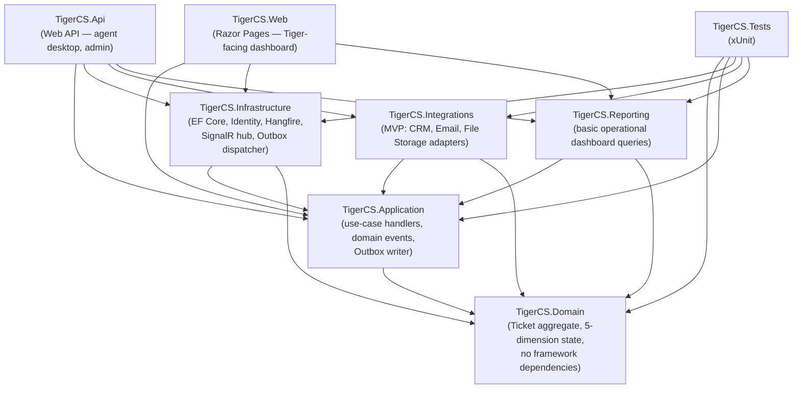
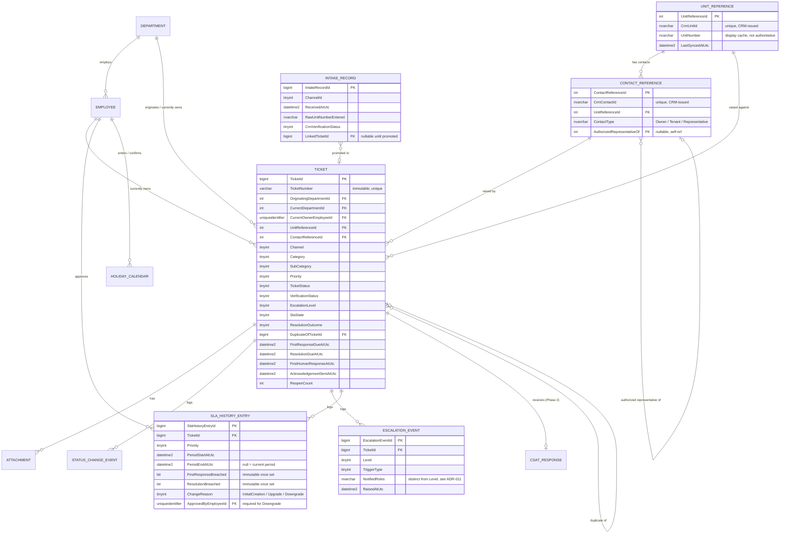

# Tiger Group — Customer Service Ticketing System
## Architecture & Database Design (Phase 2)

| | |
|---|---|
| **Purpose** | Phase 2 deliverable per the Solution Analysis's implementation plan — ERD, module dependency diagram, database schema design, API contract sketch, and ADRs — produced now that Section 13 Group A (MVP-development) and Group C (go-live) decisions are approved |
| **Status** | Design for review — **no EF Core code, migrations, or a runnable database have been created.** This document is design documentation only. Project scaffolding and actual migrations are Phase 3 ("Project Foundation") and remain out of scope here. |
| **Authorization** | Produced following project session sign-off ("Status: Approved for Architecture Design," 2026-08-17) — see the Final Decision Sign-Off in `Tiger-CS-Ticketing-Management-Decisions.md` |
| **Related documents** | `Tiger-CS-Ticketing-Solution-Analysis.md` · `Tiger-CS-Ticketing-Management-Decisions.md` · `Tiger-CS-Ticketing-Executive-Decisions.md` |
| **Stack** | ASP.NET Core 8 (Web API + Razor Pages), SQL Server, EF Core, ASP.NET Core Identity, Hangfire, SignalR, xUnit |
| **Date** | 2026-08-17 |

---

## 1. Architecture Decision Records (ADRs)

Each ADR reflects a decision already approved in the Technical Decision Register or established in the Solution Analysis; the "Traceability" line links back to it so nothing here is invented fresh at this stage.

### ADR-001 — Modular Monolith, Not Microservices
**Status:** Accepted
**Context:** MVP has one dominant, highly-relational aggregate (the ticket) and only two integrations (CRM, Email/File Storage). Splitting into services now would add distributed-transaction and cross-service-consistency problems (e.g., keeping the SLA clock consistent across service boundaries) without a corresponding scaling need.
**Decision:** A single ASP.NET Core solution with strongly separated modules (Domain, Application, Infrastructure, Integrations, Reporting), communicating in-process via application services and domain events — never a direct cross-module database call.
**Consequences:** Simple deployment and transactions now; module boundaries are kept clean enough that extracting a module later (e.g., Reporting) is a refactor, not a rewrite.
**Traceability:** Solution Analysis §10.

### ADR-002 — Five Independent Ticket-State Dimensions
**Status:** Accepted
**Context:** A single combined status field cannot represent a ticket that is both "escalated" and "still being worked" without losing one fact.
**Decision:** Track `TicketStatus`, `VerificationStatus`, `EscalationLevel`, `SlaState`, and `ResolutionOutcome` as independent columns/values on the `Ticket` aggregate, each with its own transition rules and audit trail (`StatusChangeEvent`, dimension-tagged).
**Consequences:** More columns and more transition-rule surface area than a single-status model, but every real combination (e.g., `InProgress` + `Level2`) is representable without a workaround status.
**Traceability:** ISSUE-008 (approved B — required behavior; this ADR is the IT/Solution Architect implementation referenced there).

### ADR-003 — CRM Remains Sole Source of Truth; Local Storage Is Reference + Snapshot Only
**Status:** Accepted
**Context:** v1.0 of this analysis implied the ticketing system would maintain its own mastered copy of unit/contact data. This risks the ticketing system silently diverging from CRM as the actual system of record.
**Decision:** The local database never masters unit/contact data. `UnitReference`/`ContactReference` store only the CRM-issued IDs plus a **refreshable display cache** (not authoritative); each `Ticket` additionally stores an **immutable snapshot** captured once, at verification time, that never changes even if the CRM record or the reference cache later does.
**Consequences:** Ticket history remains a faithful point-in-time record even after a CRM update (e.g., an owner's contact details changing after handover); requires a distinct concept of "cache" vs. "snapshot" that must be modeled carefully (Section 4 below).
**Traceability:** Solution Analysis §10.3 (BR-027).

### ADR-004 — Ticket ID Is Immutable; `[DEPT]` Reflects the Originating Department Only
**Status:** Accepted
**Context:** A ticket ID that changes on transfer would invalidate every prior communication referencing it.
**Decision:** `Ticket.TicketNumber` (format `TG-[DEPT]-[YYYYMMDD]-[SEQ]`) is generated once and never updated. Current ownership is tracked in a separate, mutable `CurrentDepartmentId` column; `OriginatingDepartmentId` is set at creation and never changes.
**Consequences:** Reading the ID alone does not show current ownership — the UI must surface `CurrentDepartmentId` alongside it.
**Traceability:** ISSUE-020 (approved B).

### ADR-005 — SLA Engine: Explicit Due Timestamps, Scheduled Deadline Jobs, Sweep as Safety Net Only
**Status:** Accepted
**Context:** Relying solely on a periodic sweep to detect SLA breaches is both imprecise (breach detected up to one sweep interval late) and, if made the primary mechanism, does not scale cleanly with per-ticket, per-tier due dates.
**Decision:** `FirstResponseDueAtUtc` and `ResolutionDueAtUtc` are stored as explicit columns, computed at creation and recalculated on priority change (ADR-010). A Hangfire **scheduled (delayed) job** is enqueued per due timestamp to fire exactly at that moment; a **recurring sweep** (every 1–5 minutes) exists only to catch a scheduled job lost to a deploy/restart, never as the primary detection path.
**Consequences:** Requires idempotency (ADR-006) so the scheduled job and the sweep never double-fire a breach notification for the same due event.
**Traceability:** Solution Analysis §10.5.

### ADR-006 — Transactional Outbox + Idempotency for All Cross-Boundary Effects
**Status:** Accepted
**Context:** Writing a ticket state change and then separately calling a notification/integration API in the same request risks the classic dual-write problem — the state commits but the notification is lost, or vice versa.
**Decision:** Every domain event that must trigger a notification or integration call is written to an `OutboxMessage` row in the **same database transaction** as the state change. A separate dispatcher process reads and publishes pending messages, each carrying an idempotency key (`TicketId + EventType + EventVersion`) and a correlation ID.
**Consequences:** Requires an always-running dispatcher (Hangfire recurring job) and a `Status`/`Attempts`/dead-letter model on `OutboxMessage`; every consumer of an Outbox message must itself be idempotent.
**Traceability:** Solution Analysis §10.7 (NFR-REL-01…04).

### ADR-007 — SignalR Publishes State/Deadline Changes Only, Never a Per-Second Countdown
**Status:** Accepted
**Context:** Broadcasting a live countdown from the server every second does not scale with concurrent connections and is redundant — a client can compute the same countdown locally from a due timestamp it already has.
**Decision:** The SignalR hub pushes discrete events (`TicketStatusChanged`, `SlaDueTimestampChanged`, `EscalationLevelChanged`) carrying the relevant timestamp(s); the client renders the countdown with a local timer.
**Consequences:** Client code must handle its own local clock/timer; server load and hub message volume are drastically reduced versus a per-second broadcast.
**Traceability:** Solution Analysis §10.5.

### ADR-008 — No Customer Self-Service Portal in MVP (or Any Approved Phase, Pending Separate Approval)
**Status:** Accepted
**Context:** No customer login/portal is described anywhere in the source requirements; building one adds an unapproved, public-facing authentication surface.
**Decision:** The system has no customer-facing authentication endpoint. All customer interaction is agent-mediated (phone) or an outbound message (email at MVP). `AspNetUsers` (Identity) contains only internal staff (Geyness/Tiger agents, department employees, management, IT, Legal/Compliance).
**Consequences:** No `Customer` role exists in the Identity schema; any future portal is a separately scoped addition, not an extension of the existing Identity surface without a fresh security review.
**Traceability:** ISSUE-021 (approved A).

### ADR-009 — Resolve and Close Are Distinct, Separately Permissioned Actions
**Status:** Accepted
**Context:** The department performing the work cannot itself confirm the customer was notified; conflating "work done" and "ticket closed" risks closing tickets without genuine customer notification.
**Decision:** `ResolutionOutcome` is set by a Department Employee/Head action (`Resolve`) that does not change `TicketStatus` to `Closed`. Closing (`TicketStatus → Closed`) is a separate action restricted to Geyness Agent/Supervisor/CS Manager, gated on `ResolutionOutcome` already being set and a notification-confirmed flag.
**Consequences:** Two API endpoints and two permission checks instead of one; a `Resolved`-but-not-yet-`Closed` state must be visible in queues so CS knows work is waiting on them to close.
**Traceability:** ISSUE-022 (approved B), BR-012/BR-028.

### ADR-010 — Priority-Change SLA Policy: Earlier-of-Due-Dates on Upgrade, Approval-Gated Downgrade, Full History Retained
**Status:** Accepted
**Context:** An undefined "proportional carry-forward" cannot be implemented without a formula; without a safeguard, a downgrade could remove an at-risk ticket from breach visibility.
**Decision:** Every priority period is written as its own `SlaHistoryEntry` row, never overwritten. An upgrade computes the new due date as `MIN(existingDueDate, freshlyComputedHigherTierDueDate)`. A downgrade requires `ApprovedByEmployeeId`/`ApprovedAtUtc` on the new `SlaHistoryEntry` before it takes effect; any `*Breached` flag already set on a prior entry is immutable.
**Consequences:** SLA reporting must union current and historical `SlaHistoryEntry` rows to show "original vs. changed" periods, per the approved requirement.
**Traceability:** ISSUE-023 (approved B/B).

### ADR-011 — GM Notification Is Distinct From a Formal Level 3 Escalation
**Status:** Accepted
**Context:** Conflating "the GM was notified" with "the ticket is formally at EscalationLevel 3" would make it impossible to represent "GM is aware, but Department Head is still the active owner" — a real and common intermediate state.
**Decision:** `EscalationEvent.NotifiedRoles` records who was informed (e.g., on a Critical breach, both Dept Head and GM per ISSUE-004) independently of `Ticket.EscalationLevel`, which only changes via the Level 2→GM window defined in `SlaPolicy` (ISSUE-013), or a manual Level 4 action. A Critical ticket's window may be configured to zero if management wants notification and formal escalation to be simultaneous for that tier.
**Consequences:** Two distinct signals must both be surfaced in the UI — "who has been told" and "what formal level this is at" — rather than inferring one from the other.
**Traceability:** ISSUE-004 (approved B) + ISSUE-013 (approved B), and the explicit clarification added to both decision documents.

---

## 2. Module Dependency Diagram

Dependency arrows point toward what a module *depends on* (Clean/Onion Architecture: dependencies point inward toward Domain).

**Rule enforced by this layout:** `Domain` has zero outgoing dependencies. `Application` depends only on `Domain`. Nothing outside `Infrastructure`/`Integrations` may reference EF Core, Hangfire, SignalR, or a specific CRM SDK directly — those concerns are reached only through interfaces defined in `Application` (e.g., `ICrmGateway`, `IEmailGateway`, `ITicketRepository`) and implemented in `Infrastructure`/`Integrations`.

---

## 3. Entity-Relationship Diagram (ERD)

*(Reference/config tables `SlaPolicy`, `HolidayCalendar`, `WorkWeekConfig`, and infrastructure tables `OutboxMessage`/`AuditLog` are omitted from the diagram for readability — they carry no ticket-specific foreign keys and are detailed in the schema section below.)*

---

## 4. Database Schema Design

Column-level design. SQL Server types shown for concreteness; no migration files or DDL scripts are created at this stage — this is the design that Phase 3 (Project Foundation) will implement.

### 4.1 Reference Data

| Table | Column | Type | Constraints | Notes |
|---|---|---|---|---|
| **Department** | DepartmentId | int | PK, identity | |
| | Name | nvarchar(100) | not null, unique | |
| | Code | varchar(10) | not null, unique | Backs the `[DEPT]` segment (ADR-004), e.g. `RE`, `LSE`, `FM` |
| | IsActive | bit | not null, default 1 | |
| **SlaPolicy** | Priority | tinyint | PK | 1=Critical, 2=High, 3=Medium, 4=Low |
| | FirstResponseTargetMinutes | int | not null | |
| | ResolutionTargetMinutes | int | not null | |
| | ClockBasis | tinyint | not null | 1=24/7, 2=BusinessHours |
| | WarningThresholdPercent | decimal(5,2) | not null | Seeded per ISSUE-013: Critical 50.00; High/Medium/Low 75.00 |
| | Level2ToGmWindowValue | int | not null | Seeded per ISSUE-013: Critical 30; High 2; Medium 1; Low 2 |
| | Level2ToGmWindowUnit | tinyint | not null | 1=Minutes, 2=Hours, 3=BusinessDays — pairs with the value above (Critical=30 Minutes, High=2 Hours, Medium=1 BusinessDay, Low=2 BusinessDays) |
| **HolidayCalendar** | HolidayCalendarId | int | PK, identity | |
| | HolidayDate | date | not null, unique | |
| | Description | nvarchar(200) | null | |
| | EnteredByEmployeeId | uniqueidentifier | FK → Employee, not null | Technical administrator (System Administrator), per ISSUE-012 |
| | ConfirmedByEmployeeId | uniqueidentifier | FK → Employee, null | Business owner (Customer Service/HR), per ISSUE-012 |
| **WorkWeekConfig** | WorkWeekConfigId | tinyint | PK | Single active row |
| | WorkingDaysMask | tinyint | not null | Bitmask Sun–Sat; seeded per ISSUE-017 (approved A: Sat–Thu working, Friday off) |
| | BusinessDayStartLocal | time | not null | 08:00 |
| | BusinessDayEndLocal | time | not null | 18:00 |
| | EffectiveFromUtc | datetime2 | not null | |

### 4.2 Identity / Organization

| Table | Column | Type | Constraints | Notes |
|---|---|---|---|---|
| **Employee** *(extends AspNetUsers via 1:1)* | EmployeeId | uniqueidentifier | PK, = AspNetUsers.Id | |
| | DepartmentId | int | FK → Department, null | Null for CS-only/IT/Legal roles not tied to RE/Leasing/FM |
| | DisplayName | nvarchar(200) | not null | |
| | IsGeynessStaff | bit | not null | Distinguishes Tiger vs. Geyness employment for reporting |
| | DeactivatedAtUtc | datetime2 | null | Supports FR-ADM-02's 24h revocation tracking |

*(Roles/permissions use ASP.NET Core Identity's standard `AspNetRoles`/`AspNetUserRoles` tables, mapped 1:1 to the Section 4 permission matrix via policy-based authorization — no custom role table is introduced.)*

### 4.3 CRM Reference (Cache, Not Master — ADR-003)

| Table | Column | Type | Constraints | Notes |
|---|---|---|---|---|
| **UnitReference** | UnitReferenceId | int | PK, identity | |
| | CrmUnitId | nvarchar(64) | not null, unique | CRM's own identifier — the actual key |
| | UnitNumber | nvarchar(50) | not null | Display cache only |
| | PropertyName | nvarchar(200) | null | Display cache only |
| | TowerName | nvarchar(200) | null | Display cache only |
| | UnitType | nvarchar(100) | null | Display cache only |
| | LastSyncedAtUtc | datetime2 | not null | Last CRM refresh |
| **ContactReference** | ContactReferenceId | int | PK, identity | |
| | CrmContactId | nvarchar(64) | not null, unique | |
| | UnitReferenceId | int | FK → UnitReference, not null | A unit has many contact rows (joint owners/tenants) |
| | DisplayName | nvarchar(200) | null | Cache only |
| | ContactChannel | nvarchar(100) | null | Cached phone/email for outreach |
| | ContactType | tinyint | not null | 1=Owner, 2=Tenant, 3=Representative |
| | AuthorizedRepresentativeOf | int | FK → ContactReference, null | Self-referencing — supports ISSUE-007's CRM-recorded-authorization requirement |
| | LastSyncedAtUtc | datetime2 | not null | |

### 4.4 Intake and Ticketing

| Table | Column | Type | Constraints | Notes |
|---|---|---|---|---|
| **IntakeRecord** | IntakeRecordId | bigint | PK, identity | Created for every contact per ISSUE-006 |
| | ChannelId | tinyint | not null | |
| | ReceivedAtUtc | datetime2 | not null | |
| | RawUnitNumberEntered | nvarchar(50) | null | As typed/spoken, pre-CRM-match |
| | PriorityHint | tinyint | null | |
| | CrmVerificationStatus | tinyint | not null | 1=Unverified, 2=PendingCrmVerification, 3=Verified |
| | CreatedByEmployeeId | uniqueidentifier | FK → Employee, null | Null for auto-ticket channels (Phase 2+) |
| | LinkedTicketId | bigint | FK → Ticket, null | Set once promoted to a ticket; Critical/High promote immediately (ISSUE-006), Medium/Low remain queued until CRM verification |
| **Ticket** | TicketId | bigint | PK, identity | |
| | TicketNumber | varchar(40) | not null, unique | Immutable (ADR-004) |
| | OriginatingDepartmentId | int | FK → Department, not null | Immutable after creation |
| | CurrentDepartmentId | int | FK → Department, not null | Mutable on transfer |
| | CurrentOwnerEmployeeId | uniqueidentifier | FK → Employee, null | Null until assigned |
| | UnitReferenceId | int | FK → UnitReference, not null | |
| | ContactReferenceId | int | FK → ContactReference, not null | |
| | Channel | tinyint | not null | |
| | Category | tinyint | not null | |
| | SubCategory | tinyint | null | Mandatory (app-level) only when Category = FacilityManagement |
| | Priority | tinyint | not null | Current tier; history in SlaHistoryEntry |
| | RequestSummary | nvarchar(2000) | not null | |
| | TicketStatus | tinyint | not null | 1=Open,2=InProgress,3=PendingCustomer,4=PendingThirdParty,5=Resolved,6=Closed |
| | VerificationStatus | tinyint | not null | 1=Unverified,2=PendingCrmVerification,3=Verified |
| | EscalationLevel | tinyint | not null, default 0 | 0=None,1,2,3,4 |
| | SlaState | tinyint | not null | 1=Running,2=Paused,3=Met,4=Breached,5=NotApplicable |
| | ResolutionOutcome | tinyint | null | 1=Resolved,2=Cancelled,3=Rejected,4=Duplicate |
| | DuplicateOfTicketId | bigint | FK → Ticket, null | App-level: required when ResolutionOutcome = Duplicate |
| | FirstResponseDueAtUtc | datetime2 | not null | |
| | ResolutionDueAtUtc | datetime2 | not null | |
| | FirstHumanResponseAtUtc | datetime2 | null | Satisfies ISSUE-019; distinct from acknowledgement |
| | AcknowledgementSentAtUtc | datetime2 | null | Automated ack — never satisfies FirstResponse |
| | ResolvedAtUtc | datetime2 | null | |
| | ClosedAtUtc | datetime2 | null | |
| | ReopenCount | int | not null, default 0 | |
| | ResolutionNote | nvarchar(4000) | null | Mandatory (app-level) before ResolutionOutcome is set |
| | SnapshotUnitNumber | nvarchar(50) | not null | Immutable, captured at verification (ADR-003) |
| | SnapshotPropertyName | nvarchar(200) | null | Immutable |
| | SnapshotTowerName | nvarchar(200) | null | Immutable |
| | SnapshotUnitType | nvarchar(100) | null | Immutable |
| | SnapshotContactDisplayName | nvarchar(200) | null | Immutable |
| | SnapshotContactChannel | nvarchar(100) | null | Immutable |
| | CreatedAtUtc | datetime2 | not null | |
| | RowVersion | rowversion | not null | Optimistic concurrency |

**Indexes:** unique on `TicketNumber`; nonclustered on `(CurrentDepartmentId, TicketStatus)`; nonclustered on `CurrentOwnerEmployeeId`; filtered nonclustered on `VerificationStatus` where `<> 3`; filtered nonclustered on `ResolutionDueAtUtc` where `TicketStatus NOT IN (5, 6)` (supports the SLA sweep safety net, ADR-005).

### 4.5 Audit, Escalation, SLA History

| Table | Column | Type | Constraints | Notes |
|---|---|---|---|---|
| **StatusChangeEvent** | StatusChangeEventId | bigint | PK, identity | |
| | TicketId | bigint | FK → Ticket, not null | |
| | Dimension | tinyint | not null | 1=TicketStatus,2=VerificationStatus,3=EscalationLevel,4=SlaState,5=ResolutionOutcome |
| | OldValue / NewValue | tinyint | NewValue not null | |
| | ActorEmployeeId | uniqueidentifier | FK → Employee, null | Null when ActorIsSystem |
| | ActorIsSystem | bit | not null, default 0 | |
| | Note | nvarchar(1000) | null | |
| | CorrelationId | uniqueidentifier | not null | ADR-006 |
| | OccurredAtUtc | datetime2 | not null | Index: (TicketId, OccurredAtUtc) |
| **EscalationEvent** | EscalationEventId | bigint | PK, identity | |
| | TicketId | bigint | FK → Ticket, not null | |
| | Level | tinyint | not null | |
| | TriggerType | tinyint | not null | 1=AutoBreach,2=AutoWindowExpired,3=ManualFlag,4=ManualLevel4 |
| | NotifiedRoles | nvarchar(200) | null | e.g. "DeptHead,GM" — distinct from Level (ADR-011) |
| | RaisedAtUtc | datetime2 | not null | |
| | RespondedAtUtc | datetime2 | null | |
| | RespondingEmployeeId | uniqueidentifier | FK → Employee, null | |
| **SlaHistoryEntry** | SlaHistoryEntryId | bigint | PK, identity | |
| | TicketId | bigint | FK → Ticket, not null | Index: (TicketId, PeriodStartAtUtc) |
| | Priority | tinyint | not null | Tier this period ran under |
| | PeriodStartAtUtc | datetime2 | not null | |
| | PeriodEndAtUtc | datetime2 | null | Null = current/active period |
| | FirstResponseDueAtUtc / ResolutionDueAtUtc | datetime2 | not null | |
| | FirstResponseBreached / ResolutionBreached | bit | not null, default 0 | **Immutable once set to 1** — a later downgrade never clears these (ADR-010) |
| | ChangeReason | tinyint | not null | 1=InitialCreation,2=PriorityUpgrade,3=PriorityDowngrade |
| | ApprovedByEmployeeId / ApprovedAtUtc | uniqueidentifier / datetime2 | both null unless ChangeReason=3 | App-level: required when ChangeReason = PriorityDowngrade (ISSUE-023) |

### 4.6 Attachments, CSAT, Reliability Infrastructure

| Table | Column | Type | Constraints | Notes |
|---|---|---|---|---|
| **Attachment** | AttachmentId | bigint | PK, identity | |
| | TicketId | bigint | FK → Ticket, not null | App-level: reject 11th attachment per ticket |
| | FileName / ContentType | nvarchar | not null | |
| | SizeBytes | bigint | not null | App-level: reject > 25MB |
| | StorageReference | nvarchar(500) | not null | Signed URL/blob key — never the file bytes in this table |
| | VirusScanStatus | tinyint | not null | 1=Pending,2=Clean,3=Rejected |
| | UploadedByEmployeeId | uniqueidentifier | FK → Employee, null | Null for customer-submitted (Phase 2+ channels) |
| **CsatResponse** *(Phase 2 — schema anticipated now, unused until then)* | CsatResponseId | bigint | PK, identity | |
| | TicketId | bigint | FK → Ticket, not null | |
| | SpeedScore…OverallScore | tinyint (×5) | 1–5 | |
| | Comment | nvarchar(1000) | null | |
| | IsPostReopen | bit | not null, default 0 | Per ISSUE-009's approved tagging |
| **OutboxMessage** | OutboxMessageId | uniqueidentifier | PK | |
| | EventType | nvarchar(200) | not null | |
| | Payload | nvarchar(max) | not null | JSON |
| | CorrelationId | uniqueidentifier | not null | |
| | IdempotencyKey | nvarchar(200) | not null, unique | NFR-REL-02 |
| | Status | tinyint | not null | 1=Pending,2=Processed,3=DeadLettered |
| | Attempts | int | not null, default 0 | |
| | LastError | nvarchar(2000) | null | |
| | Index | | | Filtered nonclustered on `(Status, OccurredAtUtc)` where `Status = 1` |
| **AuditLog** *(generic — exports, admin actions, access revocation; distinct from StatusChangeEvent)* | AuditLogId | bigint | PK, identity | |
| | ActorEmployeeId | uniqueidentifier | FK → Employee, null | |
| | Action / EntityType / EntityId | nvarchar | Action, EntityType not null | |
| | BeforeValue / AfterValue | nvarchar(max) | null | JSON |
| | CorrelationId | uniqueidentifier | not null | |
| | OccurredAtUtc | datetime2 | not null | |

---

## 5. API Contract Sketch

Sketch level — resource, method, path, purpose, and primary authorized roles. Not a generated OpenAPI/Swagger document; request/response schemas will be finalized in Phase 3 alongside the actual controllers.

### 5.1 Identity & Administration

| Method | Path | Purpose | Roles |
|---|---|---|---|
| POST | `/api/auth/login` | Staff login (Identity) | All staff |
| POST | `/api/auth/logout` | Logout | All staff |
| POST | `/api/admin/employees` | Create an agent/employee account | System Administrator |
| PATCH | `/api/admin/employees/{id}/deactivate` | Revoke access (FR-ADM-02, ≤24h SLA) | System Administrator |
| GET | `/api/admin/audit-log` | Query the generic audit log | System Administrator, CS Manager |
| GET/PUT | `/api/config/sla-policy` | View/update per-tier SLA targets, warning thresholds, escalation windows | System Administrator (technical), with values set per ISSUE-013's approved defaults |
| GET/POST | `/api/config/holiday-calendar` | View/add holiday dates | System Administrator enters; CS/HR confirm (ISSUE-012) |
| GET/PUT | `/api/config/work-week` | View/update the working-day configuration | System Administrator, per ISSUE-017 |

### 5.2 Verification & Intake

| Method | Path | Purpose | Roles |
|---|---|---|---|
| GET | `/api/units/lookup?unitNumber=` | CRM unit lookup (BR-001/BR-002) | Geyness Agent, Supervisor |
| GET | `/api/units/{unitReferenceId}/contacts` | List linked contacts for agent identification (FR-VER-04) | Geyness Agent, Supervisor |
| POST | `/api/intake-records` | Record a contact attempt (ISSUE-006 — every interaction gets one) | Geyness Agent |
| POST | `/api/intake-records/{id}/verify` | Attempt CRM verification; returns Unverified/PendingCrmVerification/Verified | Geyness Agent, system (auto-ticket channels, Phase 2+) |

### 5.3 Tickets — Core Lifecycle

| Method | Path | Purpose | Roles |
|---|---|---|---|
| POST | `/api/tickets` | Create a ticket from a Verified intake record | Geyness Agent |
| GET | `/api/tickets/{id}` | Ticket detail (all 5 dimensions, snapshot, current due timestamps) | Role-scoped per Section 4 matrix |
| GET | `/api/tickets?department=&status=&priority=&ownerId=` | Queue views | Role-scoped |
| PATCH | `/api/tickets/{id}/classify` | Set category/sub-category/priority | Geyness Agent |
| PATCH | `/api/tickets/{id}/assign` | Set `CurrentOwnerEmployeeId` | Supervisor, Department Head |
| POST | `/api/tickets/{id}/transfer` | Department transfer (mutates `CurrentDepartmentId` only — ADR-004) | Department Head approval required (ISSUE-010) |
| POST | `/api/tickets/{id}/status` | Transition among Open/InProgress/PendingCustomer/PendingThirdParty, with note | Department Employee, Department Head |
| POST | `/api/tickets/{id}/priority-change` | Change priority; upgrade applies immediately (ADR-010); downgrade requires `approvingEmployeeId` | Department Employee/Head (upgrade); Department Head+ (downgrade approval) |
| POST | `/api/tickets/{id}/resolve` | Set `ResolutionOutcome = Resolved` + mandatory note | Department Employee, Department Head |
| POST | `/api/tickets/{id}/close` | `TicketStatus → Closed`; requires `ResolutionOutcome` set + notification-confirmed flag | Geyness Agent, Supervisor, CS Manager (ADR-009) |
| POST | `/api/tickets/{id}/reopen` | `Closed → InProgress`, increments `ReopenCount` | Geyness Agent, Supervisor, CS Manager |
| POST | `/api/tickets/{id}/cancel` | `ResolutionOutcome = Cancelled` + reason | Geyness Agent, Department Employee, Supervisor, Department Head |
| POST | `/api/tickets/{id}/reject` | `ResolutionOutcome = Rejected` + reason | Department Employee, Department Head |
| POST | `/api/tickets/{id}/mark-duplicate` | `ResolutionOutcome = Duplicate` + mandatory `duplicateOfTicketId` | Geyness Agent, Department Employee |
| POST | `/api/tickets/{id}/attachments` | Upload (multipart; virus-scanned; ≤10/ticket, ≤25MB/file) | Role-scoped |
| GET | `/api/tickets/{id}/audit-trail` | `StatusChangeEvent` history across all 5 dimensions | Role-scoped |
| GET | `/api/tickets/{id}/sla-history` | `SlaHistoryEntry` rows — original and changed periods (ISSUE-023's reporting requirement) | Role-scoped |

### 5.4 Escalation

| Method | Path | Purpose | Roles |
|---|---|---|---|
| POST | `/api/tickets/{id}/escalate` | Manual Level 1 flag by the handling agent | Geyness Agent |
| GET | `/api/tickets/{id}/escalations` | `EscalationEvent` history, including `NotifiedRoles` distinct from `Level` (ADR-011) | Role-scoped |
| POST | `/api/tickets/{id}/escalations/level4` | Manual, never automatic (BR-016) | CS Manager, General Manager |

### 5.5 Reporting & Operational Dashboard (MVP scope — basic view only)

| Method | Path | Purpose | Roles |
|---|---|---|---|
| GET | `/api/dashboard/summary` | Ticket counts by status/priority/department, SLA backlog, escalation counts (FR-RPT-07) | Role-scoped |
| GET | `/api/reports/export?type=raw&from=&to=` | Raw data export (FR-ADM-05/FR-RPT-06); large exports run as a background job | Reporting User, CS Manager, System Administrator |
| GET | `/api/notifications/dead-letter` | Failed Outbox messages awaiting manual review (ADR-006) | System Administrator |
| POST | `/api/notifications/{outboxMessageId}/retry` | Manually retry a dead-lettered message | System Administrator |

### 5.6 Real-Time (SignalR, not REST)

| Hub | Event | Payload | Purpose |
|---|---|---|---|
| `/hubs/tickets` | `TicketStatusChanged` | `ticketId`, new `TicketStatus` | Live queue/detail updates (ADR-007) |
| `/hubs/tickets` | `SlaDueTimestampChanged` | `ticketId`, `firstResponseDueAtUtc`, `resolutionDueAtUtc` | Client computes its own countdown locally — server never pushes a per-second tick |
| `/hubs/tickets` | `EscalationLevelChanged` | `ticketId`, new `EscalationLevel`, `notifiedRoles` | Distinguishes formal escalation from mere notification (ADR-011) |
| `/hubs/tickets` | `VerificationStatusChanged` | `ticketId`/`intakeRecordId`, new `VerificationStatus` | Surfaces `PendingCrmVerification` reconciliation |

---

## 6. Traceability Summary

Every table and endpoint above resolves a specific approved decision rather than introducing a new one:

| Approved decision | Where it lands in this design |
|---|---|
| ISSUE-019 (First Human Response) | `Ticket.FirstHumanResponseAtUtc` distinct from `AcknowledgementSentAtUtc` |
| ISSUE-001 (SLA clock start) | `Ticket.CreatedAtUtc` drives `Due*At` computation; assignment lag separately observable via `StatusChangeEvent` |
| ISSUE-021 (no portal) | No customer-facing Identity endpoint; ADR-008 |
| ISSUE-022 (Resolve/Close split) | Separate `/resolve` and `/close` endpoints, ADR-009 |
| ISSUE-023 (priority-change policy) | `SlaHistoryEntry` design, ADR-010 |
| ISSUE-004 + ISSUE-013 (notification vs. escalation) | `EscalationEvent.NotifiedRoles` vs. `Ticket.EscalationLevel`, ADR-011 |
| ISSUE-006 (Intake Record) | `IntakeRecord` table and `/api/intake-records` endpoints |
| ISSUE-007 (disclosure authorization) | `ContactReference.AuthorizedRepresentativeOf` |
| ISSUE-008 (five dimensions) | `Ticket`'s five state columns, ADR-002 |
| ISSUE-018 (SLA pause, split a/b/c/d) | `SlaState = Paused` transitions governed at the application layer per `TicketStatus`; Critical/First-Response fixed rules enforced in the SLA engine, not configurable data |
| ISSUE-020 (immutable ID) | `TicketNumber` vs. `CurrentDepartmentId`, ADR-004 |
| ISSUE-012 (calendar ownership) | `HolidayCalendar.EnteredByEmployeeId` vs. `ConfirmedByEmployeeId` |
| ISSUE-017 (work week) | `WorkWeekConfig`, seeded per the approved Option A |
| ISSUE-016 (retention, go-live gate) | Not yet a schema concern at this design stage — retention is a data-lifecycle/backup policy applied to these tables in Phase 3+, still pending Legal/Compliance confirmation before go-live |

No item in this document introduces a decision that was not already approved in the Technical Decision Register or the Executive Decisions document.
