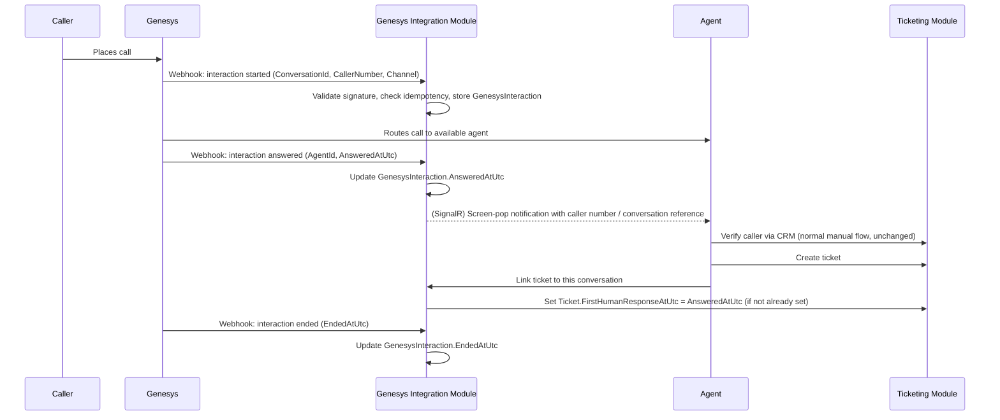

# Tiger Group — Customer Service Ticketing System
## Genesys Integration Architecture

| | |
|---|---|
| **Status** | Approved for Architecture Design — **conceptual contract only; several details below are open questions pending confirmation from the Genesys team (Section 13)** |
| **Related decisions** | ISSUE-003 (vendor/platform identity — resolved by this pilot's explicit management direction: the platform is Genesys), ISSUE-006 (CRM-outage-style manual fallback pattern, reused here for Genesys unavailability), ISSUE-019 (First Human Response) |
| **Related ADR** | ADR-0019 (supersedes the prior, conditional ADR-0012 from PR #2) |
| **Date** | 2026-08-17 |

---

## 1. Integration Objective

Link a Genesys phone interaction to a ticket so that: (a) call metadata (caller number, agent, channel, timestamps) is captured without manual agent re-entry; (b) the call's answer event can satisfy First Human Response (ISSUE-019) automatically when a ticket is linked; and (c) management gains visibility into which tickets originated from which Genesys interactions. This is a **basic** integration — no outbound dialing control, call recording retrieval, or deep agent-desktop automation is in scope for the pilot.

## 2. Genesys-to-Ticketing Interaction Flow



**Ticket creation remains manual** — Genesys does not auto-create a ticket. This is deliberate: it keeps MVP's verification model (agent-driven CRM lookup) unchanged and avoids reopening ISSUE-002 (auto-ticket verification timing), which remains a Phase 2 question for genuinely auto-ticketing channels.

## 3. Required Genesys Events

| Event | Fields required |
|---|---|
| Interaction started | Conversation ID, caller number, channel/media type, start timestamp |
| Interaction answered | Genesys agent ID, agent email or extension (when available), answered timestamp |
| Interaction ended | End timestamp |

## 4. Webhook Contracts (Conceptual)

**[ASSUMPTION — conceptual shape only; exact payload schema must be confirmed against Genesys's actual webhook/notification API before implementation.]**

```
POST /webhooks/genesys/interaction-events
Headers:
  X-Genesys-Signature: <HMAC or platform-specific signature>
  X-Correlation-Id: <propagated if present, else generated on receipt>
Body (conceptual):
{
  "conversationId": "string",
  "eventType": "started | answered | ended",
  "channel": "voice | ... ",
  "callerNumber": "string (masked/redacted in logs, see Security-Architecture.md)",
  "agent": {
    "genesysAgentId": "string",
    "email": "string | null",
    "extension": "string | null"
  },
  "timestamp": "ISO-8601 UTC"
}
```

Each webhook call is processed idempotently: the combination of `conversationId` + `eventType` forms the idempotency key (ADR-0014). A redelivered webhook for an already-processed `(conversationId, eventType)` pair is acknowledged (HTTP 200) without re-triggering any side effect.

## 5. Agent Identity Mapping

The webhook's `agent.email` or `agent.extension` is used to resolve a `GenesysAgentId` to an internal `Employee` record (Identity and Access module). **Open question (Section 13):** whether this mapping is guaranteed to be present and reliable for every agent, or whether a manual mapping table will be needed as a fallback.

## 6. Conversation-to-Ticket Mapping

A `GenesysInteraction.LinkedTicketId` is set when the handling agent links the current conversation to the ticket they create or are working on. **Open question (Section 13):** whether Genesys can supply enough context (e.g., a prior-interaction history for a repeat caller) to support automatic linking in a later phase, versus this pilot's manual linking only.

## 7. Screen-Pop Behavior

On the "interaction answered" webhook, the Genesys Integration module publishes a `GenesysInteractionAnswered` event; the UI (via SignalR, ADR-0016) surfaces a screen-pop showing the caller number and conversation reference to the handling agent, prompting them to proceed with the normal CRM verification and ticket-creation flow. This is a **notification**, not an automation — it does not itself create or modify a ticket.

## 8. Call Answer as First Human Response

Per ISSUE-019 and ADR-0009: once a ticket is linked to a conversation, if `Ticket.FirstHumanResponseAtUtc` is not already set, it is set to the interaction's answered timestamp. This operationalizes the approved policy without requiring the agent to manually record "I answered" — the Genesys timestamp is the source of truth for this event on Genesys-originated calls.

## 9. Authentication and Validation

Every inbound webhook must pass signature validation (ADR per Security-Architecture.md §"Genesys webhook security") before any processing occurs; a failed validation is logged to `AuditEntry` and the request is rejected. **Open question (Section 13):** the exact signature scheme Genesys uses (HMAC-SHA256 over the raw body, a bearer token, mutual TLS, or another mechanism) — this must be confirmed before implementation, not assumed.

## 10. Duplicate Webhook Protection

Idempotency keyed on `(conversationId, eventType)` (Section 4/ADR-0014) ensures a redelivered webhook — a documented behavior of most webhook providers under at-least-once delivery — never creates a duplicate `GenesysInteraction` row or re-fires a side effect (e.g., re-setting `FirstHumanResponseAtUtc` to a later, incorrect redelivery timestamp).

## 11. Retry Handling

Outbound calls from the ticketing system to Genesys (if any are needed for a screen-pop acknowledgement or similar) follow the same retry-with-backoff-then-dead-letter pattern as every other integration (ADR-0013). Inbound webhook retries are Genesys's own responsibility; this system's job is to always acknowledge a validly-signed, successfully-processed webhook so Genesys does not need to retry it.

## 12. Failed-Event Recovery

A webhook that fails validation or processing is recorded in `AuditEntry` (validation failures) or moved to the Outbox dead-letter state (processing failures after retries), reviewable by System Administrator via Administration, with a manual reprocess action available.

## 13. Manual Fallback

If Genesys is unavailable (webhook delivery stops, or the platform is down) the system remains **fully operable**: the agent uses the existing phone-only manual ticket-creation flow with no Genesys metadata attached, and manually records "agent-confirmed live handling" to satisfy First Human Response per ISSUE-019's original manual-MVP provision. No feature is blocked by a Genesys outage — this mirrors the CRM-outage design principle (ISSUE-006) applied to a different external dependency.

## 14. Observability and Audit Requirements

Every webhook receipt, validation result, and processing outcome is logged with a correlation ID (ADR-0014) and, for validation failures specifically, an `AuditEntry` row. Caller numbers are treated as personal data in logs — masked per `Security-Architecture.md` §"Logging without exposing personal information."

## 15. Open Technical Questions for the Genesys Team

These must be answered before Phase 3 implementation of this integration begins — coding against an unconfirmed assumption here is the highest-risk item in this architecture package (ADR-0019).

1. **Exact webhook/notification mechanism**: Does Genesys deliver these events via outbound webhooks, a subscription/notification API, or a polling API? The conceptual contract in Section 4 assumes an outbound webhook.
2. **Signature/authentication scheme**: What specific mechanism authenticates an inbound webhook as genuinely from Genesys (HMAC signature header, mutual TLS, IP allowlisting, bearer token)?
3. **Payload schema**: What is the actual JSON (or other) shape of the conversation/interaction event payload, including exact field names for conversation ID, agent ID, and timestamps?
4. **Agent identity fields**: Is agent email or extension reliably present on every interaction-answered event, for every agent, or only for some configurations?
5. **Delivery guarantees**: Is delivery at-least-once (requiring the idempotency handling this design already assumes), and is redelivery/retry behavior documented?
6. **Multi-channel scope**: Does "Genesys Basic Integration" in this pilot cover voice only, or also any digital channels Genesys might already route (chat, etc.) — the pilot's MVP scope assumes voice/phone only, consistent with excluding WhatsApp/digital channels from MVP elsewhere.
7. **Rate limits / API quotas**: Any limits on webhook volume or outbound API calls (e.g., for a future screen-pop acknowledgement call) relevant to capacity planning.
8. **Sandbox/test environment availability**: Whether a Genesys sandbox is available for integration testing within the 3-week pilot window — a schedule-critical dependency.

## 16. Required Follow-Up

Per ADR-0019: `Tiger-CS-Ticketing-Solution-Analysis.md` §15 (MVP scope) and §8 (INT-02's phase tag) should be amended to reflect Genesys Basic Integration as MVP scope, resolving the contradiction the prior ADR-0012 flagged. This amendment is recommended but not made automatically as part of this architecture package — it touches an already-approved document and should be confirmed with management first.
