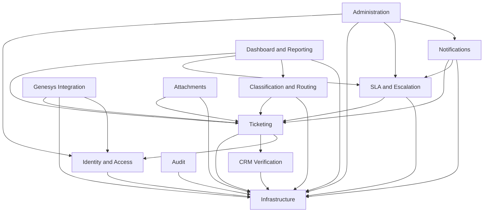

# Tiger Group — Customer Service Ticketing System
## Module Dependency Design

| | |
|---|---|
| **Status** | Approved for Architecture Design |
| **Purpose** | Define the 12 logical modules, their public contracts, owned data, event flow, and dependency rules, ensuring the dependency graph is acyclic |
| **Related documents** | `System-Architecture.md` §3–5 · `ADR-0001` |
| **Date** | 2026-08-17 |

## Dependency Graph

This is a directed acyclic graph — no module depends, directly or transitively, on a module that depends on it. `Infrastructure` has zero outgoing edges to any other module in this diagram. `Audit` consumes domain events published by other modules (see per-module tables below) but does not take a compile-time dependency on them — it depends only on `Infrastructure` and the shared event-contract types.

---

## Infrastructure

| | |
|---|---|
| **Responsibility** | Cross-cutting technical services: EF Core `DbContext`, Outbox dispatcher, Hangfire job registration, SignalR hub plumbing, correlation-ID propagation, generic health checks |
| **Public interfaces** | `IUnitOfWork`, `IOutboxWriter`, `ICorrelationIdAccessor`, `IDomainEventPublisher` |
| **Owned data** | `OutboxMessage` |
| **Events published** | None (infrastructure, not a business-event source) |
| **Events consumed** | None directly — dispatches events on behalf of other modules |
| **External dependencies** | SQL Server, Hangfire storage |
| **Prohibited dependencies** | Must not reference any business-capability module (Ticketing, CRM Verification, Genesys Integration, etc.) — it is the base of the graph |

## Identity and Access

| | |
|---|---|
| **Responsibility** | Staff authentication (ADR-0004), role/policy definitions (ADR-0005), `Employee` record management |
| **Public interfaces** | `ICurrentUserContext`, `IAuthorizationPolicyProvider` (ASP.NET Core built-in, extended), `IEmployeeDirectory` |
| **Owned data** | `Employee`, `AspNetUsers`/`AspNetRoles` (Identity-managed) |
| **Events published** | `EmployeeDeactivated` |
| **Events consumed** | None |
| **External dependencies** | None beyond Infrastructure |
| **Prohibited dependencies** | Must not depend on Ticketing, CRM Verification, Genesys Integration, or any other business-capability module — identity must remain independently testable |

## CRM Verification

| | |
|---|---|
| **Responsibility** | Unit/contact lookup against Tiger CRM, refreshable cache (ADR-0006), snapshot capture at verification time (ADR-0007) |
| **Public interfaces** | `ICrmGateway` (external adapter contract), `IUnitVerificationService` |
| **Owned data** | `UnitReference`/`ContactReference` (cache — see `Domain-Model.md`) |
| **Events published** | `UnitVerified`, `CrmUnreachable` |
| **Events consumed** | None |
| **External dependencies** | Tiger Group CRM API |
| **Prohibited dependencies** | Must not depend on Ticketing (verification must be usable independent of any specific ticket) |

## Ticketing

| | |
|---|---|
| **Responsibility** | The ticket aggregate and its five-dimension lifecycle (ADR-0008): `TicketStatus`, `VerificationStatus`, `EscalationLevel`, `SlaState`, `ResolutionOutcome` |
| **Public interfaces** | `ITicketRepository`, `ICreateTicketHandler`, `IResolveTicketHandler`, `ICloseTicketHandler`, `ITransferTicketHandler`, `IReopenTicketHandler` |
| **Owned data** | `Ticket`, `TicketRequesterSnapshot`, `TicketStatusHistory`, `TicketAssignment`, `TicketResolution`, `TicketNote` |
| **Events published** | `TicketCreated`, `TicketStatusChanged`, `TicketAssigned`, `TicketTransferred`, `TicketResolved`, `TicketClosed`, `TicketReopened` |
| **Events consumed** | `UnitVerified` (to attach snapshot at creation) |
| **External dependencies** | None directly (via CRM Verification/Identity and Access interfaces only) |
| **Prohibited dependencies** | Must not depend on Notifications, Dashboard and Reporting, Genesys Integration, or Administration — those are downstream consumers of Ticketing, never the reverse |

## Classification and Routing

| | |
|---|---|
| **Responsibility** | Category/sub-category/priority selection; department routing table |
| **Public interfaces** | `IClassifyTicketHandler`, `IRoutingTable` |
| **Owned data** | `Category`, routing-rule reference data |
| **Events published** | `TicketClassified`, `TicketRouted` |
| **Events consumed** | `TicketCreated` |
| **External dependencies** | None |
| **Prohibited dependencies** | Must not depend on SLA and Escalation, Notifications, Genesys Integration |

## SLA and Escalation

| | |
|---|---|
| **Responsibility** | Due-date computation (ADR-0009, 0010), priority-change policy (ADR-0012), escalation-level advancement (ADR-0011) |
| **Public interfaces** | `ISlaCalculator`, `IEscalationEngine`, `IPriorityChangeHandler` |
| **Owned data** | `TicketSlaInstance`, `TicketEscalation`, `BusinessCalendar`, `Holiday`, `SlaPolicy` |
| **Events published** | `SlaWarningRaised`, `SlaBreached`, `EscalationLevelChanged`, `PriorityChanged` |
| **Events consumed** | `TicketCreated`, `TicketStatusChanged`, `GenesysInteractionAnswered` (to satisfy First Response) |
| **External dependencies** | None directly |
| **Prohibited dependencies** | Must not depend on Notifications, Dashboard and Reporting, Genesys Integration (it consumes a Genesys-originated *event*, not the Genesys Integration module itself) |

## Genesys Integration

| | |
|---|---|
| **Responsibility** | Webhook ingestion, signature validation, idempotent processing, conversation-to-ticket linking (ADR-0019) |
| **Public interfaces** | `IGenesysWebhookHandler`, `IGenesysWebhookGateway` (external adapter contract) |
| **Owned data** | `GenesysInteraction` |
| **Events published** | `GenesysInteractionReceived`, `GenesysInteractionAnswered`, `GenesysInteractionLinked`, `GenesysWebhookValidationFailed` |
| **Events consumed** | `TicketCreated` (to link a just-created ticket to a pending interaction, if applicable) |
| **External dependencies** | Genesys APIs and webhooks |
| **Prohibited dependencies** | Must not depend on SLA and Escalation, Notifications, Dashboard and Reporting — it links to Ticketing only; SLA and Escalation independently consumes the events Genesys Integration publishes |

## Notifications

| | |
|---|---|
| **Responsibility** | Email acknowledgement, SLA breach/warning alerts, Outbox-based dispatch (ADR-0013) |
| **Public interfaces** | `INotificationDispatcher`, `IEmailGateway` (external adapter contract) |
| **Owned data** | `Notification` |
| **Events published** | `NotificationSent`, `NotificationFailed` |
| **Events consumed** | `TicketCreated`, `SlaWarningRaised`, `SlaBreached`, `EscalationLevelChanged` |
| **External dependencies** | Office 365 Email (Phase 2: SMS/WhatsApp) |
| **Prohibited dependencies** | Must not depend on Dashboard and Reporting, Administration, Genesys Integration |

## Attachments

| | |
|---|---|
| **Responsibility** | File metadata, storage references, virus-scan gating (ADR-0017) |
| **Public interfaces** | `IAttachmentService`, `IFileStorageGateway` (external adapter contract) |
| **Owned data** | `TicketAttachment` |
| **Events published** | `AttachmentUploaded`, `AttachmentScanCompleted` |
| **Events consumed** | None |
| **External dependencies** | File/object storage, virus-scan service |
| **Prohibited dependencies** | Must not depend on any module other than Ticketing and Infrastructure |

## Audit

| | |
|---|---|
| **Responsibility** | Append-only audit trail across ticket-lifecycle changes and administrative actions (ADR-0018) |
| **Public interfaces** | `IAuditWriter` |
| **Owned data** | `TicketStatusHistory` *(populated on Ticketing's behalf, per the ownership note below)*, `AuditEntry` |
| **Events published** | None |
| **Events consumed** | `TicketStatusChanged`, `TicketAssigned`, `TicketTransferred`, `EscalationLevelChanged`, `PriorityChanged`, and all Administration-originated events |
| **External dependencies** | None |
| **Prohibited dependencies** | Must not depend on any business-capability module — it subscribes to their published events only, never calls into them |

> **Ownership note:** `TicketStatusHistory` is logically part of the Ticketing aggregate's audit trail but is written by the Audit module's event subscriber, keeping Ticketing's write path free of audit-specific logic. This is a deliberate exception to "each module owns its data," documented here to avoid ambiguity.

## Dashboard and Reporting

| | |
|---|---|
| **Responsibility** | Basic operational dashboard: ticket counts by status/priority/department, SLA backlog, escalation counts |
| **Public interfaces** | `IDashboardQueryService` |
| **Owned data** | None (read-only queries over other modules' data) |
| **Events published** | None |
| **Events consumed** | None (polls/queries directly for MVP's basic dashboard; Phase 2's live updates will consume events via SignalR, not this module directly) |
| **External dependencies** | None |
| **Prohibited dependencies** | Must not write to any other module's data — read-only by design |

## Administration

| | |
|---|---|
| **Responsibility** | User/role management, SLA policy configuration, holiday calendar entry, dead-letter review |
| **Public interfaces** | `IAdminUserService`, `ISlaPolicyAdminService`, `IHolidayCalendarAdminService`, `IDeadLetterReviewService` |
| **Owned data** | None directly — edits `SlaPolicy`/`Holiday` (owned by SLA and Escalation) and `Employee` (owned by Identity and Access) through their published interfaces, not direct table access |
| **Events published** | `SlaPolicyChanged`, `HolidayCalendarUpdated` |
| **Events consumed** | None |
| **External dependencies** | None |
| **Prohibited dependencies** | Must not depend on Ticketing, Genesys Integration, CRM Verification, Dashboard and Reporting |

---

## Preventing Circular Dependencies — Verification

Walking the graph from any node reaches `Infrastructure` and terminates; no path leads back to its origin. The two dependencies most at risk of becoming circular were checked explicitly:

- **Genesys Integration ↔ SLA and Escalation**: Genesys Integration publishes `GenesysInteractionAnswered`; SLA and Escalation *consumes* this event but does not call back into Genesys Integration. No cycle.
- **Ticketing ↔ Audit**: Ticketing publishes `TicketStatusChanged`; Audit consumes it to write `TicketStatusHistory` but never calls back into Ticketing. No cycle.

Any new module or dependency added after this document must be checked against this same rule before merging.
