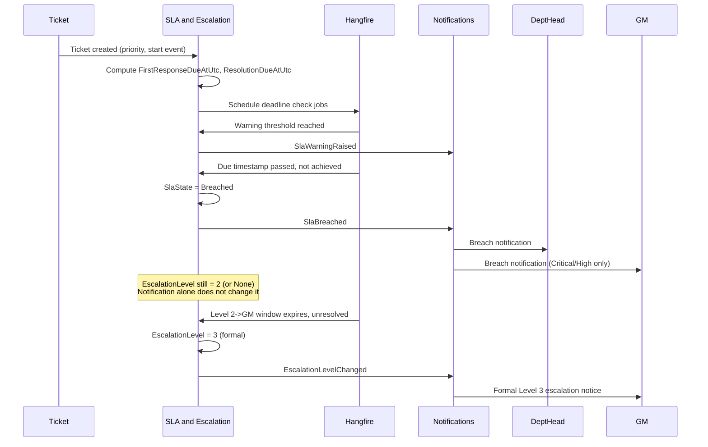

# Tiger Group — Customer Service Ticketing System
## SLA Architecture

| | |
|---|---|
| **Status** | Approved for Architecture Design |
| **Related decisions** | ISSUE-001, ISSUE-004, ISSUE-009 (Executive Decisions numbering), ISSUE-012, ISSUE-013, ISSUE-017, ISSUE-018, ISSUE-019, ISSUE-023 — all approved (see `Tiger-CS-Ticketing-Management-Decisions.md`) |
| **Related ADRs** | 0009 (separate FR/Resolution tracking), 0010 (business calendar), 0011 (escalation), 0012 (priority-change policy), 0014 (idempotency), 0015 (Hangfire) |
| **Date** | 2026-08-17 |

---

## 1. First Response SLA

**Start event:** Ticket creation (`Ticket.CreatedAtUtc`) — approved per ISSUE-001, Option C: the clock starts at creation, with time-to-assignment tracked as a separate, non-blocking metric.

**Achievement event:** `FirstHumanResponseAtUtc` — approved per ISSUE-019, refined for this pilot by ADR-0019/0009:
- **Inbound phone via Genesys:** the interaction's **answer timestamp**, if a ticket is linked to that interaction at or before the answer event.
- **Manual/no Genesys metadata available:** agent-confirmed live handling, recorded explicitly by the agent (the pre-Genesys manual MVP fallback).
- **The automated acknowledgement email never satisfies this SLA**, on any channel.

**Target:** per priority tier (Section 7 of the Solution Analysis) — Critical 15 min, High 1h, Medium 4h, Low 24h.

## 2. Resolution SLA

**Start event:** Same as First Response — ticket creation, or the start of the current `TicketSlaInstance` period after a priority change.

**Achievement event:** `ResolvedAtUtc` — the moment `ResolutionOutcome` is set via the Resolve action (ADR-0008, ISSUE-022). Note: **Closure is not the achievement event** — a ticket can be Resolved (achieving the Resolution SLA) before it is formally Closed by the CS layer.

**Target:** per priority tier — Critical 4h, High 24h, Medium 3 business days, Low 7 business days.

## 3. Critical: 24/7 Calculation

Critical-tier due timestamps are computed by simple duration addition from the start event, with **no** business-hours or holiday-calendar exclusion, and — per the approved split (ISSUE-018a) — the Critical SLA **never pauses**, regardless of `TicketStatus` (including Pending Customer/Third-Party). This is a fixed rule, not configurable data.

## 4. Non-Critical: Business-Hours Calculation

High/Medium/Low due timestamps are computed by walking forward from the start event, counting only time within the configured `BusinessCalendar` window (approved per ISSUE-017, Option A: Saturday–Thursday working days, 08:00–18:00, Friday off — stored as configurable data, not hardcoded) and excluding any date present in `Holiday`.

```
Pseudocode (conceptual, not implementation):
  remaining = targetDuration
  cursor = startEvent
  while remaining > 0:
      if cursor.date is a working day AND cursor.date not in Holiday:
          advance cursor to min(businessDayEnd, cursor + remaining)
          remaining -= elapsed
      else:
          advance cursor to next businessDayStart
  return cursor
```

## 5. UAE Holiday Calendar

Maintained as `Holiday` reference data (ADR-0010), with a business owner (Customer Service or HR, per ISSUE-012) confirming each year's dates and a technical administrator (System Administrator) entering them. No automated feed exists at MVP — this is a manual annual process, flagged as an operational risk in ADR-0010, not an architectural gap.

## 6. Pause and Resume Rules

Approved per the four-way split (ISSUE-018a–d):

| SLA type | Pending Customer | Pending Third-Party | After contact received |
|---|---|---|---|
| Critical (Resolution + First Response) | Never pauses (fixed) | Never pauses (fixed) | N/A — never pauses |
| Non-Critical Resolution | Pauses, resumes on restart (approved B) | Pauses, resumes on restart (approved B) | N/A |
| First Response (any tier) | N/A — see next column | N/A — see next column | **Cannot pause once `FirstHumanResponseAtUtc` is set** (fixed) — there is nothing left to pause |

**Monitoring note:** a ticket left in a Pending status for an unusually long duration should be flagged operationally (Dashboard and Reporting), since incorrect use of Pending status would otherwise unfairly pause a clock that should be running.

## 7. Priority Upgrade/Downgrade Behavior

Approved per ISSUE-023 (ADR-0012):

**Upgrade:** the current `TicketSlaInstance` period is closed (its `PeriodEndAtUtc` set, its breach flags — if any — left exactly as they were). A new `TicketSlaInstance` opens at the change moment under the new tier. The new due timestamp is the **earlier of** the pre-existing due timestamp and the freshly computed higher-tier due timestamp — an upgrade can only tighten a deadline, never loosen it. No approval required.

**Downgrade:** requires Department Head (or above) approval before the new `TicketSlaInstance` takes effect. The prior period's breach flags are never cleared or reversed. Recalculated due dates apply only from the approval moment forward.

**Pilot-scope note (does not change the approved behavior above):** for the 4-week, 1-developer pilot (`docs/design/MVP-Implementation-Backlog.md` §0), priority downgrades are disabled completely after ticket creation — no downgrade path exists in the pilot build at all, not even as a pending-approval workflow. "Priority is fixed after ticket creation during the pilot. Downgrades are not permitted. The approved downgrade-request and approval design remains documented for the post-pilot phase." See `docs/architecture/adr/0012-priority-change-sla-policy.md`'s own pilot-scope note for the full rationale. Upgrade behavior above is unaffected and is built in the pilot.

## 8. Due Timestamp Calculation — Summary

| Event | Recomputed? |
|---|---|
| Ticket created | `FirstResponseDueAtUtc`, `ResolutionDueAtUtc` computed for the initial tier |
| Priority upgraded | Both due timestamps recomputed per the earlier-of rule above |
| Priority downgraded (approved) | Both due timestamps recomputed from the approval moment |
| `TicketStatus` → Pending Customer/Third-Party (non-Critical) | `SlaState → Paused`; due timestamps hold, elapsed-pause duration tracked |
| `TicketStatus` → In Progress (resuming) | `SlaState → Running`; due timestamps extended by the paused duration |

## 9. SLA History

Every period is retained as an immutable `TicketSlaInstance` row (`Domain-Model.md`). Management reporting displays both the original and any changed period for a re-prioritized ticket — nothing is hidden or overwritten (ISSUE-023's explicit requirement).

## 10. Warning Events

A warning fires at a configurable percentage of the resolution target elapsed (approved defaults, ISSUE-013): Critical 50%, High/Medium/Low 75%. A warning does not change any state dimension — it is a `SlaWarningRaised` domain event, routed to the ticket owner + Supervisor via Notifications.

## 11. Breach Events

A breach sets `SlaState = Breached` for the relevant SLA type (First Response or Resolution independently) and raises `SlaBreached`, routed per the approved recipient matrix:

| Priority | Recipients on breach |
|---|---|
| Critical | Department Head + GM, simultaneously (ISSUE-004) |
| High | Department Head + GM |
| Medium | Department Head |
| Low | Supervisor |

**Breach ≠ formal escalation.** A Critical breach notification does not, by itself, set `EscalationLevel = 3` — see Section 12.

## 12. Escalation Windows

Per ADR-0011 and the approved per-tier defaults (ISSUE-013):

| Priority | Early-warning threshold | Level 2 → GM (Level 3) window |
|---|---|---|
| Critical | 50% | 30 minutes |
| High | 75% | 2 hours |
| Medium | 75% | 1 business day |
| Low | 75% | 2 business days |

Formal advancement to Level 3 occurs only when this window expires without resolution at Level 2 — never from a retry count (the earlier, rejected approach). These defaults were accepted as proposed and are stored as configurable `SlaPolicy` data, editable by System Administrator via Administration.



## 13. Hangfire Scheduling (Primary Mechanism)

A Hangfire **scheduled (delayed) job** is enqueued per due timestamp (First Response, Resolution, warning threshold, escalation window) at the moment it is computed — this is the primary detection mechanism, firing at the exact due moment (ADR-0015).

## 14. Safety Sweep (Backstop Only)

A recurring Hangfire job (every 1–5 minutes) independently re-scans open tickets against their due timestamps, solely to catch a scheduled job lost to a deploy or restart. It is never the primary detection path.

## 15. Idempotency

Every breach/warning/escalation check carries an idempotency key (`TicketId + CheckType + DueTimestamp`, per ADR-0014) so the scheduled job and the sweep never produce a duplicate notification for the same due event.

## 16. Worked Examples and Edge Cases

**Example A — Critical, 24/7:** Created Tuesday 22:40. First Response due 22:55 (15 min). Resolution due Wednesday 02:40 (4h). Neither pauses regardless of status changes.

**Example B — High, outside business hours:** Created Thursday 17:30 (business hours 08:00–18:00, Sat–Thu). 30 min elapsed Thursday; Friday excluded entirely; clock resumes Saturday 08:00. First Response (1h) due Saturday 08:30. Resolution (24h) due Sunday 13:30.

**Example C — Priority upgrade:** Medium ticket created Monday 09:00 (original Resolution due later that week). At 10:00, upgraded to Critical. The Medium period (09:00–10:00, unbreached) is archived. A fresh Critical due date is computed from 10:00: `ResolutionDueAtUtc = 14:00 Monday`. Since 14:00 Monday is earlier than the original Medium due date, the earlier-of rule selects 14:00 Monday.

**Example D — Priority downgrade with a prior breach:** Critical ticket created Tuesday 09:00 (`ResolutionDueAtUtc = 13:00`), breaches at 13:00 — recorded permanently. At 14:00, reassessed as Medium; the downgrade is pending until a Department Head approves it at 14:30. From 14:30, a fresh Medium due date applies. The 13:00 Critical breach is never removed; reporting shows both periods.

**Example E — Genesys call answer as First Response:** A High-priority ticket is created at 09:00 when an agent picks up an inbound Genesys call already in progress and links the ticket to the conversation. Genesys's answer-event timestamp was 08:58 (before the ticket's own creation timestamp, since the ticket was created a moment after the call was answered). `FirstHumanResponseAtUtc` is set to 08:58 — the actual moment of human engagement — satisfying First Response immediately upon ticket creation. This is the intended behavior: the ticket should not appear to still be awaiting first response when a human had, in fact, already answered.

**Edge case — Pending status left open too long:** A Medium ticket enters Pending Customer at 10:00 Monday and is still Pending at 10:00 the following Monday. The Resolution clock is correctly paused throughout, but Dashboard and Reporting should flag this ticket as a long-Pending outlier for supervisor review — a pause is not a substitute for follow-up.

**Edge case — Upgrade then immediate downgrade:** A ticket upgraded from Medium to Critical at 10:00, then reassessed as Medium again at 10:05. The Critical period (10:00–10:05, unbreached) is archived; the downgrade to Medium requires approval per Section 7 — it is not fast-tracked merely because the Critical period was brief. This prevents a rapid upgrade/downgrade cycle from bypassing the approval gate.
