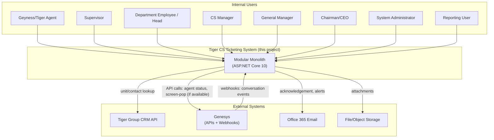
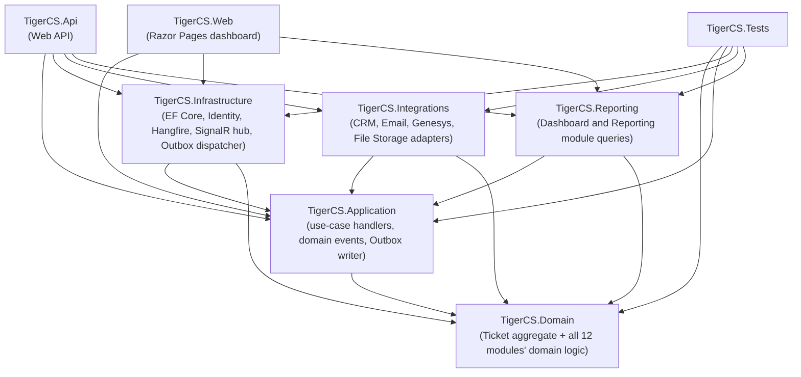
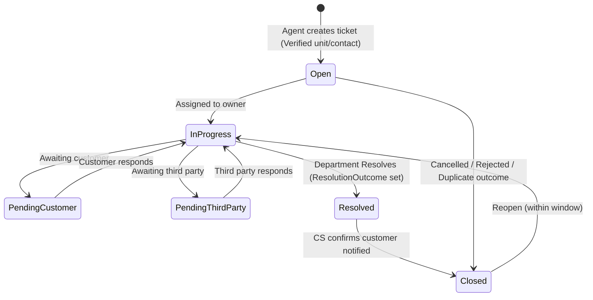
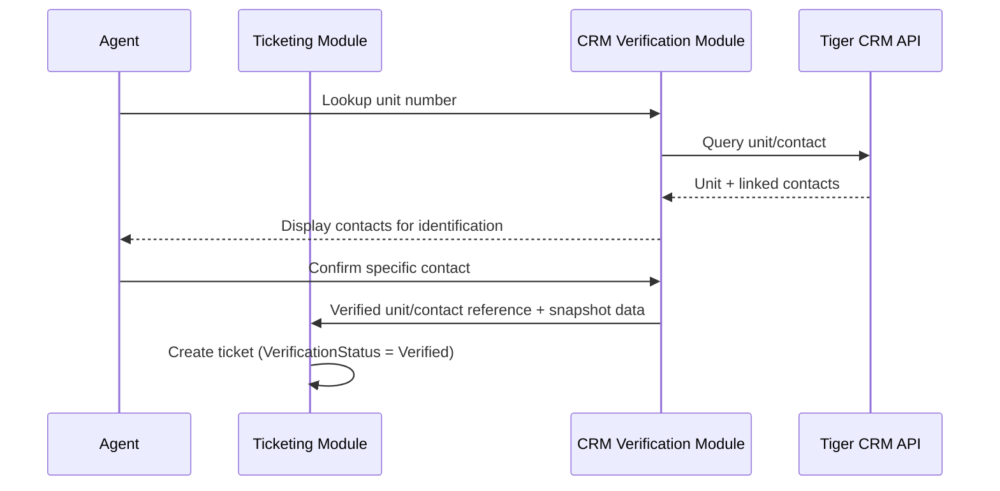
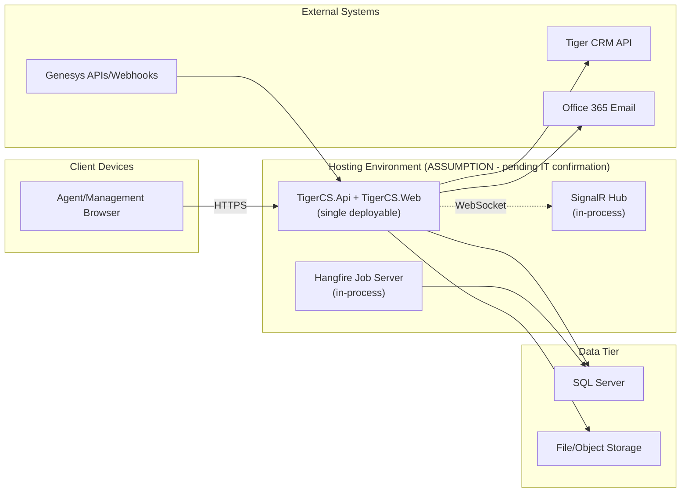

# Tiger Group — Customer Service Ticketing System
## System Architecture

| | |
|---|---|
| **Status** | Approved for Architecture Design |
| **Scope** | 3-week internal pilot MVP — see `docs/Tiger-CS-Ticketing-Solution-Analysis.md` §15 for the full scope boundary. This document does **not** cover WhatsApp, Kiosk, Social Media, Customer Portal, CSAT, or advanced AI features — all excluded from MVP by explicit instruction. |
| **Related documents** | `adr/` (architecture decisions) · `Module-Design.md` · `Domain-Model.md` · `SLA-Architecture.md` · `Genesys-Integration.md` · `Security-Architecture.md` |
| **Date** | 2026-08-17 |

---

## 1. System Context

**No customer-facing system exists in this context diagram** — per ISSUE-021 (approved), all customer interaction is agent-mediated (phone, via Genesys) or an outbound email notification. There is no customer login, portal, WhatsApp, kiosk, or social-media surface in MVP.

## 2. Main Users and External Systems

| Actor / System | Role in this architecture |
|---|---|
| Geyness/Tiger Agent | Verifies caller via CRM, creates/manages tickets, handles Genesys-linked calls |
| Supervisor | Team queue oversight, escalation Level 1 support |
| Department Employee/Head | Resolves tickets (ADR per ISSUE-022), approves transfers/downgrades |
| CS Manager | Closes tickets, oversees reporting, approves Level 4 escalation |
| General Manager | Receives Critical/escalation notifications, Level 3/4 authority |
| Chairman/CEO | Receives Level 4 escalations only (manual) |
| System Administrator | User/role management, SLA policy config, holiday calendar entry, dead-letter review |
| Reporting User | Read-only dashboard/export access |
| Tiger Group CRM API | Source of truth for unit/contact data (ADR-0006) |
| Genesys (APIs + Webhooks) | Call-center platform; supplies conversation/agent/timestamp data (ADR-0019) |
| Office 365 Email | Acknowledgement and alert delivery |
| File/Object Storage | Attachment binary storage (ADR-0017) |

## 3. Module Boundaries

Twelve logical modules — full detail in `Module-Design.md`:

**Identity and Access · CRM Verification · Genesys Integration · Ticketing · Classification and Routing · SLA and Escalation · Notifications · Attachments · Audit · Dashboard and Reporting · Administration · Infrastructure**

These logical modules sit within the physical solution layering established in ADR-0001:

The 12 logical modules live primarily in `Domain`+`Application` (business logic) with their adapters in `Infrastructure`/`Integrations`; `Genesys Integration` and `CRM Verification` specifically own the `Integrations`-layer gateway implementations for their respective external systems.

## 4. Module Responsibilities

Summarized here; full responsibility/interface/data/event detail is in `Module-Design.md`.

| Module | Responsibility (summary) |
|---|---|
| Identity and Access | Authentication, roles, policies (ADR-0004, 0005) |
| CRM Verification | Unit/contact lookup, cache, snapshot capture (ADR-0006, 0007) |
| Genesys Integration | Webhook ingestion, conversation-to-ticket linking (ADR-0019) |
| Ticketing | The ticket aggregate and its five-dimension lifecycle (ADR-0008) |
| Classification and Routing | Category/priority selection, department routing |
| SLA and Escalation | Due-date computation, escalation levels, priority-change policy (ADR-0009–0012) |
| Notifications | Email acknowledgement, breach alerts, via Outbox (ADR-0013) |
| Attachments | File metadata and storage references (ADR-0017) |
| Audit | `TicketStatusHistory` + `AuditEntry` (ADR-0018) |
| Dashboard and Reporting | Basic operational dashboard queries |
| Administration | User/role, SLA policy, holiday calendar, dead-letter management |
| Infrastructure | Outbox dispatcher, Hangfire registration, SignalR hub, correlation-ID plumbing |

## 5. Dependency Rules

`Module-Design.md` defines the full dependency graph. The governing rule: **dependencies flow one direction, from business-capability modules toward `Infrastructure`, never the reverse, and never sideways between two business-capability modules except where explicitly documented** (e.g., `Genesys Integration` depends on `Ticketing`, never the reverse). No module may query another module's owned data directly — only through that module's published interface or domain events. This keeps the dependency graph a DAG (no cycles), verified module-by-module in `Module-Design.md`.

## 6. Authentication and Authorization Flow

1. Staff member authenticates via ASP.NET Core Identity (ADR-0004) — username/password, with account lockout after repeated failures (`Security-Architecture.md`).
2. On success, the session/token carries the `Employee`'s role(s) and `DepartmentId` as claims.
3. Every API request is evaluated against the named policy for that endpoint (ADR-0005) — e.g., `CanResolveOwnDepartmentTicket` checks both role membership and that the ticket's `CurrentDepartmentId` matches the caller's `DepartmentId`.
4. No unauthenticated or customer-facing endpoint exists (ISSUE-021).

## 7. Ticket Processing Flow

`EscalationLevel`, `SlaState`, and `VerificationStatus` are tracked independently of this diagram's `TicketStatus` transitions (ADR-0008) — a ticket can be `InProgress` while `EscalationLevel = 2`, for example.

## 8. CRM Verification Flow

If CRM is unreachable: an `IntakeRecord` is still created (ISSUE-006); Critical/High proceed as provisional tickets (`VerificationStatus = PendingCrmVerification`), reconciled once CRM returns; Medium/Low remain queued.

## 9. Genesys Interaction Flow (Summary)

Summarized here; full sequence diagram and contract detail in `Genesys-Integration.md`. In brief: Genesys sends a webhook on call start/answer/end; the Genesys Integration module validates the signature, checks idempotency (by `ConversationId` + event type), and links the interaction to a ticket (existing or newly created by the agent) via `GenesysInteraction.LinkedTicketId`. The answer timestamp operationalizes First Human Response (ISSUE-019) when a ticket is linked at or before that point.

## 10. SLA and Escalation Flow (Summary)

Summarized here; full sequence diagram and worked examples in `SLA-Architecture.md`. In brief: due timestamps are computed at ticket creation and on priority change; a Hangfire scheduled job checks each due timestamp, with a recurring sweep as a safety net; a breach or warning writes to the Outbox for notification; escalation advances per the configured Level 2→GM window, independent of `TicketStatus`.

## 11. Notification Flow

Every notification (email acknowledgement, SLA breach/warning alert) originates as a domain event written to `OutboxMessage` in the same transaction as the triggering state change (ADR-0013). A Hangfire-driven dispatcher reads pending messages and calls the Office 365 Email adapter (or, from Phase 2, SMS/WhatsApp). Failed sends retry with backoff and move to a dead-letter state after exhaustion, visible to System Administrator via Administration.

## 12. Audit Flow

Every change to any of the five ticket-state dimensions raises a domain event consumed by the Audit module, writing a `TicketStatusHistory` row (ADR-0018). Administrative actions (exports, config changes, access revocation, Genesys signature-validation failures) write to `AuditEntry` directly. Both tables are append-only.

## 13. Background Job Architecture

| Job | Type | Purpose |
|---|---|---|
| SLA deadline check | Scheduled (delayed), per ticket | Primary breach/warning detection (ADR-0015) |
| SLA sweep | Recurring (1–5 min) | Safety net only |
| Outbox dispatcher | Recurring | Publishes pending notifications/integration calls |
| CRM reconciliation | Scheduled + 15-min timeout sweep | Resolves `PendingCrmVerification` records |
| Genesys dead-letter retry | Manual-triggered (Administration) | Re-processes a failed webhook after investigation |

## 14. Reliability and Failure-Handling Strategy

- **Transactional Outbox** (ADR-0013) for every cross-boundary effect.
- **Idempotency keys + correlation IDs** (ADR-0014) on every dispatched message and inbound webhook.
- **Retry with backoff**, then **dead-letter**, for every outbound integration call (Email, CRM write-back, Genesys acknowledgement where applicable).
- **Manual fallback**: if Genesys is unavailable, the agent uses the existing phone-only manual ticket-creation flow with no Genesys metadata attached — the system remains fully operable without Genesys (ADR-0019).
- **CRM outage fallback**: `IntakeRecord` + provisional tickets for Critical/High (ISSUE-006).

## 15. Deployment Overview

The exact hosting target (on-premises, Azure, or another cloud) is an **open question** — see ADR-0022. This diagram assumes a single-container, single-environment deployment as a working default, not a confirmed decision.

## 16. Security Boundaries

Summarized here; full detail in `Security-Architecture.md`. Three boundaries exist: (1) the public internet ↔ the application, crossed only by staff HTTPS traffic and inbound Genesys webhooks (both authenticated); (2) the application ↔ the CRM/Genesys/Email external systems, crossed via outbound authenticated API calls only; (3) department-scoped data access within the application itself, enforced by policy-based authorization (ADR-0005), not by any network segmentation. No customer-facing boundary exists, since no customer-facing endpoint exists (ISSUE-021).
