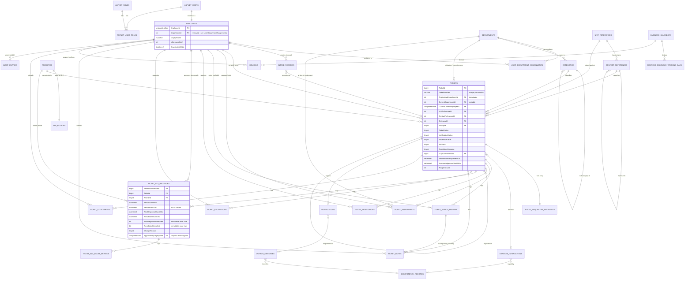

# Tiger Group — CS Ticketing System
## MVP Detailed ERD and Data Dictionary

| | |
|---|---|
| **Status** | Design for review — conceptual/logical design only |
| **Scope** | Detailed entity-relationship design for the 3-week internal pilot MVP, refining `docs/architecture/Domain-Model.md` to implementation-ready detail |
| **Explicitly not done here** | No SQL DDL, no EF Core entity classes or migrations, no connection to a real database, no application code |
| **Base** | `main` @ `4fe6f19` (post PR #1/#3/#4 merge — the full architecture package) |
| **Related documents** | `docs/architecture/Domain-Model.md` (conceptual model this refines) · `docs/architecture/System-Architecture.md` · `docs/architecture/SLA-Architecture.md` · `docs/architecture/Genesys-Integration.md` · `docs/architecture/Security-Architecture.md` · `docs/architecture/adr/0003, 0006, 0007, 0008, 0009-0012, 0013-0014, 0017-0019` |
| **Date** | 2026-08-18 |

---

## 0. Design Principles Carried Forward (Not Re-Decided Here)

These are restated, not re-opened — every one traces to an already-accepted ADR, and this document does not silently invent a different answer:

1. **The CRM remains the sole source of truth for units and contacts (ADR-0006).** This design creates **no local master Unit or Customer table.** `UnitReferences`/`ContactReferences` below store only the CRM-issued identifier plus a refreshable, non-authoritative display cache — never a locally-owned record of who owns or lives in a unit.
2. **Each ticket carries an immutable, write-once snapshot (ADR-0007)** — `TicketRequesterSnapshots` — captured at verification time, never re-synced from the CRM or the cache afterward.
3. **No customer-facing identity exists** (ISSUE-021) — `AspNetUsers` contains internal staff only.
4. **Five independent ticket-state dimensions** (ADR-0008) — `TicketStatus`, `VerificationStatus`, `EscalationLevel`, `SlaState`, `ResolutionOutcome` — are tracked as separate concerns, never collapsed into one status column.
5. **Append-only audit** (ADR-0018) — `TicketStatusHistory` and `AuditEntries` have no update or delete path in this design; corrections are new rows, not edits to old ones.
6. **Transactional Outbox + idempotency** (ADR-0013/0014) — every cross-boundary effect is mediated by `OutboxMessages`, and idempotency is a first-class, generalized concern (`IdempotencyRecords`), not bolted on per-feature.

## 0.1 Two Structural Refinements Flagged, Not Silently Assumed

Going from the conceptual `Domain-Model.md` to a detailed ERD required two structural decisions the conceptual model left implicit. Both are refinements of already-approved concepts, not new business rules — but they're called out explicitly rather than silently baked in:

- **`UserDepartmentAssignments` (many-to-many) replaces a single `DepartmentId` on `Employee`.** The conceptual model implied one department per employee. This detailed design allows an employee (e.g., a Supervisor) to be assigned to more than one department, with exactly one marked primary. **[ASSUMPTION — ` multi-department staff was not an explicit requirement; flagged for confirmation. If every MVP pilot agent genuinely belongs to exactly one department, this table still works correctly (one row per employee) and costs nothing — it is a safe superset, not a scope increase.]**
- **`TicketSlaPausePeriods` makes pause/resume an explicit, timestamped history** rather than inferring pause duration from `SlaState` transitions alone. This is required to correctly extend a due timestamp by the exact paused duration (`SLA-Architecture.md` §8) and to support an audit question like "how long, in total, was this ticket waiting on the customer." This does not change any approved SLA rule — it is the storage needed to implement the rule already approved.

No other business decision is invented in this document. Where a data-type or constraint choice is genuinely arbitrary (e.g., a string length), it is marked `[ASSUMPTION]` inline.

---

## 1. Entity-Relationship Diagram

*(Reference-only tables with no ticket-specific foreign keys — `AspNetRoles`, `AspNetUserRoles` beyond what's shown — are described in the data dictionary below but omitted from the diagram for readability.)*

---

## 2. Data Dictionary

For every entity: purpose, columns, then a relationships table with **Cardinality, Required/Optional, Delete Behavior, Ownership, Referential-Integrity Expectation**.

### 2.1 AspNetUsers / AspNetRoles / AspNetUserRoles (Identity, framework-owned)

**Purpose:** ASP.NET Core Identity's own tables (ADR-0004). Not redefined here beyond noting the extension point.

| Column (AspNetUsers) | Type | Notes |
|---|---|---|
| Id | uniqueidentifier | PK |
| UserName, Email, PasswordHash, LockoutEnd, AccessFailedCount, ... | framework-defined | Standard Identity columns |

| Relationship | Cardinality | Required/Optional | Delete Behavior | Ownership | Referential Integrity |
|---|---|---|---|---|---|
| AspNetUsers ↔ Employees | 1:1 | Required (every Employee has exactly one AspNetUsers row; not every AspNetUsers row need have an Employee, though at MVP it always will since no customer identity exists) | **Restrict** — an AspNetUsers row is never hard-deleted while an Employee references it; deactivation (`DeactivatedAtUtc`) is the only "removal" path | Identity and Access | `Employees.EmployeeId` is both PK and FK to `AspNetUsers.Id` (identifying relationship) |
| AspNetUsers ↔ AspNetUserRoles ↔ AspNetRoles | many-to-many | Required (every staff account has ≥1 role) | Cascade (Identity framework default) | Identity and Access | Framework-enforced |

### 2.2 Employees

**Purpose:** Domain extension of `AspNetUsers`, carrying staff attributes not in Identity's own schema (ADR-0004).

| Column | Type | Nullable | Notes |
|---|---|---|---|
| EmployeeId | uniqueidentifier | No | PK, FK → AspNetUsers.Id |
| DisplayName | nvarchar(200) | No | |
| IsGeynessStaff | bit | No | Distinguishes Tiger vs. Geyness employment for reporting |
| DeactivatedAtUtc | datetime2 | Yes | Null = active. Set on departure; never hard-deleted (FR-ADM-02) |
| CreatedAtUtc | datetime2 | No | |

**Note:** `DepartmentId` is deliberately **not** a column here — see §0.1 and `UserDepartmentAssignments` below.

| Relationship | Cardinality | Required/Optional | Delete Behavior | Ownership | Referential Integrity |
|---|---|---|---|---|---|
| Employees → UserDepartmentAssignments | 1:many | An active Employee should have ≥1 assignment (app-enforced, not a DB constraint, since an employee could theoretically be between assignments) | **Restrict** on Employee "deletion" — deactivation only, never a hard delete, so this is moot in practice | Identity and Access | — |
| Employees → Tickets (`CurrentOwnerEmployeeId`) | 1:many | Optional (a ticket may be unassigned) | **Set Null** if an employee is deactivated mid-ticket — ownership must be explicitly reassigned, not silently orphaned to a dangling reference | Ticketing | App layer must reassign on deactivation, not merely null the FK and move on |

### 2.3 Departments

| Column | Type | Nullable | Notes |
|---|---|---|---|
| DepartmentId | int | No | PK |
| Name | nvarchar(100) | No | Unique |
| Code | varchar(10) | No | Unique; backs the `[DEPT]` segment of `TicketNumber` (ADR-0004) |
| IsActive | bit | No | |

| Relationship | Cardinality | Required/Optional | Delete Behavior | Ownership | Referential Integrity |
|---|---|---|---|---|---|
| Departments → UserDepartmentAssignments | 1:many | Optional (a new department starts with none) | **Restrict** — cannot delete a Department with active assignments; deactivate (`IsActive = 0`) instead | Identity and Access / Administration | |
| Departments → Categories | 1:many | Required (every Category routes to exactly one Department) | **Restrict** | Classification and Routing | |
| Departments → Tickets (Originating, Current) | 1:many (×2 relationships) | Required (every ticket has both) | **Restrict** — `Code` and department rows are never deleted once a ticket references them, consistent with `TicketNumber` immutability (ADR-0004) | Ticketing | `OriginatingDepartmentId` is **write-once** at the application layer — no update path exists for it after creation, enforced in code, not just by convention |

### 2.4 UserDepartmentAssignments

**Purpose:** Many-to-many Employee↔Department membership, with one primary department per employee (§0.1).

| Column | Type | Nullable | Notes |
|---|---|---|---|
| UserDepartmentAssignmentId | int | No | PK |
| EmployeeId | uniqueidentifier | No | FK → Employees |
| DepartmentId | int | No | FK → Departments |
| IsPrimary | bit | No | Exactly one `true` row per `EmployeeId` (app-enforced; a filtered unique index on `(EmployeeId)` where `IsPrimary = 1` is the recommended DB-level backstop) |
| AssignedAtUtc | datetime2 | No | |
| AssignedByEmployeeId | uniqueidentifier | Yes | Null for the initial/seed assignment |

| Relationship | Cardinality | Required/Optional | Delete Behavior | Ownership | Referential Integrity |
|---|---|---|---|---|---|
| → Employees | many:1 | Required | **Cascade** (deleting the join row, not the Employee — Employees are never hard-deleted) | Identity and Access | |
| → Departments | many:1 | Required | **Restrict** (see §2.3) | Identity and Access | |

### 2.5 Categories

| Column | Type | Nullable | Notes |
|---|---|---|---|
| CategoryId | int | No | PK |
| Name | nvarchar(100) | No | e.g., "Facility Management", "Corrective Maintenance" |
| ParentCategoryId | int | Yes | Self-ref; non-null only for FM sub-categories |
| DepartmentId | int | No | Routing target |
| IsActive | bit | No | |

| Relationship | Cardinality | Required/Optional | Delete Behavior | Ownership | Referential Integrity |
|---|---|---|---|---|---|
| → Categories (self, parent) | many:1 | Optional | **Restrict** | Classification and Routing | A sub-category's parent must itself have `ParentCategoryId IS NULL` (app-enforced — no two-level-deep nesting) |
| → Departments | many:1 | Required | **Restrict** | Classification and Routing | |
| → Tickets | 1:many | Required (every ticket has a category) | **Restrict** — a Category referenced by any ticket is deactivated (`IsActive=0`), never deleted | Classification and Routing | |

### 2.6 Priorities and SlaPolicies

| Column (Priorities) | Type | Nullable | Notes |
|---|---|---|---|
| PriorityId | tinyint | No | PK — fixed set: 1=Critical, 2=High, 3=Medium, 4=Low |
| Name | nvarchar(20) | No | |
| DisplayOrder | tinyint | No | |

| Column (SlaPolicies) | Type | Nullable | Notes |
|---|---|---|---|
| PriorityId | tinyint | No | PK **and** FK → Priorities (1:1, identifying) |
| FirstResponseTargetMinutes | int | No | |
| ResolutionTargetMinutes | int | No | |
| ClockBasis | tinyint | No | 1=24/7, 2=BusinessHours |
| WarningThresholdPercent | decimal(5,2) | No | Approved defaults: Critical 50.00; others 75.00 |
| Level2ToGmWindowValue | int | No | Approved defaults: Critical 30; High 2; Medium 1; Low 2 |
| Level2ToGmWindowUnit | tinyint | No | 1=Minutes, 2=Hours, 3=BusinessDays |
| IsActive | bit | No | |

| Relationship | Cardinality | Required/Optional | Delete Behavior | Ownership | Referential Integrity |
|---|---|---|---|---|---|
| Priorities ↔ SlaPolicies | 1:1 | Required — every Priority has exactly one SlaPolicy row, seeded at setup | **Restrict** (neither is ever deleted; both are fixed reference data for MVP) | SLA and Escalation | |
| Priorities → Tickets (current) | 1:many | Required | **Restrict** | SLA and Escalation | |
| Priorities → TicketSlaInstances (tier per period) | 1:many | Required | **Restrict** | SLA and Escalation | |

### 2.7 UnitReferences and ContactReferences (CRM cache — NOT master data)

**Purpose:** Store only the CRM-issued identifier plus a refreshable display cache (ADR-0006). **Never the authoritative record.**

| Column (UnitReferences) | Type | Nullable | Notes |
|---|---|---|---|
| UnitReferenceId | int | No | PK |
| CrmUnitId | nvarchar(64) | No | Unique — the actual key; this system never invents unit identity |
| UnitNumber, PropertyName, TowerName, UnitType | nvarchar | Varies | Display cache only, refreshed from CRM |
| LastSyncedAtUtc | datetime2 | No | |

| Column (ContactReferences) | Type | Nullable | Notes |
|---|---|---|---|
| ContactReferenceId | int | No | PK |
| CrmContactId | nvarchar(64) | No | Unique |
| UnitReferenceId | int | No | FK — a unit has many contact rows (joint owners/tenants) |
| DisplayName, ContactChannel | nvarchar | Yes | Cache only |
| ContactType | tinyint | No | 1=Owner, 2=Tenant, 3=Representative |
| AuthorizedRepresentativeOf | int | Yes | Self-ref; supports ISSUE-007's CRM-recorded-authorization requirement |
| LastSyncedAtUtc | datetime2 | No | |

| Relationship | Cardinality | Required/Optional | Delete Behavior | Ownership | Referential Integrity |
|---|---|---|---|---|---|
| UnitReferences → ContactReferences | 1:many | Optional (a unit may briefly have zero cached contacts before first CRM sync) | **Restrict** — a cached row is refreshed, not deleted, while any ticket references it | CRM Verification | |
| ContactReferences → ContactReferences (representative) | many:1 | Optional | **Restrict** | CRM Verification | Enforces ISSUE-007: an agent may only disclose to a representative with this link populated **and** a CRM-recorded authorization (the authorization record itself lives in the CRM, not duplicated here — this FK only records that the local cache believes a link exists, refreshed from CRM) |
| UnitReferences/ContactReferences → Tickets | 1:many (each) | Required (every ticket has both) | **Restrict** | Ticketing | A ticket's FK here is a pointer to the cache row **at verification time** — it is not a substitute for the immutable snapshot (§2.8), which is what actually protects the historical record if the cache later changes |

### 2.8 TicketRequesterSnapshots

**Purpose:** The immutable, write-once record of what the agent actually read back (ADR-0007).

| Column | Type | Nullable | Notes |
|---|---|---|---|
| TicketId | bigint | No | PK **and** FK → Tickets (1:1, identifying) |
| SnapshotUnitNumber | nvarchar(50) | No | |
| SnapshotPropertyName, SnapshotTowerName, SnapshotUnitType | nvarchar | Yes | |
| SnapshotContactDisplayName, SnapshotContactChannel | nvarchar | Yes | |
| CapturedAtUtc | datetime2 | No | |

| Relationship | Cardinality | Required/Optional | Delete Behavior | Ownership | Referential Integrity |
|---|---|---|---|---|---|
| Tickets ↔ TicketRequesterSnapshots | 1:1 | Required — created in the same transaction as the ticket | **Cascade** (only if the ticket itself were ever deleted, which it never is per the retention policy — in practice this relationship is never exercised) | Ticketing | **No update path exists in the application layer** for this table after insert — this is enforced in code, not the database, since a database-level immutability constraint on an otherwise-normal table is unusual; code review must treat any proposed update path here as a defect |

### 2.9 IntakeRecords

| Column | Type | Nullable | Notes |
|---|---|---|---|
| IntakeRecordId | bigint | No | PK |
| ChannelId | tinyint | No | MVP: Phone only (per scope) |
| ReceivedAtUtc | datetime2 | No | |
| RawUnitNumberEntered | nvarchar(50) | Yes | As spoken, pre-CRM-match — **not** a FK to UnitReferences |
| PriorityHint | tinyint | Yes | FK → Priorities; agent's initial read, pre-classification |
| CrmVerificationStatus | tinyint | No | 1=Unverified, 2=PendingCrmVerification, 3=Verified |
| CreatedByEmployeeId | uniqueidentifier | No at MVP | Always an agent, since MVP is manual-creation-only |
| LinkedTicketId | bigint | Yes | Set once promoted |

| Relationship | Cardinality | Required/Optional | Delete Behavior | Ownership | Referential Integrity |
|---|---|---|---|---|---|
| Employees → IntakeRecords | 1:many | Required at MVP | **Restrict** | Ticketing | |
| IntakeRecords → Tickets | 0/1:0/1 | Optional both ways (many intake attempts never become a ticket — e.g., a wrong-number call) | **Set Null** on the intake side if a ticket is later deleted (never happens in practice) | Ticketing | An `IntakeRecord` is never required to have a `LinkedTicketId` — a call that resolves without needing a ticket (e.g., a simple information request answered verbally) is a valid terminal state **[ASSUMPTION — MVP does not mandate 100% intake-to-ticket conversion; flag if this is wrong]** |

### 2.10 Tickets

*(Column list per the ERD diagram above; repeated here for the data dictionary.)*

| Column | Type | Nullable | Notes |
|---|---|---|---|
| TicketId | bigint | No | PK |
| TicketNumber | varchar(40) | No | Unique, **immutable** (ADR-0004) |
| OriginatingDepartmentId | int | No | FK → Departments; write-once |
| CurrentDepartmentId | int | No | FK → Departments; mutable on transfer |
| CurrentOwnerEmployeeId | uniqueidentifier | Yes | FK → Employees |
| UnitReferenceId, ContactReferenceId | int | No | FK → §2.7 |
| CategoryId | int | No | FK → Categories |
| PriorityId | tinyint | No | FK → Priorities (current tier) |
| TicketStatus, VerificationStatus, EscalationLevel, SlaState | tinyint | No | Independent dimensions (ADR-0008) |
| ResolutionOutcome | tinyint | Yes | Null until Resolved/Closed |
| DuplicateOfTicketId | bigint | Yes | Self-ref FK; required (app-level) when `ResolutionOutcome = Duplicate` |
| RequestSummary | nvarchar(2000) | No | |
| FirstHumanResponseAtUtc | datetime2 | Yes | Satisfies ISSUE-019; ticket-level (not per SLA period) |
| AcknowledgementSentAtUtc | datetime2 | Yes | Automated ack — never satisfies First Response |
| ReopenCount | int | No | Default 0 |
| CreatedAtUtc | datetime2 | No | |
| RowVersion | rowversion | No | Optimistic concurrency |

**Design note:** `FirstResponseDueAtUtc`/`ResolutionDueAtUtc` are **not** columns on `Tickets` — they live only on the current (open-ended) `TicketSlaInstances` row, to avoid two sources of truth for the active due timestamps. Every read of "what's this ticket's current SLA deadline" joins to `TicketSlaInstances` where `PeriodEndAtUtc IS NULL`.

| Relationship | Cardinality | Required/Optional | Delete Behavior | Ownership | Referential Integrity |
|---|---|---|---|---|---|
| Tickets → Tickets (Duplicate) | many:1 | Optional; required only when `ResolutionOutcome = Duplicate` | **Restrict** | Ticketing | App-level check: `DuplicateOfTicketId` must reference an existing, non-duplicate-of-itself ticket (no chains of duplicates pointing to duplicates — must resolve to a genuine, non-duplicate original) |
| Tickets → GenesysInteractions | 0/1:0/1 | Optional both ways | **Set Null** on the interaction side if the ticket is deleted (never happens in practice) | Genesys Integration | A `GenesysInteraction` may exist with no linked ticket (call never converted); a `Ticket` may exist with no Genesys link (manual, non-Genesys-originated) |
| Tickets never physically deleted | — | — | **No delete path exists in the application layer for any Ticket**, consistent with the 7-year retention requirement (ISSUE-016) | Ticketing | Enforced in code; there is no "delete ticket" use case anywhere in this design |

### 2.11 GenesysInteractions

| Column | Type | Nullable | Notes |
|---|---|---|---|
| GenesysInteractionId | bigint | No | PK |
| ConversationId | nvarchar(100) | No | Unique — Genesys's own identifier |
| CallerNumber | nvarchar(30) | Yes | Masked in logs (`Security-Architecture.md` §11); **not** a FK to any contact record |
| GenesysAgentId | nvarchar(100) | No | |
| AgentEmailOrExtension | nvarchar(200) | Yes | Reliability unconfirmed — open question, `Genesys-Integration.md` §15 item 4 |
| ChannelMediaType | nvarchar(30) | No | MVP: voice only |
| StartedAtUtc | datetime2 | No | |
| AnsweredAtUtc, EndedAtUtc | datetime2 | Yes | Populated as later webhooks arrive |
| LinkedTicketId | bigint | Yes | FK → Tickets |
| CorrelationId | uniqueidentifier | No | ADR-0014 |
| ProcessingStatus | tinyint | No | Received / Validated / Rejected (signature failure) |

| Relationship | Cardinality | Required/Optional | Delete Behavior | Ownership | Referential Integrity |
|---|---|---|---|---|---|
| → Tickets | 0/1:0/1 | Optional | **Restrict** | Genesys Integration | See §2.10 |
| → IdempotencyRecords | many:1 (conceptually — see §2.20) | Required | **Restrict** | Genesys Integration | Idempotency key = `ConversationId + eventType`, per ADR-0014 |
| Employees (via AgentEmailOrExtension) | *soft* — no enforced FK | Optional | N/A | Genesys Integration | **Deliberately not a hard FK** — matching a Genesys agent to an `Employee` is a lookup performed by application logic, not a database constraint, since the mapping's reliability is itself an open question (`Genesys-Integration.md` §15 item 4). Forcing a FK here would make webhook ingestion fail whenever the mapping can't be resolved, which is the opposite of the required "never lose an interaction" behavior. |

### 2.12 TicketAssignments

| Column | Type | Nullable | Notes |
|---|---|---|---|
| TicketAssignmentId | bigint | No | PK |
| TicketId | bigint | No | FK |
| AssignedEmployeeId | uniqueidentifier | No | FK |
| AssignedDepartmentId | int | No | FK — department at time of assignment (historical, may differ from `Tickets.CurrentDepartmentId` for old rows) |
| AssignedAtUtc | datetime2 | No | |
| AssigningActorEmployeeId | uniqueidentifier | Yes | Null if system-assigned |
| IsCurrent | bit | No | Exactly one `true` row per `TicketId` (app-enforced; filtered unique index recommended) |

| Relationship | Cardinality | Required/Optional | Delete Behavior | Ownership | Referential Integrity |
|---|---|---|---|---|---|
| Tickets → TicketAssignments | 1:many | Required (every ticket beyond `Open` has ≥1 row) | **Cascade** is never exercised — assignment history is retained for the ticket's full life | Ticketing | Append-only; a reassignment inserts a new row and flips the prior row's `IsCurrent` to false, it never updates the prior row's `AssignedEmployeeId` |

### 2.13 TicketStatusHistory

| Column | Type | Nullable | Notes |
|---|---|---|---|
| TicketStatusHistoryId | bigint | No | PK |
| TicketId | bigint | No | FK |
| Dimension | tinyint | No | 1=TicketStatus, 2=VerificationStatus, 3=EscalationLevel, 4=SlaState, 5=ResolutionOutcome |
| OldValue | tinyint | Yes | Null for the first-ever row per dimension |
| NewValue | tinyint | No | |
| ActorEmployeeId | uniqueidentifier | Yes | Null when `ActorIsSystem = true` |
| ActorIsSystem | bit | No | |
| Note | nvarchar(1000) | Yes | |
| CorrelationId | uniqueidentifier | No | |
| OccurredAtUtc | datetime2 | No | |

| Relationship | Cardinality | Required/Optional | Delete Behavior | Ownership | Referential Integrity |
|---|---|---|---|---|---|
| Tickets → TicketStatusHistory | 1:many | Required | **Restrict/never deleted** — append-only (ADR-0018) | Audit (written on Ticketing's behalf — see `Module-Design.md`'s ownership note) | No update or delete path in the application layer, at any privilege level, including System Administrator |

### 2.14 TicketResolutions

| Column | Type | Nullable | Notes |
|---|---|---|---|
| TicketResolutionId | bigint | No | PK |
| TicketId | bigint | No | FK |
| ResolutionOutcome | tinyint | No | Resolved/Cancelled/Rejected/Duplicate |
| ResolutionNote | nvarchar(4000) | No | Mandatory (BR-011) |
| ReasonCode | tinyint | Yes | Required (app-level) for Cancelled/Rejected |
| DuplicateOfTicketId | bigint | Yes | Required (app-level) for Duplicate |
| ResolvingEmployeeId | uniqueidentifier | No | |
| ResolvedAtUtc | datetime2 | No | |
| IsCurrent | bit | No | Set false on Reopen, preserving history |

| Relationship | Cardinality | Required/Optional | Delete Behavior | Ownership | Referential Integrity |
|---|---|---|---|---|---|
| Tickets → TicketResolutions | 1:many (one per resolve/re-resolve cycle) | Optional until first resolution; required before `Closed` | **Restrict/never deleted** | Ticketing | On Reopen (FR-RES-04), the current row's `IsCurrent` flips to false; a new row is created on the next resolution, never overwriting the old one |

### 2.15 TicketSlaInstances

*(Columns per ERD diagram above.)*

| Relationship | Cardinality | Required/Optional | Delete Behavior | Ownership | Referential Integrity |
|---|---|---|---|---|---|
| Tickets → TicketSlaInstances | 1:many | Required (≥1 from creation) | **Restrict/never deleted** — full history retained (ISSUE-023) | SLA and Escalation | Exactly one row per `TicketId` has `PeriodEndAtUtc IS NULL` (the current period) — app-enforced, recommended as a filtered unique index |
| Employees → TicketSlaInstances (`ApprovedByEmployeeId`) | optional many:1 | Required **only** when `ChangeReason = Downgrade` | **Restrict** | SLA and Escalation | App-level check blocks a Downgrade-reason row from taking effect (i.e., from ever becoming the current period) without this FK populated |
| **Immutability rule** | — | — | `FirstResponseBreached`/`ResolutionBreached`, once set to `true`, are never reset to `false` by any code path, including a later downgrade (ADR-0012/ISSUE-023) | SLA and Escalation | Enforced in application code; flagged as the single highest-consequence integrity rule in this schema (`Architecture-Review-Checklist.md`) |

### 2.16 TicketSlaPausePeriods

| Column | Type | Nullable | Notes |
|---|---|---|---|
| TicketSlaPausePeriodId | bigint | No | PK |
| TicketSlaInstanceId | bigint | No | FK |
| PauseReason | tinyint | No | 1=PendingCustomer, 2=PendingThirdParty (never Critical — see below) |
| PausedAtUtc | datetime2 | No | |
| ResumedAtUtc | datetime2 | Yes | Null = still paused |
| PausedDurationMinutes | int | Yes | Computed and written on resume |

| Relationship | Cardinality | Required/Optional | Delete Behavior | Ownership | Referential Integrity |
|---|---|---|---|---|---|
| TicketSlaInstances → TicketSlaPausePeriods | 1:many | Optional (a period may never pause) | **Restrict/never deleted** | SLA and Escalation | **App-level invariant:** no row in this table may reference a `TicketSlaInstance` whose `PriorityId = Critical` — Critical never pauses, as a fixed rule (`SLA-Architecture.md` §6), not a configurable one. This is enforced in the pause-initiation code path, not by a database CHECK constraint (which would need a cross-table lookup SQL Server CHECK constraints cannot express directly) |

### 2.17 TicketEscalations

| Column | Type | Nullable | Notes |
|---|---|---|---|
| TicketEscalationId | bigint | No | PK |
| TicketId | bigint | No | FK |
| Level | tinyint | No | |
| TriggerType | tinyint | No | AutoBreach/AutoWindowExpired/ManualFlag/ManualLevel4 |
| NotifiedRoles | nvarchar(200) | Yes | e.g. "DeptHead,GM" — **distinct from `Level`** (ADR-0011) |
| RaisedAtUtc | datetime2 | No | |
| RespondedAtUtc | datetime2 | Yes | |
| RespondingEmployeeId | uniqueidentifier | Yes | |

| Relationship | Cardinality | Required/Optional | Delete Behavior | Ownership | Referential Integrity |
|---|---|---|---|---|---|
| Tickets → TicketEscalations | 1:many | Optional (many tickets never escalate) | **Restrict/never deleted** | SLA and Escalation | `TriggerType = ManualLevel4` rows may only be inserted by a CS Manager or GM actor — app-level check, not a DB constraint (the DB has no concept of "role," only `ActorEmployeeId`) |

### 2.18 TicketNotes

| Column | Type | Nullable | Notes |
|---|---|---|---|
| TicketNoteId | bigint | No | PK |
| TicketId | bigint | No | FK |
| NoteText | nvarchar(2000) | No | |
| AuthorEmployeeId | uniqueidentifier | No | |
| CreatedAtUtc | datetime2 | No | |
| RelatedStatusChangeId | bigint | Yes | FK → TicketStatusHistory, if the note accompanied a status change |

| Relationship | Cardinality | Required/Optional | Delete Behavior | Ownership | Referential Integrity |
|---|---|---|---|---|---|
| Tickets → TicketNotes | 1:many | Optional | **Restrict/never deleted** — immutable once written; a correction is a new note | Ticketing | |
| TicketStatusHistory → TicketNotes | 0/1:0/many | Optional | **Set Null** if the referenced history row were ever removed (never happens — history is append-only) | Ticketing/Audit | |

### 2.19 TicketAttachments

| Column | Type | Nullable | Notes |
|---|---|---|---|
| TicketAttachmentId | bigint | No | PK |
| TicketId | bigint | No | FK |
| FileName, ContentType | nvarchar | No | |
| SizeBytes | bigint | No | `[ASSUMPTION]` ≤25MB, app-enforced |
| StorageReference | nvarchar(500) | No | Opaque blob key (ADR-0017) |
| VirusScanStatus | tinyint | No | Pending/Clean/Rejected |
| UploadedByEmployeeId | uniqueidentifier | Yes | Null only if a future non-agent channel submits one (not applicable at MVP — always populated in this pilot) |
| UploadedAtUtc | datetime2 | No | |

| Relationship | Cardinality | Required/Optional | Delete Behavior | Ownership | Referential Integrity |
|---|---|---|---|---|---|
| Tickets → TicketAttachments | 1:many, ≤10 (app-enforced) | Optional | **Restrict/never deleted** (retention policy) | Attachments | An attachment is never surfaced to any UI/API consumer while `VirusScanStatus ≠ Clean` — app-level filter on every read path, not a database constraint |

### 2.20 BusinessCalendars, BusinessCalendarWorkingDays, Holidays

| Column (BusinessCalendars) | Type | Nullable | Notes |
|---|---|---|---|
| BusinessCalendarId | int | No | PK |
| Name | nvarchar(100) | No | e.g. "Default Pilot Calendar" |
| BusinessDayStartLocal, BusinessDayEndLocal | time | No | 08:00 / 18:00 |
| TimeZone | nvarchar(50) | No | |
| EffectiveFromUtc | datetime2 | No | |
| IsActive | bit | No | |

| Column (BusinessCalendarWorkingDays) | Type | Nullable | Notes |
|---|---|---|---|
| BusinessCalendarWorkingDayId | int | No | PK |
| BusinessCalendarId | int | No | FK |
| DayOfWeek | tinyint | No | 0–6 |
| IsWorkingDay | bit | No | Seeded per ISSUE-017 (approved: Sat–Thu working, Friday off) |

| Column (Holidays) | Type | Nullable | Notes |
|---|---|---|---|
| HolidayId | int | No | PK |
| BusinessCalendarId | int | No | FK |
| HolidayDate | date | No | Unique per calendar |
| Description | nvarchar(200) | Yes | |
| EnteredByEmployeeId | uniqueidentifier | No | Technical administrator (System Administrator), ISSUE-012 |
| ConfirmedByEmployeeId | uniqueidentifier | Yes | Business owner (Customer Service/HR); **flagged `[ASSUMPTION]`** — nullable here because the exact confirmation workflow (must it be confirmed before it takes effect?) is not yet specified, per `Domain-Model.md`'s existing flag on this entity |

| Relationship | Cardinality | Required/Optional | Delete Behavior | Ownership | Referential Integrity |
|---|---|---|---|---|---|
| BusinessCalendars → BusinessCalendarWorkingDays | 1:7 (exactly) | Required | **Cascade** if a calendar is ever retired (superseded by a new effective-dated calendar, per ADR-0010 — old calendars are kept, not deleted, for historical SLA recalculation) | SLA and Escalation (data) / Administration (edit) | App-enforced: exactly 7 rows (one per `DayOfWeek`) per calendar |
| BusinessCalendars → Holidays | 1:many | Optional | **Restrict/never deleted** (historical accuracy) | SLA and Escalation (data) / Administration (edit) | |

### 2.21 Notifications

| Column | Type | Nullable | Notes |
|---|---|---|---|
| NotificationId | bigint | No | PK |
| TicketId | bigint | Yes | Null only for a non-ticket-specific notice `[ASSUMPTION — at MVP, every notification is ticket-scoped; nullable kept for forward compatibility, not because MVP needs it]` |
| NotificationType | tinyint | No | Acknowledgement/Warning/Breach/Escalation |
| RecipientEmployeeId | uniqueidentifier | Yes | Null for an external recipient (the customer, via email) |
| RecipientAddress | nvarchar(320) | Yes | Populated for external/email recipients |
| Channel | tinyint | No | MVP: Email only |
| DeliveryStatus | tinyint | No | Pending/Sent/Failed/DeadLettered |
| CorrelationId | uniqueidentifier | No | |
| OutboxMessageId | uniqueidentifier | Yes | FK → OutboxMessages |
| RetryCount | int | No | Default 0 |
| CreatedAtUtc | datetime2 | No | |

| Relationship | Cardinality | Required/Optional | Delete Behavior | Ownership | Referential Integrity |
|---|---|---|---|---|---|
| Tickets → Notifications | 1:many | Optional | **Restrict/never deleted** | Notifications | |
| Notifications → OutboxMessages | many:1 | Required for any notification actually dispatched (a `Pending` row created before dispatch may briefly have no Outbox link yet) | **Restrict** | Notifications / Infrastructure | |

### 2.22 AuditEntries

| Column | Type | Nullable | Notes |
|---|---|---|---|
| AuditEntryId | bigint | No | PK |
| ActorEmployeeId | uniqueidentifier | Yes | Null for a system action |
| Action | nvarchar(100) | No | |
| EntityType | nvarchar(100) | No | e.g. "Ticket", "SlaPolicy" |
| EntityId | nvarchar(100) | Yes | Generic string, not a typed FK (see below) |
| BeforeValue, AfterValue | nvarchar(max) | Yes | JSON |
| CorrelationId | uniqueidentifier | No | |
| OccurredAtUtc | datetime2 | No | |

| Relationship | Cardinality | Required/Optional | Delete Behavior | Ownership | Referential Integrity |
|---|---|---|---|---|---|
| (generic, no enforced FK to `EntityId`) | — | — | **Restrict/never deleted** | Audit | **Deliberately no foreign key** — `AuditEntries` must be able to record an action against any current or future entity type without a schema change per new type; referential integrity here is a **soft** expectation (the `EntityType`+`EntityId` pair *should* resolve to a real row) verified by application logic and covered by tests (ADR-0021), not by the database |

### 2.23 OutboxMessages and IdempotencyRecords

| Column (OutboxMessages) | Type | Nullable | Notes |
|---|---|---|---|
| OutboxMessageId | uniqueidentifier | No | PK |
| EventType | nvarchar(200) | No | |
| Payload | nvarchar(max) | No | JSON |
| CorrelationId | uniqueidentifier | No | |
| IdempotencyRecordId | bigint | No | FK → IdempotencyRecords (replaces a bare `IdempotencyKey` string column — see below) |
| Status | tinyint | No | Pending/Processed/DeadLettered |
| Attempts | int | No | |
| LastError | nvarchar(2000) | Yes | |
| OccurredAtUtc, ProcessedAtUtc | datetime2 | ProcessedAtUtc nullable | |

| Column (IdempotencyRecords) | Type | Nullable | Notes |
|---|---|---|---|
| IdempotencyRecordId | bigint | No | PK |
| IdempotencyKey | nvarchar(300) | No | Unique; e.g. `TicketId+EventType+EventVersion` or `ConversationId+eventType` |
| Scope | nvarchar(50) | No | "OutboxDispatch" / "GenesysWebhook" / "SlaBreachCheck" — generalizes idempotency beyond just Outbox (ADR-0014) |
| FirstSeenAtUtc, LastSeenAtUtc | datetime2 | No | |
| ResultReference | nvarchar(200) | Yes | Lets a duplicate request return the same prior result rather than recomputing |
| ExpiresAtUtc | datetime2 | Yes | Housekeeping — old records may be purged after a retention window `[ASSUMPTION — window not yet specified]` |

| Relationship | Cardinality | Required/Optional | Delete Behavior | Ownership | Referential Integrity |
|---|---|---|---|---|---|
| OutboxMessages → IdempotencyRecords | many:1 | Required | **Restrict** | Infrastructure | This is a **refinement beyond `Architecture-Design.md`'s original schema sketch**, which put a bare `IdempotencyKey` column directly on `OutboxMessage`. Generalizing it into its own table lets the *same* idempotency mechanism also cover Genesys webhook dedup and the SLA sweep/scheduled-job overlap (ADR-0014), which the original sketch handled with separate, ad hoc keys per feature. **Flagged as a detailed-design refinement, not a new business decision** — the underlying idempotency requirement (ADR-0014) is unchanged. |
| GenesysInteractions → IdempotencyRecords | many:1 | Required | **Restrict** | Genesys Integration | Key = `ConversationId + eventType`, per `Genesys-Integration.md` §10 |

---

## 3. Cross-Cutting Referential-Integrity Notes

- **No cascading delete of any ticket-related row is ever exercised in practice**, because no code path deletes a `Ticket`. Cascade delete behaviors noted above (e.g., `TicketRequesterSnapshots`) exist only for schema completeness in the event a ticket were ever purged under a future, separately-approved data-lifecycle policy — not something this MVP design implements.
- **Every "Restrict" above means the database (or, where noted, the application layer) refuses an operation that would orphan a historical record** — consistent with the audit-immutability and 7-year retention requirements running through every prior architecture document.
- **Soft references** (`AuditEntries.EntityId`, `GenesysInteractions.AgentEmailOrExtension`) are called out explicitly wherever a hard FK is deliberately not used, so a future reader doesn't mistake the omission for an oversight.

## 4. Open Items Carried From Prior Documents (Not Re-Litigated, Just Flagged Again Here)

- `Genesys-Integration.md` §15's 8 open technical questions still govern `GenesysInteractions`' exact field reliability — this ERD is built to be resilient to those answers changing (e.g., `AgentEmailOrExtension` is nullable and un-FK'd specifically because of question #4), not to require them resolved first.
- ISSUE-016 (retention regulation) governs *how long* every "never deleted" table above is actually retained — this ERD assumes "at least 7 years, uniform," per the existing interim default, not a final answer.

---

## 5. What This Document Does Not Cover

Per instruction, this document stops at conceptual/logical ERD and data dictionary. **Not included:** SQL DDL/CREATE TABLE statements, EF Core entity classes or Fluent API configuration, migrations, or any connection to a real database. Those remain Phase 3 ("Project Foundation") deliverables.
