# Tiger Group — CS Ticketing System
## MVP Detailed ERD

| | |
|---|---|
| **Status** | Design for review — conceptual/logical design only |
| **Scope** | Detailed entity-relationship design for the 3-week internal pilot MVP, refining `docs/architecture/Domain-Model.md` to implementation-ready detail |
| **Explicitly not done here** | No SQL DDL, no EF Core entity classes or migrations, no connection to a real database, no application code |
| **Base** | `main` @ `4fe6f19` (post PR #1/#3/#4 merge — the full architecture package) |
| **Related documents** | `docs/design/MVP-Data-Dictionary.md` (column-level detail for every entity below) · `docs/architecture/Domain-Model.md` (conceptual model this refines) · `docs/architecture/System-Architecture.md` · `docs/architecture/SLA-Architecture.md` · `docs/architecture/Genesys-Integration.md` · `docs/architecture/Security-Architecture.md` · `docs/architecture/adr/0003, 0006, 0007, 0008, 0009-0012, 0013-0014, 0017-0019` |
| **Date** | 2026-08-18 |

**Companion document:** This file holds the Mermaid ER diagram and, for every entity, its relationship cardinalities, ownership, delete behavior, and referential-integrity notes. Column-by-column type/nullability detail lives in `docs/design/MVP-Data-Dictionary.md` so this file stays focused on structure and relationships.

---

## 0. Design Principles Carried Forward (Not Re-Decided Here)

These are restated, not re-opened — every one traces to an already-accepted ADR, and this document does not silently invent a different answer:

1. **The CRM remains the sole source of truth for units and contacts (ADR-0006).** This design creates **no local master Unit or Customer table.** Store CRM identifiers and immutable ticket-time snapshots only. The CRM remains the source of truth for unit, owner, tenant, and contact master data. Do not create local Unit or Customer master tables. `UnitReferences`/`ContactReferences` below store only the CRM-issued identifier plus a refreshable, non-authoritative display cache — never a locally-owned record of who owns or lives in a unit.
2. **Each ticket carries an immutable, write-once snapshot (ADR-0007)** — `TicketRequesterSnapshots` — captured at verification time, never re-synced from the CRM or the cache afterward.
3. **No customer-facing identity exists** (ISSUE-021) — `AspNetUsers` contains internal staff only.
4. **Five independent ticket-state dimensions** (ADR-0008) — `TicketStatus`, `VerificationStatus`, `EscalationLevel`, `SlaState`, `ResolutionOutcome` — are tracked as separate concerns, never collapsed into one status column.
5. **Append-only audit** (ADR-0018) — `TicketStatusHistory` and `AuditEntries` have no update or delete path in this design; corrections are new rows, not edits to old ones.
6. **Transactional Outbox + idempotency** (ADR-0013/0014) — every cross-boundary effect is mediated by `OutboxMessages`, and idempotency is a first-class, generalized concern (`IdempotencyRecords`), not bolted on per-feature.

## 0.1 Two Structural Refinements Flagged, Not Silently Assumed

Going from the conceptual `Domain-Model.md` to a detailed ERD required two structural decisions the conceptual model left implicit. Both are refinements of already-approved concepts, not new business rules — but they're called out explicitly rather than silently baked in:

- **`UserDepartmentAssignments` (many-to-many) replaces a single `DepartmentId` on `Employee`.** The conceptual model implied one department per employee. This detailed design allows an employee (e.g., a Supervisor) to be assigned to more than one department, with exactly one marked primary. **[ASSUMPTION — multi-department staff was not an explicit requirement; flagged for confirmation. If every MVP pilot agent genuinely belongs to exactly one department, this table still works correctly (one row per employee) and costs nothing — it is a safe superset, not a scope increase.]**
- **`TicketSlaPausePeriods` makes pause/resume an explicit, timestamped history** rather than inferring pause duration from `SlaState` transitions alone. This is required to correctly extend a due timestamp by the exact paused duration (`SLA-Architecture.md` §8) and to support an audit question like "how long, in total, was this ticket waiting on the customer." This does not change any approved SLA rule — it is the storage needed to implement the rule already approved.

**The following four refinements were added in the senior-architecture-review pass (see `MVP-Design-Review-Findings.md` for the full findings this responds to) — each closes a structural defect found in the first design pass, not a new business rule:**

- **`VerificationSessions` resolves a circular dependency in the original design.** The first pass required a `TicketId` to record the requester read-back confirmation, while ticket creation required that confirmation to already exist — a sequence that cannot be satisfied in either order. `VerificationSessions` is a short-lived, pre-ticket record of the agent's CRM lookup and verbal read-back; a ticket is created *from* a confirmed, unconsumed session, and the session's captured fields become the ticket's immutable `TicketRequesterSnapshots` row at that moment. See §2.24 for expiry/single-use/ownership rules (Finding DR-01).
- **`GenesysAgentMappings` is added because `MVP-API-Contracts.md` §6.6 described an upsert endpoint with no backing table.** See §2.25 (Finding DR-02).
- **`GenesysInteractionEvents` splits the previously-conflated "one interaction, one idempotency record" model.** A single Genesys conversation legitimately produces multiple webhook events (started/answered/ended, and potentially repeated events of the same type, e.g. multiple hold events). Idempotency is now tracked per received event, not per conversation. See §2.26 (Finding DR-03).
- **`PriorityDowngradeRequests` separates "an Agent asks for a downgrade" from "a Department Head approves it."** The first pass let the requesting Agent's own request payload name the approver (`ApprovingEmployeeId`), which is a self-authorization defect — nothing prevented an Agent from naming themselves or a compliant colleague. Approval is now a distinct action performed by the authenticated approver against a pending request. See §2.27 (Finding DR-05).

No other business decision is invented in this document. Where a data-type or constraint choice is genuinely arbitrary (e.g., a string length), it is marked `[ASSUMPTION]` inline (see `MVP-Data-Dictionary.md`).

---

## 1. Entity-Relationship Diagram

```mermaid
erDiagram
    ASPNET_USERS ||--|| EMPLOYEES : "extends 1:1"
    ASPNET_USERS ||--o{ ASPNET_USER_ROLES : has
    ASPNET_ROLES ||--o{ ASPNET_USER_ROLES : has

    EMPLOYEES ||--o{ USER_DEPARTMENT_ASSIGNMENTS : "assigned to"
    DEPARTMENTS ||--o{ USER_DEPARTMENT_ASSIGNMENTS : "has members"
    DEPARTMENTS ||--o{ CATEGORIES : "routes to"
    DEPARTMENTS ||--o{ TICKETS : "originates / currently owns"

    CATEGORIES ||--o{ CATEGORIES : "sub-category of"
    CATEGORIES ||--o{ TICKETS : classifies

    PRIORITIES ||--|| SLA_POLICIES : "governs (1:1)"
    PRIORITIES ||--o{ TICKETS : "current priority"
    PRIORITIES ||--o{ TICKET_SLA_INSTANCES : "tier for period"

    UNIT_REFERENCES ||--o{ CONTACT_REFERENCES : "has contacts"
    CONTACT_REFERENCES ||--o{ CONTACT_REFERENCES : "represents"
    UNIT_REFERENCES ||--o{ TICKETS : "raised against"
    CONTACT_REFERENCES ||--o{ TICKETS : "raised by"

    EMPLOYEES ||--o{ INTAKE_RECORDS : "creates (manual)"
    INTAKE_RECORDS }o--o| TICKETS : "promotes to"

    EMPLOYEES ||--o{ VERIFICATION_SESSIONS : "owns"
    UNIT_REFERENCES ||--o{ VERIFICATION_SESSIONS : "selected in"
    CONTACT_REFERENCES ||--o{ VERIFICATION_SESSIONS : "selected in"
    VERIFICATION_SESSIONS ||--o| TICKETS : "consumed by (single-use)"

    TICKETS ||--|| TICKET_REQUESTER_SNAPSHOTS : "has (1:1)"
    TICKETS }o--o| GENESYS_INTERACTIONS : "linked to"
    EMPLOYEES ||--o{ TICKETS : "currently owns"

    TICKETS ||--o{ TICKET_ASSIGNMENTS : logs
    EMPLOYEES ||--o{ TICKET_ASSIGNMENTS : "assigned by/to"
    DEPARTMENTS ||--o{ TICKET_ASSIGNMENTS : "at time of assignment"

    TICKETS ||--o{ TICKET_STATUS_HISTORY : logs
    EMPLOYEES ||--o{ TICKET_STATUS_HISTORY : "acted (nullable)"

    TICKETS ||--o{ TICKET_RESOLUTIONS : logs
    TICKETS }o--o| TICKETS : "duplicate of"
    EMPLOYEES ||--o{ TICKET_RESOLUTIONS : resolves

    TICKETS ||--o{ TICKET_SLA_INSTANCES : logs
    TICKET_SLA_INSTANCES ||--o{ TICKET_SLA_PAUSE_PERIODS : logs
    EMPLOYEES ||--o{ TICKET_SLA_INSTANCES : "approves downgrade"

    TICKETS ||--o{ PRIORITY_DOWNGRADE_REQUESTS : "requests on"
    EMPLOYEES ||--o{ PRIORITY_DOWNGRADE_REQUESTS : "requests"
    EMPLOYEES ||--o{ PRIORITY_DOWNGRADE_REQUESTS : "decides (nullable)"
    PRIORITY_DOWNGRADE_REQUESTS ||--o| TICKET_SLA_INSTANCES : "produces on approval"

    TICKETS ||--o{ TICKET_ESCALATIONS : logs
    EMPLOYEES ||--o{ TICKET_ESCALATIONS : responds

    TICKETS ||--o{ TICKET_NOTES : has
    EMPLOYEES ||--o{ TICKET_NOTES : authors
    TICKET_STATUS_HISTORY ||--o| TICKET_NOTES : "accompanies (nullable)"

    TICKETS ||--o{ TICKET_ATTACHMENTS : has
    EMPLOYEES ||--o{ TICKET_ATTACHMENTS : uploads

    BUSINESS_CALENDARS ||--o{ BUSINESS_CALENDAR_WORKING_DAYS : defines
    BUSINESS_CALENDARS ||--o{ HOLIDAYS : defines
    EMPLOYEES ||--o{ HOLIDAYS : "enters / confirms"

    TICKETS ||--o{ NOTIFICATIONS : triggers
    NOTIFICATIONS }o--o| OUTBOX_MESSAGES : "dispatched via"

    OUTBOX_MESSAGES }o--o| IDEMPOTENCY_RECORDS : "keyed by"

    GENESYS_INTERACTIONS ||--o{ GENESYS_INTERACTION_EVENTS : "has many received events"
    GENESYS_INTERACTION_EVENTS ||--|| IDEMPOTENCY_RECORDS : "deduped by (1:1, per event)"
    GENESYS_INTERACTION_EVENTS }o--o| OUTBOX_MESSAGES : "applied via"
    EMPLOYEES ||--o{ GENESYS_AGENT_MAPPINGS : "mapped from"

    EMPLOYEES ||--o{ AUDIT_ENTRIES : "acts (nullable)"

    EMPLOYEES {
        uniqueidentifier EmployeeId PK
        int DepartmentId FK "removed - see UserDepartmentAssignments"
        nvarchar DisplayName
        bit IsGeynessStaff
        datetime2 DeactivatedAtUtc
    }
    TICKETS {
        bigint TicketId PK
        varchar TicketNumber "unique, immutable"
        int OriginatingDepartmentId FK "immutable"
        int CurrentDepartmentId FK "mutable"
        uniqueidentifier CurrentOwnerEmployeeId FK
        int UnitReferenceId FK
        int ContactReferenceId FK
        int CategoryId FK
        tinyint PriorityId FK
        tinyint TicketStatus
        tinyint VerificationStatus
        tinyint EscalationLevel
        tinyint SlaState
        tinyint ResolutionOutcome
        bigint DuplicateOfTicketId FK
        datetime2 FirstHumanResponseAtUtc
        datetime2 AcknowledgementSentAtUtc
        int ReopenCount
    }
    TICKET_SLA_INSTANCES {
        bigint TicketSlaInstanceId PK
        bigint TicketId FK
        tinyint PriorityId FK
        datetime2 PeriodStartAtUtc
        datetime2 PeriodEndAtUtc "null = current"
        datetime2 FirstResponseDueAtUtc
        datetime2 ResolutionDueAtUtc
        bit FirstResponseBreached "immutable once true"
        bit ResolutionBreached "immutable once true"
        tinyint ChangeReason
        uniqueidentifier ApprovedByEmployeeId FK "required if Downgrade"
    }
    VERIFICATION_SESSIONS {
        uniqueidentifier VerificationSessionId PK
        uniqueidentifier AgentEmployeeId FK "owner - single-agent, see 2.24"
        int UnitReferenceId FK "nullable until selected"
        int ContactReferenceId FK "nullable until selected"
        tinyint Status "InProgress/Confirmed/Consumed/Expired/Abandoned"
        bit ConfirmedVerbally
        datetime2 ExpiresAtUtc
        datetime2 ConsumedAtUtc "nullable"
        bigint ConsumedByTicketId FK "nullable, set on consumption"
    }
    PRIORITY_DOWNGRADE_REQUESTS {
        bigint PriorityDowngradeRequestId PK
        bigint TicketId FK
        tinyint RequestedPriorityId FK
        uniqueidentifier RequestedByEmployeeId FK "agent - never the approver"
        tinyint Status "Pending/Approved/Rejected/Expired/Superseded"
        uniqueidentifier DecidedByEmployeeId FK "nullable - never client-supplied"
        datetime2 ExpiresAtUtc
    }
    GENESYS_INTERACTION_EVENTS {
        bigint GenesysInteractionEventId PK
        bigint GenesysInteractionId FK
        nvarchar ProviderEventId "nullable - preferred idempotency key when confirmed reliable"
        nvarchar FallbackDedupKey "used only when ProviderEventId absent/unconfirmed"
        nvarchar RawPayloadHash "hash only - raw payload never persisted"
        tinyint ProcessingStatus "Received/Applied/DeadLettered - never SignatureRejected, see 2.11"
    }
    GENESYS_AGENT_MAPPINGS {
        int GenesysAgentMappingId PK
        uniqueidentifier EmployeeId FK
        nvarchar GenesysAgentId "nullable, at least one identifier required"
        nvarchar AgentEmailOrExtension "nullable, at least one identifier required"
        bit IsActive
    }
```

*(Reference-only tables with no ticket-specific foreign keys — `AspNetRoles`, `AspNetUserRoles` beyond what's shown — are described in `MVP-Data-Dictionary.md` but omitted from the diagram for readability.)*

---

## 2. Entity Relationships and Integrity Rules

For every entity: a one-line purpose reminder, then its relationships table — **Cardinality, Required/Optional, Delete Behavior, Ownership, Referential-Integrity Expectation**. Column-level detail (types, nullability, constraints) for the same entities is in `MVP-Data-Dictionary.md` §2.1–2.23, using the same section numbers for cross-reference.

### 2.1 AspNetUsers / AspNetRoles / AspNetUserRoles (Identity, framework-owned)

**Purpose:** ASP.NET Core Identity's own tables (ADR-0004). Not redefined here beyond noting the extension point.

| Relationship | Cardinality | Required/Optional | Delete Behavior | Ownership | Referential Integrity |
|---|---|---|---|---|---|
| AspNetUsers ↔ Employees | 1:1 | Required (every Employee has exactly one AspNetUsers row; not every AspNetUsers row need have an Employee, though at MVP it always will since no customer identity exists) | **Restrict** — an AspNetUsers row is never hard-deleted while an Employee references it; deactivation (`DeactivatedAtUtc`) is the only "removal" path | Identity and Access | `Employees.EmployeeId` is both PK and FK to `AspNetUsers.Id` (identifying relationship) |
| AspNetUsers ↔ AspNetUserRoles ↔ AspNetRoles | many-to-many | Required (every staff account has ≥1 role) | Cascade (Identity framework default) | Identity and Access | Framework-enforced |

### 2.2 Employees

**Purpose:** Domain extension of `AspNetUsers`, carrying staff attributes not in Identity's own schema (ADR-0004). `DepartmentId` is deliberately **not** a column here — see §0.1 and `UserDepartmentAssignments` below.

| Relationship | Cardinality | Required/Optional | Delete Behavior | Ownership | Referential Integrity |
|---|---|---|---|---|---|
| Employees → UserDepartmentAssignments | 1:many | An active Employee should have ≥1 assignment (app-enforced, not a DB constraint, since an employee could theoretically be between assignments) | **Restrict** on Employee "deletion" — deactivation only, never a hard delete, so this is moot in practice | Identity and Access | — |
| Employees → Tickets (`CurrentOwnerEmployeeId`) | 1:many | Optional (a ticket may be unassigned) | **DB FK behavior: N/A — `Employees` rows are never hard-deleted, so this FK's `ON DELETE` clause is never exercised.** **Supported application operation (distinct from any delete):** deactivating an employee (`DeactivatedAtUtc` set) does **not** by itself null this FK — the application must explicitly reassign or clear ownership as its own separate, audited action | Ticketing | App layer must reassign on deactivation via an explicit action, never as an automatic side effect of deactivation and never via a database delete cascade |

### 2.3 Departments

| Relationship | Cardinality | Required/Optional | Delete Behavior | Ownership | Referential Integrity |
|---|---|---|---|---|---|
| Departments → UserDepartmentAssignments | 1:many | Optional (a new department starts with none) | **Restrict** — cannot delete a Department with active assignments; deactivate (`IsActive = 0`) instead | Identity and Access / Administration | |
| Departments → Categories | 1:many | Required (every Category routes to exactly one Department) | **Restrict** | Classification and Routing | |
| Departments → Tickets (Originating, Current) | 1:many (×2 relationships) | Required (every ticket has both) | **Restrict** — `Code` and department rows are never deleted once a ticket references them, consistent with `TicketNumber` immutability (ADR-0004) | Ticketing | `OriginatingDepartmentId` is **write-once** at the application layer — no update path exists for it after creation, enforced in code, not just by convention |

### 2.4 UserDepartmentAssignments

**Purpose:** Many-to-many Employee↔Department membership, with one primary department per employee (§0.1).

| Relationship | Cardinality | Required/Optional | Delete Behavior | Ownership | Referential Integrity |
|---|---|---|---|---|---|
| → Employees | many:1 | Required | **DB FK behavior: Cascade, but only on the join row itself.** **Supported application operation:** removing an employee's department assignment (e.g., transferred out) deletes this join row directly — a real, supported delete, distinct from any `Employees` deletion. **This cascade never fires from an `Employees` delete, because `Employees` rows are never hard-deleted (see §2.2)** — it only ever fires when the join row itself is the direct target of the application's "remove assignment" operation | Identity and Access | |
| → Departments | many:1 | Required | **Restrict** (see §2.3) | Identity and Access | |

### 2.5 Categories

| Relationship | Cardinality | Required/Optional | Delete Behavior | Ownership | Referential Integrity |
|---|---|---|---|---|---|
| → Categories (self, parent) | many:1 | Optional | **Restrict** | Classification and Routing | A sub-category's parent must itself have `ParentCategoryId IS NULL` (app-enforced — no two-level-deep nesting) |
| → Departments | many:1 | Required | **Restrict** | Classification and Routing | |
| → Tickets | 1:many | Required (every ticket has a category) | **Restrict** — a Category referenced by any ticket is deactivated (`IsActive=0`), never deleted | Classification and Routing | |

### 2.6 Priorities and SlaPolicies

| Relationship | Cardinality | Required/Optional | Delete Behavior | Ownership | Referential Integrity |
|---|---|---|---|---|---|
| Priorities ↔ SlaPolicies | 1:1 | Required — every Priority has exactly one SlaPolicy row, seeded at setup | **Restrict** (neither is ever deleted; both are fixed reference data for MVP) | SLA and Escalation | |
| Priorities → Tickets (current) | 1:many | Required | **Restrict** | SLA and Escalation | |
| Priorities → TicketSlaInstances (tier per period) | 1:many | Required | **Restrict** | SLA and Escalation | |

### 2.7 UnitReferences and ContactReferences (CRM cache — NOT master data)

**Purpose:** Store only the CRM-issued identifier plus a refreshable display cache (ADR-0006). **Never the authoritative record.**

| Relationship | Cardinality | Required/Optional | Delete Behavior | Ownership | Referential Integrity |
|---|---|---|---|---|---|
| UnitReferences → ContactReferences | 1:many | Optional (a unit may briefly have zero cached contacts before first CRM sync) | **Restrict** — a cached row is refreshed, not deleted, while any ticket references it | CRM Verification | |
| ContactReferences → ContactReferences (representative) | many:1 | Optional | **Restrict** | CRM Verification | Enforces ISSUE-007: an agent may only disclose to a representative with this link populated **and** a CRM-recorded authorization (the authorization record itself lives in the CRM, not duplicated here — this FK only records that the local cache believes a link exists, refreshed from CRM) |
| UnitReferences/ContactReferences → Tickets | 1:many (each) | Required (every ticket has both) | **Restrict** | Ticketing | A ticket's FK here is a pointer to the cache row **at verification time** — it is not a substitute for the immutable snapshot (§2.8), which is what actually protects the historical record if the cache later changes |

### 2.8 TicketRequesterSnapshots

**Purpose:** The immutable, write-once record of what the agent actually read back (ADR-0007).

| Relationship | Cardinality | Required/Optional | Delete Behavior | Ownership | Referential Integrity |
|---|---|---|---|---|---|
| Tickets ↔ TicketRequesterSnapshots | 1:1 | Required — created in the same transaction as the ticket | **N/A — `Tickets` rows are never deleted in this design (§2.10), so this FK's `ON DELETE` clause is never exercised.** No supported application operation deletes a `Ticket` or its snapshot. | Ticketing | **No update path exists in the application layer** for this table after insert — this is enforced in code, not the database, since a database-level immutability constraint on an otherwise-normal table is unusual; code review must treat any proposed update path here as a defect. **Populated from a consumed `VerificationSessions` row (§2.24), not from a standalone confirm-by-ticket call** — see Finding DR-01. |

### 2.9 IntakeRecords

| Relationship | Cardinality | Required/Optional | Delete Behavior | Ownership | Referential Integrity |
|---|---|---|---|---|---|
| Employees → IntakeRecords | 1:many | Required at MVP | **Restrict** | Ticketing | |
| IntakeRecords → Tickets | 0/1:0/1 | Optional both ways (many intake attempts never become a ticket — e.g., a wrong-number call) | **N/A — `Tickets` rows are never deleted in this design (§2.10), so this FK's `ON DELETE` clause is never exercised.** | Ticketing | An `IntakeRecord` is never required to have a `LinkedTicketId` — a call that resolves without needing a ticket (e.g., a simple information request answered verbally) is a valid terminal state **[ASSUMPTION — MVP does not mandate 100% intake-to-ticket conversion; flag if this is wrong]**. Promotion to a ticket now requires a confirmed `VerificationSessions` row (§2.24) once the CRM is reachable — see Finding DR-01. |

### 2.10 Tickets

**Design note:** `FirstResponseDueAtUtc`/`ResolutionDueAtUtc` are **not** columns on `Tickets` — they live only on the current (open-ended) `TicketSlaInstances` row, to avoid two sources of truth for the active due timestamps. Every read of "what's this ticket's current SLA deadline" joins to `TicketSlaInstances` where `PeriodEndAtUtc IS NULL`.

| Relationship | Cardinality | Required/Optional | Delete Behavior | Ownership | Referential Integrity |
|---|---|---|---|---|---|
| Tickets → Tickets (Duplicate) | many:1 | Optional; required only when `ResolutionOutcome = Duplicate` | **Restrict** | Ticketing | App-level check: `DuplicateOfTicketId` must reference an existing, non-duplicate-of-itself ticket (no chains of duplicates pointing to duplicates — must resolve to a genuine, non-duplicate original) |
| Tickets → GenesysInteractions | 0/1:0/1 | Optional both ways | **N/A — `Tickets` rows are never deleted in this design, so this FK's `ON DELETE` clause is never exercised.** | Genesys Integration | A `GenesysInteraction` may exist with no linked ticket (call never converted); a `Ticket` may exist with no Genesys link (manual, non-Genesys-originated) |
| Tickets never physically deleted | — | — | **No delete path exists in the application layer for any Ticket**, consistent with the 7-year retention requirement (ISSUE-016) | Ticketing | Enforced in code; there is no "delete ticket" use case anywhere in this design |

### 2.11 GenesysInteractions

**Corrected in this review pass (Finding DR-03):** a `GenesysInteractions` row is the **aggregate, progressively-updated record for one conversation** — it does **not** belong to a single `IdempotencyRecords` row. One conversation legitimately produces multiple webhook deliveries (started/answered/ended, and possibly repeated events of the same type). Idempotency is now tracked per received event via the child entity `GenesysInteractionEvents` (§2.26), never at the interaction/conversation level. `ProcessingStatus` on this table also no longer includes a signature-failure value — see §2.26's note and Finding DR-04.

| Relationship | Cardinality | Required/Optional | Delete Behavior | Ownership | Referential Integrity |
|---|---|---|---|---|---|
| → Tickets | 0/1:0/1 | Optional | **Restrict** | Genesys Integration | See §2.10 |
| → GenesysInteractionEvents | 1:many | Required (≥1 — an interaction row is only ever created because at least one accepted event arrived) | **Restrict/never deleted** — every accepted event's record is retained, consistent with the audit/retention policy applied everywhere else in this schema | Genesys Integration | See §2.26; this replaces the old (incorrect) direct `GenesysInteractions → IdempotencyRecords` relationship |
| Employees (via GenesysAgentMappings, §2.25) | *soft, mediated by a lookup table* — no direct hard FK from `GenesysInteractions` to `Employees` | Optional | N/A | Genesys Integration | **Deliberately not a hard FK from this table.** Matching a Genesys agent to an `Employee` is now resolved through `GenesysAgentMappings` (§2.25, added per Finding DR-02) rather than an ad hoc, unbacked lookup — but `GenesysInteractions` itself still stores the raw `GenesysAgentId`/`AgentEmailOrExtension` values as received, since the mapping may not resolve at ingestion time and ingestion must never fail because of an unresolved mapping (`Genesys-Integration.md` §15 item 4). |

### 2.12 TicketAssignments

| Relationship | Cardinality | Required/Optional | Delete Behavior | Ownership | Referential Integrity |
|---|---|---|---|---|---|
| Tickets → TicketAssignments | 1:many | Required (every ticket beyond `Open` has ≥1 row) | **Cascade** is never exercised — assignment history is retained for the ticket's full life | Ticketing | Append-only; a reassignment inserts a new row and flips the prior row's `IsCurrent` to false, it never updates the prior row's `AssignedEmployeeId` |

### 2.13 TicketStatusHistory

| Relationship | Cardinality | Required/Optional | Delete Behavior | Ownership | Referential Integrity |
|---|---|---|---|---|---|
| Tickets → TicketStatusHistory | 1:many | Required | **Restrict/never deleted** — append-only (ADR-0018) | Audit (written on Ticketing's behalf — see `Module-Design.md`'s ownership note) | No update or delete path in the application layer, at any privilege level, including System Administrator |

### 2.14 TicketResolutions

| Relationship | Cardinality | Required/Optional | Delete Behavior | Ownership | Referential Integrity |
|---|---|---|---|---|---|
| Tickets → TicketResolutions | 1:many (one per resolve/re-resolve cycle) | Optional until first resolution; required before `Closed` | **Restrict/never deleted** | Ticketing | On Reopen (FR-RES-04), the current row's `IsCurrent` flips to false; a new row is created on the next resolution, never overwriting the old one |

### 2.15 TicketSlaInstances

| Relationship | Cardinality | Required/Optional | Delete Behavior | Ownership | Referential Integrity |
|---|---|---|---|---|---|
| Tickets → TicketSlaInstances | 1:many | Required (≥1 from creation) | **Restrict/never deleted** — full history retained (ISSUE-023) | SLA and Escalation | Exactly one row per `TicketId` has `PeriodEndAtUtc IS NULL` (the current period) — app-enforced, recommended as a filtered unique index |
| Employees → TicketSlaInstances (`ApprovedByEmployeeId`) | optional many:1 | Required **only** when `ChangeReason = Downgrade` | **Restrict** | SLA and Escalation | App-level check blocks a Downgrade-reason row from taking effect (i.e., from ever becoming the current period) without this FK populated. **As of this review pass (Finding DR-05), this value is copied from the corresponding `PriorityDowngradeRequests.DecidedByEmployeeId` (§2.27) at approval time — no endpoint accepts it as a directly-supplied field.** |
| **Immutability rule** | — | — | `FirstResponseBreached`/`ResolutionBreached`, once set to `true`, are never reset to `false` by any code path, including a later downgrade (ADR-0012/ISSUE-023) | SLA and Escalation | Enforced in application code; flagged as the single highest-consequence integrity rule in this schema (`Architecture-Review-Checklist.md`) |

### 2.16 TicketSlaPausePeriods

| Relationship | Cardinality | Required/Optional | Delete Behavior | Ownership | Referential Integrity |
|---|---|---|---|---|---|
| TicketSlaInstances → TicketSlaPausePeriods | 1:many | Optional (a period may never pause) | **Restrict/never deleted** | SLA and Escalation | **App-level invariant:** no row in this table may reference a `TicketSlaInstance` whose `PriorityId = Critical` — Critical never pauses, as a fixed rule (`SLA-Architecture.md` §6), not a configurable one. This is enforced in the pause-initiation code path, not by a database CHECK constraint (which would need a cross-table lookup SQL Server CHECK constraints cannot express directly) |

### 2.17 TicketEscalations

| Relationship | Cardinality | Required/Optional | Delete Behavior | Ownership | Referential Integrity |
|---|---|---|---|---|---|
| Tickets → TicketEscalations | 1:many | Optional (many tickets never escalate) | **Restrict/never deleted** | SLA and Escalation | `TriggerType = ManualLevel4` rows may only be inserted by a CS Manager or GM actor — app-level check, not a DB constraint (the DB has no concept of "role," only `ActorEmployeeId`) |

### 2.18 TicketNotes

| Relationship | Cardinality | Required/Optional | Delete Behavior | Ownership | Referential Integrity |
|---|---|---|---|---|---|
| Tickets → TicketNotes | 1:many | Optional | **Restrict/never deleted** — immutable once written; a correction is a new note | Ticketing | |
| TicketStatusHistory → TicketNotes | 0/1:0/many | Optional | **N/A — `TicketStatusHistory` rows are never removed (append-only, §2.13), so this FK's `ON DELETE` clause is never exercised.** | Ticketing/Audit | |

### 2.19 TicketAttachments

**Corrected in this review pass (Finding DR-06):** the original design let `DELETE /api/tickets/{ticketId}/attachments/{attachmentId}` physically remove a `TicketAttachments` row — the one hard-delete exception in an otherwise uniformly append-only/retained schema, and a direct contradiction of the 7-year retention requirement (ISSUE-016) that governs every other historical table here. Removal is now a **soft withdrawal**: the metadata row is never deleted; `IsWithdrawn`/`WithdrawnAtUtc`/`WithdrawnByEmployeeId`/`WithdrawalReason` record the withdrawal, and a separate `BlobStatus` column tracks the underlying binary content's lifecycle independently of the metadata row (see `MVP-Data-Dictionary.md` §2.19).

| Relationship | Cardinality | Required/Optional | Delete Behavior | Ownership | Referential Integrity |
|---|---|---|---|---|---|
| Tickets → TicketAttachments | 1:many, ≤10 (app-enforced) | Optional | **Restrict/never deleted** (retention policy) — **no application operation deletes this row; withdrawal is a soft-delete (see above), not a hard delete** | Attachments | An attachment is never surfaced to any UI/API consumer while `VirusScanStatus ≠ Clean` **or** `IsWithdrawn = true` — app-level filter on every read path, not a database constraint. Withdrawal only revokes access to the metadata/download path; it does not affect the ticket's own attachment-count history, which remains accurate for audit purposes. |
| **Blob lifecycle (independent of the metadata row)** | — | — | Withdrawing an attachment moves its blob to `Quarantined` (not immediately deleted, to allow a recovery/legal-hold window, `[ASSUMPTION]` window length not yet specified); an operator-driven, separately-approved purge policy may later move a long-quarantined blob to `Purged`, at which point the bytes are gone from storage but the `TicketAttachments` metadata row — including `StorageReference` as an inert historical pointer — remains forever | Attachments | The metadata row's permanence and the blob's own lifecycle are two separate concerns; only the blob, never the row, may ever be actually removed |

### 2.20 BusinessCalendars, BusinessCalendarWorkingDays, Holidays

| Relationship | Cardinality | Required/Optional | Delete Behavior | Ownership | Referential Integrity |
|---|---|---|---|---|---|
| BusinessCalendars → BusinessCalendarWorkingDays | 1:7 (exactly) | Required | **N/A — a retired `BusinessCalendars` row is superseded by a new effective-dated row (ADR-0010), never deleted, so this FK's `ON DELETE` clause is never exercised.** (Corrected in this review pass — an earlier draft described this as "Cascade if a calendar is ever retired," which contradicted the same sentence's own "kept, not deleted" — retiring and deleting are not the same operation.) | SLA and Escalation (data) / Administration (edit) | App-enforced: exactly 7 rows (one per `DayOfWeek`) per calendar |
| BusinessCalendars → Holidays | 1:many | Optional | **Restrict/never deleted** (historical accuracy) | SLA and Escalation (data) / Administration (edit) | |

### 2.21 Notifications

| Relationship | Cardinality | Required/Optional | Delete Behavior | Ownership | Referential Integrity |
|---|---|---|---|---|---|
| Tickets → Notifications | 1:many | Optional | **Restrict/never deleted** | Notifications | |
| Notifications → OutboxMessages | many:1 | Required for any notification actually dispatched (a `Pending` row created before dispatch may briefly have no Outbox link yet) | **Restrict** | Notifications / Infrastructure | |

### 2.22 AuditEntries

| Relationship | Cardinality | Required/Optional | Delete Behavior | Ownership | Referential Integrity |
|---|---|---|---|---|---|
| (generic, no enforced FK to `EntityId`) | — | — | **Restrict/never deleted** | Audit | **Deliberately no foreign key** — `AuditEntries` must be able to record an action against any current or future entity type without a schema change per new type; referential integrity here is a **soft** expectation (the `EntityType`+`EntityId` pair *should* resolve to a real row) verified by application logic and covered by tests (ADR-0021), not by the database |

### 2.23 OutboxMessages and IdempotencyRecords

| Relationship | Cardinality | Required/Optional | Delete Behavior | Ownership | Referential Integrity |
|---|---|---|---|---|---|
| OutboxMessages → IdempotencyRecords | many:1 | Required | **Restrict** | Infrastructure | This is a **refinement beyond `Architecture-Design.md`'s original schema sketch**, which put a bare `IdempotencyKey` column directly on `OutboxMessage`. Generalizing it into its own table lets the *same* idempotency mechanism also cover Genesys webhook dedup and the SLA sweep/scheduled-job overlap (ADR-0014), which the original sketch handled with separate, ad hoc keys per feature. **Flagged as a detailed-design refinement, not a new business decision** — the underlying idempotency requirement (ADR-0014) is unchanged. |

**Corrected in this review pass (Finding DR-03):** the row that previously appeared here — `GenesysInteractions → IdempotencyRecords`, `many:1`, key = `ConversationId + eventType` — has been **removed**. It modeled the dedup key at the wrong grain: a `GenesysInteractions` row is a long-lived, progressively-updated aggregate for one conversation, so binding it to a single `IdempotencyRecords` row would either (a) silently drop every event after the first for that conversation, or (b) require rebinding the FK on every new event, which defeats the point of an immutable dedup record. The corrected relationship — `GenesysInteractionEvents → IdempotencyRecords`, one row per received event — is in §2.26.

### 2.24 VerificationSessions

**Added in this review pass (Finding DR-01).** **Purpose:** a short-lived, pre-ticket record of the agent's CRM unit/contact lookup and verbal read-back confirmation. Resolves the circular dependency in the original design, where the confirmation endpoint needed a `TicketId` that ticket creation itself required the confirmation to produce. A ticket is now created *from* a confirmed session; the session is consumed (marked used) at that moment, and its captured snapshot fields — not a fresh CRM/cache read — become the ticket's `TicketRequesterSnapshots` row (§2.8), preserving point-in-time accuracy even if the cache changes between confirmation and ticket creation.

| Relationship | Cardinality | Required/Optional | Delete Behavior | Ownership | Referential Integrity |
|---|---|---|---|---|---|
| Employees → VerificationSessions | 1:many | Required (every session has exactly one owning agent) | **Restrict/never deleted** — a session is a record of what happened, not working state to be cleaned up; expired/abandoned sessions are retained, not purged, consistent with the audit posture elsewhere in this schema | CRM Verification | **Single-agent ownership (`[ASSUMPTION]`):** only the owning `AgentEmployeeId` may confirm or consume their own session — mirrors a single agent handling one phone call start-to-finish. A Supervisor+ override is **not** provided at MVP; flagged for confirmation, since a call-transfer-mid-verification scenario is plausible but not a stated requirement. |
| UnitReferences/ContactReferences → VerificationSessions | 1:many (each), optional until selected | Optional (a session starts with neither selected) | **Restrict** | CRM Verification | A session's `UnitReferenceId`/`ContactReferenceId` are nullable until the agent selects them; `Status` cannot advance to `Confirmed` while either is null |
| VerificationSessions → Tickets (`ConsumedByTicketId`) | 0/1:0/1 | Optional both ways (a session may expire/be abandoned without ever producing a ticket) | **Restrict** | Ticketing / CRM Verification | **Single-use, app-enforced:** once `Status = Consumed`, the session can never be referenced by a second ticket-creation call — a reuse attempt returns `409` (`type: .../verification-session-already-consumed`). A session past `ExpiresAtUtc` (`[ASSUMPTION]` 30 minutes from creation — long enough for one call, short enough to prevent stale reuse) cannot be consumed either — `409` (`type: .../verification-session-expired`) — and transitions to `Status = Expired` on the next read or via a scheduled sweep (same Hangfire pattern as the SLA sweep, ADR-0015). |
| **Audit** | — | — | Every status transition (created → confirmed → consumed/expired/abandoned) is written to `AuditEntries` (`EntityType = "VerificationSession"`) | CRM Verification | Gives a complete record of every verification attempt, including ones that never became a ticket — closes a gap the original design had no visibility into |
| **CRM-outage interaction** | — | — | N/A | CRM Verification | A `VerificationSession` is only created on the CRM-available path. When the CRM is unavailable, the agent instead creates an `IntakeRecords` row directly (§2.9) with no session involved; a `VerificationSession` is created and consumed **later**, at promotion time (§2.9's `IntakeRecords → Tickets` relationship), once the CRM is back and the unit/contact can actually be resolved. |

### 2.25 GenesysAgentMappings

**Added in this review pass (Finding DR-02).** **Purpose:** backs `MVP-API-Contracts.md` §6.6's upsert endpoint, which the original design described without a corresponding table — an endpoint with nothing to persist to.

| Relationship | Cardinality | Required/Optional | Delete Behavior | Ownership | Referential Integrity |
|---|---|---|---|---|---|
| Employees → GenesysAgentMappings | 1:many (in practice expected to be 1:1 per active mapping) | Optional (not every Employee takes Genesys calls) | **Restrict/never deleted** — deactivation only (`IsActive = false`), consistent with every other lookup/reference table in this schema | Genesys Integration / Administration (edit) | **Uniqueness (app-enforced, filtered unique index recommended):** among rows where `IsActive = true`, `GenesysAgentId` and `AgentEmailOrExtension` are each unique — two different employees can never simultaneously hold the same active Genesys identifier. A deactivated mapping does not block a new active mapping from reusing that identifier (e.g., an extension reassigned to a new hire). At least one of `GenesysAgentId`/`AgentEmailOrExtension` must be non-null (app-enforced — mirrors the API's "at least one, required" validation). |

### 2.26 GenesysInteractionEvents

**Added in this review pass (Finding DR-03).** **Purpose:** one row per webhook delivery accepted for a conversation — the correct grain for idempotency, replacing the removed `GenesysInteractions → IdempotencyRecords` relationship (§2.11, §2.23).

| Relationship | Cardinality | Required/Optional | Delete Behavior | Ownership | Referential Integrity |
|---|---|---|---|---|---|
| GenesysInteractions → GenesysInteractionEvents | 1:many | Required (≥1) | **Restrict/never deleted** | Genesys Integration | The parent `GenesysInteractions` row is created (or matched by `ConversationId`) on the *first* accepted event for that conversation; subsequent events update the same parent row's fields (e.g., `AnsweredAtUtc`) on an apply-if-absent basis, never overwriting an already-set field — this is what makes out-of-order delivery safe |
| GenesysInteractionEvents → IdempotencyRecords | 1:1, required | Required | **Restrict** | Genesys Integration | **Corrected dedup key (Finding DR-03):** `IdempotencyKey = "GenesysEvent:" + ProviderEventId` **when** the provider's own `EventId` is present and has been confirmed reliable by the Genesys team (`Genesys-Integration.md` §15 item 1, still open at time of writing); **otherwise** `IdempotencyKey` falls back to a composite of `ConversationId + EventType + RawPayloadHash + a short time-bucket (e.g. 5-second window)` — a key that does **not** collapse two genuinely distinct events of the same type (e.g., two separate hold events on the same call), only near-identical redeliveries arriving within the same short window. See `Genesys-Mock-Contract.md` §4 for the full duplicate/retry/out-of-order behavior this enables. |
| GenesysInteractionEvents → OutboxMessages | many:1, optional until dispatched | Optional (briefly, between acceptance and dispatch) | **Restrict** | Genesys Integration / Infrastructure | Downstream effects of one event (matching/creating the `GenesysInteractions` parent row, satisfying First Human Response, agent-mapping lookup) are applied asynchronously via the same Outbox pattern used everywhere else (ADR-0013) — not inline in the webhook request |
| **Security note (Finding DR-04)** | — | — | N/A | Genesys Integration | `RawPayloadHash` stores a hash of the canonicalized payload, **never the raw payload itself** — this table (and every log line describing it) must never contain unmasked `CallerNumber` or other raw inbound content. See §2.11's note and `Genesys-Mock-Contract.md` §3/§4. |

### 2.27 PriorityDowngradeRequests

**Added in this review pass (Finding DR-05).** **Purpose:** separates "an Agent requests a priority decrease" from "a Department Head approves it" into two distinct actions performed by two distinct, independently-authenticated actors — the original design let the requesting Agent's own payload name the approver (`ApprovingEmployeeId`), which is a self-authorization defect.

| Relationship | Cardinality | Required/Optional | Delete Behavior | Ownership | Referential Integrity |
|---|---|---|---|---|---|
| Tickets → PriorityDowngradeRequests | 1:many | Optional (most tickets never have one) | **Restrict/never deleted** | SLA and Escalation | **At most one `Pending` row per `TicketId`** (app-enforced, filtered unique index recommended) — a second request while one is already pending returns `409` naming the existing pending request, rather than creating a competing one |
| Employees → PriorityDowngradeRequests (`RequestedByEmployeeId`) | 1:many | Required | **Restrict** | SLA and Escalation | Populated from the authenticated caller's identity, never a client-supplied field |
| Employees → PriorityDowngradeRequests (`DecidedByEmployeeId`) | optional many:1 | Required once `Status ∈ {Approved, Rejected}`; null while `Pending` | **Restrict** | SLA and Escalation | **Populated exclusively from the authenticated approver's own identity at the moment they call the approve/reject action — never accepted as a field in the original request.** This is the specific defect this entity exists to close. |
| PriorityDowngradeRequests → TicketSlaInstances | 0/1:0/1 (produces exactly one new `TicketSlaInstances` row on approval, none otherwise) | Optional | **Restrict** | SLA and Escalation | On approval, `TicketSlaInstances.ApprovedByEmployeeId` is set to this request's `DecidedByEmployeeId` (copied, not re-entered) — the existing breach-immutability rule (§2.15) is unchanged: `FirstResponseBreached`/`ResolutionBreached` already `true` on the prior period are never reset by an approved downgrade |
| **Expiry** | — | — | A `Pending` request past `ExpiresAtUtc` (`[ASSUMPTION]` 24 hours) transitions to `Status = Expired` (same scheduled-sweep pattern as `VerificationSessions`, §2.24) and can no longer be approved/rejected — the requesting Agent must submit a new request if still needed | SLA and Escalation | Prevents a stale, long-forgotten request from being approved out of context weeks later |

---

## 3. Cross-Cutting Referential-Integrity Notes

- **No cascading delete of any ticket-related row is ever exercised in practice**, because no code path deletes a `Ticket`. Cascade delete behaviors noted above (e.g., `TicketRequesterSnapshots`) exist only for schema completeness in the event a ticket were ever purged under a future, separately-approved data-lifecycle policy — not something this MVP design implements.
- **Every "Restrict" above means the database (or, where noted, the application layer) refuses an operation that would orphan a historical record** — consistent with the audit-immutability and 7-year retention requirements running through every prior architecture document.
- **Soft references** (`AuditEntries.EntityId`, `GenesysInteractions.AgentEmailOrExtension`) are called out explicitly wherever a hard FK is deliberately not used, so a future reader doesn't mistake the omission for an oversight.
- **Database FK behavior vs. supported application operations (Finding DR-07 — reviewed and normalized across every entity in this pass):** every "Delete Behavior" cell above now describes exactly one of two distinct things, and never blurs them:
  1. **A real, supported application operation that deletes or removes a row** — e.g., removing a `UserDepartmentAssignments` join row (§2.4) when an employee leaves a department; the Identity framework's own cascade on `AspNetUserRoles` (§2.1). These are things the application actually does, and the stated Cascade/Restrict is the FK behavior that operation relies on.
  2. **A theoretical FK-target deletion that structurally cannot happen in this design** — e.g., a `Ticket` being deleted, an `Employee` row being hard-deleted, a `TicketStatusHistory` row being removed, a `BusinessCalendars` row being deleted rather than superseded. Earlier drafts of this ERD stated a `Set Null`/`Cascade` for these cases "in case it ever happens" — worded in a way that could be misread as a supported path. **Every such case has been rewritten to `N/A — <parent row is never deleted in this design>`**, so a schema implementer never configures a real `ON DELETE` clause for a path that must never be exercised, and so a future reader never mistakes the label for a sanctioned operation. See §2.2, §2.8, §2.9, §2.10, §2.18, §2.20 for the corrected wording.

## 4. Open Items Carried From Prior Documents (Not Re-Litigated, Just Flagged Again Here)

- `Genesys-Integration.md` §15's 8 open technical questions still govern `GenesysInteractions`' exact field reliability — this ERD is built to be resilient to those answers changing (e.g., `AgentEmailOrExtension` is nullable and un-FK'd specifically because of question #4), not to require them resolved first. **Item 1 (event delivery/identity) now directly gates §2.26's idempotency-key preference logic** — until Genesys confirms whether `EventId` is stable/unique, the fallback composite key remains primary in practice.
- ISSUE-016 (retention regulation) governs *how long* every "never deleted" table above is actually retained — this ERD assumes "at least 7 years, uniform," per the existing interim default, not a final answer. This now explicitly includes `VerificationSessions`, `PriorityDowngradeRequests`, `GenesysInteractionEvents`, and `GenesysAgentMappings`, added in this review pass.
- **New open item (Finding DR-01):** the 30-minute `VerificationSessions` expiry and the single-agent-ownership rule (no Supervisor+ override) are both `[ASSUMPTION]` and not yet confirmed against real call-handling patterns (e.g., call transfers mid-verification).
- **New open item (Finding DR-05):** the 24-hour `PriorityDowngradeRequests` expiry window is `[ASSUMPTION]`.

---

## 5. What This Document Does Not Cover

Per instruction, this document stops at conceptual/logical ERD and relationship design. **Not included:** column-level types/nullability (see `MVP-Data-Dictionary.md`), SQL DDL/CREATE TABLE statements, EF Core entity classes or Fluent API configuration, migrations, or any connection to a real database. Those remain Phase 3 ("Project Foundation") deliverables.
