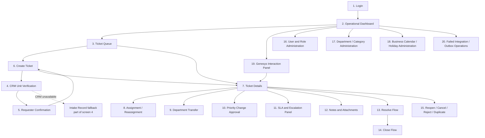
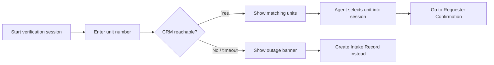

# Tiger Group — CS Ticketing System
## MVP UI Wireframes

| | |
|---|---|
| **Status** | Design for review — low-fidelity structural specs only |
| **Scope** | 20 screens needed for the full approved MVP design. Every screen is described structurally (layout regions, fields, actions, states) plus a Mermaid diagram where a flow or layout benefits from one. **No ASCII-art wireframes are used anywhere in this document.** This document describes the complete approved UI design; `MVP-Implementation-Backlog.md` decides which parts of it are built within the current 4-week, 1-developer pilot — see the pilot-scope notes on screens 10a/10b. |
| **Explicitly not done here** | No high-fidelity visual design, no color/typography/branding decisions, no actual HTML/CSS/component code, no design-tool files. |
| **Base** | `main` @ `4fe6f19`; refines `docs/design/MVP-API-Contracts.md` and `docs/design/MVP-ERD.md` |
| **Related documents** | `docs/design/MVP-API-Contracts.md` (every screen's actions map to an endpoint there) · `docs/architecture/Security-Architecture.md` §3 (roles) · `docs/architecture/SLA-Architecture.md` |
| **Date** | 2026-08-18 |

---

## 0. Conventions

- **Roles** referenced below use the same names as `MVP-API-Contracts.md` §0: Agent, Supervisor, Department Head (Dept Head), CS Manager, GM, System Administrator.
- Every screen lists: Purpose, Allowed Roles, Main Layout Regions, Fields/Data Displayed, Primary Actions, Secondary Actions, Validation Rules, Loading State, Empty State, Error State, Permission-Dependent Behavior, Confirmation Dialogs, Responsive Behavior, Accessibility Considerations.
- "Practical for a pilot" governs every choice here: no decorative elements, no animation specs, no screens for Phase 2/3 features (WhatsApp, Kiosk, Social Media, Customer Portal, CSAT, advanced AI, SMS, advanced reports/KPI dashboards).
- SLA countdown displays follow ADR-0016: **state/deadline-change events only**, never a live per-second ticking countdown — the UI shows a due date/time and a coarse `SlaState` badge (`OnTrack`/`Warning`/`Breached`), refreshed on SignalR state-change events or on manual refresh, not via a client-side timer re-rendering every second.

### Screen-Flow Overview

---

## 1. Login

- **Purpose:** Authenticate staff (`MVP-API-Contracts.md` §1.1).
- **Allowed roles:** Unauthenticated (anonymous, pre-login).
- **Main layout regions:** centered single-column card — logo/header region, form region, footer region (version/help link).
- **Fields/data displayed:** Username (text input), Password (masked input).
- **Primary actions:** "Log In" (submit).
- **Secondary actions:** none at MVP (no self-service password reset UI — `[ASSUMPTION]`; reset is an admin-mediated, out-of-band process for the pilot).
- **Validation:** both fields required client-side before submit is enabled; server errors surface inline below the form, not as a field-specific error (avoids revealing which field was wrong).
- **Loading state:** submit button shows an inline spinner and disables while the request is in flight.
- **Empty state:** N/A.
- **Error state:** generic "Invalid username or password" banner on `401`; a distinct "Account locked — contact your administrator" banner on `423`.
- **Permission-dependent behavior:** none (pre-auth).
- **Confirmation dialogs:** none.
- **Responsive behavior:** form card scales to full-width on narrow viewports; no horizontal scroll.
- **Accessibility:** labeled inputs with visible `<label>` elements, error banner uses `role="alert"`, tab order Username → Password → Submit.

## 2. Operational Dashboard

- **Purpose:** Landing screen after login — at-a-glance ticket counts, SLA backlog, and quick navigation (`MVP-API-Contracts.md` §7.1–7.5).
- **Allowed roles:** All authenticated staff; content scope (own department vs. all) varies by role.
- **Main layout regions:** top nav bar (logo, current user, logout), summary-tile row (counts by status/priority), SLA backlog panel, department distribution panel (Supervisor+ only), quick-action bar (New Ticket, Genesys Panel).
- **Fields/data displayed:** ticket counts by `TicketStatus`/`PriorityId`, SLA backlog list (ticket number, priority, due date, `SlaState` badge), department distribution chart/table (Supervisor+).
- **Primary actions:** "Create Ticket" (→ screen 6), click a summary tile to jump to a filtered Ticket Queue (→ screen 3).
- **Secondary actions:** switch department scope (Supervisor+), refresh.
- **Validation:** N/A (read-only screen).
- **Loading state:** skeleton tiles while counts load; panels load independently (one slow panel doesn't block the others).
- **Empty state:** "No tickets yet" placeholder in the SLA backlog panel if the count is zero — a positive, not alarming, empty state.
- **Error state:** a panel that fails to load shows an inline retry control scoped to that panel only, not a full-page error.
- **Permission-dependent behavior:** Agent sees own-department tiles only; Supervisor+ sees a department-scope selector; department distribution panel hidden entirely below Supervisor.
- **Confirmation dialogs:** none.
- **Responsive behavior:** tile row wraps to 2 columns on narrow viewports; department distribution table becomes horizontally scrollable within its own container.
- **Accessibility:** tiles are actual buttons/links (not divs with click handlers only), `SlaState` badges carry a text label alongside color (never color alone).

## 3. Ticket Queue / List

- **Purpose:** Search, filter, and browse tickets (`MVP-API-Contracts.md` §3.2).
- **Allowed roles:** All authenticated staff; scope varies (own department default, Supervisor+ cross-department).
- **Main layout regions:** filter bar (top), results table, pagination control (bottom).
- **Fields/data displayed:** per row — `TicketNumber`, `CategoryId`/name, `PriorityId`/name, `TicketStatus`, `SlaState` badge, `CurrentOwnerEmployeeId`/name, `CreatedAtUtc`.
- **Primary actions:** click a row → Ticket Details (screen 7); "Create Ticket" button.
- **Secondary actions:** filter by department/category/priority/status/escalation/SLA state/owner; free-text search; sort by column; export is **not** included at MVP (`[ASSUMPTION]` — no stated requirement).
- **Validation:** filter combinations that yield no valid state are simply disabled in the UI (e.g., a department filter narrows the category filter's options), not submitted and rejected.
- **Loading state:** table rows replaced by skeleton rows during fetch; filter bar remains interactive.
- **Empty state:** "No tickets match these filters" with a "Clear filters" action.
- **Error state:** full-panel error message with retry if the list call fails outright.
- **Permission-dependent behavior:** department filter defaults to and is locked to the Agent's own department; Supervisor+ can open it to "All departments."
- **Confirmation dialogs:** none.
- **Responsive behavior:** table columns collapse to a card-per-row layout below a width threshold, retaining the same fields.
- **Accessibility:** table uses proper `<table>` semantics with header cells; sortable column headers expose sort state via `aria-sort`.

## 4. CRM Unit Verification

- **Purpose:** Verify a unit against the CRM before creating a ticket (`MVP-API-Contracts.md` §2.1/§2.2), with an explicit fallback path when the CRM is unavailable.
- **Allowed roles:** Agent and above.
- **Main layout regions:** search input region (unit number / property name), results list region, CRM-outage banner region (conditional).
- **Fields/data displayed:** search results — `UnitNumber`, `PropertyName`, `TowerName`, `UnitType`; on CRM outage, a banner explaining fallback and a link into the Intake Record flow.
- **Primary actions:** search; select a unit → advances to Requester Confirmation (screen 5).
- **Secondary actions:** "Create Intake Record instead" (visible only when the outage banner is showing).
- **Validation:** search requires at least a unit number or property name.
- **Loading state:** inline spinner in the results region while searching.
- **Empty state:** "No matching units found — check the number and try again."
- **Error state:** on `502`/`504` (CRM unavailable, `MVP-API-Contracts.md` §2.1), the screen does **not** show a bare error — it shows the outage banner and fallback action as a first-class path, not an afterthought.
- **Permission-dependent behavior:** none beyond base role gate.
- **Confirmation dialogs:** none.
- **Responsive behavior:** results list stacks vertically on narrow viewports.
- **Accessibility:** outage banner uses `role="status"` (informational, not alarming) rather than `role="alert"`, since it's an expected, handled condition with a clear next step.

**Corrected in the senior-architecture-review pass (Finding DR-01):** screens 4–6 now drive a `VerificationSessions` resource (`MVP-API-Contracts.md` §2.4.1–§2.4.4) instead of a single implicit "verified in this session" assumption. Entering this flow silently starts a session (§2.4.1) before the unit search box is even shown; the session ID is carried through screens 4–6 as hidden state.

## 5. Requester/Contact Confirmation

- **Purpose:** Confirm which CRM-recorded contact the agent is speaking to, and capture the immutable snapshot into the open `VerificationSessions` resource (`MVP-API-Contracts.md` §2.4.2/§2.4.3) — **not** a standalone per-ticket confirmation, since no ticket exists yet at this point (the circular dependency this replaces is documented in `MVP-ERD.md` §2.24).
- **Allowed roles:** Agent and above.
- **Main layout regions:** selected-unit summary (read-only, from screen 4), contact list region, verbal-confirmation checkbox region.
- **Fields/data displayed:** unit summary; contact list with `DisplayName`, `ContactType` (Owner/Tenant/Representative), `ContactChannel`.
- **Primary actions:** select a contact (calls §2.4.2, recording the selection against the session), check "Confirmed verbally" and submit (calls §2.4.3, capturing the snapshot and advancing the session to `Confirmed`), continue to Create Ticket (screen 6).
- **Secondary actions:** "Back" to unit search (screen 4) — the session's `UnitReferenceId` may be reselected as long as the session hasn't been confirmed/consumed yet.
- **Validation:** cannot continue until a contact is selected **and** the verbal-confirmation checkbox is checked — this is a hard client-side gate mirroring the API's `ConfirmedVerbally: required = true` (§2.4.3). A session that has expired (`ExpiresAtUtc` passed, `[ASSUMPTION]` 30 minutes from session start) shows a distinct "This verification has timed out — please start again" state rather than a generic error, since restarting is the correct, expected recovery, not a failure.
- **Loading state:** contact list shows a skeleton while loading.
- **Error state:** `502`/`504` shows the same outage-banner-with-fallback pattern as screen 4; a `410 Gone` (expired session) shows the timeout state described above, not a generic error banner.
- **Permission-dependent behavior:** a `Representative` contact type shows an additional "Authorized by" sub-line (`AuthorizedRepresentativeOfContactId`) so the agent can visually verify the authorization chain before disclosing details (ISSUE-007). **The session belongs to exactly the agent who started it** (`MVP-ERD.md` §2.24) — this screen never needs a "whose session is this" check since only the owning agent's client ever holds the session ID.
- **Confirmation dialogs:** none additional — the checkbox itself is the confirmation gesture.
- **Responsive behavior:** contact cards stack single-column on narrow viewports.
- **Accessibility:** the verbal-confirmation checkbox has an explicit, unambiguous label (not just an icon), since it gates a compliance-relevant action.

## 6. Create Ticket

- **Purpose:** Create a new ticket from a confirmed `VerificationSessions` resource (`MVP-API-Contracts.md` §3.1, redesigned per Finding DR-01).
- **Allowed roles:** Agent and above.
- **Main layout regions:** verified-context summary (unit + contact, read-only, carried from the confirmed session via screens 4–5), ticket-details form, submit bar.
- **Fields/data displayed/entered:** Category (dropdown, filtered by active categories), Priority (dropdown: Critical/High/Medium/Low), Request Summary (multi-line text, ≤2000 chars with a live character count), optional Genesys interaction link (auto-populated if arriving from screen 19). **The unit/contact fields are never directly editable here** — they are read-only, sourced from the session, and the request this screen submits carries only `VerificationSessionId`, not `UnitReferenceId`/`ContactReferenceId` directly.
- **Primary actions:** "Create Ticket."
- **Secondary actions:** "Cancel" (discards, returns to Queue) — **the session is not consumed if the agent cancels here**, so `[ASSUMPTION]` a cancelled session remains usable (subject to its own expiry) if the agent returns to complete the ticket later, rather than being invalidated by navigating away.
- **Validation:** Category, Priority, and Request Summary all required; Request Summary length-limited with visible remaining-character count; submit button disabled until valid. A `409`/`410` (session already consumed by another ticket, or expired between confirmation and this screen) shows a clear "This verification is no longer valid — please verify again" state and routes back to screen 4, rather than a generic error.
- **Loading state:** submit button shows spinner and disables during the create call (idempotency key generated client-side per `MVP-API-Contracts.md` §3.1, so a slow response followed by a retry never double-creates — this is a separate concern from the session's own one-time-use rule).
- **Empty state:** N/A (a form).
- **Error state:** `404`/`422` validation errors surface inline next to the relevant field via the ProblemDetails `errors` map.
- **Permission-dependent behavior:** none beyond base role gate.
- **Confirmation dialogs:** "Cancel" with unsaved changes prompts "Discard this ticket?" before navigating away.
- **Responsive behavior:** form fields stack single-column; verified-context summary collapses to a compact strip on narrow viewports.
- **Accessibility:** character-count live region uses `aria-live="polite"` so screen readers announce remaining length without interrupting typing.

## 7. Ticket Details

- **Purpose:** The central hub screen — full ticket detail, timeline, and entry points to every ticket action (`MVP-API-Contracts.md` §3.3/§3.13).
- **Allowed roles:** Agent and above.
- **Main layout regions:** header strip (TicketNumber, TicketStatus, SlaState badge, PriorityId), left column (requester/unit summary, category, assignment), right column (SLA panel summary — links to screen 11), tabbed lower region (Timeline / Notes / Attachments — links to screen 12), action bar (context-sensitive buttons for Assign, Transfer, Resolve, etc.).
- **Fields/data displayed:** everything in `TicketDetailResponse` (`MVP-API-Contracts.md` §3.3) — snapshot, current assignment, current resolution (if any), open escalations, attachment/note counts.
- **Primary actions:** vary by `TicketStatus`/role — Assign/Reassign, Transfer, Resolve, Close, Reopen, Add Note, Upload Attachment.
- **Secondary actions:** copy ticket number, print/export is **not** included at MVP.
- **Validation:** action buttons are disabled (not hidden) with a tooltip explaining why, when the current state doesn't permit them (e.g., "Close" disabled until resolved) — this keeps the state machine visible rather than mysterious.
- **Loading state:** header strip loads first (fastest query), body regions show skeletons independently.
- **Empty state:** N/A (a ticket always has core data).
- **Error state:** `404` (ticket not found/no access) shows a dedicated "Ticket not found or you don't have access" page, not a blank screen.
- **Permission-dependent behavior:** action bar buttons are filtered by role per `MVP-API-Contracts.md` (e.g., reassigning another agent's ticket needs Supervisor+; `ManualLevel4` escalation needs CS Manager/GM).
- **Confirmation dialogs:** most destructive-feeling actions (Cancel, Reject, Transfer) show a confirmation dialog summarizing the effect before submitting.
- **Responsive behavior:** two-column layout collapses to a single stacked column, with the SLA panel summary moving directly under the header strip (kept high-visibility even when stacked).
- **Accessibility:** the header strip's `SlaState` and `TicketStatus` badges are announced via visually-hidden text alongside color/icon.

## 8. Assignment / Reassignment

- **Purpose:** Assign or reassign a ticket to an employee (`MVP-API-Contracts.md` §3.5).
- **Allowed roles:** Agent and above (self-claim only, own department); Supervisor+ (reassign anyone).
- **Main layout regions:** modal/panel over Ticket Details — employee picker region, current-assignment summary region.
- **Fields/data displayed:** current owner (if any), searchable employee list scoped to the ticket's `CurrentDepartmentId` (`MVP-API-Contracts.md` §1.4).
- **Primary actions:** "Assign" / "Reassign."
- **Secondary actions:** "Cancel."
- **Validation:** target employee must be an active member of the ticket's current department (`422` otherwise, surfaced inline).
- **Loading state:** employee list shows a skeleton while loading.
- **Empty state:** "No active staff in this department" (rare, but handled) with a link to department administration (screen 17), Supervisor+ only.
- **Error state:** inline banner on failure, modal stays open so the action can be retried.
- **Permission-dependent behavior:** Agent sees only "assign to me" as a one-click action when the ticket is unassigned; the full picker is Supervisor+ only.
- **Confirmation dialogs:** reassigning a ticket away from its current owner shows "This will reassign the ticket from {current owner}. Continue?"
- **Responsive behavior:** modal becomes a full-screen sheet on narrow viewports.
- **Accessibility:** employee picker is a searchable combobox with proper `aria-activedescendant` handling, not a bare `<select>` (department rosters can be long).

## 9. Department Transfer and Approval

- **Purpose:** Transfer a ticket to a different department (`MVP-API-Contracts.md` §3.6).
- **Allowed roles:** Supervisor+ in the current department.
- **Main layout regions:** modal/panel — target-department picker, reason text area.
- **Fields/data displayed:** current department (read-only), target department dropdown (active departments only), reason (required text).
- **Primary actions:** "Transfer."
- **Secondary actions:** "Cancel."
- **Validation:** target department required and must differ from current; reason required (non-empty).
- **Loading state:** submit spinner.
- **Empty state:** N/A.
- **Error state:** inline banner; `422` (same department) surfaces as a field-level error on the picker.
- **Permission-dependent behavior:** button/entry point hidden entirely below Supervisor.
- **Confirmation dialogs:** "Transferring will clear the current assignment — {receiving department} will need to claim it. Continue?" (reflects the API's side effect, `MVP-API-Contracts.md` §3.6).
- **Responsive behavior:** modal → full-screen sheet on narrow viewports.
- **Accessibility:** reason field has a visible character-remaining indicator if a max length is enforced; error summary announced via `aria-live`.

## 10. Priority Upgrade / Downgrade Request and Approval

**Redesigned in the senior-architecture-review pass (Finding DR-05).** The original design let the requesting Agent's own form pick the approver (a self-authorization defect) via a "co-sign" field. This is now two distinct screens/states for two distinct actors — an Agent never sees or fills in any field naming who approves; a Dept Head+ acts only from their own authenticated inbox.

**Pilot-scope restriction:** "Priority is fixed after ticket creation during the pilot. Downgrades are not permitted. The approved downgrade-request and approval design remains documented for the post-pilot phase." Screens 10a and 10b below are the **complete, approved post-pilot design** and are retained in full, not deleted. For the current 4-week/1-developer pilot (`MVP-Implementation-Backlog.md` S-14, S-24), only 10a's **upgrade** action is built; 10a's downgrade-request action and the entirety of screen 10b **do not exist in the pilot build** — not as a disabled button, simply absent, since no server-side capability backs them during the pilot. The SLA/Escalation Panel (screen 11) displays the pilot-restriction notice verbatim wherever a priority-change action would otherwise appear.

### 10a. Priority Upgrade (immediate) / Downgrade Request (Agent-facing)

- **Purpose:** Change ticket priority upward immediately, or (post-pilot design only) submit a downgrade request for a Dept Head+ to decide (`MVP-API-Contracts.md` §5.5, §5.6.1). **In the current pilot build, only the upgrade path exists** — see the pilot-scope restriction above screen 10a.
- **Allowed roles:** Agent and above.
- **Main layout regions:** modal/panel — current-priority display, new-priority picker, reason field (required for decrease, optional for increase — **pilot build: the picker only offers higher-urgency values; a decrease is not a selectable option at all**). **No approver field of any kind** — this is the specific element removed by this redesign.
- **Fields/data displayed:** current `PriorityId`, current SLA due dates (context for why this matters), new priority selection.
- **Primary actions:** "Upgrade" (immediate, §5.5) — built in the pilot. "Submit Downgrade Request" (post-pilot design only: creates a `Pending` request, §5.6.1 — never applies immediately, regardless of the acting user's own role, since approval is always a separate action performed from screen 10b) — **not present in the pilot build**.
- **Secondary actions:** "Cancel"; "View request status" (if a request is already pending for this ticket, links to a read-only status view instead of allowing a second submission).
- **Validation:** decrease requires a reason; submitting a second downgrade request while one is already `Pending` is blocked client-side (mirroring the API's `409`) with a link to the existing request's status, not a duplicate submission.
- **Loading state:** submit spinner.
- **Empty state:** N/A.
- **Error state:** `409` (already-pending request) shown as above; `422` (not a genuine decrease/increase) as an inline field error.
- **Permission-dependent behavior:** none — this screen is identical regardless of the acting Agent's role, since it never grants approval itself.
- **Confirmation dialogs:** upgrade shows "New due date will be the earlier of the current and new-priority deadlines" as an informational note, not a blocking confirmation; downgrade-request submission shows "This request will be sent to a Department Head for approval and will expire in 24 hours if not decided" (reflects the request's `ExpiresAtUtc`, `MVP-ERD.md` §2.27) before submit.
- **Responsive behavior:** modal → full-screen sheet on narrow viewports.
- **Accessibility:** the ADR-0012 breach-preservation notice (see 10b) is always visible text, not a tooltip-only disclosure, given its compliance relevance.

### 10b. Priority Downgrade Approval Inbox (Dept Head+-facing)

- **Purpose:** Let a Dept Head+ review and decide pending downgrade requests for tickets in departments they have authority over (`MVP-API-Contracts.md` §5.6.3–§5.6.5).
- **Allowed roles:** Dept Head and above.
- **Main layout regions:** pending-requests list (ticket number, current/requested priority, reason, requester, age), detail panel for the selected request, approve/reject action bar.
- **Fields/data displayed:** everything needed to decide without a separate ticket lookup — `TicketNumber`, `CurrentPriorityId`, `RequestedPriorityId`, `Reason`, `RequestedByEmployeeId`/name, `RequestedAtUtc`, time remaining until `ExpiresAtUtc`.
- **Primary actions:** "Approve" (§5.6.4), "Reject" (§5.6.5, requires a `DecisionNote`).
- **Secondary actions:** none.
- **Validation:** `409` (already decided/expired by the time this Dept Head acts — a race with another approver, or the request timing out) surfaces as "This request is no longer pending" and removes it from the list, rather than a generic failure.
- **Loading state:** list skeleton.
- **Empty state:** "No pending downgrade requests" — a positive, expected state, not an error.
- **Error state:** inline banner per action; the `409` race case above is the one most worth designing for explicitly, since two Dept Heads viewing the same inbox is a realistic scenario.
- **Permission-dependent behavior:** the list is scoped to departments the acting Dept Head actually has authority over — never shows another department's pending requests for departments outside their scope.
- **Confirmation dialogs:** approval shows "Any existing SLA breach on this ticket is preserved and will not be cleared by this approval" (reflects ADR-0012) before submitting — the same invariant the original single-screen design stated, now shown at the point where approval actually happens rather than at request time.
- **Responsive behavior:** list/detail split collapses to drill-in navigation on narrow viewports, matching screen 16's pattern.
- **Accessibility:** the breach-preservation notice is always visible text, not a tooltip-only disclosure, given its compliance relevance; the approver's own identity is never a form field anywhere on this screen — it is implicit from being logged in, and the UI does not need to display or confirm it back to the user beyond the normal "logged in as" indicator already in the app shell.

## 11. SLA and Escalation Panel

- **Purpose:** Detailed SLA status and escalation history/actions for a ticket (`MVP-API-Contracts.md` §5.1–5.9) — core, committed pilot functionality (`MVP-Implementation-Backlog.md` §0.2, S-24), not deferred.
- **Allowed roles:** view — Agent and above; manual-escalate — Agent and above (owner or Supervisor+); `ManualLevel4` — CS Manager/GM only. Pause/resume is a **stretch item** (`MVP-Implementation-Backlog.md` §2.6) — not present in the pilot build.
- **Main layout regions:** SLA summary region (First Response / Resolution due dates, `SlaState` badges), escalation history region, action bar. **Pause history region is a post-pilot design element, not built in the pilot** (SLA pause/resume is stretch).
- **Fields/data displayed:** `FirstResponseDueAtUtc`/`Breached`, `ResolutionDueAtUtc`/`Breached`, escalation list (`Level`, `TriggerType`, `RaisedAtUtc`, response status). `IsCurrentlyPaused`/`TotalPausedMinutesThisPeriod` are post-pilot fields, not populated in the pilot build.
- **Primary actions:** "Record First Response" (if not yet recorded), "Escalate" (manual flag, or Level 4 for CS Manager/GM), "Upgrade Priority" (screen 10a). **"Pause"/"Resume" are not present in the pilot build** (stretch item).
- **Priority-downgrade notice:** this panel displays, as visible text (not a tooltip), wherever a priority-change action appears: **"Priority is fixed after ticket creation during the pilot. Downgrades are not permitted. The approved downgrade-request and approval design remains documented for the post-pilot phase."** No downgrade action or entry point appears anywhere on this screen.
- **Secondary actions:** "Respond" on an open escalation (for the notified role-holder).
- **Validation:** the pilot build's automatic escalation is Level 2-on-breach only (`MVP-Implementation-Backlog.md` S-11) — the timed Level 2→3 auto-advance is a stretch item; this panel does not display a "time until auto-advance" countdown for Level 2, since no such job exists in the pilot build. Critical-never-pauses is moot in the pilot build (nothing pauses at all yet, since pause/resume itself is stretch) — not silently violated, simply not applicable.
- **Loading state:** summary region and history regions load independently with their own skeletons.
- **Empty state:** "No escalations on this ticket" in the escalation history region — a neutral, expected state.
- **Error state:** inline banners per action; the summary region shows a "Could not load SLA status" retry state if that specific fetch fails.
- **Permission-dependent behavior:** "Escalate → Level 4" option in the escalate dropdown is present but disabled with a tooltip for non-CS-Manager/GM users, rather than hidden — so staff understand the escalation path exists even if they can't invoke it.
- **Confirmation dialogs:** manual escalation shows a confirmation summarizing who will be notified (`NotifiedRoles`) before submitting.
- **Responsive behavior:** the three regions stack vertically on narrow viewports, summary region first.
- **Accessibility:** breached/warning states use both a badge color and an explicit text label ("Breached," "Warning," "On Track") — never color alone, consistent with the dashboard's badge convention (screen 2).

## 12. Notes and Attachments

- **Purpose:** Add/view notes and manage attachments (`MVP-API-Contracts.md` §4.1–4.6).
- **Allowed roles:** view/add note, upload/download attachment — Agent and above; withdraw attachment — uploader (within window) or Supervisor+.
- **Main layout regions:** tab or split region within Ticket Details (screen 7) — Notes list + add-note composer; Attachments list + upload control.
- **Fields/data displayed:** notes (`NoteText`, `AuthorEmployeeId`/name, `CreatedAtUtc`), attachments (`FileName`, `SizeBytes`, `VirusScanStatus`, `UploadedByEmployeeId`/name, `UploadedAtUtc`). **Withdrawn attachments (`IsWithdrawn = true`) are excluded from this list entirely** (Finding DR-06) — their row is retained for audit purposes but not surfaced here.
- **Primary actions:** "Add Note," "Upload File."
- **Secondary actions:** "Download" (attachment, only if `VirusScanStatus = Clean` and not withdrawn), "Withdraw" (attachment, where permitted — **corrected in the senior-architecture-review pass, Finding DR-06: this revokes access and reason-tags the file; it does not delete the underlying metadata row**, unlike the original design's physical delete).
- **Validation:** note text required, non-empty; file upload enforces size (≤25MB) and type allow-list client-side before submit, mirroring the server's rules (`MVP-API-Contracts.md` §4.3) so the user isn't surprised by a server rejection after a slow upload; withdrawal requires a reason (no longer optional, since it's now a permanent, audit-visible action rather than an erasure).
- **Loading state:** upload shows a progress indicator; note composer disables submit while posting.
- **Empty state:** "No notes yet" / "No attachments yet," each with the relevant add/upload action inline so the empty state isn't a dead end.
- **Error state:** `413`/`415`/`422` upload errors show a specific inline message (too large / wrong type / attachment limit reached) rather than a generic failure.
- **Permission-dependent behavior:** a `Pending`-scan attachment shows a "Scanning..." badge and its Download action is disabled with a tooltip; a `Rejected`-scan attachment shows a clear "Rejected — file could not be verified safe" state and is never downloadable by anyone, including Supervisor+.
- **Confirmation dialogs:** "Withdraw attachment" asks for confirmation and a reason, naming the file, and states that the file will no longer be accessible to anyone but that its record is retained (sets expectations correctly, since this is no longer a delete).
- **Responsive behavior:** notes/attachments lists scroll independently within a bounded-height region rather than growing the whole page indefinitely.
- **Accessibility:** upload control is keyboard-operable (not drag-and-drop-only); scan-status badges include text, not just an icon.

## 13. Resolve Flow

- **Purpose:** Resolve a ticket (`MVP-API-Contracts.md` §3.9).
- **Allowed roles:** Agent and above (owner) or Supervisor+.
- **Main layout regions:** modal/panel — outcome selector, resolution note composer, conditional fields region (reason code / duplicate-of picker).
- **Fields/data displayed:** `ResolutionOutcome` options (Resolved/Cancelled/Rejected/Duplicate), `ResolutionNote` (required, ≤4000 chars), `ReasonCode` (shown only for Cancelled/Rejected), `DuplicateOfTicketId` picker (shown only for Duplicate).
- **Primary actions:** "Resolve Ticket."
- **Secondary actions:** "Cancel."
- **Validation:** `ResolutionNote` required regardless of outcome (BR-011); conditional fields become required only when their triggering outcome is selected; duplicate-of ticket picker rejects selecting a ticket that is itself already a duplicate, inline, before submit.
- **Loading state:** submit spinner.
- **Empty state:** N/A.
- **Error state:** inline field errors from the ProblemDetails `errors` map.
- **Permission-dependent behavior:** none beyond the base owner/Supervisor+ gate.
- **Confirmation dialogs:** none beyond the form submission itself (the note requirement already forces deliberate input).
- **Responsive behavior:** modal → full-screen sheet on narrow viewports.
- **Accessibility:** outcome selector uses radio buttons (not a dropdown), since the choice materially changes the rest of the form — all options should be visible at once.

## 14. Close Flow

- **Purpose:** Final close after resolution (`MVP-API-Contracts.md` §3.10).
- **Allowed roles:** Agent and above (owner) or Supervisor+.
- **Main layout regions:** simple confirmation panel — resolution summary (read-only, from the current `TicketResolutions` row), close button.
- **Fields/data displayed:** `ResolutionOutcome`, `ResolutionNote`, `ResolvedAtUtc`, resolving employee.
- **Primary actions:** "Close Ticket."
- **Secondary actions:** "Cancel."
- **Validation:** button disabled if there's no current resolution (`409` avoided proactively — mirrors §3.10's validation).
- **Loading state:** submit spinner.
- **Empty state:** if somehow reached without a resolution present, shows "This ticket must be resolved before it can be closed" with a link back to screen 13, instead of a disabled dead-end.
- **Error state:** inline banner on failure.
- **Permission-dependent behavior:** none beyond base gate.
- **Confirmation dialogs:** "Close this ticket? This can be reopened later if needed" (sets expectations about reversibility).
- **Responsive behavior:** single-column panel, no layout changes needed at narrow widths.
- **Accessibility:** resolution summary presented as definition-list markup for clear label/value association.

## 15. Reopen / Cancel / Reject / Duplicate Flow

- **Purpose:** Cover the remaining terminal-adjacent actions — Reopen (`MVP-API-Contracts.md` §3.11) and the duplicate recommend/confirm flow (§3.12); Cancel/Reject are handled inside screen 13's outcome selector, referenced here for completeness.
- **Allowed roles:** Reopen — Agent and above (or Supervisor+, per policy); duplicate confirm — Supervisor+; duplicate recommend — Agent and above.
- **Main layout regions:** modal/panel — action-specific: Reopen shows a reason field; Duplicate flag shows a target-ticket picker plus an action selector (Recommend/Confirm/Reject).
- **Fields/data displayed:** for Reopen — current `ResolutionOutcome`/`ReopenCount` (read-only context); for Duplicate — candidate ticket search/picker, current `DuplicateFlagStatus`.
- **Primary actions:** "Reopen Ticket" / "Recommend Duplicate" / "Confirm Duplicate" / "Reject Duplicate Flag."
- **Secondary actions:** "Cancel."
- **Validation:** Reopen requires a reason; Duplicate confirm/reject only enabled when the ticket is currently in `Recommended` state (`403` otherwise, avoided by disabling rather than hiding, with a tooltip).
- **Loading state:** submit spinner.
- **Empty state:** N/A.
- **Error state:** inline banners.
- **Permission-dependent behavior:** "Confirm"/"Reject" buttons hidden for Agents on a recommended-duplicate ticket, visible for Supervisor+.
- **Confirmation dialogs:** Reopen shows "This will increase the reopen count and restart SLA tracking for this ticket" (`[ASSUMPTION]` flag carried from `MVP-API-Contracts.md` §3.11 — the note is shown precisely because this behavior is itself an assumption, not confirmed policy) so the acting user isn't surprised.
- **Responsive behavior:** modal → full-screen sheet on narrow viewports.
- **Accessibility:** the assumption-flagged reopen notice is rendered as visible text, not hidden behind a help icon, given its consequence.

## 16. User and Role Administration

- **Purpose:** Manage staff accounts, activation, department assignments, and (**added in the senior-architecture-review pass, Finding DR-02**) Genesys agent-identity mappings (`MVP-API-Contracts.md` §1.4–1.6, §6.6.1/§6.6.2).
- **Allowed roles:** System Administrator.
- **Main layout regions:** staff list/table (left or top), detail/edit panel (right or below, for the selected employee) — department assignment sub-region, role display sub-region, activation toggle, **Genesys agent-mapping sub-region (`GenesysAgentId`/`AgentEmailOrExtension` fields, `IsActive` toggle)**.
- **Fields/data displayed:** `DisplayName`, `Roles`, `Departments` (with primary flag), `IsActive`/`DeactivatedAtUtc`, and the selected employee's `GenesysAgentMappings` row if one exists.
- **Primary actions:** activate/deactivate a selected employee; edit department assignments (add/remove, change primary); upsert or deactivate the employee's Genesys agent mapping (§6.6.1/§6.6.2) — this replaces the original design's implication that agent-mapping administration lived on screen 20 (it did not have a concrete home there; this is that home).
- **Secondary actions:** search/filter the staff list.
- **Validation:** cannot deactivate the last active System Administrator (`409`, `MVP-API-Contracts.md` §1.6) — surfaced inline, not silently blocked.
- **Loading state:** table skeleton; detail panel skeleton independently.
- **Empty state:** N/A (staff list is never empty in practice).
- **Error state:** inline banner in the detail panel on save failure.
- **Permission-dependent behavior:** entire screen is unreachable (route-guarded) below System Administrator.
- **Confirmation dialogs:** deactivating an employee who owns open tickets shows "{employee} currently owns {N} open ticket(s). They will need to be reassigned separately." (surfacing `AffectedOpenTicketCount` from `MVP-API-Contracts.md` §1.6) before confirming.
- **Responsive behavior:** list/detail split collapses to a single-panel, drill-in navigation on narrow viewports.
- **Accessibility:** the last-admin block message is a clear, specific sentence, not a generic "action not allowed."

## 17. Department and Category Administration

- **Purpose:** Manage departments and the category tree that routes tickets to them (`MVP-ERD.md` §2.3/§2.5 — no dedicated CRUD endpoints were specified in `MVP-API-Contracts.md`'s per-module list, so this screen is scoped to what's implied by those entities' admin ownership; flagged `[ASSUMPTION]` that basic CRUD for these reference tables is in MVP scope at all, since `MVP-API-Contracts.md` did not enumerate department/category admin endpoints explicitly — if confirmed out of scope, this screen reduces to read-only reference display).
- **Allowed roles:** System Administrator.
- **Main layout regions:** department list/table, category tree view (nested, one level deep per `MVP-ERD.md` §2.5's no-two-level-nesting rule), edit panel.
- **Fields/data displayed:** `Name`, `Code`, `IsActive` (departments); `Name`, `ParentCategoryId`, `DepartmentId`, `IsActive` (categories).
- **Primary actions:** create/edit a department or category; deactivate (never hard-delete, per `MVP-ERD.md` §2.3/§2.5's Restrict rules).
- **Secondary actions:** search/filter.
- **Validation:** category parent must itself be a top-level category (no deeper nesting) — enforced in the picker by only offering top-level categories as parent options.
- **Loading state:** tree/list skeletons.
- **Empty state:** N/A for departments; a department with zero categories shows "No categories yet" with a create action.
- **Error state:** inline banner; attempting to deactivate a department/category still referenced by tickets shows the Restrict-behavior message plainly ("Cannot delete — in use. Deactivate instead.").
- **Permission-dependent behavior:** route-guarded to System Administrator.
- **Confirmation dialogs:** deactivation confirmation naming the entity.
- **Responsive behavior:** tree view becomes an indented flat list on narrow viewports rather than a true nested tree control.
- **Accessibility:** category tree uses proper `aria-expanded`/`aria-level` semantics if implemented as a tree widget, or a clearly-indented flat list otherwise.

## 18. Business Calendar and Holiday Administration

- **Purpose:** Manage the SLA business calendar and holidays (`MVP-API-Contracts.md` §5.10–5.12).
- **Allowed roles:** System Administrator (enter/edit calendar and holidays); business-owner confirmation role per §5.12's flagged assumption (modeled here as Supervisor+ in Customer Service, pending clarification).
- **Main layout regions:** calendar summary region (working days, hours, time zone), holiday list region, add-holiday form region.
- **Fields/data displayed:** `BusinessDayStartLocal`/`EndLocal`, `TimeZone`, per-day `IsWorkingDay` grid, holiday list (`HolidayDate`, `Description`, entered-by, confirmed-by/status).
- **Primary actions:** "Add Holiday"; "Confirm Holiday" (business-owner role only, on unconfirmed holidays).
- **Secondary actions:** edit calendar hours/time zone (`[ASSUMPTION]` — no explicit endpoint enumerated for this in `MVP-API-Contracts.md`; flagged the same way as screen 17).
- **Validation:** holiday date must not already exist for the calendar (`409`, surfaced inline on the date field).
- **Loading state:** section skeletons.
- **Empty state:** "No holidays added yet."
- **Error state:** inline banner.
- **Permission-dependent behavior:** "Confirm Holiday" action visible only to the business-owner role; System Administrator sees holidays' confirmation status but not the confirm action itself (separation of entry vs. confirmation, per the open question in `MVP-ERD.md` §2.20).
- **Confirmation dialogs:** none beyond the add-holiday form submission.
- **Responsive behavior:** working-day grid becomes a vertical list of day/toggle pairs on narrow viewports.
- **Accessibility:** the unconfirmed-holiday status is shown as explicit text ("Pending confirmation"), not merely an icon, given it may affect SLA computation.

## 19. Genesys Interaction Panel

- **Purpose:** Operational view of incoming/recent Genesys interactions and manual linking to tickets (`MVP-API-Contracts.md` §6.2/§6.3) — **core, committed pilot functionality** (`MVP-Implementation-Backlog.md` §0/§3/S-17), built against the confirmed Tiger/Genesys contract and gated by a feature flag for operational safety, not scope exclusion. This screen is inert while the flag is off (no interactions will ever arrive) but is fully built and testable regardless of the flag's state.
- **Allowed roles:** Agent and above.
- **Main layout regions:** live/recent interaction list, detail region for a selected interaction, link-to-ticket action region.
- **Fields/data displayed:** `ConversationId`, masked `CallerNumber`, `GenesysAgentId`/mapped employee (if resolved via `GenesysAgentMappings`, Finding DR-02), `StartedAtUtc`/`AnsweredAtUtc`/`EndedAtUtc`, `LinkedTicketId` (if any), `ProcessingStatus`, and — **corrected in the senior-architecture-review pass (Finding DR-03)** — an expandable events sub-list (`GenesysInteractionEvents`: `EventType`, `ReceivedAtUtc`, per-event `ProcessingStatus`), since one interaction row now represents potentially several received events, not one.
- **Primary actions:** "Link to Ticket" (opens a ticket picker or "Create New Ticket" which pre-fills the Genesys link on screen 6); "Create New Ticket from this call."
- **Secondary actions:** refresh; filter by linked/unlinked.
- **Validation:** linking to a ticket already linked to a different interaction is blocked client-side with an explanatory message before the API's `409` would even be hit.
- **Loading state:** list skeleton; updates arrive via SignalR state-change events rather than polling (ADR-0016) where the call is actively in progress.
- **Empty state:** "No recent Genesys interactions."
- **Error state:** an interaction with any **dead-lettered** event is shown with a distinct visual state and a link to screen 20. **Corrected in this review pass (Finding DR-04): there is no `Rejected` state to show here** — a signature-failed request is never persisted at all (`Genesys-Mock-Contract.md` §3), so it can never appear in this list; only genuinely-accepted-then-failed-downstream events reach a dead-lettered state.
- **Permission-dependent behavior:** none beyond base role gate (retry actions live in screen 20; Genesys agent-mapping administration lives in screen 16, per Finding DR-02 — both System-Administrator-only).
- **Confirmation dialogs:** none beyond the link-conflict block above.
- **Responsive behavior:** list/detail split collapses to drill-in navigation on narrow viewports, matching screen 16's pattern.
- **Accessibility:** masked phone numbers are rendered with a visible "masked" indicator so staff understand they're not seeing the full number, not left to guess why it's partial.

## 20. Failed Integration / Outbox Operations

- **Purpose:** Operational visibility and manual retry for failed **Genesys events** (per-event, not per-conversation — Finding DR-03) and, more broadly, dead-lettered Outbox messages (`MVP-API-Contracts.md` §6.4/§6.5). **This screen never shows signature-rejected requests** (Finding DR-04) — those are never persisted; a run of signature failures is visible only via security-log/ops monitoring outside this application. **The retry action itself is a stretch item for the pilot** (`MVP-Implementation-Backlog.md` §2.6) — failed Genesys events are visible in logs/audit for pilot purposes; this screen's read-only visibility of Outbox dead-letters (non-Genesys) is committed, but the Genesys-specific retry button described below is not built unless capacity allows.
- **Allowed roles:** System Administrator (full access, including retry); Supervisor+ in a Genesys-handling department (view only, per `MVP-API-Contracts.md` §6.4).
- **Main layout regions:** failed-events table, detail panel (raw error/attempt count), retry action bar.
- **Fields/data displayed:** `ConversationId` (parent interaction, for context), `EventType`, per-event `ProcessingStatus`, `Attempts`, `LastError`, timestamps.
- **Primary actions:** "Retry" (System Administrator only).
- **Secondary actions:** filter by status; search by `ConversationId`.
- **Validation:** "Retry" disabled (not hidden, for Supervisor+ viewers — shown but disabled with a tooltip explaining the role requirement) when the acting user isn't System Administrator; disabled for entries not currently in a failed/dead-lettered state (`409` avoided proactively, mirroring `MVP-API-Contracts.md` §6.5).
- **Loading state:** table skeleton.
- **Empty state:** "No failed events" — a positive empty state, prominently reassuring given this is an operational-health screen.
- **Error state:** if the retry call itself fails, an inline error appears on that row specifically, not a full-page failure.
- **Permission-dependent behavior:** Supervisor+ sees the same table read-only; the Retry column is entirely absent for that role rather than shown-disabled, since Supervisors have no path to ever use it (distinguishing "not now" from "not your role" — the latter simply isn't shown).
- **Confirmation dialogs:** "Retry this event? It will be reprocessed from the beginning" before submitting.
- **Responsive behavior:** table collapses to card-per-row on narrow viewports, consistent with screen 3's pattern.
- **Accessibility:** `LastError` text is presented in a `<pre>`/monospace region so technical detail isn't mangled by prose-oriented styling, aiding an administrator's diagnosis.

---

## 21. What This Document Does Not Cover

No visual/graphic design (color palettes, typography, spacing scales, iconography), no component library selection, no actual markup/CSS/JavaScript/TypeScript, no design-tool artifacts (Figma files, etc.), and no screens for any Phase 2/3 feature (WhatsApp, Kiosk, Social Media, Customer Portal, CSAT survey UI, advanced AI assistance, SMS, advanced reporting/KPI dashboards, customer-facing self-service). Those remain out of this MVP pilot's scope, consistent with `docs/architecture/README.md`'s explicit exclusions.
