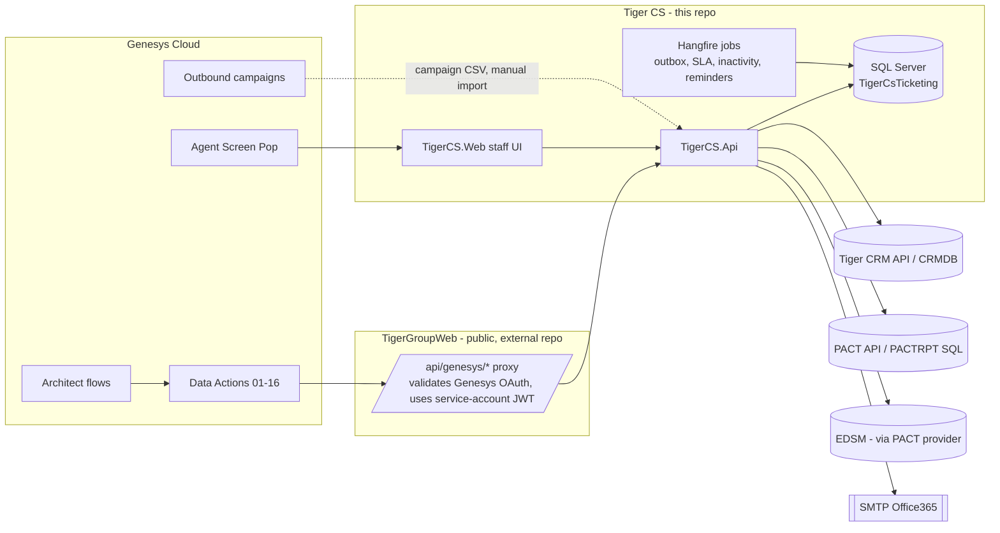

# 1. System overview, architecture and dependency map

> Part of the [Tiger CS documentation set](README.md). Baseline: `main` @ `a1cba71` (2026-10-08). Behaviour here is read from code;
> anything about TigerGroupWeb, Tiger CRM, PACT, EDSM, Genesys Cloud or SMTP is an **external assumption** unless stated otherwise.

## 1.1 Repository and release baseline

| Item | Verified state (this review) |
|---|---|
| Repository | `nidaabasem/Tiger-CS-Ticketing` — the only repository reachable from this review session |
| Authoritative branch | `main` @ `a1cba71` ("Collections Campaigns … (#77)"); review branch `claude/compassionate-tesla-albggj` |
| Open PRs at review start | none |
| PRs #72–#77 | All five **are in `main`'s history** (GitHub marks them closed with a merge timestamp): #72 unit details / inactivity reopen / gated next payment, #73 PACT Due & Overdue, #74 Genesys UAT audit + unit‑0 fix, #75 PACT apartment list, #76 closed (superseded) and #77 Campaigns (`claude/campaigns-final`) |
| Build / tests | .NET SDK 10.0.111; `dotnet test src/TigerCS.slnx` → 3216 passed on `main`; 3396 on the review branch, 0 failed (local, SQLite/fakes; **never run against SQL Server, Hangfire, or any real external system**) |
| Deployed to UAT/production | **Unknown to this review.** No deployment evidence is accessible. Every "deployed" column in the [traceability matrix](15-requirements-traceability-matrix.md) is therefore "not verified". |
| TigerGroupWeb / TigerWebsite | **Not accessible** (separate repo). Forwarding contract: [TigerGroupWeb-Proxy-Change](../Genesys/TigerGroupWeb-Proxy-Change.md) |
| Tiger CRM | **Not accessible.** Contracts: [Internal-CRM-API-Contract](../design/Internal-CRM-API-Contract.md), [CRM-Document-Operations-Requirements](../Genesys/CRM-Document-Operations-Requirements.md) |
| Mobile app | No code or contract in any accessible repo |

Other branches: ~50 `claude/*` branches exist. Most are heads of PRs that were squash‑merged (they look "unmerged" only because the squash
rewrites history). One branch held real, unmerged work — `claude/admiring-brown-73jnmx` (CRM document gateway + email‑OTP); its content
is integrated in this review PR. The remaining older branches were **not** reviewed line by line; see
[15.1](15-requirements-traceability-matrix.md#branches).

## 1.2 Solution layout (`src/TigerCS.slnx`)

| Project | Role |
|---|---|
| `TigerCS.Domain` | Entities, enums, state rules (Ticket, Workflow, SLA, Collections reminder …) |
| `TigerCS.Application` | App services, DTOs, authorization policy sets, abstractions for gateways |
| `TigerCS.Infrastructure` | EF Core (SQL Server) persistence, Identity/JWT, Hangfire jobs, outbox, e-mail |
| `TigerCS.Integrations` | HTTP/SQL gateways: CRM, PACT, Tasleeh, EDSM, CRM documents, Mock providers |
| `TigerCS.Api` | REST API (controllers, Swagger, `Program.cs`) |
| `TigerCS.Web` | Razor Pages staff UI; calls the API with the signed‑in user's JWT |
| `TigerCS.Reporting` | Reporting helpers |
| `TigerCS.Tests` | xUnit suite (3216 tests) |

## 1.3 Architecture

Module boundaries (each is a folder under `Application/Modules`, `Domain/Modules`, `Infrastructure/Modules`):
Identity & Access · Administration/WorkflowConfiguration · Customer Verification (CRM/PACT/Tasleeh lookup, verification sessions) ·
Ticketing (tickets, lifecycle, interactions, dashboard) · SLA & Escalation · Notifications/Outbox · Genesys Integration ·
Collections (reads, reminders, campaigns) · CRM Documents · Reporting.

## 1.4 Dependency map and failure behaviour

| Dependency | Used for | Config | If unavailable |
|---|---|---|---|
| SQL Server `TigerCsTicketing` | all state, Hangfire storage | `ConnectionStrings:TigerCsDatabase` | API down |
| Tiger CRM HTTP API | buyer/customer lookup, unit details (planned), documents (not built) | `Crm:*` | lookup `502 CRM_UNAVAILABLE`; documents `503` |
| PACT API | contracts by mobile, customer verification | `PactApi:*` | PACT customers unavailable; CRM still used |
| PACTRPT / CRMDB (SQL) | receivables, campaigns | `ConnectionStrings:PACTRPT`, `CrmDatabase` | Collections receivables error; Genesys reads `503` |
| EDSM | payment history/instalments | `CollectionsSource:*` | `Unavailable`; nothing derived |
| SMTP | customer e-mail, document copies | `EmailNotifications:*` | outbox retries; delivery failure recorded |
| Genesys Cloud | conversations, queues, Screen Pop | `Genesys:*` | `/api/genesys` returns `503` when disabled |
| TigerGroupWeb | only public ingress for Genesys | n/a here | Genesys calls fail; TigerCS unaffected |

See [Configuration reference](12-configuration-reference.md), [Deployment order](13-deployment-order.md) and [Troubleshooting](14-troubleshooting.md).
