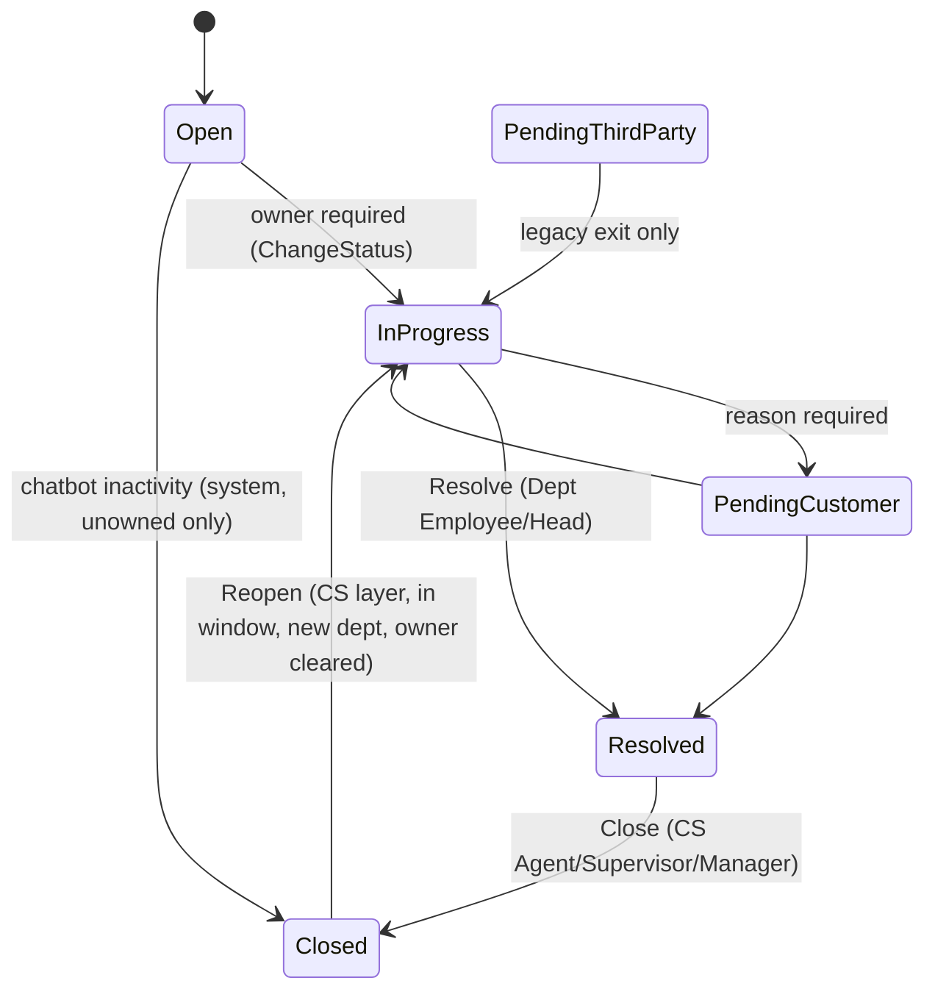

# 04 - Ticket Lifecycle, SLA, Approvals, Notifications and Work Views

Derived from code at HEAD `31878f4`. Paths relative to `src/`. **(not implemented)** = requirement area with no runtime code; **(unverified)** = not confirmable from code.

## 1. Statuses and transitions

`TicketStatus`: Open=1, InProgress=2, PendingCustomer=3, PendingThirdParty=4 (legacy), Resolved=5, Closed=6 (`TigerCS.Domain/Modules/Ticketing/TicketStatus.cs`).

Rules (`TicketStatusTransitions.cs:58-72`, `Ticket.cs:676-692, 712-723, 765-780, 834-858`):
- Generic `POST api/tickets/{id}/status` accepts only Open->InProgress, InProgress<->PendingCustomer and legacy PendingThirdParty->InProgress. Open->InProgress needs an owner (`TicketNotAssignedException`). PendingCustomer requires a reason and the workflow capability `CanGoPendingCustomer` (`TicketLifecycleAppService.cs:105-123`).
- Resolve only from InProgress or PendingCustomer. A Resolved ticket has **no generic exit** except Close (the Reopen comment says "continue the existing work item" but no transition exists; see audit F-9).
- Closed tickets are immutable (assign, transfer, status, resolve, close, first response, escalation all refuse). Reopen is the only exit.
- **Pending Third Party**: no arm of the table produces it; `ChangeStatusAsync` refuses it explicitly (`:90-93`); pickers use `ActiveStatuses`; dashboard/queue filters omit it; legacy tickets still display, count as active (`TicketQueryFilters.cs:23-39`), resume their open pending record on exit (`:163-171`) and must return to InProgress before Resolve (`Ticket.cs:704-712`). Residual config surface: see audit F-1.

### Inactivity closure and timeout
Only one automatic closure exists: **chatbot customer inactivity** (`ChatbotInactivityCloseAppService.cs`, `Ticket.CloseForCustomerInactivity` `Ticket.cs:746`). Config: `Genesys:Enabled` and `Genesys:CustomerInactivityTimeoutMinutes` (default 5; <=0 disables) (`GenesysOptions.cs`, `Api/appsettings.json`). A recurring Hangfire job (`ChatbotInactivityCloseJob`, batch 100) re-checks at fire time: integration on, timer older than timeout, conversation not ended, no open handoff, **no human owner**, status Open/InProgress/PendingCustomer. Result: Resolved then Closed in one step, outcome **Cancelled**, `ClosedForCustomerInactivity=true`, history rows `actorIsSystem`, audit `AutoCloseCustomerInactivity`, only the `TicketClosed` email. Reopenable (see section 7). `BackgroundJobs:Enabled` is `false` in the committed appsettings, so the job runs only where that is overridden. There is **no** generic auto-close of Resolved or PendingCustomer tickets owned by a human (not implemented).

## 2. Departments

- `OriginatingDepartmentId`: private setter, assigned only in the creation factory (`Ticket.cs:493`); no other writer in code, SQL or EF configuration. Write-once by construction.
- `CurrentDepartmentId`: changed only by `TransferToDepartment` (`Ticket.cs:639-650`) and `Reopen` (`:856`); both clear the owner. Visibility, assignment, approvals and handoffs use the current department.

## 3. Assignment, auto-assignment, transfer

- Manual assign (`TicketAssignmentAppService.AssignAsync`): CS Manager (any dept), CS Supervisor / Department Head (own dept only); target must be an active member of the ticket's current department; refused when department settings `AllowAssignment=false` or, for reassignment, `AllowInternalReassignment=false`; appends a superseding `TicketAssignment`; audited.
- Auto-assignment (`TicketAutoAssignmentService.ApplyAsync`): runs at creation, on Transfer (without explicit assignee) and on Reopen. Rule per request type: DepartmentQueue / Individual / Team (primary only owns). Every failure (no request type, no rule, disabled, assignee not in department) leaves the ticket in the department queue with a system audit row (null actor). Never random.
- Transfer: CS Manager only; target department active; source `AllowTransferToOtherDepartments`; optional assignee in the **target** department; **does not restart or recompute SLA** (SLA stays priority-based, department-independent).

## 4. SLA

Runtime SLA is driven only by the priority-keyed `SlaPolicies` plus the business calendar (`SlaDueDateService.cs`). Seeded (`SlaReferenceData.cs:72-84`): Critical 15 min / 4 h, 24x7; High 60 min / 24 business-hours; Medium 4 h / 3 business days (1800 min); Low 24 h / 7 business days. Calendar: Asia/Dubai, 08:00-18:00, Saturday-Thursday, Friday off, no holidays seeded.

- Clock starts at creation (classification for unclassified Genesys tickets; reconciliation for provisional CRM-outage tickets). Both deadlines scheduled as Hangfire jobs plus a safety sweep (`SlaSweepJob`).
- **First Response SLA** is satisfied only by `Ticket.FirstHumanResponseAtUtc` (write-once). Writers: (a) `POST api/tickets/{id}/sla/first-response` by the owner / supervisory role (source Manual or GenesysCallAnswer); (b) `GenesysConversationEndAppService` when the transcript contains a `HumanAgent` line, timestamp = that line. VirtualAgent, System, Customer lines, the automated acknowledgement (`AcknowledgementSentAtUtc`) and handoff acceptance never satisfy it (`FirstHumanResponseRecorder.cs`). **Gap**: no Web control calls (a) (audit F-2).
- **Resolution SLA** achieved at `TicketResolution.ResolvedAtUtc`; Close does not affect it. Resolve finalizes breaches for both clocks (`ResolveAsync:310-313`).
- Breach: idempotent key per ticket/deadline/due; marks `SlaState=Breached` (sticky), history row, audit, **automatic Level 2 escalation** once per ticket.
- **Reset on reopen**: current period ended, new Resolution cycle from reopen time using the same policy; First Response carried over, not re-armed (`StartReopenResolutionCycleAsync`). Breached stays breached.
- **Pauses**: `SlaState.Paused` is produced only for provisional unverified tickets. PendingCustomer does **not** pause the clock; request-type `PausesOnPendingCustomer`, request-type SLA layers and the admin SLA editor are stored and displayed but not consumed by the runtime calculator (not implemented; audit F-3).
- **Escalation**: manual Level 1-3 (`SlaRoleSets.ManualEscalate`), Level 4 CS Manager/GM only with `ManualLevel4` trigger; levels only rise; escalation does not change status. Timed Level 2->3 advance not built.
- **Priority change / downgrade approval**: not implemented. No endpoint changes priority after classification (initial classification is write-once, `TicketClassificationAppService`), downgrade endpoints are hard-disabled (`TicketSlaController.cs:21-36`), `RequestType.AllowAgentPriorityChange` is exposed but unused at runtime. Proposed: out of scope until the business confirms upgrade-recompute semantics.

## 5. Approvals

Types: AccountingApproval, CustomerServiceApproval, ReopenApproval (`ApprovalType.cs`). Configured per request type (`RequestTypeApprovalRequirement`); requested by operational actors (owner / department-side), decided by the target snapshot (role, employee, or department member with Dept Employee/Head). Rejection needs a comment. Approval never auto-resumes a pending ticket. Dashboard "Pending Approval" counts approvals the viewer can action.

## 6. Notifications (customer email)

Pipeline: state change writes an `OutboxMessage` in the same transaction (events `TicketCreated`, `TicketResolved`, `TicketClosed`, `TicketReopened`) -> dispatcher -> `CustomerTicketEmailHandler` -> SMTP. Rendering and sending never run inside the request.
- **Dedupe**: producer key `Ticket:{id}:{EventType}:v{ver}` for Created and `...:v{ver}:cycle{ReopenCount}` for lifecycle events (`OutboxMessage.cs:274-293`), so repeated requests collapse and each reopen cycle emails once more; consumer finds-or-creates a `Notification` row, unique on (OutboxMessageId, NotificationType); terminal rows are never re-sent.
- **Failures**: transient -> failed attempt + retry with exponential backoff; permanent -> dead-lettered + audit; skipped (disabled, no usable email, event older than `MaxNotificationAgeHours` default 24) is a successful terminal outcome with audit `NotificationSkipped`. Email failure never fails the ticket operation.
- `EmailNotifications:Enabled` is `false` by default; resolution note quoted only if `IncludeResolutionNote`. Inactivity closure sends only "closed".
- **Language**: templates are English only (`CustomerEmailTemplates.cs:195` `lang="en"`); no per-customer language. Arabic exists only in chatbot welcome content (docs/Genesys). Staff are not notified by email (`recipientEmployeeId` always null).

## 7. Reopen: policy, approval, direct, override

- Eligibility (`ReopenEligibilityService.cs:165-200`, `ReopenPolicy.cs`): status Closed; outcome Resolved (or Cancelled **only** if closed for chatbot inactivity); request type `AllowReopen` (pinned workflow version); closure moment from the latest status-history row into Closed; within `Ticketing:ReopenWindowDays` (default 7, min 1), inclusive. Distinct outcomes: NotEligible, OutcomeNotReopenable, NotAllowedForRequestType, ReopenWindowExpired.
- **Direct reopen**: CS Agent / Supervisor / Manager (and System Administrator via override) who can view the ticket's department; reason (<=1000 chars) and target active department required; row-version checked first. Effects: InProgress, department set, owner cleared, `ReopenCount++`, resolution archived, new Resolution SLA cycle, auto-assignment re-run, history + typed `Reopened` event + audit + `TicketReopened` email, all in one transaction.
- **Reopen Approval**: for roles without direct reopen (Dept Employee/Head of the current department, GM, Chairman/CEO). Requestable on a Closed ticket only when the same eligibility is `Eligible` (so never for an inactivity closure or after the window), reason mandatory, configured per request type. Granting **touches nothing on the ticket**; a CS user must still perform the reopen, and direct reopen never requires an approval (`TicketApprovalAppService.cs:50-60`). Approve is re-checked for eligibility at decision time; Reject always allowed.
- **Admin override**: System Administrator passes the role/visibility gate only; the window, outcome, request-type and concurrency rules still apply. No "reopen beyond window" path exists.

## 8. Human handoff, AI interruption, Pending Interactions

- A `TicketAgentHandoff` is the business state of pending human work (WaitingForAgent -> InProgress -> Completed/Cancelled). Raised by Genesys (`CustomerRequestedHuman`, `AiConnectionLost`, `AiEscalated`) or automatically when an AI conversation ends with no human line, no handled-by user and no open handoff on a non-Closed ticket (`GenesysConversationEndAppService.TryAutoRaiseHandoffAsync:310`), so an AI disconnect never orphans a ticket. At most one open handoff per interaction (filtered unique index).
- Accept (`AgentHandoffAppService.AcceptAsync`): caller can view the department AND must be an active member of the ticket's current department (not bypassed by System Administrator); claims exclusively, assigns the ticket, Open->InProgress, one transaction; does **not** record First Response. Cancel when the AI reconnects.
- Unavailable agents / routing: TigerCS does not route or check availability (Genesys owns it); work simply stays WaitingForAgent. Dashboard exposes "awaiting human agent" count and oldest wait (risk threshold `Dashboard:HumanWaitRiskThresholdSeconds`, default 900 s; not an SLA). **Gap**: that KPI is computed by the API but not rendered as a card (audit F-10).
- A human-owned ticket is excluded from inactivity closure.

## 9. Visibility and views

- **CS Manager** (and CS Agent, CS Supervisor, GM, Chairman/CEO, System Administrator) see all departments; department roles see their memberships only. Team Performance: CS Manager sees one row per active **CS Agent** (Call Center members labelled "Call Center Agent"), four counts (Currently Assigned, Tickets Worked, Completed Follow-ups, SLA Breaches) with drill-down; supervisors, department staff and AI are not rows. Filters: employee, agent type, department, date range (UTC, default 30 days). States: "No permission" on 403, "No agents match", "Nothing to show" (`Pages/Reports/TeamPerformance.cshtml`).
- **Dashboard** (`Pages/Dashboard.cshtml(.cs)`): KPI cards in order Open Tickets, My Tickets, In Department Queue, SLA Breached, Due Today, Pending Approval (each a drill-down); shortcut tiles Queue, Pending Interactions, My Tickets, Closed; breakdown cards Volume by Channel, Request Type, Status, Department, Open Backlog Ageing, Priority (channel info = volume by channel); filters date range, department, agent, channel, request type, status (active statuses only), priority; Recent/Critical list (10): breached, due soon, Critical/High, newest. Error state on API failure; "All clear" empty state; per-card empty text.
- **Tickets workspace** (`?view=`): Queue (default), Pending Interactions, My Tickets (owner = viewer), Closed (status = Closed), with tab counts; filter context persisted in a cookie. Loading/empty/error states in `_TicketListView.cshtml:200-215` and `_PendingInteractionsView.cshtml:126-140`; Collections pages show a "Loading..." status during fetch (`receivables.js`).
- **Navigation**: Dashboard, Customers, Tickets, Collections (all users), Team Performance (reports roles), Administration (System Administrator). Collections authorization is by API (see doc 03).
- **Row navigation**: a single click on `tr.is-link[data-href]` rows (Dashboard, Customers, Customer Profile, Admin lists, Team Performance records) follows the link (`wwwroot/js/site.js:57-61`). There is **no double-click handler anywhere**, and the main Queue/My/Closed rows are not click-rows at all (only the ticket-number link; `_TicketRow.cshtml:7-13`) (audit F-11).
