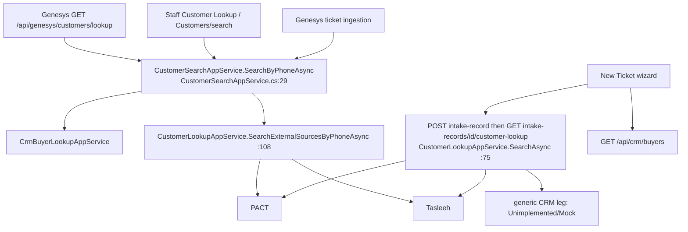

# 5. Customer identity, lookup and CRM/PACT reconciliation

> Part of the Tiger CS documentation set. Baseline: working tree at `31878f4` (main `a1cba71` + the CRM-documents / email-OTP commits). Written from code;
> `file:line` references are to that tree. Anything about Tiger CRM, PACT, EDSM, Tasleeh or TigerGroupWeb behaviour is an **external assumption (unverified)**.

## 5.1 Sources and what each one gives

| Source | Gateway (code) | Lookup key | Returns | Real or fixture |
|---|---|---|---|---|
| Tiger CRM "Buyer" | `CrmBuyerHttpGateway` `GET /TicketingSystem/GetBuyerByPhone?phoneNumber=` (`X-SECRET-KEY`), `TigerCS.Integrations/.../CrmBuyerHttpGateway.cs:64-66` | phone, verbatim | `{success, found, buyers[{customer{customerId,fullNameEnglish,fullNameArabic,mobileNumber,email}, units[{leadId,leadStatus,unitId,unitNumber,projectId,projectName,customerType,...}]}]}` | Real HTTP only (no mock switch) |
| PACT | `PactCustomerHttpGateway` `GET v1/contracts/{mobile}` (+ fallback `/customer-type`), `X-API-KEY`, `PactCustomerHttpGateway.cs:93` | phone with every `+` removed (`CustomerPhoneNumber.WithoutPlus`, `CustomerPhoneNumber.cs:192`) | flat contract rows grouped by `tenantID` into one customer match with all its contracts (`PactCustomerHttpGateway.cs:205-217`) | `Pact:Provider` = `Http` in `appsettings.json`; code default is `Mock` (`PactGatewayOptions.cs:17`) |
| Tasleeh | `ITasleehGateway` | phone | name + id only, never units | **Only `MockTasleehGateway` exists** (`IntegrationsServiceCollectionExtensions.cs:274-290`); see finding F-08 |
| Generic CRM unit-number cache (`ICrmGateway`) | `UnimplementedCrmHttpGateway` when `Crm:Provider=Http` | unit number | fails closed | Not used by the Genesys journeys |

Identifier spaces that **must not be mixed**:

| Identifier | Meaning | Where it appears |
|---|---|---|
| CRM `customerId` (int) | CRM Buyer customer | `crm:{id}` customer key; `Tickets.CrmBuyerCustomerId`; Genesys `customerReference` / `externalCustomerId` (when `verificationSource=Crm`) |
| CRM `unitId` (int, >0) / `leadId` / `projectId` | Buyer unit, the sale (lead), project | unit-details `unitId`; `Tickets.CrmBuyerUnitId/LeadId/ProjectId`; OTP `crmUnitId` |
| PACT `tenantID` | PACT customer ("tenant") | `PactCustomerMatchDto.PactCustomerId`; customer key `ext:Pact:{tenantID}`; `Tickets.ExternalCustomerId` |
| PACT `unitID` / `companyID` / `contractID` | unit, company (EDSM key), contract | `ExternalUnitId` (string), `CompanyId`, `ContractNumber` |
| `UnitReferenceId` / `ContactReferenceId` (TigerCS ints) | local cache rows for a unit and a unit-scoped contact | verification sessions, OTP proof; **not** CRM ids |
| Tasleeh id | `TasleehCustomerId` | `ext:Tasleeh:{id}` |

## 5.2 Phone normalisation (three different rules)

| Rule | Code | Input → output | Used by |
|---|---|---|---|
| Telephony address → TigerCS form | `CustomerPhoneNumber.FromTelephonyAddress` `CustomerPhoneNumber.cs:153-182` | `tel:+971501234567`, `sip:+971…@host;user=phone`, `971…` → `+971…`; `00971…` → `+971…`; national `0501234567` → `0501234567` (unchanged, no country guessed); `tel:anonymous` → `null` | Genesys lookup (`GenesysCustomerLookupAppService.cs:69`), ticket ingestion (`GenesysInquiryIngestionAppService.cs:139`), unit-details (`GenesysCustomerUnitDetailsAppService.cs:75`) |
| Canonical digits | `CustomerPhoneNumber.Normalize` `:63-81` | every non-digit dropped | identity comparison (`AreSameNumber`), Customers directory grouping, `phone:` keys |
| PACT request form | `WithoutPlus` `:192` | trim + remove `+` only (internal spaces/hyphens kept) | PACT URL only |
| OTP form | `CustomerOtpAppService.TryNormalizePhone` (`CustomerOtpAppService.cs:521-535`) | accepts only digits and `+ -().\/`; digits 7-15; **always** `"+" + digits` | `/api/genesys/verification/*` — rejects `tel:` (F-09) and turns `0501234567` into `+0501234567` |
| Staff typing | New Ticket / Customer Lookup | verbatim, no normalisation (`NewTicket.cshtml.cs` remarks) | CRM gets what was typed |

CRM receives the number **verbatim** (`+971…` for Genesys, as typed for staff). CRM-to-PACT comparison in the linker uses `Normalize`, so `0501234567` (national) and `971501234567` are **not** treated as the same number.

## 5.3 Lookup entry points



* `CustomerSearchAppService` runs CRM Buyer and PACT+Tasleeh **in parallel**; each source reports `Found / NotFound / Failed` independently and never hides another (`CustomerSearchAppService.cs:32-52`). CRM status adds `AmbiguousMatch` and (Genesys only) `NotSearched`.
* The wizard path is department-aware (`IDepartmentCustomerLookupSourceRepository`); an intake with no department searches all three. The wizard's CRM identity still comes from `GET /api/crm/buyers`; the CRM entry in the intake lookup is only a participation flag (`NewTicket.cshtml.cs:650`).
* Lookup is **never a gate**: ticket creation accepts an unverified customer (`TicketCreationAppService.cs:105-152`).
* **Unexpected exceptions are not absorbed** (F-07): only documented failure outcomes become `Failed`.

## 5.4 CRM Buyer rules (`CrmBuyerLookupAppService.cs`)

1. Only `customerType == 1` (Buyer) **and `unitId > 0`** units survive (`:119-120`). CRM lead status is not re-filtered.
2. A buyer left with zero units is dropped; zero buyers → `NotFound`.
3. Same `customerId` repeated → units merged, de-duplicated by `unitId` (`:106-115`).
4. **More than one distinct `customerId` → `AmbiguousCustomerMatch`**: nothing is selected, a masked warning is logged (`:80-92`). Surfaced as: `GET /api/crm/buyers` **409**; Genesys lookup `crmStatus:"AmbiguousMatch"` with empty `crmBuyers`; unit-details **409 `CUSTOMER_AMBIGUOUS`**; OTP **409 `CUSTOMER_AMBIGUOUS`**; wizard shows the "conflicting records - verify manually" notice and the manual path.
5. No CRM data is copied into TigerCS tables on lookup. Tickets store CRM ids + a name/project/unit snapshot only.

## 5.5 PACT rules (`PactCustomerHttpGateway.cs`)

* HTTP 404, or 200 with empty `data`, → `NotFound`. 401/403 → `Unauthorized`, 400 → `InvalidResponse`, timeout/5xx/unreachable/missing key or URL → `Unavailable`; the lookup service maps every non-NotFound failure to `Failed` (`CustomerLookupAppService.cs:231-239`).
* Rows grouped by `tenantID`; a row without `tenantID` is grouped under the searched number (`:206`). Customer type = first non-null `customerBuyerType`, else a fallback call.
* Contract date: `PactContractDateJsonConverter` is tolerant; unreadable → `null` → **treated as active**.
* "PACT-first": in the New Ticket wizard cards are ordered PACT (0), CRM (1), other (2) (`NewTicket.cshtml.cs:747-752`); in the Genesys screen pop the order is CRM first, then PACT, then Tasleeh (`GenesysCustomerLookupAppService.cs:129-146`) - **the two orderings differ**.

## 5.6 CRM <-> PACT reconciliation into one card

`CustomerIdentityLinker.FindPactMatch` (`CustomerIdentityLinker.cs:14-33`). A CRM buyer and a PACT tenant are one person only when **all** hold, with **exactly one** candidate on each side:

1. both phone numbers look like numbers and `AreSameNumber` (digits equal);
2. same person: equal e-mail **or** equal English/Arabic name (trimmed, case-insensitive);
3. at least one CRM unit equals a PACT unit by **unit number AND project name** (CRM English or Arabic project name vs PACT project name). PACT units used here **include expired contracts** (evidence of the historical tenancy).

A shared phone alone never unifies. If more than one PACT tenant or more than one CRM buyer matches, the cards stay separate.

Consumers: New Ticket (`NewTicket.cshtml.cs:704`; unified card `Sources=["Pact","Crm"]`, key stays `crm`, `LinkedPactCustomerId` kept), Customer Lookup (`CustomerLookup.cshtml.cs:153`), lookup ticket history (`CustomerHistoryController.cs:141` -> `GetByLinkedIdentityAsync`, both identities' tickets, no duplicates), and Collections pre-ticket payment (`CollectionsPaymentSummaryAppService.cs:105-108`).

**Source identifiers are preserved, never merged**: a ticket persists exactly one identity - CRM (`CrmBuyerCustomerId/LeadId/UnitId/ProjectId`, `Ticket.cs:333-342`) **or** external (`CustomerVerificationSource`, `ExternalCustomerId` = tenantID, `ExternalUnitId`, name/email snapshot, `Ticket.cs:395-403`); never both (`TicketCreationAppService.cs:140-143`). Which one is decided by the unit the agent selects on Step 2. There is no persisted CRM->PACT crosswalk (`CollectionsPaymentSummaryAppService.cs:29-32`).

**Genesys does not reconcile** (F-10): `GET /api/genesys/customers/lookup` returns CRM and PACT separately; a customer present in both counts as `matchedCustomerCount = 2`.

```mermaid
sequenceDiagram
  participant Agent
  participant Web as TigerCS.Web NewTicket
  participant API as TigerCS.Api
  participant CRM as Tiger CRM
  participant PACT as PACT
  Agent->>Web: phone
  Web->>API: POST /api/intake-records (verbatim phone)
  Web->>API: GET intake-records/{id}/customer-lookup
  API->>PACT: GET v1/contracts/{phone without +}
  Web->>API: GET /api/crm/buyers?phoneNumber=
  API->>CRM: GET /TicketingSystem/GetBuyerByPhone
  Note over Web: BuildCandidates: FindPactMatch(buyer, [buyer], sources)
  Web-->>Agent: cards (PACT first); unified card if verified link
  Agent->>Web: choose unit (CRM unit or PACT unit)
  Web->>API: POST /api/tickets (CrmBuyer* OR External*)
```

## 5.7 Ambiguous matches, manual customers, multi-unit selection

| Situation | Behaviour |
|---|---|
| CRM: 2+ distinct customers | 409 / `AmbiguousMatch`; no auto-select; manual Project+Unit entry |
| PACT: 2+ tenants for one number | all returned as separate cards; never auto-selected |
| Several units | never auto-selected. Wizard: agent picks (`OnPostUseCrmBuyerUnit`, `OnPostUseExternalUnit`). Unit-details: omit `unitId` -> `mode:UnitSelectionRequired` + `eligibleUnits`. OTP send: several units + no `crmUnitId` -> `UnitSelectionRequired` + `units`. Document copy: several records -> `SelectionRequired` + `choices` |
| Not found / source down | manual path: Project + Unit Number both required in the wizard (`NewTicket.cshtml.cs` `OnPostUseManualUnitAsync`); a manual property carries **no external identity** |
| Genesys-created ticket | always unverified: only the typed tower/unit snapshot; the lookup result is used for audit text and `customerName` (`GenesysInquiryIngestionAppService.cs:185-218`). An agent must select a customer later |
| Duplicate unit rows | CRM distinct by `unitId`; PACT distinct by (company, contract, unitId); selection view distinct by `ExternalUnitId` |

## 5.8 Expired-contract filtering

Rule: `PactContractActivity.IsActiveOn` - expired only if `ContractEndDate` is **before today in Asia/Dubai**; a null/unreadable date is active (`PactContractActivity.cs:46-47`).

| Surface | Expired contracts |
|---|---|
| Lookup layer (`CustomerLookupAppService.SearchPactAsync`) | **Retained**, flagged `isContractExpired`, with `contractEndDate` (`:241-275`) |
| **New Ticket wizard unit selection** | **Excluded**: `SelectablePactUnits` keeps `ContractEndDate is null or >= today`, distinct by `ExternalUnitId` (`NewTicket.cshtml.cs:221-230`). A customer with only expired contracts still gets a card (identity/history/payments) with 0 selectable units (`:735-743`) |
| Customer Lookup page | Shown, labelled expired (`CustomerLookup.cshtml.cs:35-39`) |
| Identity linking | Expired PACT units count as evidence |
| **Collections / EDSM mapping** | **Never filtered**: every contract of the tenant is needed to resolve (companyID, tenantID) pairs (`CollectionsPaymentSummaryAppService.cs:535-543`, `PactContractActivity.cs` remarks) |
| Genesys lookup | Nested `externalSources` keeps flags; the flat `screenPop.units` / `unitsText` lists **expired units unflagged** (`GenesysCustomerLookupAppService.cs:143`, F-11) |
| Unit-details / OTP / documents | CRM only - PACT contracts are irrelevant |

## 5.9 Invalid unit `0`: every path checked

CRM and PACT use `0` as a "no unit" placeholder. Result of reading every place a unit id can be defaulted:

| # | Location | Behaviour | Verdict |
|---|---|---|---|
| 1 | CRM wire DTO `CrmBuyerUnitHttpDto.UnitId` is non-nullable `int` (`CrmBuyerLookupHttpContracts.cs:19-32`): a missing `unitId` deserialises to **0** | filtered by `unit.UnitId > 0` (`CrmBuyerLookupAppService.cs:119-120`) | **Safe** for every consumer of `CrmBuyerLookupAppService` (wizard, Genesys lookup, unit-details, OTP, profile, document copy re-check) |
| 2 | PACT `row.UnitID is null or > 0` (`PactCustomerHttpGateway.cs:241`); `JsonSerializerDefaults.Web` also reads `"0"` strings | 0/negative rows dropped | Safe |
| 3 | PACT `unitID` **null** -> `ExternalUnitId` falls back to `unitCode`, then `unitNumber` (`:251-254`); a fallback value of `"0"` is not rejected | a display code is stored in an id field | Design risk, minor (F-12) |
| 4 | Genesys unit-details `unitId is <= 0` -> 400 `unitId must be a positive CRM unit id` (`GenesysCustomerUnitDetailsAppService.cs:81`); the eligible list comes from the filtered buyer | Safe |
| 5 | Genesys customer reference `int.TryParse(...) && customerId > 0` (`:165`); `CustomerIdentity.TryParse("crm:0")` rejected (`CustomerDirectoryDtos.cs`, `crmId > 0`) | Safe |
| 6 | CRM `customerId` / `projectId` defaulting to 0 when omitted | **not validated** (only unit is) | Minor, F-07 notes the same gateway weakness |
| 7 | **`POST /api/tickets` `CrmBuyerUnitId`**: only "all four present or none" is checked (`TicketCreationAppService.cs:108-116`), then `CreateVerifiedFromCrmBuyer` stores them (`:236-240`, `Ticket.cs:333-342`). `0` is accepted and stored. The wizard's `OnPostUseCrmBuyerUnit` uses `int.Parse` on posted text (`NewTicket.cshtml.cs:843-846`) and the comment at `:92-94` / `:1229` claims the API "re-validates everything" - it does not | **Gap (F-01)** |
| 8 | `ExternalUnitId` on ticket creation: free text, no check | same gap (F-01) |
| 9 | Ticket snapshot / Customers directory: `Source = CrmBuyerUnitId != null ? "Crm"` (`CustomerDirectoryRepository.cs:353`) -> a stored 0 shows as a unit | consequence of #7 |
| 10 | Collections EDSM due-installments: `(int?)Long(row,"unitID")` (`EdsmCollectionsHttpGateway.cs:260`) - unchecked narrowing, no `>0` test; surfaces as `nextPayment...units[].unitId` | display only; F-12 |
| 11 | PACT SQL receivables `UnitID` 0 allowed (`PactSqlReceivablesSource.cs:120`); campaigns flag `MissingUnitIdentity` when `UnitId is not > 0 \|\| Code is blank or "0"` -> row `NeedsReview`, never `Ready` (`CollectionsCampaignAppService.cs:120-121`) | Safe for campaigns; the staff receivables list still shows such rows |
| 12 | OTP `crmUnitId`: matched as the string of an eligible (filtered, non-blank-number) unit (`CustomerOtpAppService.cs:147-160, 500-503`) | Safe |
| 13 | Document copy `crmUnitId`: compared with the session's unit reference (`CrmDocumentCopyAppService.cs`); unit comes from the OTP-bound cache row | Safe |
| 14 | `GenesysEligibleUnitDto`, `CustomerProfileUnitDto` | built from the filtered buyer | Safe |
| 15 | `GenesysInquiryRequest` has no unit id; `unitNumber` is free text | n/a |

## 5.10 Failure matrix

| Condition | Genesys lookup | Wizard |
|---|---|---|
| CRM down | `crmStatus:"Failed"`, other sources returned | "CRM temporarily unavailable", manual path |
| PACT down | `externalSources[Pact].status:"Failed"` | notice; CRM unaffected |
| Phone withheld (`tel:anonymous`) | `found:false, crmStatus:"NotSearched"`, 200 | n/a |
| Malformed CRM buyer (missing `customer` / `units`) | **500** (F-07) | 502/500 |
| Integration disabled | 503 `genesys-integration-disabled` | unaffected |
