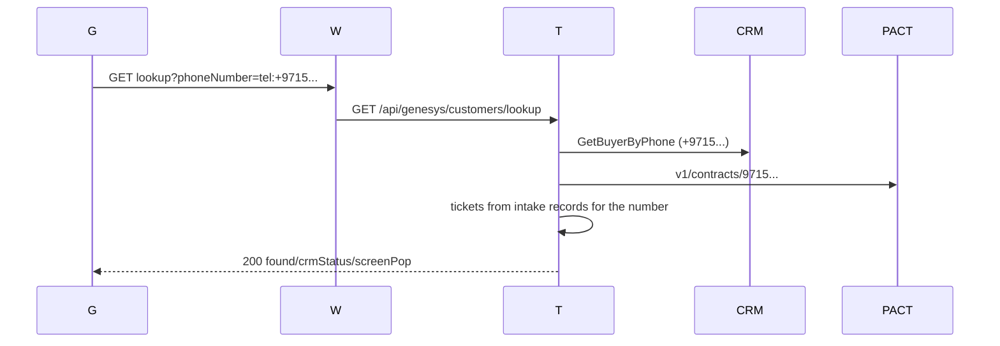
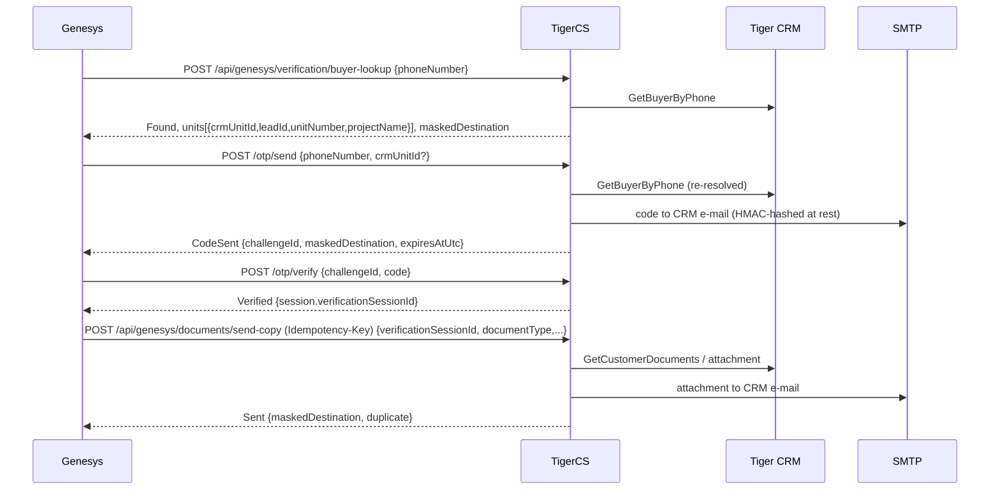

# 8. Genesys integration guide - every journey end to end

> Baseline: working tree `31878f4`. TigerCS code is the source of truth (`file:line`). **TigerGroupWeb (the public proxy) is not in this repository**; everything said about it comes from
> [TigerGroupWeb-Proxy-Change.md](../Genesys/TigerGroupWeb-Proxy-Change.md) and is **PROPOSED / UNVERIFIED** (marked `[ext]`). Genesys Cloud behaviour is likewise `[ext]`.

## 8.1 Topology and authentication

```mermaid
sequenceDiagram
  participant G as Genesys (Architect / Data Action)
  participant W as TigerGroupWeb [ext]
  participant T as TigerCS.Api
  participant X as CRM / PACT / EDSM
  G->>W: POST https://tigergroup.ae/api/genesys/oauth/token (client_credentials, scope ticketing.genesys) [ext]
  W-->>G: bearer token [ext]
  G->>W: Data Action call + Authorization: Bearer <genesys token>
  W->>W: validate Genesys token; never forward it [ext]
  W->>T: same route + Authorization: Bearer <TigerCS service-account JWT>
  T->>X: CRM Buyer / PACT contracts / EDSM (as needed)
  T-->>W: status + body (problem+json on errors)
  W-->>G: status/body/Content-Type unchanged [ext]
```

* **There is no `/api/genesys/oauth/token` in TigerCS.** A search of the source finds `oauth` only in comments (`GenesysController.cs:17-18`, `GenesysOptions.cs:20-24`). The Genesys OAuth endpoint is entirely a TigerGroupWeb assumption; data action `00-custom-auth-request-config.json` posts to it.
* TigerCS authenticates the **service account** with its normal JWT (`POST /api/auth/login`). `[AllowAnonymous]`, `AuthController.cs:40`; 401 bad credentials, 423 locked, 400 blank.
* Policies: `/api/genesys/*` (tickets, customers, agent-context, screen-pop, documents, verification) = `CustomerVerification` = role **CS Agent or CS Supervisor** + active employee (`InfrastructureServiceCollectionExtensions.cs:~421`). `/api/genesys/collections/*` = `AuthenticatedStaff` (`GenesysCollectionsController` -> `CollectionsControllerBase`, `GenesysCollectionsController.cs:86-87`) **plus** Collections grants: financial read / reminder send / outcome report resolved by `CollectionsAuthorizationService` (`CollectionsCore.cs:65-89`); outcomes and VoiceBot need the account's employee id in `Collections:Authorization:IntegrationEmployeeIds` (ships empty, `appsettings.json`).
* `Genesys:Enabled` (`GenesysOptions.cs`): when false every Genesys application service answers `503 genesys-integration-disabled`. `appsettings.json:139-140` ships `true`, although the options class documents default `false`.
* Customer auth vs staff auth are **separate**: the Genesys service account proves nothing about the *customer*. Customer proof is the OTP flow (8.9). Staff Screen Pop (8.7) issues an *agent* session and is never used as customer proof.
* Request/response JSON: ASP.NET default `camelCase`, case-insensitive binding, nulls are written (no global ignore-null). Enums in documents/OTP results are strings. Errors are RFC 7807 `application/problem+json`; most Genesys errors add `code`, `outcome`, `traceId`.

### Common headers

| Header | Direction | Used by |
|---|---|---|
| `Authorization: Bearer <JWT>` | to TigerCS | all |
| `Idempotency-Key` | to TigerCS | `POST /api/genesys/documents/send-copy` (**required**, `^[A-Za-z0-9._:\-]{1,128}$`), collections `POST reminders` and `.../outcomes` (optional), `POST /api/verification-sessions` (optional) |
| `X-Collections-Deadline-Seconds` | to TigerCS (proxy-generated `[ext]`) | collections reads; shortens, never lengthens, `Collections...GenesysReadDeadlineSeconds` (default 22 s) (`CollectionsEdsmOptions.cs`, `GenesysCollectionsController.cs:416-423`) |
| `X-Genesys-Flow-Timeout-Seconds` | Genesys -> proxy `[ext]` | not read by TigerCS |
| `Retry-After` | from TigerCS | OTP 429 |

### Identifier provenance

| Id | Created by | Carried as | Notes |
|---|---|---|---|
| `conversationId` | Genesys (`Call.ConversationId` / `Message.ConversationId`) | body field on create/patch/agent-context/screen-pop/outcomes | **Idempotency key** of ticket creation; unique index on `TicketInteractions` |
| `ticketId` / `ticketNumber` | TigerCS (`POST /api/genesys/tickets` response) | Architect participant data `TigerCsTicketId`; route `{ticketId:long}` on PATCH | must belong to the `conversationId` (409 otherwise) |
| `customerKey` | TigerCS Customers directory | `crm:{id}`, `ext:Pact:{tenantID}`, `ext:Tasleeh:{id}`, `phone:{digits}` | **Not returned by the Genesys lookup.** Flow builds `ext:Pact:` + `externalCustomerId` |
| `customerReference` | = lookup `externalCustomerId` when `verificationSource=Crm`, or `crm:{id}` | unit-details body | PACT tenant ids are *not* valid here |
| tenant / company / unit ids | PACT (`tenantID`, `companyID`, `unitID`) | summary `pactTenantId`, `companies[].companyId`, contract refs | never taken from the caller |
| `challengeId` | TigerCS OTP (`CustomerOtpChallenge`) | OTP send -> resend/verify | caller-scoped |
| `verificationSessionId` | TigerCS (`OTP verify` response `session.verificationSessionId`) | send-copy body | owned by the calling service account, 30 min lifetime (`VerificationSessionAppService.SessionLifetime`) |
| `recordId` | CRM attachment id | send-copy `choices[].recordId` -> `recordId` | |
| `reminderId` | TigerCS (`REM-123`) | route | |

## 8.2 Journey: caller / customer lookup

`GET https://tigergroup.ae/api/genesys/customers/lookup?phoneNumber=...` `[ext]` -> `GET {TigerCS}/api/genesys/customers/lookup?phoneNumber=...` (`GenesysController.cs:342`). Data action `01`.

* Auth: bearer, `CustomerVerification`. No idempotency header (read-only, no writes).
* Request: `phoneNumber` (any `tel:` / `+971` / `971` form, normalised by `FromTelephonyAddress`). Blank -> 400 validation problem.
* Response 200 `GenesysCustomerLookupResultDto`: `phoneNumber`, `found`, `crmStatus` (`Found|NotFound|AmbiguousMatch|Failed|NotSearched`), `crmBuyers[]`, `externalSources[]` (Pact/Tasleeh with `status`), `tickets[]` (max 10, open first), `openTicketCount`, `screenPop{customerName, customerEmail, verificationSource, externalCustomerId, matchedCustomerCount, units[], unitsText, recentTicketNumbers[], openTicketNumbers[], recentTicketsText}`.
* Errors: 400, 401, 503 (disabled). A source being down is **not** an error (see [05](05-customer-identity-and-reconciliation.md) for the one exception, F-07).
* `tickets` are looked up by intake phone across **all departments** (service-account scope, `GenesysCustomerLookupAppService.cs:81-100`).
* Provenance: `externalCustomerId` is a CRM `customerId` if `verificationSource=Crm`, otherwise a PACT `tenantID`/Tasleeh id.
* Retry: safe, idempotent.



## 8.3 Journey: create / reuse ticket by `conversationId`

`POST /api/genesys/tickets` (`GenesysController.cs:100`), data action `02`. Auth bearer. **Idempotent on `conversationId`**.

Request (`GenesysInquiryRequest`, `GenesysContracts.cs:44-64`): required `conversationId`, `channel` (`Phone|LiveChat|WebsiteChat|WebMessaging|WhatsApp|SocialMedia`, case-insensitive; aliases map to Live Chat, `ChannelAliases` `:405`). Optional: `interactionId, participantId, communicationId, direction, customerPhone, customerName, customerEmail, calledNumber, queueId, queueName, agentId, agentName, startedAtUtc, departmentId, departmentCode, towerName, unitNumber, subject`. Blank strings are treated as absent (`Absent`, `:395`).

Flow (`GenesysInquiryIngestionAppService.IngestAsync`): enabled? -> conversationId present? -> **existing interaction -> return same ticket** (`:112`) -> active channel (`GenesysChannelResolver` code) -> department (explicit id, else explicit code, else queue mapping; **never** a fallback) -> **supplied request type validated; invalid -> 422, nothing written** -> normalise phone -> customer lookup (enrichment only; broad try/catch `:406`) -> agent mapping -> intake record -> `TicketCreationAppService.CreateAsync` **Unclassified** (no category/request type; default Normal priority and SLA from creation) -> audit -> request type applied (`GenesysRequestTypeClassificationAppService`: department routing, auto-assignment, SLA policy) or, if none was supplied, the human follow-up queue "Awaiting classification". See `docs/Genesys/Request-Type-Routing-And-Default-Priority.md`.

| Status | Body / code |
|---|---|
| 201 | `{outcome:"TicketCreated", conversationId, ticketId, ticketNumber}` + `Location: /api/tickets/{id}` |
| 200 | same body, `outcome:"AlreadyIngested"` (retry / duplicate / concurrent loser - unique index + `DuplicateWriteException` recovery `:225-235`) |
| 400 | unknown channel (validation problem on `channel`); blank conversationId (`genesys-conversation-id-required`) |
| 422 | `genesys-department-not-resolved`, `genesys-channel-not-configured` (no active channel row), `genesys-ticket-creation-failed` (`detail` names the TicketCreationOutcome) |
| 503 | `genesys-integration-disabled` |

Notes: the ticket is never customer-verified by Genesys (see 05 sec. 5.7). Retrying a 422 is pointless until configuration is fixed; retrying a timeout is safe. Mapping of queue -> department: `POST /api/admin/genesys/queue-mappings` (System Administrator).

## 8.4 Journey: update / end / transcript / handoff / awaitingCustomerReply

`PATCH /api/genesys/tickets/{ticketId:long}` (`GenesysController.cs:207`), one body, every part optional and idempotent. Data actions `03, 04, 05, 06, 07, 10`.

```json
{ "conversationId": "...",            // required
  "agentId": "..", "agentName": "..", "startedAtUtc": "...",
  "routing": { "queueId":"", "queueName":"", "agentId":"", "agentName":"" },
  "ended":   { "endedAtUtc": "...", "endReason": "...", "transcript": [ {"sender":"Customer|VirtualAgent|HumanAgent|System","sentAtUtc":"...","body":"...","senderName":"","senderId":"","externalMessageId":""} ] },
  "handoff": { "required": true|false|omitted, "agentAvailable": false, "mode":"Callback|ContinueChat|ReplyInChannel|HumanTakeover", "trigger":"CustomerRequestedHuman|AiConnectionLost|AiEscalated|RoutingDecision|AgentTransfer", "reason":"", "workItemId":"", "assignedAgentId":"" },
  "customerConfirmation": { "confirmedResolved": true, "confirmedAtUtc": "...", "note": "" },
  "awaitingCustomerReply": true|false|omitted }
```

Processing order (`GenesysTicketUpdateAppService.UpdateAsync`): integration enabled -> conversationId -> ticket exists -> interaction exists -> **interaction.TicketId == route ticketId** -> customerConfirmation valid -> handoff (request / stand-down / assignment) -> routing + startedAt -> agent connect takes waiting work -> **ended + transcript** -> agent-if-absent -> handler resolution -> confirmation event -> inactivity timer -> echo open handoff status.

Response 200 (`GenesysTicketUpdateResponse`): `outcome:"Applied", conversationId, ticketId, ticketNumber, ticketStatus (never changed), conversationEnded, transcriptMessageCount, handoffStatus, ticketAgentHandoffId, awaitingCustomerReply, inactivityDeadlineUtc, awaitingCustomerReplyNote`.

| Status | Problem type / meaning |
|---|---|
| 400 | `genesys-conversation-id-required`, `genesys-invalid-transcript` (sender not `Customer/HumanAgent/VirtualAgent/System`, or empty body), `genesys-invalid-handoff-mode`, `genesys-invalid-handoff-trigger`, `genesys-handoff-reason-required` (`required:false` without `reason`), `genesys-invalid-customer-confirmation` (`confirmedResolved` not true) |
| 404 | `ticket-not-found`; `genesys-conversation-not-found` |
| 409 | `genesys-conversation-ticket-mismatch` |
| 422 | `genesys-no-open-handoff` (assignment with nothing outstanding) |
| 503 | disabled |

Semantics:
* **End never closes the ticket.** Interaction end time/reason are write-once; transcript messages are de-duplicated by `externalMessageId`, else (sender, time, body) (`GenesysConversationEndAppService.IsAlreadyStored`). A redelivery that adds messages appends them. On end, a bot-only conversation with no human and no open handoff **auto-raises** a handoff (`AiConnectionLost`, "ended without a human", `:~190`), audited separately; the first human message records First Human Response.
* **Handoff "agent unavailable" path**: `handoff.required:true, agentAvailable:false` -> work item `WaitingForAgent` (visible in `GET /api/pending-customer-interactions`, `AuthenticatedStaff`; start/complete/cancel by staff). `agentAvailable:true` + `agentId` -> `Assigned` from the start. Idempotent: an open item is returned (`AlreadyRequested`); `workItemId` is the stronger key. `required:false` stands outstanding work down (needs `reason`; nothing outstanding is a success). An agent connecting through `routing.agentId` takes `WaitingForAgent` work.
* **awaitingCustomerReply**: `true` starts a persisted timer (server clock) unless human follow-up is requested/open, the conversation ended, the ticket is closed or a person owns it (then `awaitingCustomerReplyNote` explains). Repeating `true` never restarts it. `false` cancels. If silent for `Genesys:CustomerInactivityTimeoutMinutes` (5) a background job closes the ticket (needs `BackgroundJobs:Enabled`, which ships `false`).
* Not atomic: handoff/routing are committed before `ended` is validated (F-05); a rejected transcript leaves those parts applied. Re-sending the whole update is safe.
* Transcript source: **no shipped data action sends a transcript** (action `04` posts only `endedAtUtc`/`endReason`). `[ext]` Whatever posts transcripts is not in this repo.

## 8.5 Journey: agent context

`POST /api/genesys/agent-context` (`GenesysController.cs:504`). Body `{genesysUserId (required), agentEmail?, conversationId?}`. Resolves the agent by immutable Genesys User ID (`AspNetUsers.GenesysUserId`; never name/email). 200 -> `{outcome:"Resolved", genesysUserId, userId, userName, displayName, roles[], departmentIds[], conversationId, ticketId, ticketNumber, ticketInteractionId, handledByUserId}`. Records `HandledByUserId` apply-if-absent. Errors: 400 missing id; **403 `GENESYS_AGENT_NOT_MAPPED` / `GENESYS_AGENT_INACTIVE`**; 404 `genesys-conversation-not-found`; 503. No data action exists. Idempotent.

## 8.6 Journey: unit details (verified CRM buyer)

`POST /api/genesys/customers/unit-details` (`GenesysController.cs:397`), action `12`. Body `{customerReference, phoneNumber, unitId?}`.

1. `customerReference`: `crm:{id}` or plain positive int; PACT/Tasleeh keys rejected (`GenesysCustomerUnitDetailsAppService.cs:146-166`).
2. phone via `FromTelephonyAddress`; null -> 400.
3. `unitId` present and `<= 0` -> 400 (`:81`).
4. CRM Buyer lookup; `NotFound` or customer id != reference -> 403 `CUSTOMER_NOT_VERIFIED`; ambiguous -> 409 `CUSTOMER_AMBIGUOUS`; other CRM failure -> 502 `CRM_UNAVAILABLE`.
5. No `unitId` -> `mode:"UnitSelectionRequired"`, `eligibleUnits[{unitId,unitNumber,projectId,projectName,floor,bookingStatus}]`; else the unit must be among the buyer's own units, else 403 `UNIT_NOT_ELIGIBLE` (same answer as non-existent).
6. `GetUnitDetails` enrichment (`CrmUnitDetailsHttpGateway`, `GET /TicketingSystem/GetUnitDetails?customerId&unitId`): 404/`found:false` -> `detailsStatus:"NotAvailable"`, failures -> `"Unavailable"`, nulls never defaulted.

Success 200 `{mode, customerReference:"crm:{id}", eligibleUnits[], unit{unitId,unitNumber,tower,floor,unitType{code,name},bedrooms,area{value,unit},booking{reference,status,statusCode},parking[],expectedHandoverDate,actualHandoverDate}, project{projectId,name,arabicName,address,status,expectedHandoverDate,actualHandoverDate,description,amenities[]}, handoverDateSource, detailsStatus}`. Read-only, safe to retry. A POST only to keep phones out of URLs.

## 8.7 Journey: staff Screen Pop (agent session - not customer auth)

`POST /api/genesys/screen-pop` (`GenesysController.cs:616`) body `{genesysUserId, conversationId?, ticketId?, customerPhone?}` -> 200 `{launchUrl, expiresAtUtc, expiresInSeconds:3600, targetPath, ticketId}`. `launchUrl = {Genesys:ScreenPopWebBaseUrl}/ScreenPop?token=...` (256-bit random, SHA-256 stored, one use, 1 h, `GenesysScreenPopLaunch.Lifetime`). Landing priority: conversation's ticket -> `ticketId` -> `/Customers/Lookup?phoneNumber=<customerPhone trimmed>` -> `/Tickets`. Errors: 400, 403 `GENESYS_AGENT_NOT_MAPPED|INACTIVE`, **503 `GENESYS_SCREEN_POP_NOT_CONFIGURED`** or disabled. Redeem (TigerCS Web -> API, anonymous): `POST /api/auth/screen-pop/redeem {token}` -> normal login payload + `targetPath`; 401 `SCREEN_POP_TOKEN_INVALID|EXPIRED|USED`, 403 mapping/lock-out re-checked at redeem, 503. The token is in a URL query string (access logs / history) - mitigated by one-time use. `customerPhone` is **not normalised** (F-04). No data action exists.

## 8.8 Journey: Collections - summary, transactions

Public `GET https://tigergroup.ae/api/genesys/collections/customers/by-key/{key}/payment-summary` `[ext]` -> TigerCS same path (`GenesysCollectionsController.cs:107`), actions `08`, `09`.

* `customerKey` must be `ext:Pact:{tenantID}`; the Customers directory must already know it **from a ticket an agent verified through PACT** (`CustomerDirectoryRepository.GetProfileAsync` returns null without tickets) -> `404 AccountNotFound`. Genesys-created tickets are unverified, so a first-time caller is `404` until an agent verifies (documented and tested: Genesys-Collections-API.md sec. 2). A CRM key -> `200 mappingStatus:"NotMapped"`.
* TigerCS asks PACT `v1/contracts/{mobile}` for each phone of the profile (max 5), keeps rows whose `tenantID` equals the key, caches the (company, tenant) pairs 30 min, then calls EDSM per company; **expired contracts are included** (05 sec. 5.8).
* Query: `includeTransactions` (default true; action sets false). Transactions: `companyId` (required, must be in the PACT contracts) and `type=Paid|Due|Outstanding|1|2|3`; `All/4` -> 400.
* Errors (`ToResponse`, `GenesysCollectionsController.cs:358-378`; body `{code, message, traceId}`): 400 `InvalidRequest`; 403 `Forbidden`; 404 `AccountNotFound`; 422 `CustomerNotMapped` (transactions); 503 `FinanceUnavailable` / `CollectionsDisabled`. Deadline: read budget 22 s (Genesys surface) or the shorter `X-Collections-Deadline-Seconds`; on expiry what was read is returned with `status:"DeadlineExceeded"`, or `503` if the accounts could not be confirmed.
* Idempotent GETs; EDSM/PACT calls have a write side effect in PACT (`contracts` creates EDSM rows) - hence mapping cache.

## 8.9 Journey: customer verification (email OTP) and document copy



OTP endpoints (`GenesysVerificationController.cs`, policy `CustomerVerification`, actions `13-16`):

| Route | Request | 200 statuses | Errors |
|---|---|---|---|
| `POST .../verification/buyer-lookup` | `{phoneNumber}` | `Found` + `units[]`, `maskedDestination` (no name/phone/full e-mail) | 400 `INVALID_REQUEST`; 404 `CUSTOMER_NOT_FOUND`; 409 `CUSTOMER_AMBIGUOUS`; 502 `CRM_AUTHENTICATION_FAILED`/`CRM_INVALID_RESPONSE`; 503 `CRM_UNAVAILABLE`/`DOCUMENT_COPY_DISABLED` |
| `POST .../otp/send` | `{phoneNumber, crmUnitId?, channel? Email\|Sms, language? en\|ar}` | `CodeSent` (+`channel`), `AlreadySent` (same challenge), `UnitSelectionRequired` | 403 `UNIT_NOT_OWNED`; 404; 409; 422 `NO_EMAIL_ON_RECORD`/`NO_MOBILE_ON_RECORD`; 503 `OTP_SMS_NOT_CONFIGURED`; 504 `OTP_DELIVERY_UNCONFIRMED` (SMS: may have been sent - never auto-resent); 429 `OTP_RATE_LIMITED` (5 challenges/customer/h, `Retry-After: 3600`), `OTP_RESEND_LIMIT_REACHED`; 502 `OTP_DELIVERY_FAILED`; 503 |
| `POST .../otp/resend` | `{challengeId}` | `CodeSent` | 404 `OTP_CHALLENGE_NOT_FOUND`; 410 `OTP_EXPIRED`; 423 `OTP_LOCKED`; 429 `OTP_RESEND_TOO_SOON` (60 s, `Retry-After`) |
| `POST .../otp/verify` | `{challengeId, code}` | `Verified` + `session` | 400 `OTP_INVALID` (`attemptsRemaining`) / `INVALID_REQUEST`; 404; 409 `OTP_ALREADY_USED`; 410; 423 |

Limits (`CrmDocumentOptions.cs`): lifetime 10 min, 5 wrong tries, 3 sends/challenge, 60 s between sends. The caller never supplies destination, customer id, lead or method. `POST /api/verification-sessions` now refuses `verificationMethod:"Otp"` (400 `otp-requires-challenge`), so **the only way to obtain an OTP session is this flow**. Error bodies carry `code, outcome, challengeId, maskedDestination, attemptsRemaining, resendAvailableAtUtc`; the data actions map success bodies only, so the flow must read the error body for `attemptsRemaining`.

Document copy `POST /api/genesys/documents/send-copy` (`GenesysDocumentsController.cs`), action `11`: body `{verificationSessionId (Guid), documentType (Contract|ReservationForm|UnitLayout|RegistrationReceipt, spaces/case tolerant), crmUnitId?, recordId?, crmLeadId?, deliveryChannel?}`, header `Idempotency-Key` required. Checks in order (`CrmDocumentCopyAppService`): enabled -> key -> session id -> type -> channel (Email only) -> replay of key -> session owned by caller, `Confirmed|Consumed`, unexpired, method accepted **and OTP proof attached** (an agent-asserted session never qualifies) -> unit match -> bound lead -> CRM re-resolution of the contact (single buyer, same customer, lead still owned) -> CRM document list -> selection / record -> destination e-mail from CRM -> duplicate suppression (15 min, same session+type+record) -> claim row (unique caller+key) -> fetch bytes -> size (<=10 MB) -> send -> audit.

| Status | Body / code |
|---|---|
| 200 | `Sent` (`duplicate:true` on replay) or `SelectionRequired` (`choiceKind:"Document"`/`"Unit"`, `choices[]`) |
| 202 | `Queued` (`REQUEST_IN_PROGRESS`; repeat with same key) |
| 400 | `INVALID_REQUEST` |
| 403 | `VERIFICATION_FAILED`, `CRM_CUSTOMER_NOT_RESOLVED`, `RECORD_OWNERSHIP_MISMATCH` |
| 404 | `DOCUMENT_NOT_FOUND` |
| 409 | `IDEMPOTENCY_KEY_REUSED` |
| 422 | `DELIVERY_DESTINATION_UNAVAILABLE` |
| 501 | `DELIVERY_CHANNEL_NOT_INTEGRATED` (WhatsApp/Sms) |
| 502 | `DELIVERY_FAILED`, `DOCUMENT_TOO_LARGE`, `CRM_REQUEST_REJECTED`, `CRM_AUTHENTICATION_FAILED`, `CRM_ACCESS_DENIED`, `CRM_INVALID_RESPONSE` (`retryable` in body) |
| 503 | `DOCUMENT_SOURCE_UNAVAILABLE` (retryable), `DOCUMENT_COPY_DISABLED` |

Retry rules: reuse the same key for the same request; a new key for the customer's follow-up choice. Both `CrmDocuments:Enabled` (ships `false`) and `EmailNotifications:Enabled` (ships `false`) must be on or the chain answers 503 / `OTP_DELIVERY_FAILED`.
If a 5xx or timeout occurs after the document left TigerCS but before the response, a replay with the same key returns `Sent, duplicate:true` - exactly-once e-mail, at-least-once HTTP.

## 8.10 Journey: reminders, candidates, campaign lists, outcomes

Routes (same controller base, both prefixes): `GET .../reminders/candidates`, `POST .../reminders` (`Idempotency-Key`), `POST .../reminders/{reminderId}/outcomes` (`Idempotency-Key`), `GET .../customers/{crmCustomerId}/reminders`, `GET .../customers/{crmCustomerId}/outstanding|payments` (`GenesysCollectionsController.cs:107-356`). **No data action exists for any of them**; the proxy forwarding is `[ext]`-pending (Proxy-Change.md sec. 1 rows 3-8).

* Candidates: `reminderType` (`OverdueMonthly|CurrentMonth|MonthEndFollowUp`), `businessDate` (must be today Asia/Dubai), cursor paging 1-100. Settled/stale accounts never listed. Needs reminder-send grant.
* Queue: `{candidateId, channels[] (VoiceBot|Sms|Email), language en|ar}` -> 202 `Queued` job (200 replay of the same key); 409 `CandidateChanged` (with `replacementCandidate`) / `IdempotencyConflict`; 422 `NoEligibleContact`/`ChannelNotEnabled`; 503 `FinanceUnavailable`. VoiceBot only by integration accounts. Channels ship disabled (`Collections:Channels.*Enabled=false`, `SchedulerOwner:"None"`).
* Outcome: `{eventId (required, idempotency), channel, providerMessageId?, conversationId?, occurredAtUtc?, deliveryStatus?, customerResponded, customerIntent?, requiresHumanFollowUp, customerPhone?}` -> 200 or **202 with `ticketResult:"Pending"`** (durable retry); 403 unless integration account; 404 `ReminderNotFound`; 409 `IdempotencyConflict`/`ReminderSuppressed`. A customer response creates/reuses the conversation's ticket through the normal Genesys ingestion, routed to Collections, Unclassified.
* Campaign lists are **staff-only** (`AuthenticatedStaff`): `GET /api/collections/campaigns/preview` and `/export?mode=Review|Genesys` (CSV inside a JSON envelope, `CollectionsCampaignsController.cs:20-50`); Genesys mode refuses unresolved rows (unit `0`, conflicting contacts, stale source). Delivery to Genesys outbound campaigns is a manual import `[ext]`.

## 8.11 Unavailable agent / unavailable source paths

| Condition | Where | Outcome |
|---|---|---|
| No human available | PATCH `handoff.agentAvailable:false` | work item `WaitingForAgent`, ticket unchanged, pending list for staff |
| Agent unmapped / deactivated | agent-context, screen-pop | 403 `GENESYS_AGENT_NOT_MAPPED` / `GENESYS_AGENT_INACTIVE`; ingestion and PATCH never fail on it (verbatim id kept, owner null) |
| Integration off | all | 503 `genesys-integration-disabled` |
| CRM down | lookup `Failed`; unit-details 502 `CRM_UNAVAILABLE`; OTP/doc 503/502 | |
| PACT down | lookup `Failed`; collections 503 `FinanceUnavailable` | |
| EDSM down / provider `Unavailable` (default) | summary `status` per company, or 503 | never zero-filled |
| CRM documents / e-mail disabled | 503 `DOCUMENT_COPY_DISABLED`, `OTP_DELIVERY_FAILED` | |
| Proxy cannot reach TigerCS | `[ext]` proxy-side 502/504 | |

## 8.12 Timeouts, retries, duplicates (summary)

| Route | Safe to retry | Key |
|---|---|---|
| POST tickets | yes | `conversationId` |
| PATCH tickets | yes (parts idempotent; not atomic) | `conversationId` + part-specific (`confirmedAtUtc`, `externalMessageId`, `workItemId`) |
| GET lookup / collections reads | yes | - |
| unit-details / buyer-lookup | yes | - |
| otp/send | yes within a live challenge (`AlreadySent`) | caller + customer + lead |
| otp/verify | wrong codes consume attempts; a correct code works once | `challengeId` |
| send-copy | yes **with the same `Idempotency-Key`** | key + fingerprint |
| collections POST | yes with same `Idempotency-Key` | key / `eventId` |
| screen-pop issue | creates a new token each call | - |

Timeout budget chain (documented, enforced only on the TigerCS side): Genesys Data Action timeout > TigerGroupWeb (flow timeout - 2 s) > `X-Collections-Deadline-Seconds` (- 3 s) > TigerCS read deadline (22 s). Outbound client timeouts: CRM Buyer 15 s, PACT 15 s, EDSM 30 s (`IntegrationsServiceCollectionExtensions.cs`).
