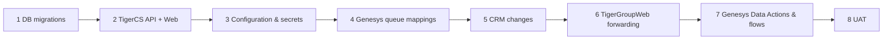

# 13. Deployment order

> Part of the [documentation set](README.md). **Nothing here has been executed by this review; do not merge/deploy automatically.** Rollback for every step = redeploy the previous build; DB scripts below are additive.

1. **Database.** Take a backup. Check `__EFMigrationsHistory`; apply (EF bundle or the idempotent root scripts, in this order if missing): `AddCollectionsReminders`, `AddChatbotInactivityAndCrmDocumentCopies`, `AddResolutionClosedForCustomerInactivity`, **`AddCustomerOtpVerification` (OTP challenges, `20261007180009`, script `AddCustomerOtpVerification.sql`)**, then **`AddSlaPauseAndPriorityDowngrade` (`20261008184722`: tables `TicketSlaPausePeriods`, `PriorityDowngradeRequests`, six snapshot columns on `TicketSlaInstances`; script `AddSlaPauseAndPriorityDowngrade.sql`)**. Full idempotent script of every migration: produced by `tools/build-release.sh`. Optional after review: `ConfigureReopenApprovalRequirements.sql`.
2. **TigerCS API and Web** from the review branch (build with `dotnet publish`; do not use the stale `publish/` folder).
3. **Configuration** ([12](12-configuration-reference.md)): secrets, `BackgroundJobs__Enabled=true`, `Genesys__Enabled=true`, `Genesys__ScreenPopWebBaseUrl`, confirmed `CustomerInactivityTimeoutMinutes`; keep `CrmDocuments__Enabled=false` until step 5–6 are done, then enable in UAT with `OtpCodePepper` and SMTP configured. Keep reminders/next‑payment off.
4. **Genesys queue mappings** in Admin (`Queue-Mapping-Requirements.md`); run `01_Investigate_Finance_Routing_UAT.sql`.
5. **Tiger CRM**: JSON 401 behaviour, `GetCustomerDocuments` + file routes, `GetUnitDetails` ([CRM-Required-Contracts](../Genesys/CRM-Required-Contracts.md)).
6. **TigerGroupWeb**: add forwarding rules ([15.5](15-requirements-traceability-matrix.md#155-external-handover-not-changeable-from-this-repository)).
7. **Genesys**: import Data Actions 01–16 ([09](09-data-action-inventory.md)); update Architect flows and welcome content.
8. **UAT**: run [16](16-uat-checklist.md) and record evidence.

Order constraint: TigerGroupWeb must not forward a route before TigerCS is deployed (404s), and Data Actions must not be published before the proxy forwards them.
